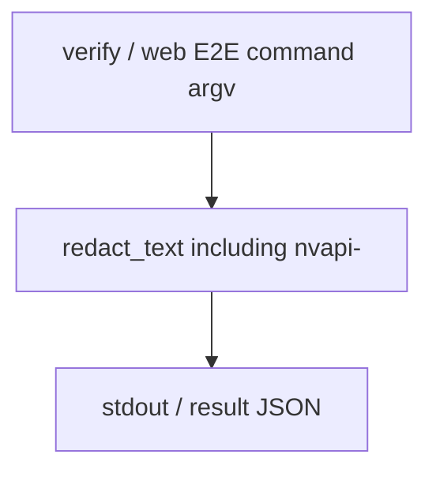

# Architecture — ContextualWisdomLab `.github`

This repository is the organization control plane. Sibling products remain
standalone modules.

## Sandbox command-metadata redaction

Operational PII is not masked. Credentials stay redacted.

## Related

- [`docs/doctoring/sandbox-command-metadata-redaction.md`](docs/doctoring/sandbox-command-metadata-redaction.md)
