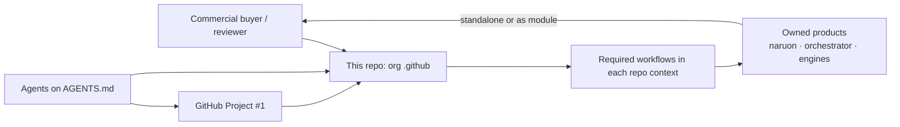
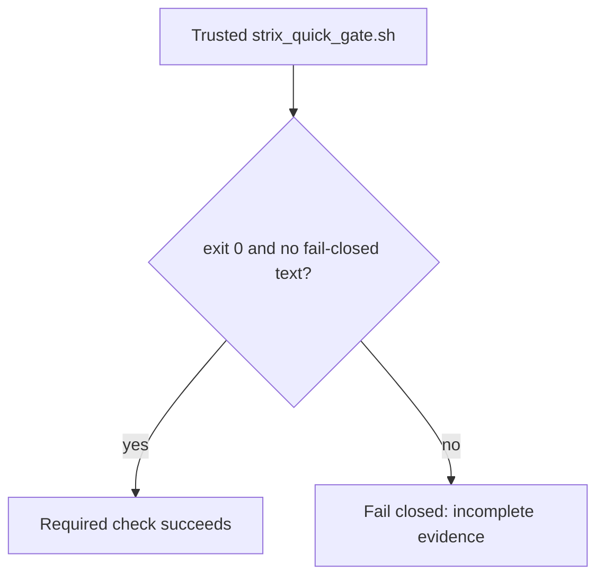
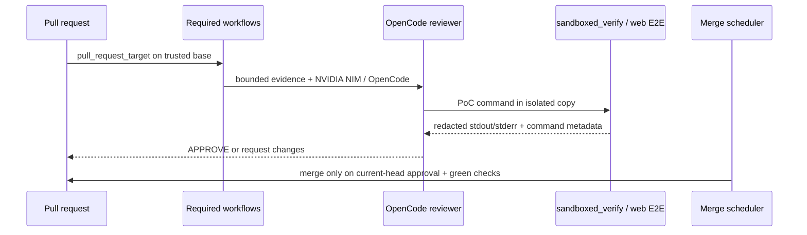

# Architecture — ContextualWisdomLab `.github`

This repository is the organization control plane. It is not naruon and it
does not own product data. Sibling products remain standalone modules; this
repo publishes org profile assets, reusable required workflows, and the
review/merge schedulers those products consume.

## System context

## Strix incomplete-evidence gate

CWE-754: a zero exit plus “failing closed” in the log is unusual and
must not become a green security check.

`pull_request_target` evaluates required workflow YAML from the trusted
base/default branch. A PR-head workflow may be materialized for data-only
self-test, but it is not the active wrapper. Workflow-changing PRs therefore
need a post-merge default-branch Strix run with a structured evidence binding;
the generic `strix` success context is insufficient.

## Control-plane data flow

## Trust boundaries

- Required review workflows execute **base-branch** scripts.
- Reviewer agents stay `edit: deny`.
- Logs redact credential shapes. They do not mask operational PII.
- LLM and scheduled agents bind `NVIDIA_NIM_API_KEY`. They never use
  `COPILOT_GITHUB_TOKEN`.
- Rust remains the psychometric arithmetic owner.

## Quality gates

`scripts/ci/` ships with 100% statement/branch coverage and 100%
docstrings.

## Related durable documents

- [`docs/CWL-MASTER-CONTEXT.md`](docs/CWL-MASTER-CONTEXT.md)
- [`docs/doctoring/strix-provider-evidence-fail-closed.md`](docs/doctoring/strix-provider-evidence-fail-closed.md)
- [`docs/agent-github-project-protocol.md`](docs/agent-github-project-protocol.md)
