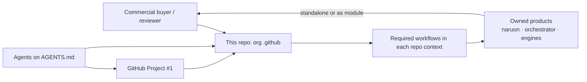
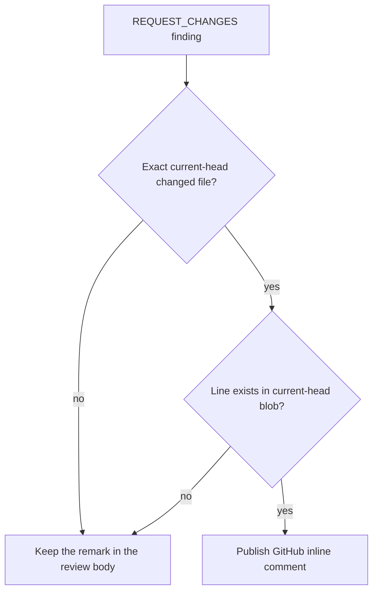
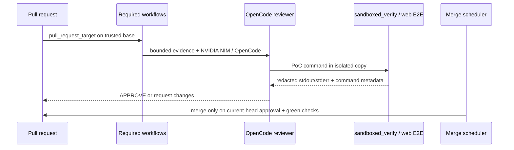

# Architecture — ContextualWisdomLab `.github`

This repository is the organization control plane. It is not naruon and it
does not own product data. Sibling products remain standalone modules; this
repo publishes org profile assets, reusable required workflows, and the
review/merge schedulers those products consume.

## System context

## Line-anchored REQUEST_CHANGES

CWE-1288: path and line must be consistent with the trusted current-head
artifact. Line `0` and `True` are not anchors (`0 > line_count` is
false). Reviewers stay `edit: deny`.

## Control-plane data flow

## Trust boundaries

- Required review workflows execute **base-branch** scripts.
- Reviewer agents stay `edit: deny`.
- Logs redact credential shapes. They do not mask operational PII.
- LLM and scheduled agents bind `NVIDIA_NIM_API_KEY`. They never use
  `COPILOT_GITHUB_TOKEN`.
- Rust remains the psychometric arithmetic owner.

## Quality gates

`scripts/ci/` ships with 100% statement/branch coverage and 100%
docstrings.

## Related durable documents

- [`docs/CWL-MASTER-CONTEXT.md`](docs/CWL-MASTER-CONTEXT.md)
- [`PR_GOVERNANCE_AUDIT.md`](PR_GOVERNANCE_AUDIT.md)
- [`docs/doctoring/review-line-anchored-findings.md`](docs/doctoring/review-line-anchored-findings.md)
