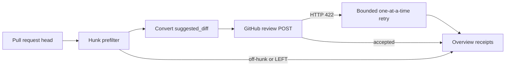

# Architecture — ContextualWisdomLab `.github`

This special repository is the org profile, the central PR-governance CI
hub, and Cloudflare infra-as-code. It is not a product runtime. Sibling
repos stay standalone and remain excellent when they import these
workflows as modules.

## Current increment (2026-08-13)

OpenCode inline comments convert surviving RIGHT-side `suggested_diff`
fences into GitHub `suggestion` blocks so authors can apply the hunk in
one click. Retry after a refused attach requires a real `HTTP 422` line
or `Unprocessable Entity`, not a `422` substring in a SHA or issue
number (CWE-1288; MITRE, 2026). Decision record:
[`docs/doctoring/review-inline-comment-422-fallback.md`](docs/doctoring/review-inline-comment-422-fallback.md).

LLM and Actions-scheduler paths continue to use `NVIDIA_NIM_API_KEY` /
OpenCode Agent. Review-agent keys are unchanged. Operational PII is not
masked.

## References (APA 7th)

MITRE. (2026). *CWE-1288: Improper validation of syntactic correctness of
input*. https://cwe.mitre.org/data/definitions/1288.html
