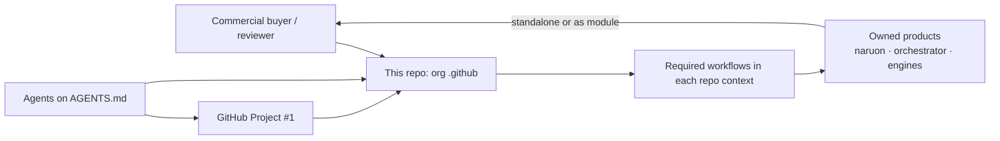
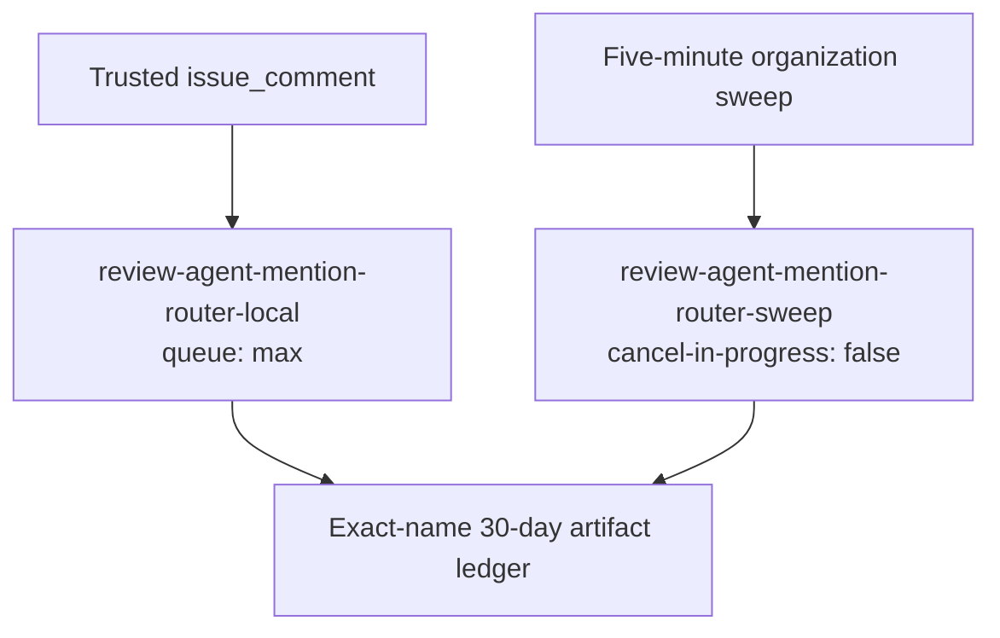
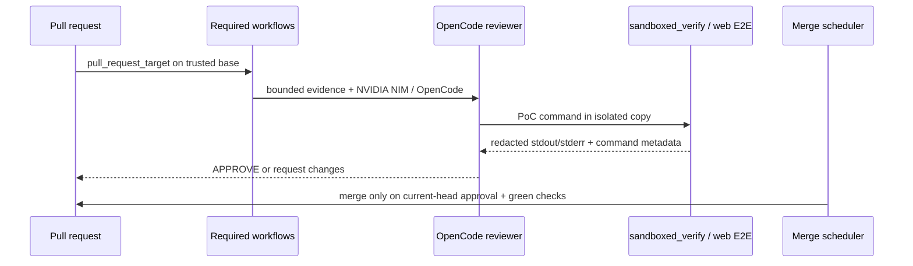

# Architecture — ContextualWisdomLab `.github`

This repository is the organization control plane. It is not naruon and it
does not own product data. Sibling products remain standalone modules; this
repo publishes org profile assets, reusable required workflows, and the
review/merge schedulers those products consume.

## System context

## Isolated mention queues

A scheduled sweep cannot replace a pending interactive route. CWE-362
forbids sharing one concurrency group across those event classes.

## Control-plane data flow

## Trust boundaries

- Required review workflows execute **base-branch** scripts. A PR that edits
  those workflows cannot widen its own `pull_request_target` token.
- Reviewer agents stay `edit: deny`. They judge; they do not implement.
- Sandbox helpers copy the workspace, drop secret environment values unless
  explicitly allowlisted by **name**, and run subprocesses with `shell=False`.
- Logs and review receipts redact credential shapes (tokens, bearer values,
  known provider prefixes). They do not mask operational PII that the
  control plane must process.
- LLM and scheduled agents bind `NVIDIA_NIM_API_KEY` (env may be
  `NVIDIA_API_KEY`). They never use `COPILOT_GITHUB_TOKEN`. Existing
  review-agent key schemes stay unchanged.

## Quality gates

`scripts/ci/` ships with 100% statement/branch coverage and 100% docstrings.
CI installs Python tools only with `pip install --require-hashes`. Contract
tests pin workflow structure and governance prose so drift fails closed.

## Related durable documents

- [`docs/CWL-MASTER-CONTEXT.md`](docs/CWL-MASTER-CONTEXT.md) — mission and
  ecosystem.
- [`docs/agent-github-project-protocol.md`](docs/agent-github-project-protocol.md)
  — Project #1 operation.
- [`PR_GOVERNANCE_AUDIT.md`](PR_GOVERNANCE_AUDIT.md) — live review/merge
  contract.
- [`docs/doctoring/agent-mention-concurrency-isolation.md`](docs/doctoring/agent-mention-concurrency-isolation.md)
  — current increment's queue-isolation decision and APA 7th citations.
