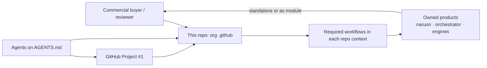
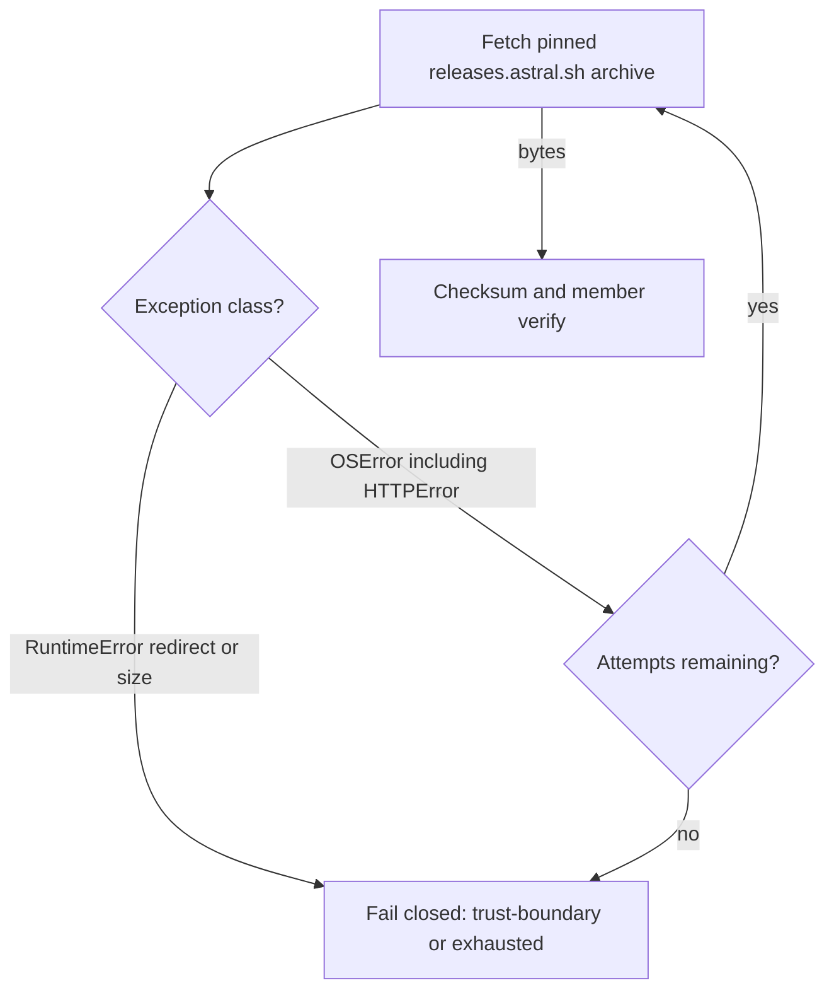
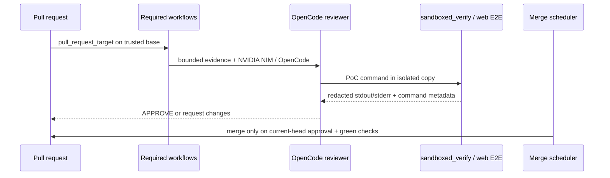

# Architecture — ContextualWisdomLab `.github`

This repository is the organization control plane. It is not naruon and it
does not own product data. Sibling products remain standalone modules; this
repo publishes org profile assets, reusable required workflows, and the
review/merge schedulers those products consume.

## System context

## Trusted-uv download retry gate

CWE-755: a lone origin 503 is an `OSError` and must retry. A redirect or
oversized payload is a `RuntimeError` and must not.

## Control-plane data flow

## Trust boundaries

- Required review workflows execute **base-branch** scripts.
- Reviewer agents stay `edit: deny`.
- Logs redact credential shapes. They do not mask operational PII.
- LLM and scheduled agents bind `NVIDIA_NIM_API_KEY`. They never use
  `COPILOT_GITHUB_TOKEN`.
- Rust remains the psychometric arithmetic owner.

## Quality gates

`scripts/ci/` ships with 100% statement/branch coverage and 100%
docstrings.

## Related durable documents

- [`docs/CWL-MASTER-CONTEXT.md`](docs/CWL-MASTER-CONTEXT.md)
- [`docs/doctoring/trusted-uv-transient-download-retry.md`](docs/doctoring/trusted-uv-transient-download-retry.md)
- [`docs/agent-github-project-protocol.md`](docs/agent-github-project-protocol.md)
