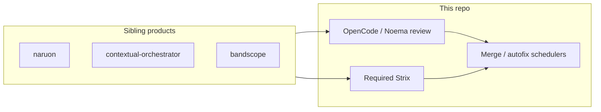

# Architecture — ContextualWisdomLab/.github

This repository is the organization-wide GitHub special repository: profile
page, central PR governance / required workflows, and Cloudflare IaC. It is
not naruon itself. naruon remains the email-workspace platform described in
`docs/CWL-MASTER-CONTEXT.md`.

## Bounded requirement includes (2026-08-14)

Coverage materialize treats a lone `--require-hashes` line as non-evidence.
Only exact SHA-256 package pins or a bounded relative `-r`/`--requirement`
include (`target == PurePosixPath.as_posix()`, no `.`/`..` parts, candidate
lock path only) enter the trusted image. Dotted includes such as
`./lock.txt` and `-r other-hashes.txt` stay outside the build context
(CWE-22; CWE-1288).

## Strix scanner pin (2026-08-13)

Required Strix used `strix-agent==1.0.4`, which printed a finished
penetration-test report and then exited before writing the artifact. The
fail-closed gate (ContextualWisdomLab/.github#891) then failed the required
check even when the console already listed real findings. That is a buyer-felt
security-dashboard miss on every ruleset consumer, including
`contextual-orchestrator`.

The shipped pin is `strix-agent==1.5.3` (atomic report writes; quit after
scan) together with `cryptography==50.0.0` (CVE-2026-39892 floor plus
CVE-2026-69247 PKCS#7 timing-oracle fix). Upstream still declares
`cryptography<49`, so compile uses `requirements-strix-ci-overrides.txt` and
install uses `pip install --require-hashes --no-deps` on the complete lock.
Decision record: `docs/doctoring/strix-agent-cryptography-override.md`.

Do not treat leftover TUI severity lines as a report, and do not drop
cryptography 50.0.0 to satisfy the stale metadata bound.
