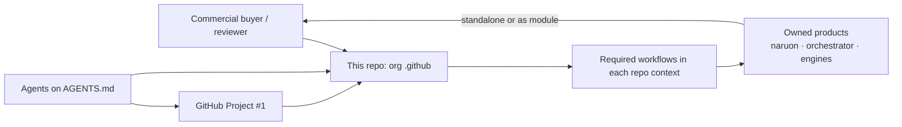
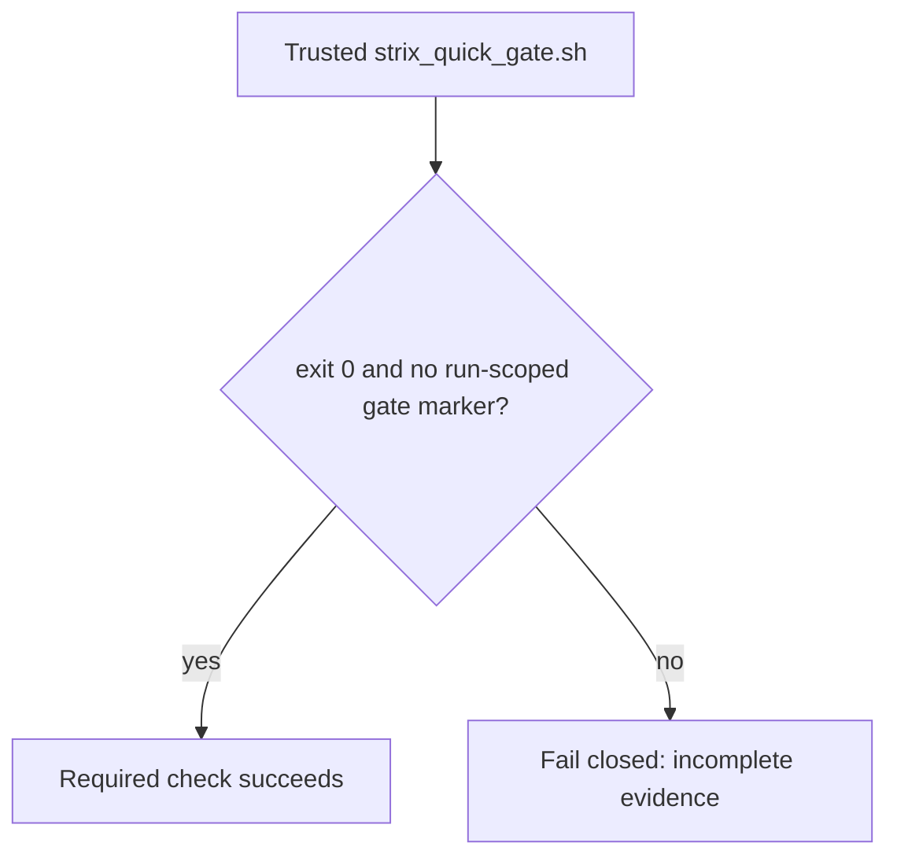
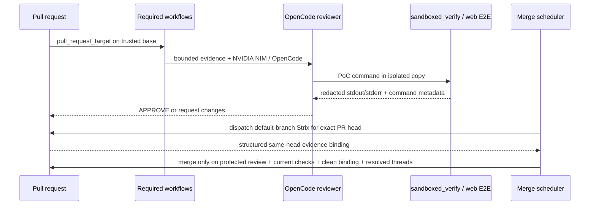

# Architecture — ContextualWisdomLab `.github`

This repository is the organization control plane. It is not naruon and it
does not own product data. Sibling products remain standalone modules; this
repo publishes org profile assets, reusable required workflows, and the
review/merge schedulers those products consume.

## System context

## Strix incomplete-evidence gate

CWE-754: a zero exit plus a run-scoped `CWL_STRIX_GATE_MARKER_<run-id>:`
line containing `failing closed`, incomplete evidence, or neutral skip is
unusual and must not become a green security check. The wrapper ignores the
same words in untrusted scanner/model/source text.

`pull_request_target` evaluates required workflow YAML from the trusted
base/default branch. A PR-head workflow may be materialized for data-only
self-test, but it is not the active wrapper. Workflow-changing PRs therefore
need a post-merge default-branch `repository_dispatch` Strix run with an
`evidence-binding.json` binding the exact PR-head SHA, scan-start SHA,
metadata-bearing `run.json`, workflow run ID, artifact, report path, and report
SHA-256. A metadata-less `run.json` is excluded rather than substituted with
the scan-start SHA; the generic `strix` success context is insufficient.

## Control-plane data flow

## Trust boundaries

- Required review workflows execute **base-branch** scripts.
- Reviewer agents stay `edit: deny`.
- Evidence artifacts apply the allowlisted minimum-disclosure scrubber to
  credentials, email addresses, phone numbers, IPv4 addresses, and absolute
  runner paths before upload. Repository-relative source locations remain so
  findings stay actionable; private reasons are not propagated to reviewer
  context. Artifact access is limited to the repository's existing Actions
  artifact readers, for the security-review purpose, with the existing
  five-day retention and GitHub audit trail.
- LLM and scheduled agents bind `NVIDIA_NIM_API_KEY`. They never use
  `COPILOT_GITHUB_TOKEN`.
- Rust remains the psychometric arithmetic owner.

## Quality gates

`scripts/ci/` ships with 100% statement/branch coverage and 100%
docstrings.

## Related durable documents

- [`docs/CWL-MASTER-CONTEXT.md`](docs/CWL-MASTER-CONTEXT.md)
- [`docs/doctoring/strix-provider-evidence-fail-closed.md`](docs/doctoring/strix-provider-evidence-fail-closed.md)
- [`docs/agent-github-project-protocol.md`](docs/agent-github-project-protocol.md)
