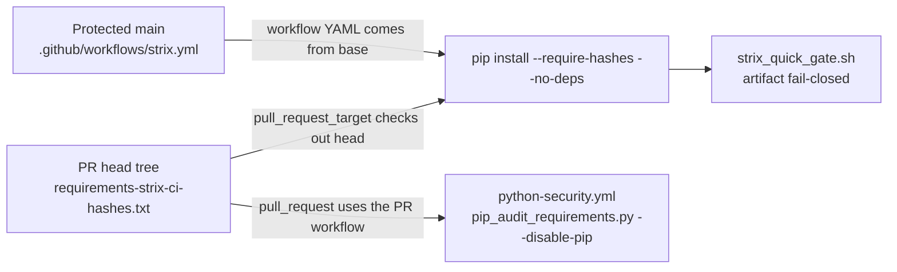
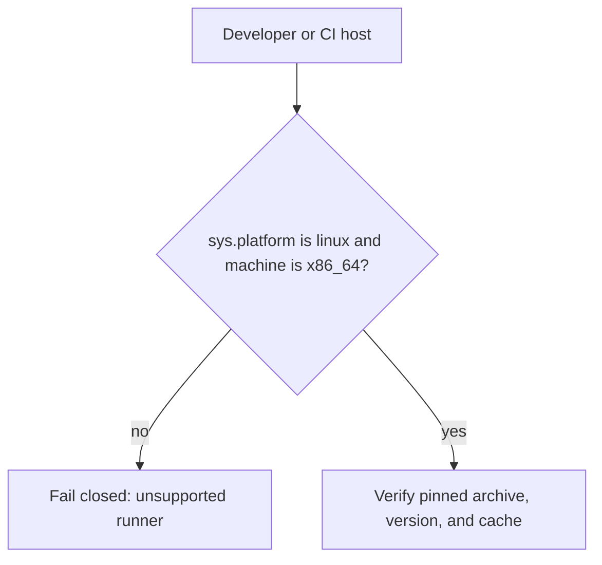

# Architecture — org-central `.github` control plane

This repository is the ContextualWisdomLab organization profile, the central
PR-governance / required-workflow hub, and the Cloudflare DNS/Pages
declaration. The live work tracker is GitHub Project #1.

## Trust boundary: required Strix vs head-tree locks

A `pull_request_target` job cannot honor an installer flag that exists only on
the pull request. `--no-deps` must therefore merge to `main` before a lock
that needs it (strix-agent 1.5.3 + cryptography 50.0.0) can install. pip-audit
is `pull_request`, so hashed-lock `--disable-pip` takes effect on the same
head. Decision record:
[`docs/doctoring/strix-hashed-lock-no-deps.md`](docs/doctoring/strix-hashed-lock-no-deps.md).

## Trusted-uv installer platform gate

Installer verification tests simulate Linux x86_64 and clear the process cache
(CWE-670) so they measure verification rather than the host-architecture gate.

## Other control-plane surfaces

- OpenCode / Noema are reviewers (`edit: deny`); GitHub Actions performs
  mechanical updates and merges.
- Review JSON embedded in Markdown is escaped by
  `scripts/ci/opencode_review_normalize_output.py`.
- Cloudflare reconcile is dry-run by default; PRs never see the API token.
