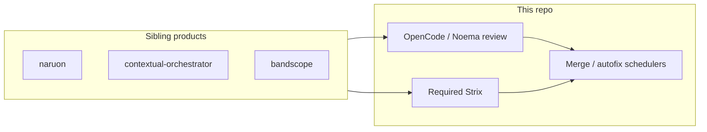

# Architecture — ContextualWisdomLab/.github

This repository is the organization-wide GitHub special repository: profile
page, central PR governance / required workflows, and Cloudflare IaC. It is
not naruon itself. naruon remains the email-workspace platform described in
`docs/CWL-MASTER-CONTEXT.md`.

## Bounded requirement includes (2026-08-14)

Coverage materialize treats a lone `--require-hashes` line as non-evidence.
Only exact SHA-256 package pins or a bounded relative `-r`/`--requirement`
include (`target == PurePosixPath.as_posix()`, no `.`/`..` parts, candidate
lock path only) enter the trusted image. Dotted includes such as
`./lock.txt` and `-r other-hashes.txt` stay outside the build context
(CWE-22; CWE-1288).

`base_hash_locks` discovers those candidates with `_is_candidate_lock_path`,
so a hash-pinned `requirements/ci.txt` is materialized even though its
file name is not `requirements*.txt`.

## Failed-check review publication (2026-08-14)

`run_failed_check_diagnosis` must pass the local `$control_json` into
`build_inline_comment_failure_body`. The helper requires that third
argument; a two-argument call under `set -u` aborts the publish step and
discards a valid REQUEST_CHANGES diagnosis. Inline-comment 422 retry
classifies HTTP 422 only from `HTTP 422` / `Unprocessable Entity` /
classified GitHub HTTP 422 JSON phrases, not a bare `422` substring
(CWE-1288). Decision record:
`docs/doctoring/review-inline-comment-422-fallback.md`.
