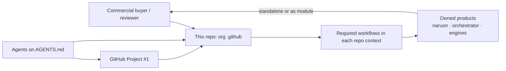
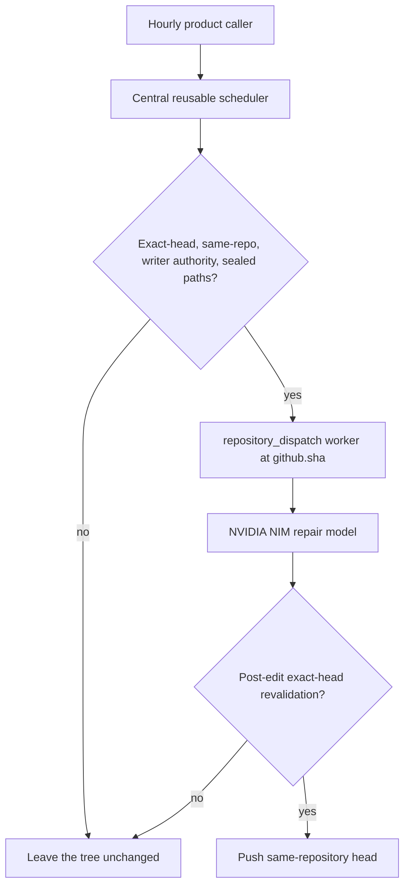
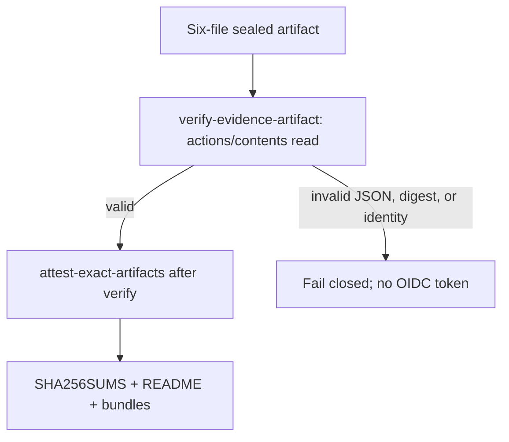
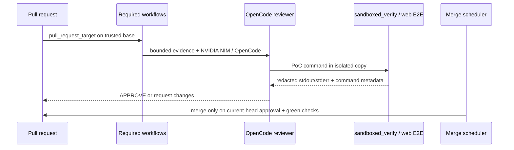

# Architecture — ContextualWisdomLab `.github`

This repository is the organization control plane. It is not naruon and it
does not own product data. Sibling products remain standalone modules; this
repo publishes org profile assets, reusable required workflows, and the
review/merge schedulers those products consume.

## System context

## OriginWeave hourly caller

`originweave-hourly-review-repair.yml` is a thin, read-only caller at minute
10. It names `ContextualWisdomLab/OriginWeave` and protected `main`, maps
only established scheduler credentials, and grants job-scoped
`id-token: write`. The reusable engine stays product-neutral.

## nonnest2 hourly caller

`nonnest2-hourly-review-repair.yml` is a thin, read-only caller at minute
16. It names `ContextualWisdomLab/nonnest2` and protected `master`, maps
only established scheduler credentials, and grants job-scoped
`id-token: write`. The reusable engine stays product-neutral.

## Hourly NVIDIA NIM repair gate

The worker checks out helpers at `${{ github.sha }}` so a later default-branch
push cannot replace privileged scripts after dispatch (CWE-367). Repair binds
`NVIDIA_NIM_API_KEY`, never `COPILOT_GITHUB_TOKEN`.

Product callers stagger Clearfolio at minute 23, DiskSage at minute 37, and
fast-mlsirm at minute 49. Each caller is read-only, dispatches at most one
repair, and delegates all privileged logic to the same sealed scheduler.

## Exact-artifact SBOM attestation

Caller inputs enter shell steps only as named environment variables. This
workflow does not claim SLSA Build L3.

## Control-plane data flow

## Trust boundaries

- Required review workflows execute **base-branch** scripts. A PR that edits
  those workflows cannot widen its own `pull_request_target` token.
- Reviewer agents stay `edit: deny`. They judge; they do not implement.
- Sandbox helpers copy the workspace, drop secret environment values unless
  explicitly allowlisted by **name**, and run subprocesses with `shell=False`.
- Logs and review receipts redact credential shapes (tokens, bearer values,
  known provider prefixes). They do not mask operational PII that the
  control plane must process.
- LLM and scheduled agents bind `NVIDIA_NIM_API_KEY` (env may be
  `NVIDIA_API_KEY`). They never use `COPILOT_GITHUB_TOKEN`. Existing
  review-agent key schemes stay unchanged.
- Rust remains the psychometric arithmetic owner. Repair never substitutes
  Python for scoring math.
- Downloaded SBOM and distribution bytes are inert. The signing job does
  not import, install, or unpack them.

## Object-storage governance (2026-08-16)

Central `.github` publishes a provider-neutral `object_storage` contract.
Naruon and other products keep their own adapters. The executable check is
`scripts/ci/validate_object_storage_contract.py`. HTTPS, exact-host
allowlists, tenant-purpose binding, server-side encryption, SHA-256-or-stronger
integrity, distinct lifecycle states, and non-destructive rollback are
required. Denied private-network trust also rejects special-use internal
and Kubernetes `.svc` suffixes. DNS pinning is mandatory; rebinding helper
suffixes and embedded or hyphenated IPv4 or 32-bit numeric aliases are never allowlist
members. CSAP and SOC 2 remain design
constraints, not certification claims.
Operational PII is not blanket-masked. Product adapters prove write/read/delete
timeout and partial-upload behavior with
`docs/object-storage/PRODUCT_ACCEPTANCE_TEMPLATE.md`.

## Quality gates

`scripts/ci/` ships with 100% statement/branch coverage and 100% docstrings.
CI installs Python tools only with `pip install --require-hashes`. Contract
tests pin workflow structure and governance prose so drift fails closed. The
trusted `uv` exporter is downloaded from the literal GitHub Releases URL for
`uv` 0.12.1; `releases.astral.sh` is not the network sink.

## Related durable documents

- [`docs/CWL-MASTER-CONTEXT.md`](docs/CWL-MASTER-CONTEXT.md) — mission and
  ecosystem.
- [`docs/agent-github-project-protocol.md`](docs/agent-github-project-protocol.md)
  — Project #1 operation.
- [`docs/pr-review-and-merge-procedure.md`](docs/pr-review-and-merge-procedure.md)
  — bot/agent exact-head review and merge procedure.
- [`PR_GOVERNANCE_AUDIT.md`](PR_GOVERNANCE_AUDIT.md) — live review/merge
  contract.
- [`docs/doctoring/hourly-nvidia-nim-autofix.md`](docs/doctoring/hourly-nvidia-nim-autofix.md)
  — current increment's repair-worker decision and APA 7th citations.
- [`docs/doctoring/fast-mlsirm-hourly-review-caller.md`](docs/doctoring/fast-mlsirm-hourly-review-caller.md)
  — product-specific psychometric repair heartbeat and scientific gates.
- [`docs/doctoring/exact-artifact-sbom-attestation.md`](docs/doctoring/exact-artifact-sbom-attestation.md)
  — current increment's attestation decision and APA 7th citations.
