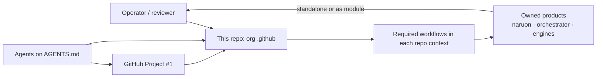
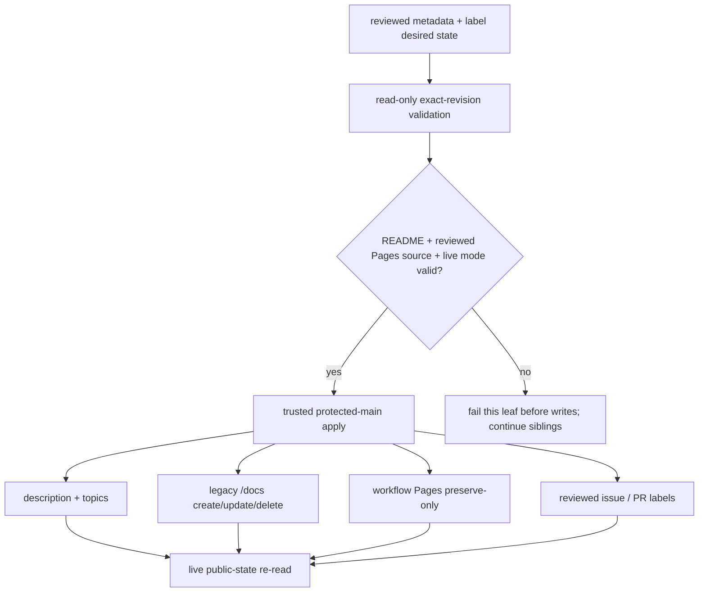
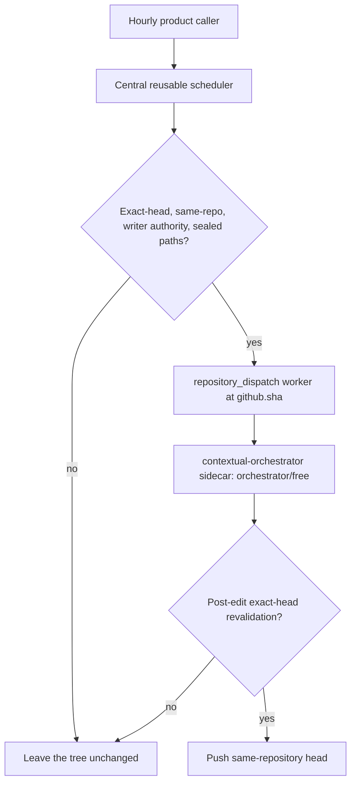
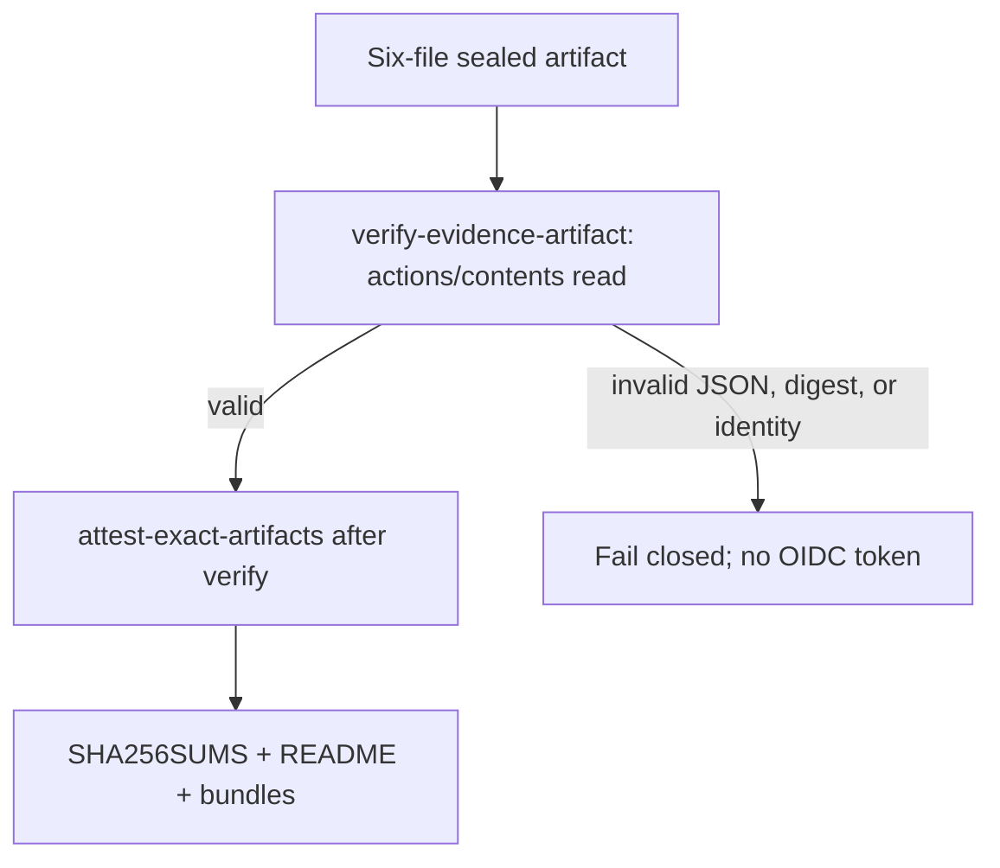
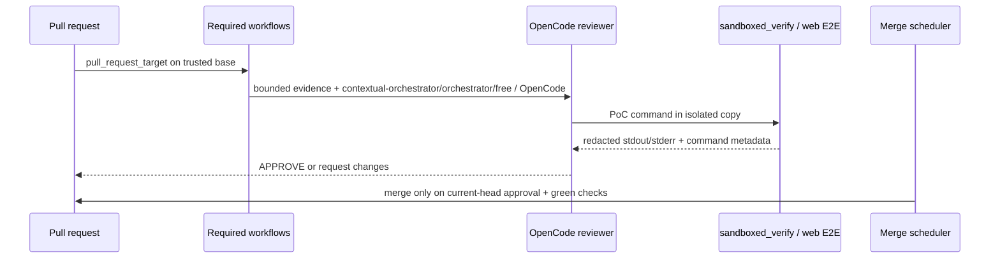

# Architecture — ContextualWisdomLab `.github`

This repository is the organization control plane. It is not naruon and it
does not own product data. Sibling products remain standalone modules; this
repo publishes org profile assets, reusable required workflows, and the
review/merge schedulers those products consume. The live gap snapshot is
[`docs/product-technical-gap-baseline.md`](docs/product-technical-gap-baseline.md);
it is not merge authorization. Figma File ID is N/A (no customer UI here).

## System context

## Repository public-surface reconciliation

Repository-facing metadata is an organization control-plane responsibility,
while product README content remains owned by each sibling repository. The
reviewed desired state lives in `config/repository-metadata.json` and
`config/repository-label-taxonomy.json`. Pull requests validate both manifests
and their reconciliation behavior without write authority. Scheduled apply
runs only from trusted `.github/main` after validation; branch-selected manual
dispatch is intentionally absent under the central workflow trust contract.

The metadata reconciler is convergent and mode-aware. Already-correct
descriptions/topics and legacy default-branch `/docs` Pages sites receive no
write; absent or drifted legacy Pages state is created/updated, and disabled
Pages is deleted. An explicit `pages_mode: workflow` instead preserves an
already-configured Actions-backed site: `.github/workflows/pages.yml` must be a
regular file on the protected default branch and the live Pages configuration
must already report `build_type: workflow`. The central control plane never
creates or converts workflow mode. These source/live-mode preconditions run
before repository description or topic mutation, so an invalid workflow Pages
declaration cannot leave a partially applied repository record. Contents API
source probes accept only a single `type: file` object; directories and listings
are not valid source evidence.

Topic equality is set-based so GitHub presentation ordering cannot manufacture
drift. Exact DeepWiki badge state is a leaf-owned precondition, including a
fail-closed contradiction when desired state disables DeepWiki while the badge
remains live. Label reconciliation adds/removes only taxonomy-declared labels
through individual endpoints, preserving unrelated concurrent
priority/status/area labels. Metadata and label failures retain independent
exit statuses, so a blocked metadata leaf does not prevent eligible label work
in the same apply. Failures aggregate after independent repositories or
assignments are attempted, so one blocked leaf never serializes the fleet.
Pull-request metadata validation keeps a PR-stable concurrency lineage and
cancels superseded validations; scheduled protected-main apply is deliberately
non-cancellable so a newer heartbeat cannot abandon partially updated fleet
state. See ADR-0020 and the operational baseline for the authority and
live-verification contract.

## Hourly product callers

`hourly-review-repair.yml` is one thin, read-only caller for all 18 product
repositories (formerly 18 near-identical files, one per repository; see
ADR-0021 and
`docs/doctoring/hourly-review-repair-single-file-consolidation.md`). Its
`on.schedule` list carries all 17 distinct cron minutes; a `resolve-target`
job reads `github.event.schedule` to look up which repository (or, for the
one shared minute, repositories) fired, and a matrix `dispatch-review-repair`
job calls the reusable scheduler once per resolved target with job-scoped
`id-token: write` and each repository's own independent,
non-cancelling `concurrency.group`. OriginWeave (minute 10, protected
`main`), nonnest2 (minute 16, protected `master`), and aFIPC (minute 2,
protected `master`) are three of the 18 resolved targets; every target maps
only established scheduler credentials. The reusable engine stays
product-neutral.

## Hashed-lock pip-audit

`scripts/ci/pip_audit_requirements.py` audits complete hashed locks with
`--disable-pip`. Resolver flags such as `--index-url` are not package
lines. `-r` includes and directory-symlink parents fail closed so pip
cannot relabel `ResolutionImpossible` as a known vulnerability.

## Hourly contextual-orchestrator repair gate

The worker checks out helpers at `${{ github.sha }}` so a later default-branch
push cannot replace privileged scripts after dispatch (CWE-367). Repair provisions the vendored
contextual-orchestrator gateway sidecar (ADR-0003), which auto-discovers upstream models from five
KV-registered provider secrets including `NVIDIA_NIM_API_KEY`; it never binds one provider
directly, and never uses `COPILOT_GITHUB_TOKEN`.

Product callers stagger Clearfolio at minute 23, DiskSage at minute 37, and
fast-mlsirm at minute 49. Each caller is read-only, dispatches at most one
repair, and delegates all privileged logic to the same sealed scheduler.

## Exact-artifact SBOM attestation

Caller inputs enter shell steps only as named environment variables. This
workflow does not claim SLSA Build L3.

## Control-plane data flow

## Trust boundaries

- Required review workflows execute **base-branch** scripts. A PR that edits
  those workflows cannot widen its own `pull_request_target` token.
- Reviewer agents stay `edit: deny`. They judge; they do not implement.
- Repository public-surface writes execute only from trusted `.github/main`;
  pull-request validation remains read-only and leaf README changes keep their
  repository-local review boundary. Workflow-backed Pages is preserve-only and
  must pass its source/live-mode precondition before any repository metadata
  write.
- Central Semgrep binds one job-level `SEMGREP_IMAGE` digest for log
  evidence, manifest inspect, and `docker run` so buyers can reconstruct
  the exact scanner that produced SARIF.
- OpenCode remains the review reasoner. Deterministic code may repair only
  trusted `path:line` source-line digest bindings on LLM probes; it never
  invents a hypothesis, observed result, or verdict.
- Sandbox helpers copy the workspace, drop secret environment values unless
  explicitly allowlisted by **name**, and run subprocesses with `shell=False`.
  Web E2E readiness URLs are loopback-only; see
  [`docs/doctoring/sandboxed-web-readiness-loopback-boundary.md`](docs/doctoring/sandboxed-web-readiness-loopback-boundary.md)
  and [`docs/adr/0004-sandboxed-web-readiness-loopback-boundary.md`](docs/adr/0004-sandboxed-web-readiness-loopback-boundary.md).
- Logs and review receipts redact credential shapes (tokens, bearer values,
  known provider prefixes). They do not mask operational PII that the
  control plane must process.
- Every LLM-bearing review and scheduled-repair workflow routes model traffic
  through the vendored contextual-orchestrator gateway. OpenCode and Noema remain
  independent read-only verdict controls with their existing credential mappings,
  while the write-capable scheduled repair worker uses
  `contextual-orchestrator/orchestrator/free`; sharing the gateway does not merge
  their credentials, privileges, or verdict authority. The gateway discovers
  eligible upstream routes from the credentials actually available to that
  workflow instead of binding a provider directly. None of these paths uses
  `COPILOT_GITHUB_TOKEN`.
- Rust remains the psychometric arithmetic owner. Repair never substitutes
  Python for scoring math.
- Downloaded SBOM and distribution bytes are inert. The signing job does
  not import, install, or unpack them.

## Quality gates

`scripts/ci/` ships with 100% statement/branch coverage and 100% docstrings.
CI installs Python tools only with `pip install --require-hashes`. Contract
tests pin workflow structure and governance prose so drift fails closed. The
repository-public-surface workflow additionally holds both reconciliation
scripts to 100% statement/branch coverage and 100% docstrings before its
privileged apply job can run. Workflow-mode regressions specifically require
fail-before-write behavior and reject directory/listing responses as Pages
source evidence.
The trusted `uv` exporter is downloaded from the literal GitHub Releases URL for
`uv` 0.12.1; `releases.astral.sh` is not the network sink.
An exact-base `uv.lock` may additionally expose source from an organization-owned
GitHub repository pinned to a full commit: the secret-free image build verifies
the fetched revision and makes its source importable without running package
build or installation hooks. Pull-request execution remains networkless.
Root-level lock files are independent environments unless an explicit include
relationship says otherwise; only one unambiguous two-file supplement pair may
be recovered together, so unrelated toolchains cannot create a synthetic
resolver conflict.

## Related durable documents

- [`docs/CWL-MASTER-CONTEXT.md`](docs/CWL-MASTER-CONTEXT.md) — mission and
  ecosystem.
- [`docs/agent-github-project-protocol.md`](docs/agent-github-project-protocol.md)
  — Project #1 operation.
- [`docs/pr-review-and-merge-procedure.md`](docs/pr-review-and-merge-procedure.md)
  — bot/agent exact-head review and merge procedure.
- [`PR_GOVERNANCE_AUDIT.md`](PR_GOVERNANCE_AUDIT.md) — live review/merge
  contract.
- [`docs/adr/0020-repository-public-surface-reconciliation.md`](docs/adr/0020-repository-public-surface-reconciliation.md)
  — desired-state ownership, trust boundary, and convergence decision.
- [`docs/doctoring/repository-public-surface-reconciliation.md`](docs/doctoring/repository-public-surface-reconciliation.md)
  — current operational baseline and live-verification contract.
- [`docs/doctoring/hourly-nvidia-nim-autofix.md`](docs/doctoring/hourly-nvidia-nim-autofix.md)
  — current increment's repair-worker decision and APA 7th citations.
- [`docs/doctoring/semgrep-image-digest-single-source.md`](docs/doctoring/semgrep-image-digest-single-source.md)
  — single-source Semgrep digest for log evidence and `docker run`.
- [`docs/doctoring/opencode-llm-review-publication.md`](docs/doctoring/opencode-llm-review-publication.md)
  — LLM probe publication without inventing observed proof.
- [`docs/doctoring/opencode-exact-vcs-dependency-evidence.md`](docs/doctoring/opencode-exact-vcs-dependency-evidence.md)
  — import-only exact source dependencies for networkless coverage.
- [`docs/doctoring/fast-mlsirm-hourly-review-caller.md`](docs/doctoring/fast-mlsirm-hourly-review-caller.md)
  — product-specific psychometric repair heartbeat and scientific gates.

- [`docs/doctoring/exact-artifact-sbom-attestation.md`](docs/doctoring/exact-artifact-sbom-attestation.md)
  — current increment's attestation decision and APA 7th citations.
- [`docs/doctoring/sandboxed-web-readiness-loopback-boundary.md`](docs/doctoring/sandboxed-web-readiness-loopback-boundary.md)
  — loopback-only web E2E readiness polling and APA 7th citations.
