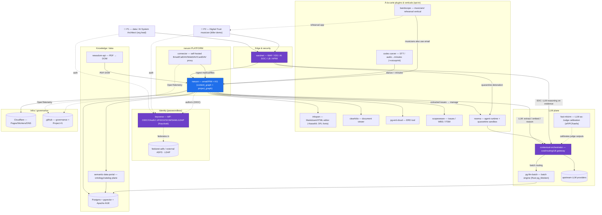

# CWL Master Context — read this first (context-reset reconstruction brief)

> Purpose: a single, durable, agent-readable brief so ANY agent (Claude with a fresh context, Codex, Grok, Gemini) can reconstruct and continue this work WITHOUT the originating conversation. Private assistant memory is NOT the source of truth — this repo is. Keep this file current.
>
> Durable sources of truth (in priority order): (1) **GitHub Project #1** "naruon Platform Roadmap" https://github.com/orgs/ContextualWisdomLab/projects/1 — live work/roadmap; (2) **naruon `docs/planning/naruon-platform-plan.md`** (PR ContextualWisdomLab/naruon#974) — full IA/User-Stories/Use-Cases/Architecture spec; (3) **`docs/agent-github-project-protocol.md`** (this repo, PR #363) — how agents operate the Project + cross-repo-ref convention; (4) this file.

## 0. Origin / core job-to-be-done (READ THIS — everything serves it)
naruon's genesis (the user's own words): **"I can't find my emails, and the schedules that arrive by email keep changing so they're hard to track."** So the two founding jobs are:
1. **FIND emails** — retrieval/context: Context Search + hybrid search + the **DAG sender ontology** ("what this sender means to me" → find + prioritize).
2. **TRACK ever-CHANGING email-borne schedules** — a meeting proposed then moved across replies/ical updates: extract the **current schedule truth** ("it's now Fri 3pm") + keep the **change history** + surface the current state + conflicts.
GROUNDING (authoritative source = naruon `docs/architecture/naruon-product-spec.md`, the North Star spec): naruon is a **Web Client + AI Workspace / relay proxy** to customer-owned data (self-hosted runner in the customer VPC; **data sovereignty** — stores only metadata + AI-extracted intent + task state), NOT an email host and NOT groupware. Core features from the spec: Thread Consolidation, DAG Sender Ontology, Self-Sent Knowledge Indexing, Ticket-based Tasks (2-way linked to threads+events), Reply Tracking, CalDAV/WebDAV writeback; 10 GNB menus (Home/Mail/Calendar/Tasks/Projects/Context Search/Data/AI Hub/Security/Settings). **The deep relationship / norm-group / KG model (§4, §5, §5b) EXISTS ONLY TO SERVE these two jobs + "what a sender means to the user" — keep it in that service, within the email-workspace scope (§1b); do NOT drill it into a social-network research artifact or groupware.** When in doubt, re-read the naruon product spec + plans (docs/architecture/naruon-product-spec.md, docs/plans/*north-star*, docs/engineering/domain-model-realignment.md) before theorizing.

## 1. Mission (Contextual Wisdom Lab / 맥락지혜 연구실)
Turn scattered enterprise context into **judgment-ready structure, then action**. The problem isn't lack of information — it's that the *context to judge is scattered* ("정보 부족이 아니라 판단할 맥락이 흩어져 있다 / 구슬이 서 말이어도 꿰어야 보배"). **Synthesis, not summary.** DIKW as checkpoints: records → contextualize → judgment point → action. Reduce human cognitive load ("사람이 덜 소모"). Judgment stays with the human.

## 1b. SCOPE BOUNDARY — naruon is an EMAIL WORKSPACE (observe & surface, do NOT own/execute org workflows)
naruon is fundamentally an **email workspace** that connects scattered context → judgment → action. It is **NOT groupware / HRIS / an approval-workflow (전자결재) / ERP engine.** It **OBSERVES, SYNTHESIZES, and SURFACES** judgment-ready structure to the human — it does **NOT own or execute** org processes (approval routing, recusal, escalation, HR actions, evaluations). The whole relationship / org-hierarchy / authority / norm-group / COI model (§4, §5, §5b) exists for **CONTEXT UNDERSTANDING + SURFACING**, NOT for enforcement. Example: for an in-company couple on a direct reporting line, naruon may NOTICE the multiplex tie and, when relevant, SURFACE a judgment-support flag ("this touches your partner / a possible conflict of interest") — it does NOT auto-recuse or route the approval; the actual approval/recusal lives in the external 전자결재 system, which naruon integrates with / observes but does not replace. When drilling the model, do not drift into groupware/workflow-owning features. Judgment (and org action) stays with the human + their existing systems.

## 2. naruon = the PLATFORM (one platform, many à-la-carte plugins)
`naruon` is an email-first workspace (FastAPI backend + Next.js frontend + a thin WebSocket connector proxying IMAP/SMTP/CalDAV/WebDAV from customer premises) whose core is a **dense two-tier knowledge graph** over Postgres + pgvector. It is a **TRUE plugin platform** ("진정한 plugin처럼 계속 붙일 수 있는"): plugin manifest/contract, extension points (ingest sources, DOM/analysis processors, KG enrichers, work-item types, UI panels, agents, scheduling), plugin registry, versioned API, isolated execution for untrusted plugins (noema quarantine sandbox). **À-la-carte / opt-in**: each capability is a plugin a user enables by need; nothing mandatory; different users run different combos. Every imported component is **standalone AND submodule** ("따로, 또 같이").

## 3. Ecosystem components (product names + roles)
Product renames (repo slug → product name; domains purchased): `cwl-idp`→**keyverse** (keyverse.io), `waf-ids-ai-soc`→**wardnet** (wardnet.io), `cwl-editor`→**inkspan** (inkspan.io). Other domains: cloud-erd.app (pg-erd-cloud), naruon.net / naruon.io (naruon).
- **naruon** — the platform (email/PIM/KG). Verticals + capabilities plug in.
- **bandscope** (BandScope) — a **vertical**: local-first desktop rehearsal app for MUSICIANS (Tauri+React+Python). Its users also use naruon for email → they plug into the platform. (NOT a naruon fork.)
- **wardnet** (was waf-ids-ai-soc) — WAF / IDS / **AI SOC** / software LB / APIM.
- **keyverse** (was cwl-idp) — central passwordless IdP: OIDC/OAuth2.1/FIDO2/SCIM/SAML(ADFS)/LDAP; eliminate passwords; federates external IdPs (incl. the employer ADFS via feelanet-adfs) + account linking / cross-IdP user merge. Built on **Keycloak (Apache-2.0)** — ZITADEL was removed (AGPL-3.0, not permissible). NO admin-console operation — config-as-code / Admin REST API only.
- **inkspan** (was cwl-editor) — commercial-grade Markdown + HTML WYSIWYG editor (TipTap/ProseMirror, MIT) with base64-inline images (LLM-readable) + a standalone base64 converter + bundled offline OFL fonts (Noto Sans KO/EN/JA/ZH/VI for air-gapped use). Feature: compose email in Markdown → HTML on send.
- **clearfolio** — document viewer (à-la-carte plugin).
- **pg-erd-cloud** (cloud-erd.app) — ERD tool for developers / data architects.
- **contextual-orchestrator** — LLM **token-cost optimizer + performance + upstream load balancer + routing hub** (LiteLLM-plus). Multi-dimensional cost review (account/service/upstream_api/model/team/group/company). Controls BATCH routing → **pg-llm-batch**.
- **pg-llm-batch** — standalone Apache-2.0 batch engine (Rust pg_tiktoken token counting + Postgres batch submit/poll/retrieve), extracted from `xtrmLLMBatchPython` (which stays PRIVATE forever — its history has live keys + employer-confidential Hyosung-ITX data; rotate those keys). The orchestrator controls its routing.
- **codec-carver** — STT / omni-modal speech+video codec (audio/video conversion for LLM input); speaker diarization + consented voiceprint; feeds auto meeting minutes.
- **fast-mlsirm** — LLM-as-a-Judge output **calibration** + measurement/evaluation-item quality; incorporate `aFIPC` Fixed-Item Parameter Calibration + `kaefa`-style item-fit optimal-model search (R IRT/psychometrics). GPU = GPGPU in the Rust core (wgpu, single numpy|rust backend axis).
- **semantic-data-portal (SDP)** — the higher **ontology / catalog / governance plane** ABOVE the doc KG (Apache AGE + pgvector). naruon owns the doc KG (content_graph + project_graph in Postgres); SDP is not that store.
- **noema** — agent runtime (Pydantic-AI / Codex-Python): a GitHub Review Agent in CI + a do-anything agent inside naruon + the **lightweight quarantine sandbox**.
- **newsdom-api** — PDF → DOM recognition sidecar (generalized beyond JP newspapers). naruon parses non-PDF formats (html/md/plaintext) into its content_graph.
- **scopeweave** — issue/WBS **management** + ITSM Service Request (two-layer: requester ticket ↔ team issues). Consumes issues naruon extracts from email/conversation/ITSR. (Dev-CODE issues stay in GitHub/GitLab — integrate, don't rebuild GitHub.)
- **appguardrail** — app security guardrails; collects org security/CI failures + Strix findings as issues.
- Forks (fix UPSTREAM via a very detailed PR in the upstream's language): argos, vooster (+v2), and R pkgs. `xtrmLLMBatchPython` PRIVATE.

## 4. Personas + killer demo
- **P1** = the org lead (the user): data architect + data Product Manager + data expert + **AI System Architect**, in an AI business team → needs legal/regulatory (법령) review; uses cloud-erd.app. Expects rigor on data modeling/ERD/schema.
- **P2** = his girlfriend (KILLER demo): works in a **Digital Trust / security team on personal-data-protection (개인정보보호)** AND plays in **N amateur workplace bands** → heavy BandScope + naruon user. She forgets her schedule and double-books band rehearsals over prior commitments (incl. dates) → naruon aggregates calendars + extracts commitments to the KG + detects conflicts + reminds, privacy-preserving. Proves platform+verticals AND security/privacy as first-class.

**Org hierarchy (structural, not flavor — the norm-groups, approval chains, scheduling, and privacy bridge all route through it):** each persona sits in **company → team → under a team lead (팀장)**.
- P1: AI System Architect in an **AI business team (AI사업팀)** at his employer; reports to his team lead; needs legal/regulatory review.
- P2: belongs to **N+1 distinct, overlapping norm-groups, each with its OWN separate leader** — (1) her **work security team (Digital Trust / 보안팀, 개인정보보호)** led by her **work team lead (팀장)**, AND (2) **N bands, each led by its own band leader**. The work team lead and the band leaders are DIFFERENT groups / different authorities — she answers to a different leader in each context. This is the concrete case of CP-3 multi-membership: resolve *which* group + whose norms apply per interaction before acting.
These give concrete instances of: **norm-groups** (company, team, band×N — CP-3 multi-membership); **approval chains** (leave/travel 전자결재 flows through the team lead → CP-4 anticipatory coordination); **scheduling** (team meetings called by the team lead → RSVP/conflict); **privacy bridge** (a personal fact discloses only its *consequence* — "unavailable" — to the team lead/team, never the reason → CP-5); and **org-affiliation over time** (current vs former employer → content-based classification, CP-5). So the KG models **Person, Company/Org, Team, Role {team_lead | member}, Band(+leader), NormGroup** — AND, crucially, **RELATIONSHIPS ARE FIRST-CLASS (REIFIED) ENTITIES**, not bare edges, because a relationship carries attributes, evidence, confidence, temporal validity, disclosure policy, and norm-context:
- **`membership`** (person→group: member_of / reports_to / leads) — role, **valid_from/to tenure window**, authority (e.g. a team lead's approval power).
- **`interpersonal_relation`** (person↔person: partner, colleague, **former**-colleague, band-mate, manager) — closeness, **disclosure policy**, context.
- every relationship node carries: `type` · `participants` · **`valid_from/to`** (temporal → current vs former employer) · **`evidence` (source_segment_uids)** · **calibrated `confidence`** · **`norm_group` context** · **`disclosure_level`**.
Reify because relationships are INFERRED (individual-evidence-based posterior → CP-3 ecological-fallacy-safe), CHANGE over time (tenure ends → former), carry a PER-RELATIONSHIP disclosure policy (CP-5: partner sees more, team lead sees only the consequence), and can be REFERENCED by other relationships/claims. Same reification applies to Event↔Event relations (enables/conflicts/unrelated) and Commitment links. **Org hierarchy is MULTI-LEVEL / recursive** (there is a team lead's team lead, and above): `reports_to` is **transitive** — a person's management chain is arbitrary depth (member → team lead → their team lead → … → dept head → exec), queried as a variable-length path (Apache AGE openCypher). **Org/Team entities NEST** (Company ⊃ Division ⊃ Department ⊃ Team — a containment hierarchy). This drives: **approval escalation** (전자결재 climbs the reports_to chain by amount/type threshold), **level-dependent authority**, and **bounded disclosure propagation** (CP-5: a personal fact's *consequence* reaches the immediate lead only as far up the chain as policy allows — it must NOT silently leak further up). **Norm-groups OVERLAP in membership, and authority is GROUP-LOCAL (can INVERT)**: a **workplace/company band (직장인 밴드)** means the same people are colleagues AND band-mates — a related-team (유관 팀) colleague may be your **band leader**. So `leads`/`reports_to`/authority is a property of the **per-norm-group relationship, NOT a global person-to-person ranking** — the same pair can have OPPOSITE authority in different groups (your work-junior leads you in the band). Therefore norm resolution must **select the ACTIVE group per interaction and apply THAT group's authority + norms + disclosure**, never a global ranking; and **disclosure must respect every overlapping context** (a fact from the band context must not leak to the work context via a shared member). The reified relationship model captures this naturally: one person-pair has **multiple relationship entities, one per norm-group**, each with its own authority direction, norm context, and disclosure policy.

## 5. Cross-cutting disciplines (ACCEPTANCE CRITERIA, bind every feature)
- **CP-1 DIKW spine**: KG is the product, inbox is an ingest edge; synthesis over summary; reduce cognitive load.
- **CP-2 No-ask / dense-KG auto-resolution**: NEVER ask the user a disambiguation question (asking re-imposes the scattered-context load the product removes). A dense, multi-dimensional KG holds the evidence to auto-resolve (e.g. hotel location vs event venue, host=partner vs colleague, commitment status, travel time). Surface the RESOLVED connection + recommended action + evidence + calibrated confidence; the human **corrects by exception**, never answers a question. Even "pick an option" is a residue of asking. Irreversible/external actions (send/book/approve) still terminate at a human approve/hold, delivered as a correction surface. Connecting context IS the mission — never gate it behind a permission question; KG DENSITY replaces the question.
- **CP-3 Ecological-fallacy discipline**: infer at the correct level of analysis; group/norm-group rates are PRIORS updated by individual content to a POSTERIOR; never impute group→individual (or reverse). One person belongs to **N simultaneous OVERLAPPING norm/reference groups** (multi-MEMBERSHIP graph, not a tree); norms are group-relative; resolve the active norm-group(s) before acting. Honest calibrated confidence.
- **CP-4 Commitment-status weighting**: every commitment has status {confirmed | tentative | desired} + RSVP direction {organizer | attendee}. Conflict detection is STATUS-WEIGHTED (confirmed > tentative > desired). A desired item (an RSVP I'm sending) over a confirmed slot (a paid booking) = conflict the confirmed side wins; NEVER silently break a confirmed commitment. e-Approval (전자결재: leave/travel/expense) outcomes are first-class KG events linked to the events they enable (anticipatory coordination). Worked examples in naruon#974 §6 (UC-01..05).
- **CP-5 Privacy: default-segregated + consent minimal-disclosure bridge**: contexts (personal / work→{former employer, current employer} / per-project / per-band) segregated by default, classified by CONTENT not account. A private fact affects another context ONLY via its necessary CONSEQUENCE (e.g. "unavailable Tue–Thu") — NEVER the private reason (e.g. "hospitalized"). NOT a hard wall — a consent-gated, revocable, audited, minimal-disclosure BRIDGE; user controls disclosure level. Multi-account binding (N email accounts → one identity), content-based classification. Email-to-self (from==to) = personal storage/notes → KG reference nodes, not interpersonal communication.
- **G6 Language-agnostic**: extraction/resolution/search consistent across EN/KO/JA/ZH/VI via LLM extraction + multilingual embeddings + cross-lingual structured topic modeling (STM). NO dependency on morphological analyzers (Kiwi/Nori) — they cause performance cliffs (refs 1week.tistory.com/119-122). **FTS language resolution**: naruon's current `to_tsvector` FTS is language-DEPENDENT and fails CJK (tokenizer cliff) — DROP per-language configs; use dense multilingual embeddings (primary) + language-agnostic sparse (pg_trgm/pg_bigm char n-grams, PostgreSQL-licensed, AND/OR learned-sparse SPLADE-style as pgvector sparsevec) fused via RRF; unaccent+NFC for Vietnamese.
- **SEAM Don't productionize stopgaps**: naruon's current deterministic extraction, to_tsvector FTS, and half-built multi-account model are SCAFFOLDING. Build the real target behind a stable extractor/plugin SEAM (orchestrator-routed LLM-based, language-agnostic); current code = reference/fallback, not the thing to cement.

## 5b. Deeper model — the hard problems (agent-drilled; extends §5 disciplines)

These are the non-obvious complications the naive person→group→edge model misses. Each names the problem + the KG/design implication + the discipline it extends.

1. **Identity resolution across sources / languages / aliases (FOUNDATIONAL).** One Person surfaces as many email addresses, name variants, per-org identities, and across scripts (김철수 = Chulsoo Kim = "CS"). Unless these resolve to ONE Person entity, the entire relationship + norm graph fragments and every downstream inference is wrong. Requires cross-lingual, cross-account entity resolution (embeddings + deterministic signals + evidence) with calibrated confidence; **merge/split are REVERSIBLE ops, never hard-merge on weak evidence** (CP-3). Extends G6 + multi-account.

2. **Role / Position as a first-class entity — authority attaches to the ROLE, not the person.** Approvals route to "the team-lead role," which different Persons occupy over time; when the holder changes, `reports_to`/authority re-point automatically. Model **Position ← occupied_by(temporal) → Person**; approval/authority hang off the Position.

3. **Delegation / acting-roles (대결·전결).** Authority is temporarily delegatable: a lead on leave delegates approval to an acting lead for a window. A **Delegation** relation (from_role, to_person, scope, valid_window) reroutes approvals during that period. Standard in 전자결재; must not misroute to the absent holder.

4. **Relationship lifecycle transitions RE-RESOLVE authority + disclosure.** Relationships aren't static: a colleague is promoted (becomes your lead → authority direction FLIPS), a band disbands, a partner becomes an ex (disclosure policy flips), a colleague becomes a *former* colleague (context reclassifies). Each transition is an **event** that triggers re-evaluation; **stale relationships must stop applying old norms** (e.g. an ex must not retain partner-level disclosure).

5. **Norm conflict when ONE interaction implicates MULTIPLE active groups at once.** A message to someone who is BOTH your work colleague AND your band leader has no single "active group." Resolve the **active frame** from channel/topic/thread cues (work-deadline email → work norms; setlist message → band norms). When genuinely ambiguous, represent multi-frame uncertainty and default to the **most-restrictive disclosure** — never silently assume one hat.

6. **Tie strength + decay weight everything.** Relationship strength is continuous (interaction frequency/recency) and **decays** (a colleague silent for 2 years). It weights disclosure defaults, **scheduling priority** (a close prior commitment outranks a distant one — extends CP-4), and who-to-loop-in. Recompute on interaction; don't treat presence of an edge as constant strength.

7. **Emergent / implicit groups vs formal groups.** Beyond formal org/band membership, the recurring participants of a thread / a project's actual collaborators form a **de-facto group** with its own norms. Detect emergent groups from interaction patterns (co-occurrence, reply graphs), not just the org chart; ad-hoc task forces / a thread's cc-list are real norm-groups.

8. **Privacy MOSAIC / aggregation (the Digital-Trust deep point).** Minimal-disclosure PER event is insufficient: an observer who sees the PATTERN of consequences ("unavailable Tue–Thu" + "declined the offsite" + "left early Monday") can INFER the private reason (hospitalization). The bridge must reason over the **aggregate** of what has been disclosed to an audience over time (differential-privacy-like), not each disclosure in isolation. Extends CP-5.

9. **Consent as a first-class, scoped, revocable, purpose-bound, auditable entity.** Consent to disclose to the team lead ≠ to their lead; ≠ for a different purpose; is revocable and time-bound. Model **Consent(subject, data_class, audience_scope, purpose, expiry, granted/revoked events)**. Purpose limitation + revocation are legal requirements (개인정보보호) — extends CP-5 and the legal/regulatory feature.

10. **Reflexivity — the system's OWN inferences + actions are first-class KG events.** Every auto-resolution, auto-RSVP, auto-moderation (AI SOC), draft, and disclosure is recorded as an event with **provenance (evidence, confidence, responsible extractor)** and is ONE gesture to correct; corrections update the extractor/edge confidence, closing the **correct-by-exception** loop (extends CP-2). The KG is self-describing about what the AI did and why — required for audit + the human staying in charge of judgment.

11. **Cross-org / external parties.** Relationships extend past the company: customers, vendors, partners, venues, the external employer ADFS. External relationships carry **different trust + disclosure defaults**; classification must place them (personal / current-employer / former-employer / external-vendor / customer) — extends CP-5 + keyverse federation.

12. **Contradiction & provenance-conflict handling.** Sources disagree (one email says X reports to A, a later one implies B). The KG must hold **competing claims with evidence + recency + source-trust**, resolve to a posterior (not overwrite), and surface the contradiction rather than silently picking one — CP-3 honesty. Never collapse conflicting evidence into false certainty.

## 5c. Multiplex / dual relationships — RESEARCH-GROUNDED, re-scoped to OBSERVE & SURFACE
Literature-grounded (see papers below). A dyad can hold MULTIPLE relationship types at once, across domains — reify one relationship entity per (pair, domain), never a single averaged tie (Higgins et al. 2021: *segmented multiplexity* = domain-restricted exchange). Key frames: **role-set / role conflict** (Merton 1957; Kahn et al. 1964), **nepotism is not uniformly bad** (entitlement vs reciprocal — Jaskiewicz 2013), **workplace-romance risk rises with power differential** (Pierce/Byrne/Aguinis 1996), **dormant ties keep NONZERO residual** (Levin/Walter/Murnighan 2011; Kram 1983 mentor phases → redefinition).
**Taxonomy (temporal axis: C=both active, H=one historical/dormant):** T1 parent⊕boss (C) · T2 in-company couple on a DIRECT reporting line (C) · T3 couple-peers (C) · T4 friend⊕manager (C) · T5 mentor⊕manager (C) · T6 co-founder⊕sibling (C) · T7 in-law⊕colleague (C) · T8 ex-partner⊕colleague (H) · T9 former-tutor⊕peer (H) · T10 former-boss⊕peer (H) · T11 band-leader⊕org-junior = authority INVERSION (C).
**KG representation:** one reified `Relationship(a→b, type, domain_context, role_a/role_b, authority{scope,direction,weight}, norm_context, disclosure_policy, valid_from/to, phase, status∈{active,dormant,ended}, residual{authority,trust,obligation}=decay(t)+floor(>0))` per (pair,domain); NormGroup precedence; Frame selects which relationship's authority is legitimate; authority COMPOSES per-frame (never sums); DORMANT edges retained (decay≠0) and INCLUDED in queries so masked authority gradients (T9/T10) aren't invisible to the org chart.
**SCOPE — the SOCIAL GRAPH belongs IN the KG (core); only ENFORCEMENT is out (per §1b).** Do NOT confuse "naruon doesn't run org workflows" with "drop the social network" — the relationship / social-network graph is CORE and lives fully in the KG (it already does: naruon `project_graph_objects` has a `participant` type + the DAG Sender Ontology + domain-model-realignment). The social graph is the FOUNDATION for the origin jobs AND the real pains: it powers FIND + PRIORITIZE (DAG sender ontology — "what this sender means to me"), schedule TRACKING (who a changing meeting is with + priority), and — critically — the project pains the user named: **too many projects, schedule management that doesn't work, WBS that can't be estimated, Job/Work/Task/Duty that is a mystery.** The person↔person + person↔event + dependency graph is exactly what makes schedule management, **WBS / inter-event dependency ESTIMATION**, and work decomposition (Job/Work/Task/Duty) possible (with scopeweave). The ONLY out-of-scope part is naruon EXECUTING org actions (auto-recuse, route approvals, run 전자결재/HR): naruon **models + reasons + surfaces**, the external systems ACT. So: full social-graph modeling + inference + estimation-support + surfacing = IN; workflow enforcement = OUT.
**Attachable papers (CC BY 4.0, redistributable):** Higgins, Crepalde & Fernandes (2021) PLOS ONE 16(9):e0257527 (segmented multiplexity); Frontiers in Psychology (2021) 12:690074 (ambivalent leader-follower). Green-OA (link, don't redistribute): Levin et al. 2011 Organization Science (dormant ties); Pierce/Byrne/Aguinis 1996 JOB (workplace-romance power differential). Cite-only (copyright): Verbrugge 1979, Merton 1957, Kahn 1964, Kram 1983, Jaskiewicz 2013.

## 6. AI SOC = wardnet + noema quarantine sandbox (see wardnet#38)
A **source-agnostic artifact-analysis service**: `submit(artifact, context) → {verdict, confidence, evidence, IOCs}`. Consumers: naruon email/file attachments (quarantine BEFORE store), platform uploads, connector inputs, API, GitHub issue/PR comments (one trigger). WITHOUT VirusTotal (self-contained): static (YARA(BSD) + capa(Apache) capability→ATT&CK + LIEF/pefile + unzip/macro extract + entropy + context heuristics) + dynamic detonation in a gVisor/Firecracker (Apache) microVM with eBPF behavioral monitoring (Falco/Tetragon, Apache) + network sinkhole + **LLM reasoning (via contextual-orchestrator) over the evidence** + KG/IOC correlation (self-hosted growing reputation). Auto-response per consumer (GitHub → delete comment + block user; email → quarantine + flag; upload → reject + notify). Validated by a real incident 2026-07-08 (user mapasevo21 posted a `sarif_bypass_patch.zip` malware lure on .github#365 + naruon#977 — deleted + blocked manually; this is what the SOC would automate).

## 7. Engineering conventions (BINDING, all agents)
- **Commercial/permissive licenses ONLY** — MIT/Apache-2.0/BSD/ISC/MPL-2.0/PostgreSQL. NO GPL/AGPL/copyleft/non-commercial. Verify via `gh api repos/<o>/<r> --jq .license.spdx_id` before adding. (ZITADEL=AGPL removed; MinerU=Apache OK; ParadeDB pg_search=AGPL avoid; ClamAV=GPL avoid.)
- **DB object names = 2+ word snake_case** (don't rename existing Camel/Pascal).
- **Config/secrets from a KV/credential store, NOT os.getenv** (env only as bootstrap transport).
- **Attach relevant paper PDFs in PRs** (permissive redistribution only).
- **Use CodeGraph maximally** (build an index on a clone, then explore, before grep; cite queries).
- **Do NOT ask the user to decide** — make the call and proceed (full autonomy).
- **Cross-repo references** must be `owner/repo#num` or a full URL (never plain "naruon PR #974", which doesn't link). Same-repo may use `#num`.
- **One phase at a time** — execute ONE coherent verified increment per roadmap phase on the previous phase's MERGED foundation; do NOT fan out all phases as parallel PRs (that scatter saturated the runners). Don't announce phases you then don't execute in order.
- **Durable knowledge lives in the repo / Project / KG (dogfood), NOT in an agent's private memory.**
- Interconnected products are developed **PUBLIC** (after a full-history secret scan; xtrmLLMBatchPython excepted — stays private).

## 8. Roadmap (full detail: naruon#974 §9; live status: Project #1)
- **P0 MVP** — make the dense KG real (behind a stable extractor seam; do NOT productionize the deterministic stopgap; reconcile multi-account model; extend hybrid search to content_segments + project_graph_objects; wire DecisionPointCard).
- **P1 Platform/Plugin SDK** — registry, versioned API, hook bus, manifest/license/signature gate, noema quarantine sandbox, /plugins UI.
- **P2 Dense-KG inference** — LLM-based language-agnostic extraction (orchestrator-routed) + batch embeddings; typed entities (graph_persons/events/commitments, norm_groups + memberships); prior×likelihood posterior; no-ask auto-resolve + correct-by-exception.
- **P3 Scheduling & conflict avoidance** — status-weighted conflict engine; iTIP/iMIP RSVP (organizer vs attendee); free-busy find-time; room booking; anticipatory 전자결재→travel; connector CardDAV + POP3-over-WS.
- **P4 Privacy bridge** — context isolation + content-based classification; consent minimal-disclosure bridge.
- **P5 Verticals** — BandScope, pg-erd-cloud, scopeweave, Inkspan, codec-carver (audio minutes+voiceprint), legal/contract, code-integration — all à-la-carte plugins on the P1 SDK.
- Cross-cutting: OpenTelemetry error tracking across naruon + the connector (self-hosted-runner-style Email/CalDAV/WebDAV/CardDAV proxy); AI-authored Office docs (python-docx/openpyxl/python-pptx); real-time collab (TipTap+Yjs); naruon email signatures; KG-mediated email style correction; project wiki (KG); requirements/RFI/RFP, WBS/estimation, planned-vs-actual gap (early/on-time/delayed/not-performed/skip), Phase/Activity/Task/Duty (=Job/Work/Task/Duty), Waterfall↔Agile (scopeweave).

## 9. How work is tracked (dogfood the traceability)
GitHub **Project #1** is the shared source of truth. Structure: real **Issues** (roadmap/backlog, in owning repos, custom fields Phase P0–P5/Ops/Decision + Component) and real **PRs** (delivered work, native Repository). Native workflows are ON (item added→Todo, PR merged→Done, item closed→Done). Chain: roadmap **Issue** → agent sets In Progress on pickup → implementing **PR** `Closes #N` → merge → auto Done. Operate the Project per `docs/agent-github-project-protocol.md`. Group by Phase / Component / Repository.

## 10. Current state (2026-07-08)
- Renames done (keyverse/wardnet/inkspan). Planning spec = naruon#974. Project #1 populated (68 issues + 60 PRs). Protocol = .github#363.
- **BLOCKER B1**: org GitHub Actions effectively HALTED (~86 queued, ~0 in_progress org-wide) — likely the Actions monthly SPENDING CAP. Blocks ALL PR checks/merges + the Cloudflare DNS run (nameservers). Fix (org-admin): raise the Actions spending limit OR add a self-hosted runner. Nothing merges until then.
- **Decisions pending**: (D1) Code Security enablement vs the CodeQL-only code_scanning ruleset (osv/trivy/scorecard SARIF upload) — a private repo needs GHAS seats; reconcile or make those checks non-required. (D2) trivy `limit-severities-for-sarif: true` (gate only CRITICAL/HIGH) — held pending the user's strict-security preference.
- **Built this session, PR-open, awaiting merge (B1)**: see Project #1 PRs (contextual-orchestrator cost/routing #46 + naruon#973; pg-llm-batch; keyverse Keycloak; inkspan; SBOM #361; opencode auto-retry #360; Strix neutral #349 + emit #358; appguardrail collector #254; auto-rebase #357; noema #359/naruon#970; PDF-DOM naruon#965/newsdom#300; SDP #11; fast-mlsirm GPGPU #109; scopeweave #284/naruon#971; fuzzing 10 PRs (found+fixed 2 real naruon bugs); Cloudflare DNS/Pages #362; this protocol #363; planning #974). Human step: report the mapasevo21 malware file (github user-attachments) to GitHub Abuse; rotate the xtrmLLMBatchPython-leaked keys; the org-admin runner/decisions above.

---
*Keep this current. Update Project #1 as the live tracker; this file is the narrative brief a fresh agent reads to reconstruct the whole picture.*

## Inter-component architecture (UML)

Component / interaction diagram of how the ecosystem connects. `naruon` is the platform core; à-la-carte plugins + verticals attach; `contextual-orchestrator` is the LLM plane; `keyverse` is auth; `wardnet` is the edge + AI SOC.

**Reading it:** users hit `wardnet` (edge/SOC) → `naruon` (platform); everything authenticates via `keyverse` (which federates external ADFS/LDAP). `naruon` ingests via the `connector` + `newsdom-api`, builds the KG in Postgres, uses `semantic-data-portal` for the ontology plane, and routes ALL LLM work through `contextual-orchestrator` (which load-balances upstreams and routes batch to `pg-llm-batch`). `noema` is the shared agent runtime + quarantine sandbox (used by naruon, the GitHub review agent, and wardnet's AI SOC). Plugins/verticals (`inkspan`, `clearfolio`, `pg-erd-cloud`, `scopeweave`, `codec-carver`, `bandscope`) attach à-la-carte; `fast-mlsirm` calibrates LLM-as-Judge quality. Hosting = Cloudflare; governance + Project #1 live in `.github`.
