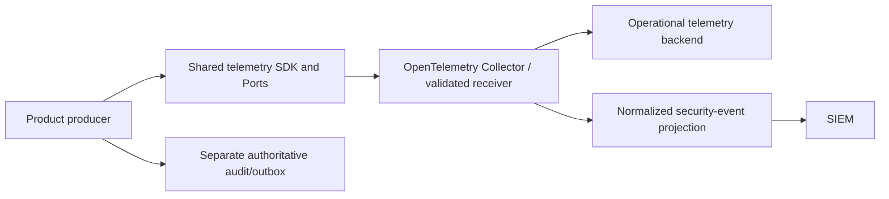

# 0032 — Canonical runtime telemetry ownership

- **Status:** Proposed; runtime package and receiver are not released
- **Date:** 2026-09-25
- **Issue:** [ContextualWisdomLab/.github#1565](https://github.com/ContextualWisdomLab/.github/issues/1565)

## Context

The current default branches of
[naruon `develop@042b0c7`](https://github.com/ContextualWisdomLab/naruon/blob/042b0c70531b229af3acbd0421a2f23098d848b3/backend/core/telemetry.py),
[LineageWeave `main@83eba56`](https://github.com/ContextualWisdomLab/LineageWeave/blob/83eba56149eb802cd63642c507c324c9976ec78e/lineageweave/observability.py),
and [contextual-orchestrator `main@5665b0a`](https://github.com/ContextualWisdomLab/contextual-orchestrator/blob/5665b0ad1e07ffb5e9f8c59e44b6b2a785298013/contextual_orchestrator/telemetry.py)
construct OpenTelemetry exporters or providers in product code. Those files
and branch heads were re-read on 2026-09-24 UTC. The
existing `context-graph-contracts` repository contains only a README on
`develop`, so it supplies neither a runtime API nor a released dependency.
The product specification calls for OpenTelemetry across naruon and its
connector, while this repository owns governance and compatibility checks.

## Decision

Create a dedicated, versioned [cwl-telemetry](https://github.com/ContextualWisdomLab/cwl-telemetry)
runtime package as the canonical SDK/Port owner. The repository now exists;
[its implementation PR #1](https://github.com/ContextualWisdomLab/cwl-telemetry/pull/1)
is open, and no release is available. Its first reviewed release must precede
production adoption and any organization-wide blocking gate. `.github` owns the
architecture contract and the canary fitness check, not runtime providers.
Products own event production and domain-specific classification. The shared
package owns explicit logger, tracer, meter and exporter bootstrap, bounded
attribute admission, and OTLP delivery policy. A Collector/gateway owns
receiver validation, routing and buffering. A telemetry backend stores
operational signals. SIEM consumes only normalized security events.

The version-one API is an explicit `bootstrap(TelemetryConfig(...))` call returning logger/tracer/meter Ports
and a shutdown handle. Importing the package must have no network, thread,
provider, or credential side effect. Receiver opt-in must validate an HTTPS
endpoint and scoped credentials. Tenant/workspace references are opaque and
bounded. No product may construct an OTLP exporter/provider or SIEM client
after adopting the shared package. An ADR for a genuine canonical runtime
owner is the only exception to the central fitness rule.

The event contract is versioned and admits only bounded, typed fields:
event name, UTC timestamp, severity, service/version, environment, exact
source revision, opaque tenant/workspace and permitted principal references,
trace/span/request correlation, bounded context and operation codes, resource
reference, action/result/status, error type/code, retry count, duration,
dependency/provider, source location, classification, purpose code and
provenance reference. A strict allowlist rejects raw prompts, responses,
document bodies, credentials, cookies, Authorization headers, DSNs and
unnecessary personal data before queue admission. Unknown fields fail closed;
high-cardinality values cannot become metric labels.

| Signal | Owner | Retention and purpose |
| --- | --- | --- |
| Operational logs/traces/metrics | Product emits; shared SDK bounds; Collector routes | Short, purpose-bound diagnosis; exact duration set by deployment policy |
| Normalized security event | Security producer and SIEM schema owner | Security investigation; no raw debug stream |
| Authoritative audit/domain event | Product audit/outbox owner | Durable business or compliance record, outside telemetry delivery |

Receiver admission checks schema/version, content type, size, tenant binding,
timestamp window, replay/idempotency, authentication and TLS. An external
telemetry record cannot invoke a domain command or change authorization.
The shared security outbox can hand one normalized event at a time to an
operator-approved HTTPS SIEM gateway. The gateway must acknowledge the exact
event ID in a bounded JSON response before the sender marks it delivered;
HTTP failure, redirect, malformed acknowledgement, or TLS failure leaves the
record pending. Local failure/recovery tests cover this handoff. No actual
SIEM destination, gateway deployment, schedule, or retention policy has been
verified.
Normal export failure must not fail a product transaction: a bounded queue
retries with backoff, then follows an explicit drop/dead-letter/local durable
buffer policy and reports loss. The audit/outbox path remains durable and
separate. On Collector or SIEM outage, product work continues, the bounded
buffer fills, a loss signal appears, and recovery drains with idempotency and
preserved source identity. Shutdown has a bounded flush and reports residue.

The canary `python3 scripts/ci/check_telemetry_ownership.py <product-checkout>`
reports direct Python OpenTelemetry bootstrap calls, including simple factory
aliases. It is not yet a required workflow: it does not see dynamic dispatch
or non-Python clients, and no shared
release exists for the detected products to adopt. The release gate requires
schema/privacy/cardinality and trace/source tests, timeout/backoff/saturation/
shutdown/Collector/SIEM outage and recovery tests, receiver hostile-input
tests, and one product's released-adapter migration with parity tests. Only
after that canary succeeds may `.github` make the check blocking for products.
The runtime PR's local pinned-Collector canary observed traces, logs,
and metrics from the shared SDK after TLS and bearer-token admission, and
rejected malformed or unauthenticated requests. A second local test stored a
security record in the Collector's persistent queue during consumer outage,
restarted the Collector, and verified delivery to the recovered HTTPS consumer
(2026-09-24 UTC). The
[naruon migration draft #1772](https://github.com/ContextualWisdomLab/naruon/pull/1772)
removes product-owned exporters and passes focused local parity/privacy tests.
Its draft now adds an encrypted database credential row, an operator stdin
provisioning command, startup activation, and an image-sealed source revision;
focused local tests and a backend image build verified those paths. Its
repository rule requires runtime credentials from a KV/credential registry,
so the temporary environment-variable opt-in was removed. The image still
lacks a hash-pinned released shared wheel, and no deployed credential,
backend, or SIEM route has been verified. A pinned reusable ownership workflow
is piloted on the naruon PR; it is not yet an organization-wide required gate.

## Issue #1565 acceptance audit — 2026-09-24 18:07 UTC

This is a local and GitHub evidence snapshot, not a release verdict. The
runtime PR head is `a41a8bd098ba1cf268f3dbbb06d382856bc26ad1`, the
governance PR head is `42e12580ca41d189ff8e711a441cbc7bf6d46654`, and
the naruon draft head is `3cccca66c58a6037259016764f231298ac644099`.
Their current-head check rollups are pending; the runtime and naruon PRs still
require independent review. No `cwl-telemetry` release exists.

| Acceptance item | Current evidence | Remaining proof |
| --- | --- | --- |
| 1. Reject product-local vendor bootstrap | The Python canary passes naruon and reports eight direct constructions on LineageWeave main. Tests cover aliases, lexical shadowing, defaults and assignment values. The reusable workflow exempts only the ADR-0032 runtime owner `ContextualWisdomLab/cwl-telemetry` using the caller repository identity. | Dynamic/non-Python clients and direct Collector/SIEM clients are not covered. |
| 2. Versioned, inert shared Port | Runtime PR contains `0.1.0` API and an import-side-effect test. | Reviewed, published wheel with verified digest; no release exists. |
| 3. Schema, privacy, identity and trace contract | Runtime contract tests cover bounded fields, prohibited content, W3C propagation and exact product source revision. | Current-head hosted result and independent review. |
| 4. Degraded delivery and audit durability | Local tests cover bounded SDK queue, shutdown failure, Collector restart with a persistent security queue, security outbox recovery and SIEM outage/acknowledgement. Naruon request still succeeds when its receiver is down. | Deployed queue capacity/alerting and the product's separate authoritative audit/outbox durability are not proven by these telemetry tests. |
| 5. Hostile receiver admission | Local Collector canary and security decoder tests cover TLS, bearer, content type, size, schema/version, tenant, time and replay cases. | Hosted current-head result and deployed receiver admission. |
| 6. Owner, purpose, retention and degraded sequence | This ADR and the runtime README define the route and owners; the pinned Collector canary executes local routing and recovery. | Approved backend/SIEM destination, concrete retention periods, deployed persistent volume and live delivery evidence. |
| 7. One product migration with parity | Naruon draft removes direct exporter/provider construction; 97 relevant tests pass, one live-DB test skips, and a local HTTPS OTLP wire test checks redaction and source identity. | Released hash-pinned wheel in the production image, live DB evidence, current-head hosted checks and review. |
| 8. Central compatibility gate | Governance reusable workflow and naruon caller pin exact commits; local canary rejects LineageWeave and passes naruon. | Current-head hosted caller result, required-status rollout and coverage of other product languages/client libraries. |

### Evidence update — 2026-09-26 15:51 UTC

The shared runtime [PR #1](https://github.com/ContextualWisdomLab/cwl-telemetry/pull/1)
reached `6af2a93fd5069b91d5eddbc817c26a0c2d2fd560`: all 23 local contract,
hostile-receiver, and pinned-Collector tests passed; the wheel and source
distribution built. Its SIEM sender now closes failed HTTP responses while
leaving unacknowledged events pending. The naruon migration
[PR #1772](https://github.com/ContextualWisdomLab/naruon/pull/1772) reached
`79d6e89bc4c3e41085fcf07c98bb8c2706de9452` and pins that exact SDK
revision for development. On a fresh isolated PostgreSQL database, Alembic
reached head, an actual permission-change request succeeded with the telemetry
receiver unavailable, and a separate DB session found its committed security
audit row. This adds local product audit durability evidence to item 4 and
removes the live-DB evidence gap from item 7. Neither PR has current-head
hosted checks or independent approval; the runtime is unreleased, Naruon's
production image has no released hash-pinned wheel, and no approved backend or
SIEM destination, retention policy, or live delivery is verified.

The runtime's main-only manual workflow can build and attach wheel, source
distribution and SHA-256 manifest to a **draft** release after merge. A draft
or a local build is not a published dependency. Until publication and the
product image's hash-pinned install are verified, keep telemetry disabled in
production. Do not infer backend or SIEM delivery from local canaries.

## Consequences

- One runtime package can version redaction and delivery policy independently
  of product releases; the central checker can prevent duplicate bootstrap.
- A new package and Collector deployment must be maintained. Until both exist,
  this ADR and checker are governance evidence, not runtime completion.

## Alternatives considered

- **Use `.github` as runtime owner:** rejected because this control-plane
  repository does not ship product runtime dependencies.
- **Promote `contextual-orchestrator`:** rejected because its telemetry serves
  model routing and is a product-specific bounded context.
- **Expand `context-graph-contracts`:** rejected for runtime ownership now:
  its present protected baseline only declares interoperability contracts.
  A future explicit charter and package release could revisit the decision.
- **Treat wardnet as the SIEM consumer:** rejected for this first contract.
  At [main `f8260f1`](https://github.com/ContextualWisdomLab/wardnet/blob/f8260f1e03836039ff9463dd99fa982e4e270c4b/README.md),
  wardnet exposes its own WAF/SOC events as NDJSON and explicitly leaves full
  SIEM adapters for later. Its event payload includes client IP and raw path;
  that product-specific producer cannot silently become the normalized
  organization security-event consumer. A named SIEM destination and retention
  policy still need owner approval before production routing.
