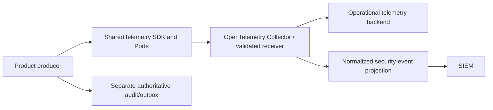

# 0032 — Canonical runtime telemetry ownership

- **Status:** Proposed; runtime package and receiver are not released
- **Date:** 2026-09-25
- **Issue:** [ContextualWisdomLab/.github#1565](https://github.com/ContextualWisdomLab/.github/issues/1565)

## Context

The current default branches of
[naruon `develop@042b0c7`](https://github.com/ContextualWisdomLab/naruon/blob/042b0c70531b229af3acbd0421a2f23098d848b3/backend/core/telemetry.py),
[LineageWeave `main@83eba56`](https://github.com/ContextualWisdomLab/LineageWeave/blob/83eba56149eb802cd63642c507c324c9976ec78e/lineageweave/observability.py),
and [contextual-orchestrator `main@5665b0a`](https://github.com/ContextualWisdomLab/contextual-orchestrator/blob/5665b0ad1e07ffb5e9f8c59e44b6b2a785298013/contextual_orchestrator/telemetry.py)
construct OpenTelemetry exporters or providers in product code. Those files
and branch heads were re-read on 2026-09-24 UTC. The
existing `context-graph-contracts` repository contains only a README on
`develop`, so it supplies neither a runtime API nor a released dependency.
The product specification calls for OpenTelemetry across naruon and its
connector, while this repository owns governance and compatibility checks.

## Decision

Create a dedicated, versioned [cwl-telemetry](https://github.com/ContextualWisdomLab/cwl-telemetry)
runtime package as the canonical SDK/Port owner. The repository now exists;
[its implementation PR #1](https://github.com/ContextualWisdomLab/cwl-telemetry/pull/1)
is a draft, and no release is available. Its first release must precede
product migration and any organization-wide blocking gate. `.github` owns the
architecture contract and the canary fitness check, not runtime providers.
Products own event production and domain-specific classification. The shared
package owns explicit logger, tracer, meter and exporter bootstrap, bounded
attribute admission, and OTLP delivery policy. A Collector/gateway owns
receiver validation, routing and buffering. A telemetry backend stores
operational signals. SIEM consumes only normalized security events.

The version-one API is an explicit `bootstrap(TelemetryConfig(...))` call returning logger/tracer/meter Ports
and a shutdown handle. Importing the package must have no network, thread,
provider, or credential side effect. Receiver opt-in must validate an HTTPS
endpoint and scoped credentials. Tenant/workspace references are opaque and
bounded. No product may construct an OTLP exporter/provider or SIEM client
after adopting the shared package. An ADR for a genuine canonical runtime
owner is the only exception to the central fitness rule.

The event contract is versioned and admits only bounded, typed fields:
event name, UTC timestamp, severity, service/version, environment, exact
source revision, opaque tenant/workspace and permitted principal references,
trace/span/request correlation, bounded context and operation codes, resource
reference, action/result/status, error type/code, retry count, duration,
dependency/provider, source location, classification, purpose code and
provenance reference. A strict allowlist rejects raw prompts, responses,
document bodies, credentials, cookies, Authorization headers, DSNs and
unnecessary personal data before queue admission. Unknown fields fail closed;
high-cardinality values cannot become metric labels.

| Signal | Owner | Retention and purpose |
| --- | --- | --- |
| Operational logs/traces/metrics | Product emits; shared SDK bounds; Collector routes | Short, purpose-bound diagnosis; exact duration set by deployment policy |
| Normalized security event | Security producer and SIEM schema owner | Security investigation; no raw debug stream |
| Authoritative audit/domain event | Product audit/outbox owner | Durable business or compliance record, outside telemetry delivery |

Receiver admission checks schema/version, content type, size, tenant binding,
timestamp window, replay/idempotency, authentication and TLS. An external
telemetry record cannot invoke a domain command or change authorization.
Normal export failure must not fail a product transaction: a bounded queue
retries with backoff, then follows an explicit drop/dead-letter/local durable
buffer policy and reports loss. The audit/outbox path remains durable and
separate. On Collector or SIEM outage, product work continues, the bounded
buffer fills, a loss signal appears, and recovery drains with idempotency and
preserved source identity. Shutdown has a bounded flush and reports residue.

The canary `python3 scripts/ci/check_telemetry_ownership.py <product-checkout>`
reports direct Python OpenTelemetry bootstrap calls. It is not yet a required
workflow: it does not see dynamic dispatch or non-Python clients, and no shared
release exists for the detected products to adopt. The release gate requires
schema/privacy/cardinality and trace/source tests, timeout/backoff/saturation/
shutdown/Collector/SIEM outage and recovery tests, receiver hostile-input
tests, and one product's released-adapter migration with parity tests. Only
after that canary succeeds may `.github` make the check blocking for products.
The draft runtime PR's local pinned-Collector canary observed traces, logs,
and metrics from the shared SDK after TLS and bearer-token admission, and
rejected malformed or unauthenticated requests (2026-09-24 UTC). The
[naruon migration draft #1772](https://github.com/ContextualWisdomLab/naruon/pull/1772)
removes product-owned exporters and passes focused local parity/privacy tests.
Its operator credentials, exact image revision, and hash-pinned released wheel
are not wired, so this is not production backend or SIEM delivery evidence.

## Consequences

- One runtime package can version redaction and delivery policy independently
  of product releases; the central checker can prevent duplicate bootstrap.
- A new package and Collector deployment must be maintained. Until both exist,
  this ADR and checker are governance evidence, not runtime completion.

## Alternatives considered

- **Use `.github` as runtime owner:** rejected because this control-plane
  repository does not ship product runtime dependencies.
- **Promote `contextual-orchestrator`:** rejected because its telemetry serves
  model routing and is a product-specific bounded context.
- **Expand `context-graph-contracts`:** rejected for runtime ownership now:
  its present protected baseline only declares interoperability contracts.
  A future explicit charter and package release could revisit the decision.
