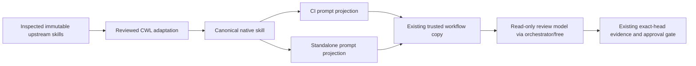

# ADR-20260907-review-skill-projection: bounded procedures in trusted reviewer prompts

Status: Proposed. Date: 2026-09-07.
Owner: ContextualWisdomLab/.github, review-instruction packaging.
Gap ID: G-REVIEW-SKILL-PROJECTION-20260907.

## Problem and evidence

The user asked to make useful tools in the September 6 social post available to
organization review bots and agents. A catalog entry alone does not change a
reviewer's input. Unrestricted installation can introduce hooks, permissions,
provider calls and instructions that conflict with CWL's existing boundaries.

Protected-main observation `78a4937c684a54ca8e415822c913742f41c6efc4` shows that
`.github/workflows/opencode-review-dispatch.yml` copies the two trusted root
prompt files into `OPENCODE_REVIEW_WORKDIR` after its inline fallback prompt.
The runtime configuration binds `ci-review` and `ci-review-fallback` to
`ci-review-prompt.md` and `code-reviewer` to `code-reviewer-prompt.md`.
This existing copying seam is the integration point; merely adding a skill
file to the reviewed PR tree would not establish trusted policy provenance.

PR #1655 already owns the uncertainty/control-schema repair in both prompts.
This child starts at `5cbce30b4905e033480d4a9c7f8195be7f029bc9` and preserves its
entire prompt prefixes byte-for-byte. It does not change the predecessor ref.
Main and parent snapshots are evidence, not interchangeable release identities.
The parent is not an installed foundation until protected integration succeeds.

## Alternatives

1. Install complete upstream plugins on every CI run. Rejected: unnecessary
   executable hooks and mutable dependency/network surfaces; inappropriate for
   the deliberately read-only review process.
2. Add upstream links to AGENTS.md only. Rejected as the implementation: discovery
   is useful, but the isolated CI model cannot fetch links and an AGENTS change
   does not prove the selected procedures reached its runtime prompt.
3. Publish one bounded native skill and explicit prompt projections. Selected:
   no new runtime dependency or workflow trigger; the existing trusted copy
   operation delivers the selected procedures. A contract test rejects divergent,
   absent, ambiguous or partial projections.

## Decision and boundaries

The canonical body is `.agents/skills/cwl-review-evidence/SKILL.md`; bundled
`references/upstream_sources.md` carries immutable source and license records.
The marked body is reproduced exactly in both existing root prompts. Those
copies are distribution projections, not separately maintained policy owners.
There is no production compiler or new Python runtime; Python is used only by
this repository's existing test mechanism to compare packaged artifacts.
The kebab-case skill directory/name follows the Agent Skills interchange
convention; it is not a general naming-policy change.

Use Ponytail as a supplemental complexity lens, Agent Skills for engineering
review, and Scientific Agent Skills for applicable scientific claims. Do not
adopt a line-count target, smoke-only quality gate, one-implementation deletion
rule, blanket clinical evidence grading, or upstream provider/installation flow.
See the [source-selection record](../doctoring/review_skill_source_selection.md).

Read-only review permissions, trusted evidence provenance, adversarial probes,
current-head identity, existing verdict/uncertainty contracts, `orchestrator/free`,
independent approval and protected merge remain unchanged. Review procedures do
not authorize fetch, shell, edits, MCP, subagent dispatch, paid fallback or
plugin activation. Product domain truth stays with its current owner. CO remains
the routing owner; DiagramWeave remains the diagram owner; local workstation
plugin installation remains outside this central CI slice.

## PRD / TRD / dependency flow

PRD: a reviewer can suggest a simpler implementation without weakening safety or
DDD, and can identify unsupported scientific claims without inventing evidence.
TRD: native skill and both trusted prompt projections must carry identical
procedure bytes. Missing or divergent projections fail the packaging tests.

This is a dependency view, not a claim that a new service was deployed.

## Acceptance and limitations

The RED snapshot `6d3f311d3d9d12df178fcc169c6a5fb58e14de40` contains packaging
regressions before implementation. Local focused evidence must record the
actual test result, source-prefix blob identity and final projection equality.
These are deterministic artifact checks, not measurements of model accuracy,
false-positive rate, token savings or task success. No such improvement is
claimed without a source-bound evaluation using the allowed free routing path.

Evaluation cases for the subsequent model-backed comparison include retaining a
single-implementation ACL; rejecting deletion of input validation; distinguishing
failed-fit denominators from successful-fit accuracy; recognizing repeated or
time-leaking observations; rejecting a PR-supplied fake skill; and avoiding
scientific prerequisites for an unrelated spelling change. Evaluate existing
and changed prompts on the same authorized cases and preserve disagreements.
Do not promote this manual scenario list into executed test evidence.

The child remains Draft while #1655 is unintegrated. After non-force integration
and retargeting, admit the complete child for independent review without treating
Ready as merge authorization. Merge only when its own exact-head checks and
independent review pass. Then verify one real central reviewer run consumed the
new protected prompt before claiming live rollout. Noema, Strix and vendor-hosted bots are not wired by this patch. Their
owners must integrate the same released procedure through their trusted prompt
boundary and validate their own receipts; they must not fetch this mutable
child branch as a runtime dependency. Native skill discovery also requires a
host that supports `.agents/skills` and a checkout/distribution containing it.

## Gap baseline handoff and rollback

G-REVIEW-SKILL-PROJECTION-20260907 is implemented at the packaging/projection
layer but remains Proposed for production consumption. The separate baseline
writer should append this entry and the final child PR/head to
`docs/product-technical-gap-baseline.md`, preserving its dated inventory. The
large shared baseline and AGENTS/CLAUDE owner lanes are not rewritten by this
child. The same change is Unreleased; no GitHub release or scheduled task is
created here.

Rollback removes the marked projections and native skill together in a reviewed
change and updates the packaging tests. It must leave the parent uncertainty
repair, all pre-existing prompt bytes and all workflow permissions intact.
