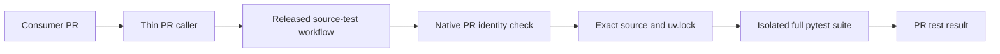

# ADR: Reusable Python source-tree tests

- Status: Proposed
- Date: 2026-09-07
- Decision owners: CI maintainers
- Scope: Python unit-test execution in consumer PRs
- Figma File ID: N/A; no product UI

## Context and decision drivers

An operations consumer has a locked pytest suite but no PR-triggered test
workflow. Its review check can pass while no unit tests run on GitHub. A local
full-suite run also exposed a pre-existing missing runbook entry after focused
tests had passed. Review and focused local results cannot substitute for an
executable full-suite check bound to the submitted revision.

The central owner at `c9052e607e5f3cc76e73207e7786b21500721b79` has a reusable
`exact-head-coverage-quality-gate.yml`, but that contract installs its own
quality dependencies and measures one `scripts/ci` module at 100% branch
coverage. It does not preserve a consumer's locked project dependencies.
The existing R and Dependency Review contracts own different responsibilities.

The drivers are exact PR identity, locked dependencies, no production access,
small caller configuration, and a truthful distinction between unit tests,
package builds and runtime acceptance.

## Decision

Add `.github/workflows/python-source-tests.yml` as the canonical owner of this
narrow test shape. The consumer retains its PR trigger and pins the reusable
workflow to a reviewed, released immutable owner revision. Adoption must wait
for that publication; a PR branch is not a released contract.

The workflow validates the native `pull_request` event, a positive PR number
matching the caller input, and a full native head SHA before checkout. It
checks out that SHA with credential persistence disabled and verifies the
result before installing dependencies. A fixed GitHub-hosted Linux runner
receives only read access to repository contents. No service, deployment
credential, arbitrary shell input, shared cache or publication step is added.

Use the consumer's `uv.lock` with `uv sync --locked --no-install-project` and
an optional extra passed as a quoted value, then run the fixed command
`uv run --no-sync python -m pytest tests`. The consumer owns pytest discovery
and its source import configuration. Python version and optional extra are
the only project variations; action pins and the uv version remain owner data.

The workflow-level group includes the caller workflow name, repository and
native event PR number, with cancellation of older runs in that group. A missing
native PR uses a unique run ID until the identity guard rejects it.
The unvalidated input number must not select a group: concurrency precedes the
job guard, so a bad input could otherwise cancel another PR before rejection.
The reusable workflow owns concurrency; callers must not repeat that group.
GitHub supplies the caller's workflow name even inside a reusable workflow, so
separate caller workflows remain independent. This contract supports one call
per caller workflow and PR; parallel matrix invocations need a separate owner
contract rather than competing for this group.
Missing or inconsistent PR identity fails; dispatch, push and
`pull_request_target` are outside this contract.

## Alternatives considered

- Keep manual tests: rejected because no check then follows the PR revision.
- Copy a standalone workflow into each consumer: rejected because setup,
  identity and dependency handling would acquire multiple owners.
- Extend the single-module coverage workflow with project-install switches:
  rejected because its dependency and coverage contract differs materially.
- Install the editable project: excluded from this source-tree contract because
  package build dependencies may not be covered by `uv.lock`. Consumers needing
  installed entry points or build correctness need a separately verified build
  contract; they must not cite this workflow as package-install evidence.
- Accept free-form test commands: rejected; consumer source is already executed
  on an isolated runner, but central command construction need not gain a
  second injection surface.

## Consequences and validation

Each eligible PR obtains a full `tests` run using its committed dependency
resolution. Failures propagate without a success fallback. A finite 15-minute
job limit bounds unit-test hangs; it does not set any model inference timeout.
This initial limit is an operational ceiling, not a measured performance claim.

Unit tests remain untrusted code. Read-only token permissions do not make their
behavior safe for production runners or credentials. Consumers must review
their own suite for service requirements and side effects. The workflow does
not impose a network sandbox, independently trusted coverage threshold,
package-build guarantee, deploy authorization or live-service proof.
`--no-install-project` skips the root package only; dependency and workspace
package builds can still occur. Projects using only a dependency group named
`dev` must pass an empty `project_extra`, since groups are not extras.

Validation must exercise the real identity guard with missing, mismatched and
malicious inputs, check the locked/no-sync execution contract, lint the workflow,
then obtain actual owner CI and independent review. Publication and consumer
adoption each require fresh exact-head evidence. See the
[doctoring record](../doctoring/python-source-tests.md) for observations and
the remaining release/consumer gates.

