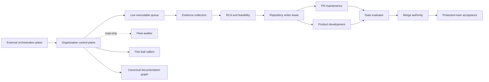
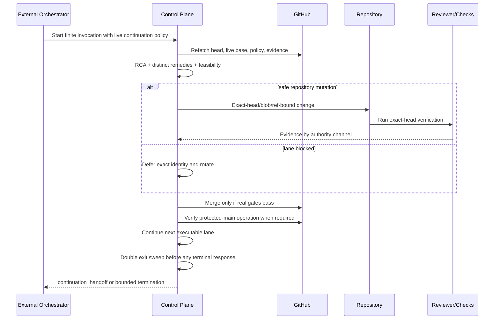
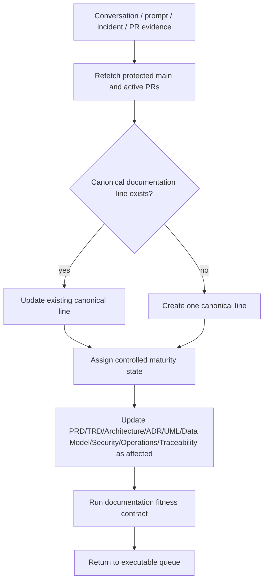

# CWL Automation Control Plane Architecture

Status: active_pr

## Bounded contexts

The External orchestration plane owns scheduled agent invocation, continuation policy, and external writer-lease state. The GitHub execution and evidence plane owns repositories, PRs, branches, workflows, checks, statuses, reviews, rulesets, artifacts, and merge/release evidence. These planes interact but are not interchangeable authorities.

The central repository owns reusable GitHub automation semantics and the canonical documentation graph. Product repositories own product code and thin local caller/contracts. Dedicated repository loops own writes to their repositories; the fleet auditor remains read-only. A conversational decision or automation prompt is an input to reconciliation, not a replacement for repository documentation.

## Plane boundaries

### External orchestration plane

Approved scheduled agent/orchestrator services may hold the authoritative writer lease for a repository and may choose the next execution lane. Their enabled state, schedule, prompt/configuration, and most recent run are external control records. They cannot turn a GitHub check, review, merge, or protected-main runtime result into success by declaration.

### GitHub execution and evidence plane

GitHub-native scheduled/manual/event workflows, reusable workflows, repository-local thin callers, PRs, checks, review threads, artifacts, rulesets, and protected branches are the authoritative source of repository state and execution evidence. Cross-repository reusable behavior belongs centrally unless an accepted architecture decision assigns it elsewhere.

### Canonical documentation plane

`docs/automation/**`, the ADR index, AGENTS/CLAUDE/CHANGELOG links, and their machine-checkable fitness gate are the durable design authority. Pull-request bodies, incident comments, conversation history, and downloadable planning artifacts supply evidence and candidate decisions, but material durable decisions must be reconciled into this graph with explicit maturity.

## Trust boundaries

1. GitHub event and repository metadata are inputs, not proof of current state until refetched.
2. External automation configuration is lease/control evidence, not source/check/review evidence.
3. PR-controlled source, comments, logs, and model prompts are untrusted content.
4. Workflow source is trusted only when immutably identified.
5. Checks, statuses, formal reviews, model judgments, merge authority, and protected-main runtime evidence are separate channels.
6. Model credentials are privileged secrets and are not needed for deterministic gates.
7. A source merge and a protected-main runtime execution are separate acceptance boundaries.
8. Conversation history and active-PR documentation cannot be presented as protected-main implementation.

## Failure domains

- Repository-local product/test defect.
- Central reusable-workflow defect.
- External scheduler/orchestrator continuation defect.
- Reviewer methodology/provider failure.
- Runner/network/bootstrap infrastructure failure.
- Permission/governance configuration.
- Writer conflict or stale evidence.
- Documentation authority or traceability drift.

A failure freezes only the smallest affected domain/lane unless evidence proves a broader boundary.

## Control flow

## Documentation reconciliation flow

## Deployment topology

The control plane is hybrid rather than purely GitHub-native. External scheduled agent/orchestrator services provide finite invocation and writer-lease coordination; GitHub provides repository execution, evidence, policy, collaboration, and protected integration; external model/reviewer providers sit behind explicit credential and network boundaries. No durable database is assumed by this architecture; the data model is conceptual unless a persistence implementation is separately accepted.
