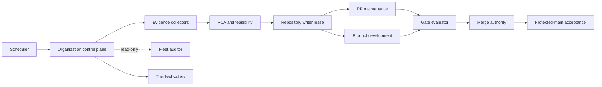
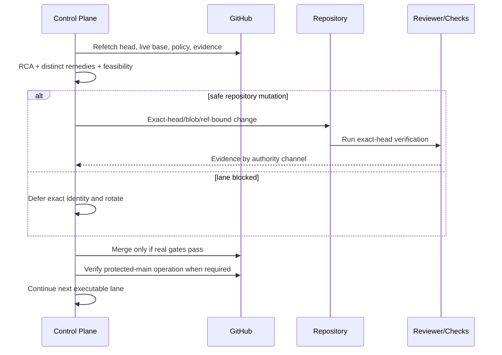

# CWL Automation Control Plane Architecture

Status: active_pr

## Bounded contexts

The central repository owns reusable automation semantics. Product repositories own product code and thin local caller/contracts. Dedicated repository loops own writes to their repositories; the fleet auditor remains read-only.

## Trust boundaries

1. GitHub event and repository metadata are inputs, not proof of current state until refetched.
2. PR-controlled source, comments, logs, and model prompts are untrusted content.
3. Workflow source is trusted only when immutably identified.
4. Checks, statuses, formal reviews, model judgments, and merge authority are separate evidence channels.
5. Model credentials are privileged secrets and are not needed for deterministic gates.
6. A source merge and a protected-main runtime execution are separate acceptance boundaries.

## Failure domains

- Repository-local product/test defect.
- Central reusable-workflow defect.
- Reviewer methodology/provider failure.
- Runner/network/bootstrap infrastructure failure.
- Permission/governance configuration.
- Writer conflict or stale evidence.

A failure freezes only the smallest affected domain/lane unless evidence proves a broader boundary.

## Control flow

## Deployment topology

The control plane is GitHub-native: scheduled/manual/event workflows, reusable workflows, repository-local thin callers, and external model/reviewer providers behind explicit credential and network boundaries. No durable database is assumed by this architecture; the data model is conceptual unless a persistence implementation is separately accepted.
