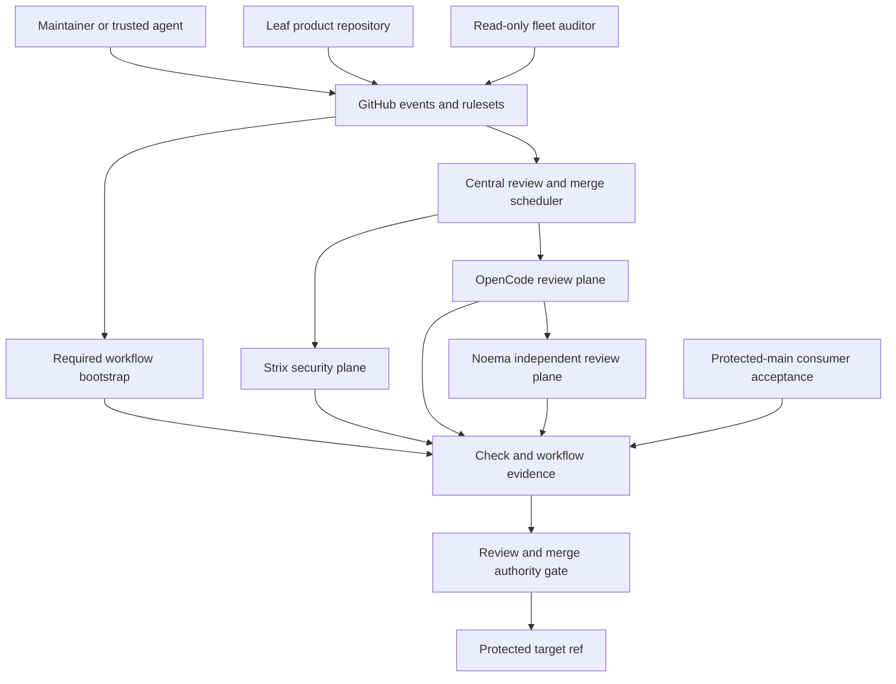

# Architecture: CWL automation control plane

Status: code-current bounded-context and trust-boundary view.

Editable companion: [CWL Automation Control Plane Architecture and Evidence
ERD](https://www.figma.com/board/4x8YSMb8teJhU19nDjdkcy). The Mermaid diagrams
in this repository remain the versioned normative source.

## Architectural style

The system is a central control plane with thin leaf enrollment. GitHub is the
event and policy substrate. `ContextualWisdomLab/.github` supplies immutable
trusted workflow code, decision helpers, reviewer adapters, and fleet audit.
Product repositories retain source ownership and independent build/release
operation.

## Bounded contexts

### Enrollment and event context

Organization rulesets and repository events create required checks and route
work. Leaf repositories provide source and repository-specific contracts, but
do not redefine central reviewer or merger authority.

### Snapshot and provenance context

The context materializes a trusted workflow revision and a target PR snapshot.
It validates repository/ref/SHA syntax, fetches the live PR, independently
observes the base ref, and seals evidence to that identity. It owns neither the
review verdict nor source mutation.

### Evidence execution context

Strix, deterministic tests, coverage/docstrings, CodeQL/security, OpenCode, and
Noema produce distinct evidence records. Sandboxed execution may run target
source only after the protected control path has validated identity and scoped
credentials.

### Decision and mutation context

`scripts/ci/pr_review_merge_scheduler.py` interprets evidence, review state,
thread state, mergeability, and branch freshness. It can dispatch missing
evidence, update a same-repository head, enable guarded auto-merge, or request a
head-matched merge. It does not turn a model sentence into authority.

### Repair context

`scripts/ci/pr_review_fix_scheduler.py` identifies a narrow candidate;
`.github/workflows/pr-review-autofix.yml` owns the edit-capable worker. The
worker verifies the snapshot before checkout and before push. Its new head
returns through every review and check gate.

### Fleet audit and operability context

`scripts/ci/audit_central_required_workflows.py` and scheduled workflows inspect
enrollment, ruleset, queue, and evidence drift without obtaining a source
writer lease. Operational acceptance records whether protected-main central
behavior worked in a real target repository.

## Control plane and data plane

- **Control plane:** events, workflow provenance, inputs, permissions, secret
  requirements, state classification, review eligibility, writer leases,
  dispatch, merge/release decisions, and incident state.
- **Data plane:** source archives/worktrees, patches, test output, coverage,
  SARIF, SBOMs, logs, model prompts/responses, and artifacts.

Control-plane identity is never inferred from data-plane content. PR text and
model output are untrusted data, even when they describe a desired action.

## Trust boundaries

1. **Untrusted PR to protected workflow:** `pull_request_target` metadata may be
   read, but PR code is not executed by the privileged bootstrap.
2. **Central workflow to target repository:** repository, PR, source head, base
   branch, and live-base state are revalidated before dispatch or mutation.
3. **GitHub to external model provider:** only bounded prompts and the required
   model credential cross the egress boundary; model output returns as
   untrusted advisory evidence.
4. **Evidence to authority:** checks/statuses/reviews are classified by type and
   identity before ruleset and merge logic consume them.
5. **Source write:** only the actor holding the fresh branch writer lease may
   push. The fleet auditor is outside this boundary.

## Failure domains

- GitHub event/API/ruleset failures affect event delivery or policy reads.
- Runner and source-materialization failures affect one execution attempt.
- Provider/model failures affect advisory review capacity.
- Credential/App/OIDC failures affect only actions requiring that authority.
- Leaf product tests affect one target head.
- Central workflow defects can affect the fleet and therefore require staged
  protected-main consumer evidence before broad closure.

## Central versus leaf deployment

Central required workflows run in target-repository context while their trusted
definition comes from this repository. Privileged `repository_dispatch`
receivers exist only on a protected default branch. Thick leaf-local copies are
temporary rollback bridges and must not become a second source of truth.

The strict review-only dispatch envelope in
`ContextualWisdomLab/.github#840` is pending. Architecture diagrams describe
the required identity and mutation boundary, while
[DOCUMENTATION_COVERAGE.md](DOCUMENTATION_COVERAGE.md) records the implementation
state honestly.

The architecture also distinguishes logical target controls from deployed
guarantees. Per-workflow concurrency and compare-and-swap head guards exist,
but a cross-workflow durable writer lease is conceptual and tracked in
`ContextualWisdomLab/.github#890`. Noema is a distinct deployed review identity,
but the scheduler does not prove that a counted approval came from Noema; that
governance gap remains in `ContextualWisdomLab/.github#772`.

## Responsibility and deployment ownership

| Surface | GitHub platform | Central `.github` | Leaf repository | Human/security owner |
|---|---|---|---|---|
| events, refs, checks, reviews, rulesets | persist/enforce platform objects | interpret typed evidence | emit product events and source refs | configure eligible actors/rulesets |
| trusted review/security policy | execute protected workflow definition | own workflows, helpers, tests, pins | thin enrollment/caller only | review central policy change |
| source/build/product tests | host runner/ref transaction | sandbox and classify receipts | own commands, fixtures, runtime | own product correctness |
| branch repair/merge | enforce API/ruleset/head transaction | select guarded action and credential | retain branch/source ownership | provide legitimate approval/exception |
| release/deployment | enforce environment transaction | no implied authority | own release/deploy workflow | approve environment/promotion |
| incident acceptance | retain run/audit objects | define receipt and coordinate canary | execute representative consumer path | close/reopen incident |

External model providers own service capacity and response generation only;
their output remains untrusted advisory data. A leaf compatibility override
must name its owner, bounded scope, rationale, exit condition, and known-good
central replacement.
