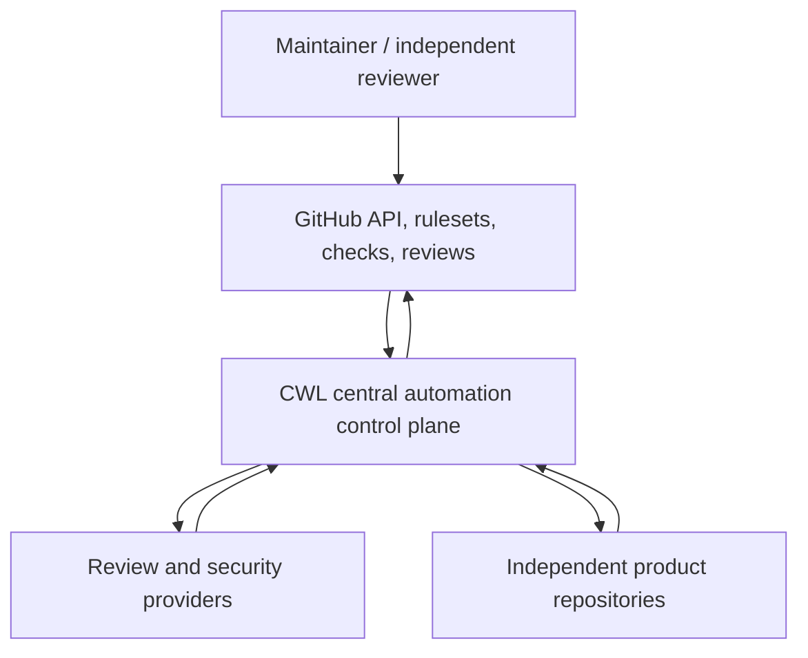
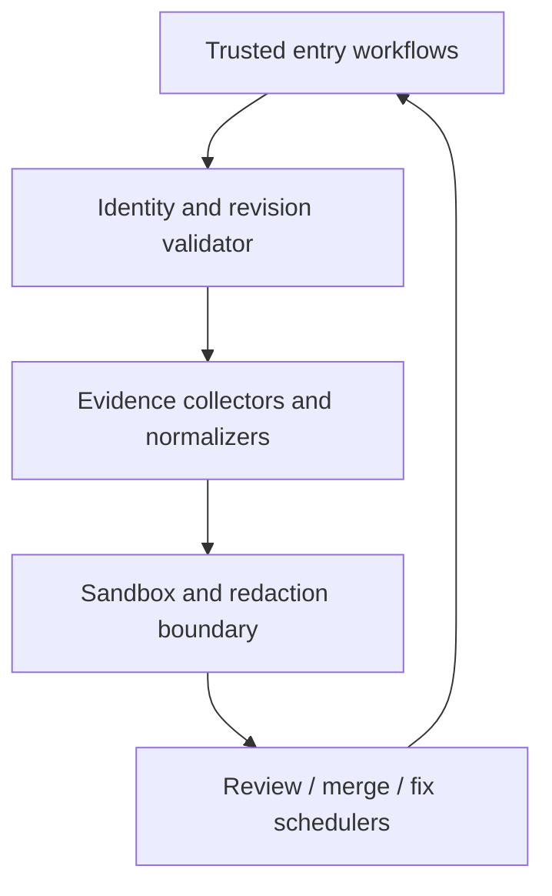

# Architecture — CWL automation control plane

Status: accepted baseline
Last reviewed: 2026-08-09

## 1. Architecture description approach

This description follows stakeholder/viewpoint separation from ISO/IEC/IEEE 42010:2022. It documents context, component, information, security, execution, and operations viewpoints. Standards and primary sources are listed in [`../doctoring/automation-control-plane-standards.md`](../doctoring/automation-control-plane-standards.md).

## 2. Context and bounded responsibilities

The central control plane owns shared governance policy, trusted workflow source, dispatch validation, evidence normalization, and safe scheduling. GitHub owns repository state, rule enforcement, formal review identities, checks/status APIs, and merge primitives. Product repositories own product code, product data, domain tests, release/deployment, and thin central integrations. Providers supply advisory or configured machine evidence but do not acquire merge or human-review authority.

## 3. Logical components

| Component | Current implementation examples | Responsibility |
|---|---|---|
| Trusted entry workflows | `opencode-review.yml`, `opencode-review-dispatch.yml`, `noema-review.yml`, `strix.yml` | Materialize stable contexts; keep privileged execution on trusted default-branch source. |
| Identity validator | workflow metadata checks, `pr_head_replay_guard.py`, dispatch validators | Bind repository, PR, head, base, actor, workflow source, and run attempt. |
| Evidence collectors | `collect_failed_check_evidence.sh`, review context and normalizers | Gather bounded current evidence without merging authority classes. |
| Sandbox/redaction | `sandboxed_verify.py`, `sandboxed_web_e2e.py`, `redact_sensitive_log.py` | Execute bounded proof paths and publish safe, useful diagnostics. |
| Decision/schedulers | `pr_review_merge_scheduler.py`, `pr_review_fix_scheduler.py`, autofix workflows | Select allowed actions under expected-head, policy, and writer constraints. |
| Mention router | `agent_mention_router.py`, `agent_mention_sweep.py`, exact-name artifact ledger | Authenticate, deduplicate, and forward explicit review-agent requests. |
| Security/supply-chain gates | CodeQL, Semgrep, OSV, Scorecard, SBOM, secret scan, Strix | Produce independent security evidence. |

## 4. Control plane and data plane

The **control plane** reads metadata, classifies evidence, selects work, validates authority, and requests GitHub operations. The **evidence data plane** carries source archives-as-data, test output, logs, findings, review bodies, status/check records, and artifacts. Product application data is outside both planes.

Untrusted PR content may enter the evidence data plane only through a bounded low-privilege execution or inert inspection path. It must not cross into a privileged `pull_request_target` or default-branch write path as executable code. A privileged action consumes validated identity and bounded evidence, not arbitrary PR shell text.

## 5. Trust boundaries

| Boundary | Untrusted side | Trusted side | Required control |
|---|---|---|---|
| PR to base workflow | PR source, filenames, metadata, artifacts | protected workflow source | No untrusted checkout/execution in privileged event; strict input validation. |
| Dispatch caller to central worker | payload and actor claims | default-branch dispatcher | Actor allowlist, canonical schema, live PR comparison, replay/idempotency receipt. |
| Provider to review gate | model text and tool output | normalized gate record | Schema validation, head/run binding, adversarial receipts, no raw authority transfer. |
| Sandbox to public evidence | child stdout/stderr/logs/commands | CI log, summary, comment, result JSON | Complete-boundary redaction, canonicalization, bounded output, stable schema. |
| Central to product repository | central App/token and mutation request | product branch/ruleset | Least privilege, expected head, branch-local lease, protected review. |
| Check/review evidence to merge | heterogeneous evidence | GitHub merge primitive | Authority separation, required gate inventory, qualifying approval, thread state. |

## 6. Failure domains

- **GitHub control-plane failure:** API, Actions queue, artifact service, or ruleset availability. Actions remain non-passing; maintenance rotates to other safe work.
- **Provider failure:** OpenCode, Noema, Strix, or upstream model capacity/transport. Provider evidence remains absent or failed; deterministic work continues.
- **Runner/toolchain failure:** DNS, package index, compiler, container, or toolchain. Classified transient failures may retry within a budget; integrity failures do not.
- **Revision race:** head/base changes after evidence collection. Expected-head checks abort mutations and invalidate stale acceptance.
- **Evidence failure:** malformed, oversized, secret-bearing, ambiguous, or contradictory data. Fail closed while preserving bounded non-sensitive diagnosis.
- **Governance failure:** no eligible independent reviewer or required permission. Record the exact external prerequisite and rotate work; never weaken policy.
- **Documentation failure:** implementation and authoritative contracts diverge. Treat as repository debt and repair with machine-checked links/terms.

## 7. Deployment topology

The central repository is the organization policy/source repository. Organization required workflows and thin `workflow_call` consumers materialize stable check contexts in target repositories. Default-branch `repository_dispatch` workers perform validated privileged operations. GitHub-hosted runners are disposable execution environments; durable state is GitHub repository/PR/check/review/artifact state and, conceptually, the evidence entities in [DATA_MODEL.md](DATA_MODEL.md).

No new always-on service or database is required by this architecture baseline. Persisting the conceptual evidence model would be a separate architecture decision.

## 8. Evolution rules

- Add central capability behind a versioned thin contract; do not copy a thick workflow into every product repository.
- Preserve independent product operation and product-owned gates.
- Prefer immutable action/workflow pins and short-lived identity.
- Separate deterministic gates from optional model execution so missing model credentials do not prevent unrelated validation.
- Change one authority boundary at a time and require consumer proof after protected integration.
- Keep diagrams, ADRs, tests, operations, and traceability synchronized with source changes.
