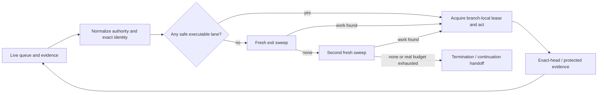

# Autonomous-maintenance threat addendum

Status: active_pr threat-model companion
Last reviewed: 2026-08-09
Scope: availability, integrity, and governance threats created by long-running autonomous maintenance itself

This companion is part of the automation threat-model family. The general trust boundaries remain in [THREAT_MODEL.md](THREAT_MODEL.md); this file makes two whole-conversation threats explicit because they are easy to miss in a conventional credential/source threat model: **premature termination** and **split-brain authority**.

## 1. AT-01 — premature termination / false quiescence

### Threat

An automation run observes one blocked PR, queued review, long model call, completed merge, documentation update, prompt change, or apparent wall-clock budget and incorrectly concludes that the control plane has no more executable work. Safe work in another branch, issue, documentation lane, protected-main acceptance lane, or buyer/control-plane gap is starved until the next recurrence.

This is simultaneously:

- an availability threat because repair/merge/product queues idle;
- an integrity threat because `done` or an implicit terminal state misrepresents the live queue; and
- an accountability threat because the lack of a fresh exit proof makes later reconstruction ambiguous.

### Attacker/failure stories

1. A provider or reviewer delays one PR; the maintainer keeps polling it and never repairs another repository-owned defect.
2. A prompt update, documentation audit, review request, CI dispatch, Draft/Ready transition, auto-merge enablement, commit, merge, or single buyer slice is treated as terminal progress even though another safe lane exists.
3. A long but still valid invocation crosses an informal elapsed-time threshold and exits without checking the rest of the queue.
4. A malicious/noisy PR consumes attention through repeated changing status while unrelated high-leverage work remains executable.

### Required controls

- exact-identity deferred set for external/pending waits;
- branch-local writer lease rather than global serialization;
- live executable queue ordered by risk/leverage;
- no-report-as-completion and no-soft-timeout invariant from ADR-0007;
- meta/control events carry zero terminal credit;
- fresh whole-queue exit sweep covering PRs, issues, docs, tests, security, protected-main acceptance, writers, release evidence, and bounded product gaps;
- if the first exit sweep finds work, execute it and sweep again;
- termination only on genuine practical execution/tool-budget exhaustion or a second fresh all-lanes-nonactionable sweep; and
- `continuation_handoff` only for genuine finite-run budget exhaustion, carrying exact deferred identities and next executable actions.

### Negative tests / evidence

- one pending review cannot end the run when another safe issue exists;
- prompt/doc/status/review/dispatch/Draft/Ready/auto-merge/commit/merge events cannot satisfy the exit predicate;
- elapsed time alone cannot satisfy the exit predicate;
- the first sweep finding work forces another action;
- the second sweep cannot reuse the first sweep's stale state; and
- a continuation handoff without a real budget boundary is invalid.

### Residual risk

The ChatGPT/connector execution environment can impose a real finite tool/run budget. The control plane cannot remove that external bound. It can only preserve exact continuation state and refuse to call budget exhaustion product completion.

## 2. AT-02 — split-brain authority / evidence conflation

### Threat

Two or more evidence or actor classes believe they authorize the same operation: for example a model verdict is treated as human approval, a success status replaces a required Check Run, a PR-base snapshot is mistaken for the current live base tip, an external writer and scheduler mutate the same branch, or a documentation acceptance state is treated as protected-main implementation.

### Failure stories

1. An automated reviewer emits approval-like prose and a merge scheduler counts it as qualifying independent human review.
2. A stale successful Check Run or Commit Status from a predecessor head survives while the PR head moved.
3. A PR's `.base.sha` snapshot is used as if it were the current protected base tip after the base branch advances.
4. A source PR passes but protected-main/consumer behavior is still broken; incident status nevertheless changes to closed.
5. A branch writer and an autofix workflow each use separately read old heads and both push.
6. An `active_pr` documentation contract is presented as `implemented_on_protected_main`.

### Required controls

- distinct `check_evidence`, `status_evidence`, `review_evidence`, `model_evidence`, `workflow_evidence`, `dependency_evidence`, and security evidence classes;
- qualifying human review requires live formal review identity and current-head/ruleset eligibility; no model/check/status wording can synthesize it;
- `source_revision`, `pr_base_snapshot_sha`, independently resolved `live_base_tip_sha`, and protected `merge_revision` remain separate;
- expected-head mutations and immediate live refresh before writes;
- branch-scoped `writer_lease` and rotation when another writer becomes active;
- protected-main or real-consumer `operational_acceptance` attaches to `merge_revision`, not the source PR;
- controlled documentation maturity vocabulary; and
- strict versioned event/result envelopes with legacy/versioned parser non-conflation in [EVENT_CONTRACTS.md](EVENT_CONTRACTS.md).

### Negative tests / evidence

- model/comment/status-only `APPROVED` does not satisfy independent human review;
- stale-head evidence invalidates when source head or current live base moves;
- schema-free legacy dispatch cannot accept a versioned claim;
- a moved expected head rejects mutation even if all predecessor checks were green;
- only one active branch writer is permitted by the current lease decision;
- protected-source acceptance cannot be derived from a source-branch run; and
- `active_pr`/`accepted_architecture` cannot be emitted as `implemented_on_protected_main` without protected evidence.

### Residual risk

An organization owner or external platform authority can intentionally reconfigure protection outside repository-controlled code. Scheduled ruleset audit, provider/actor receipts, and protected-main acceptance reduce detection/reconstruction time but do not cryptographically prevent a fully authorized platform owner from changing policy.

## 3. Combined failure mode

Premature termination and split-brain authority can reinforce one another: a run sees an apparently green status from the wrong authority, stops early, and never reaches the lane that would have discovered the missing formal review or protected-main failure. Therefore work conservation and authority separation are one safety property, not independent conveniences.

## 4. Ownership and reopening

- automation maintainer owns work-conservation and continuation semantics;
- governance maintainer owns evidence/reviewer/merge authority;
- repository writer owns branch-local lease compliance;
- service owner owns protected-main/consumer acceptance for runtime incidents.

Reopen this threat family when scheduling, reviewer eligibility, evidence classes, event schemas, writer authority, or protected-main acceptance changes.