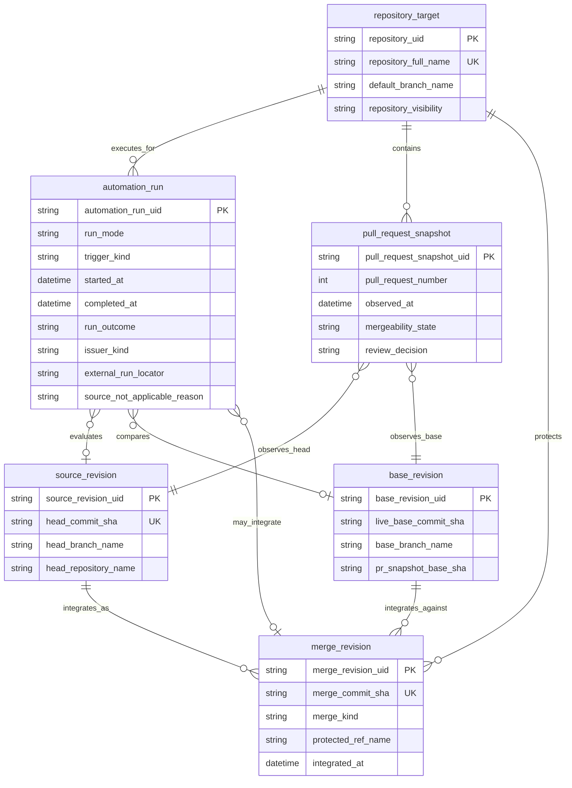
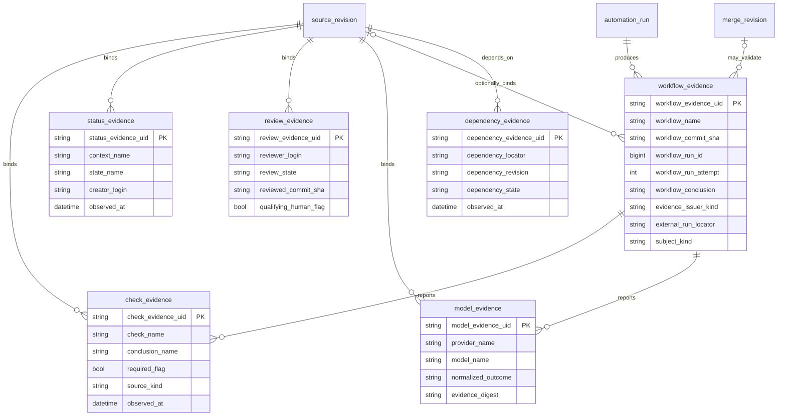
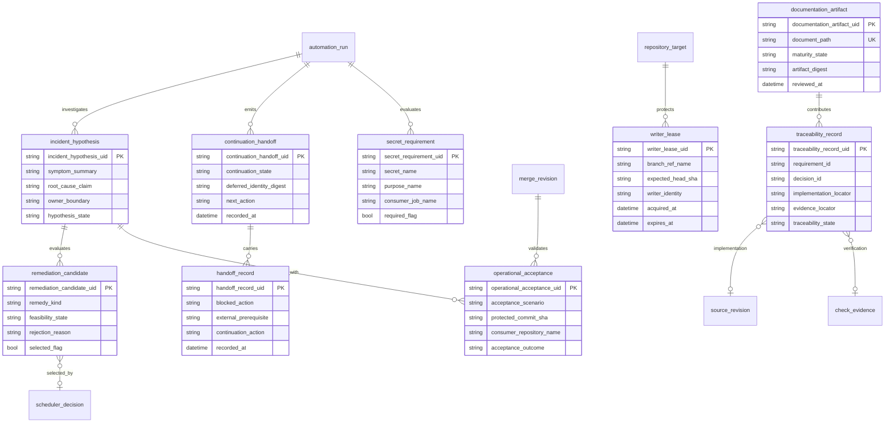
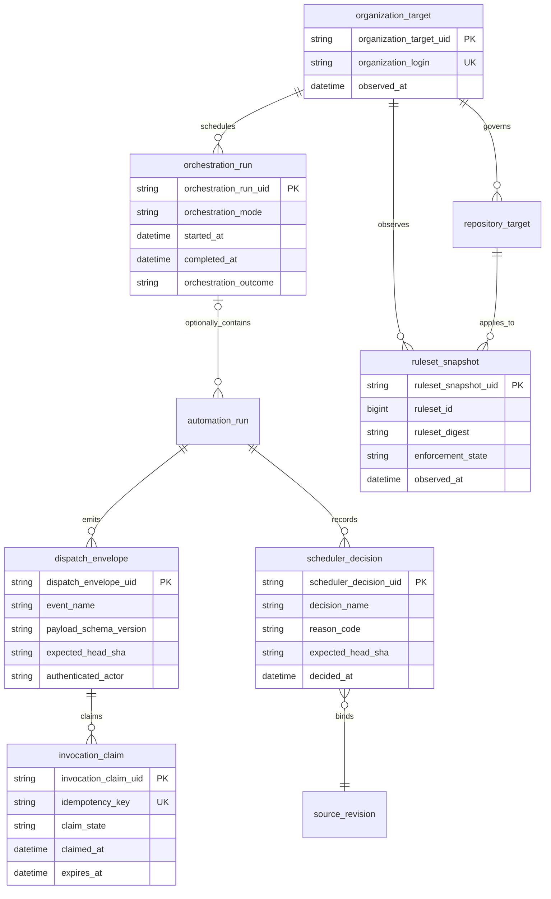
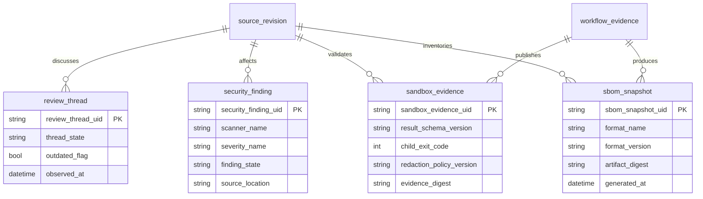

# Conceptual data model and ERD

Status: accepted conceptual model; no new persistence is implied
Last reviewed: 2026-08-09

## 1. Purpose and persistence boundary

The control plane already exchanges these concepts through GitHub API objects, workflow payloads, artifacts, comments, local JSON, and in-memory structures. This document gives them stable names so exact revision identity and authority do not collapse into an informal boolean such as `passed`.

The model is **conceptual and logical**. It is not a claim that ContextualWisdomLab operates a database with these tables. GitHub remains the durable system of record today. A future materialized evidence store would require a separate ADR, retention/privacy design, migrations, tenancy model, backup/restore, and rollback plan.

All entity names contain at least two words and use `snake_case`, matching the organization naming rule.

## 2. Identity and run ERD

`pr_snapshot_base_sha` and `live_base_commit_sha` are deliberately separate. The former explains what GitHub recorded with the PR snapshot; the latter is resolved from the current protected ref at decision time.

For explanatory UML/ERD views the two roles may also be labelled `pr_base_snapshot` and `live_base_revision`; those labels are aliases of the two separate fields carried by `base_revision`, not permission to collapse them into one SHA.

## 3. Evidence ERD

Evidence classes remain separate because their issuers and permissions differ.
`check_evidence.source_kind` distinguishes a Check Run from another configured
check source; a Commit Status remains `status_evidence`. Neither is silently
converted into `review_evidence`, and normalized model output remains
`model_evidence` even when a workflow uses it as one configured gate input.

`model_evidence` is the conceptual equivalent of a `model_judgment` when a
reviewer/model verdict is discussed in prose. The stored authority class remains
model evidence unless GitHub independently records a formal review through a
reviewer identity whose eligibility is validated separately.

### 3.1 Runtime receipt and issuer aliases

| Observed object | Canonical entity | Required issuer and identity mapping |
|---|---|---|
| GitHub Actions workflow/job/attempt | `workflow_evidence` | `evidence_issuer_kind=github_actions`, workflow name/source SHA, run ID, attempt, conclusion, and exact subject kind. |
| External hourly or manual bounded execution | `automation_run` | `issuer_kind`, auditable `external_run_locator`, run mode/outcome, and either exact source/base links or `source_not_applicable_reason`; an `orchestration_run` parent is optional. |
| Organization-wide scheduled invocation | `orchestration_run` plus repository-scoped `automation_run` children | External scheduler identity, start/end/outcome, and one child per repository; it is not itself a source revision or writer lease. |
| Protected merge API response | `merge_revision` | Merge commit, kind, protected ref, integration time, and optional validating `workflow_evidence`; it is never aliased to a source-head check. |
| Commit Status, Check Run, formal review, or model output | `status_evidence`, `check_evidence`, `review_evidence`, or `model_evidence` respectively | Preserve native issuer, object identity, observed revision, and authority class; similar display names do not permit conversion. |

`workflow_evidence.subject_kind` is one of source revision, live-base
observation, merge revision, scheduled inventory, or explicit
`not_applicable`. A non-PR scheduled run therefore has no invented
`source_revision`; it records the protected workflow source and reason.
External run locators are identifiers or receipt URLs, never credential values.

## 4. Operations, RCA, continuation, and documentation ERD

A `remediation_candidate` is one materially distinct possible root-cause-changing
remedy and retains feasibility/rejection evidence. Merely naming a blocker is
not a candidate remedy. A `continuation_handoff` exists only when a finite run
must transfer exact deferred identities and next executable work because a real
practical run/tool budget ended; it is never generated merely because a prompt,
document, review request, check dispatch, commit, or merge completed.

A `handoff_record` is the concrete external-prerequisite/continuation item carried
by the handoff. `documentation_artifact` and `traceability_record` make document
fitness and requirement/decision-to-implementation evidence first-class without
claiming a database.

## 5. Governance and dispatch ERD

A ruleset snapshot is a dated observation, not an eternal property of a
repository. An invocation claim gives at-least-once GitHub delivery an
idempotent side-effect boundary. A scheduler decision records a proposed or
completed action; it is not review evidence.

## 6. Review, sandbox, and supply-chain ERD

These entities store bounded metadata and digests, not unrestricted logs,
credentials, source archives, or personal data. A scanner finding, review
thread, sandbox result, and SBOM are different evidence authorities and must not
be collapsed into one pass/fail row.

## 7. Entity definitions

| Entity | Meaning | Current physical representation |
|---|---|---|
| `automation_run` | One finite maintainer, scheduler, reviewer, or recovery execution | GitHub Actions run or external automation invocation; not centrally persisted as this schema |
| `repository_target` | Repository and protected-branch policy context | GitHub repository/ruleset APIs and configured allowlists |
| `pull_request_snapshot` | Time-bounded observation of PR state | GitHub PR API/GraphQL response |
| `source_revision` | Immutable source head under evaluation | Git commit SHA and head repository/ref |
| `base_revision` | Both PR snapshot base and independently resolved live base tip | PR API plus Git ref/API lookup |
| `merge_revision` | Protected integrated commit or merge-group revision, distinct from the PR source head | Pull request merge response and protected ref/workflow evidence |
| `check_evidence` | Check Run result with source kind and revision | GitHub Check Runs API |
| `status_evidence` | Commit status context, creator, state, and revision | Commit Status API |
| `review_evidence` | Formal review submission with author, state, and commit | Pull Request Review API/GraphQL |
| `model_evidence` | Normalized provider/model output with digest and revision; prose alias `model_judgment` | Bounded review/security artifact or job output |
| `workflow_evidence` | Workflow/run/job/attempt and artifact provenance | Actions APIs and bounded artifacts |
| `dependency_evidence` | Cross-PR, package, workflow, or release prerequisite | GitHub/package/attestation evidence |
| `incident_hypothesis` | Falsifiable RCA statement and owner boundary | Incident notes, PR body, or run artifact |
| `remediation_candidate` | One materially distinct remedy with feasibility, rejection, and selection evidence | RCA/PR review notes or bounded maintainer result; not persisted as a table |
| `continuation_handoff` | Finite-run transfer of exact deferred identities and next executable lanes after genuine budget exhaustion | External automation continuation ledger or bounded handoff artifact |
| `handoff_record` | Precise external prerequisite plus autonomous continuation item carried by a handoff | Maintainer ledger, issue, or PR comment when needed |
| `operational_acceptance` | Protected-main or real-consumer scenario proof | Workflow run, check, artifact receipt, and dated traceability row |
| `secret_requirement` | Explicit secret-to-purpose-to-job contract | `workflow_call` declaration, job environment, and security docs |
| `writer_lease` | Branch-scoped exclusive mutation intent | Live Project/issue assignment, branch/head observation, or automation ledger |
| `documentation_artifact` | Canonical document path, digest, review time, and controlled maturity state | Repository Markdown plus Git blob/commit identity |
| `traceability_record` | Requirement/decision to implementation, test/evidence, maturity and closure mapping | `TRACEABILITY.md`, ADR links, tests, workflow/check receipts |
| `organization_target` | Organization scope and observation time for fleet governance | GitHub organization API identity |
| `orchestration_run` | One fleet/hourly invocation grouping repository-scoped child runs | External continuation ledger or top-level Actions sweep receipt |
| `ruleset_snapshot` | Dated ruleset parameters, targets, exclusions, and digest | GitHub ruleset API response plus audit artifact |
| `dispatch_envelope` | Canonical authenticated event fields and schema version | `repository_dispatch`, workflow inputs, or validated local JSON |
| `invocation_claim` | Idempotency claim and completion state for one routed request | Bounded GitHub Actions artifact ledger |
| `scheduler_decision` | Exact-head action, reason, and outcome selected by a scheduler | Job summary/result JSON and workflow evidence |
| `review_thread` | Current/outdated and resolved/unresolved review conversation state | Pull request review-thread GraphQL nodes |
| `security_finding` | Scanner-specific finding with severity, state, and source location | SARIF, dependency alerts, or bounded scanner report |
| `sandbox_evidence` | Versioned result, exit semantics, redaction policy, and evidence digest | `SANDBOXED_*_RESULT` plus scrubbed bounded log/artifact |
| `sbom_snapshot` | Revision-bound software inventory artifact and digest | SPDX/CycloneDX artifact and attestation metadata |

## 8. Invariants

1. PR evidence cannot exist without a named source revision. A non-PR scheduled
   run may omit source/base relations only with an explicit `not_applicable`
   reason and a protected workflow revision.
2. `review_evidence.qualifying_human_flag` is false for authors, automated identities, dismissed reviews, comment-only records, and reviews not bound to the required current head.
3. A merge decision references the current `pull_request_snapshot`,
   `source_revision`, `base_revision`, required evidence inventory, and writer
   lease. A successful integration creates a distinct `merge_revision`.
4. `operational_acceptance` belongs to `merge_revision`, names the protected
   commit and concrete scenario, and cannot be attached directly to a PR
   `source_revision`; a source-branch run is insufficient.
5. A `secret_requirement` names one purpose and consumer job; wildcard purpose is invalid.
6. A writer lease covers one repository/ref/expected-head tuple, never the whole organization by implication.
7. A `remediation_candidate` records a materially distinct feasible/rejected remedy; stale evidence, invented authority, gate weakening, or another writer race cannot be selected as a valid remedy.
8. A `continuation_handoff` is valid only for genuine practical run/tool-budget exhaustion and must carry exact deferred identities plus next executable work. Prompt updates, documentation work, inventory, review requests, CI dispatch, Draft/Ready changes, auto-merge enablement, commits, merges, or one completed slice cannot create run-complete evidence.
9. Handoff records always name a continuation action unless every work lane is freshly proven non-actionable.
10. `documentation_artifact.maturity_state` maps to the controlled vocabulary in `DOCUMENTATION_AUDIT.md`; `active_pr` or `accepted_architecture` must never be emitted as `implemented_on_protected_main` without protected-main evidence.
11. A `traceability_record` preserves distinct requirement/decision, implementation, verification, and operational-closure locators; absence of one cannot be inferred from another authority class.
12. Credential values and unrestricted raw logs are never data-model attributes.
13. A ruleset snapshot always has an observation time and digest; stale snapshots cannot authorize a current mutation.
14. One invocation idempotency key has at most one completed claim; retries link rather than overwrite their predecessor.
15. Checks, statuses, reviews, model results, scheduler decisions, security findings, threads, sandbox results, and SBOMs retain their distinct issuer and authority class.
16. An organization-wide invocation is one `orchestration_run` with repository-scoped `automation_run` children. A standalone automation_run created by one GitHub workflow, manual recovery, or external bounded action may have no orchestration parent. Atomic evidence and mutations remain bound to one `repository_target`; a fleet parent does not imply a cross-repository writer lease.

## 9. Future persistence decision gate

Materialization is justified only if GitHub-native evidence cannot meet query latency, cross-repository history, retention, or audit requirements. Before implementation, measure those gaps and decide tenancy, access control, purpose limitation, legal retention, encryption, deletion, schema migration, disaster recovery, and reconciliation with GitHub as source of truth.