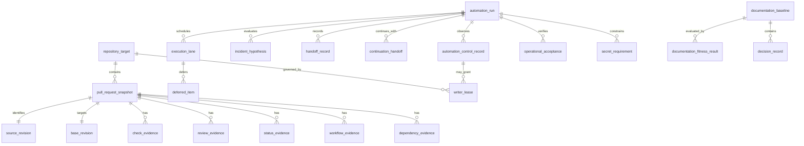

# CWL Automation Control Plane — Conceptual Data Model

Status: active_pr

This is a logical evidence/domain model. It does **not** assert that the central control plane currently persists these entities in a database. External scheduler state, GitHub repository state, and canonical documentation state are separate authorities even when one automation run observes all three.

## Entities

- `automation_run`: one finite invocation of a maintenance, development, or audit loop.
- `automation_control_record`: observed external scheduler/orchestrator identity, enabled state, cadence, ownership scope, and configuration revision relevant to a run; it is not GitHub source evidence.
- `repository_target`: repository identity and control-plane ownership class.
- `execution_lane`: one independently executable unit such as a PR/head, issue, documentation line, operational acceptance probe, release task, or bounded product slice.
- `deferred_item`: an exact lane identity temporarily non-actionable because of queued evidence, approval, provider capacity, read-only dependency, writer conflict, or another bounded wait condition.
- `continuation_handoff`: records the preceding substantive action or defer decision and the next selected executable lane, or the bounded termination reason after the required exit sweeps.
- `pull_request_snapshot`: current PR metadata captured for a decision.
- `source_revision`: exact source/head commit identity.
- `base_revision`: independently resolved current base-ref tip identity.
- `check_evidence`: named GitHub Check evidence bound to a revision.
- `status_evidence`: commit-status context, creator, state, target URL where applicable, and revision.
- `review_evidence`: formal review/reviewer/thread evidence.
- `workflow_evidence`: workflow/run/job/checkout identity and outcome.
- `dependency_evidence`: state of a central or stacked prerequisite.
- `incident_hypothesis`: falsifiable causal hypothesis and disposition.
- `handoff_record`: read-only transfer to the authoritative owner when mutation is outside the lease.
- `operational_acceptance`: protected-main consumer execution evidence.
- `secret_requirement`: purpose, scope, materialization boundary, and least-privilege requirement for a secret.
- `writer_lease`: authoritative writer scope, source of authority, branch/repository boundary, and conflict evidence.
- `documentation_baseline`: one canonical documentation authority for a bounded control-plane/product scope.
- `documentation_fitness_result`: adequacy assessment by artifact class, including missing, stale, partial, adequate, conflicting, or not-applicable findings and required corrective actions.
- `decision_record`: material decision reconciled from protected-main source, active PRs, incidents, research, or conversation evidence with an explicit maturity state.

## Invariants

- `source_revision` and `base_revision` are never collapsed into one identity.
- Review, check, status, workflow, model, merge, external-automation, and runtime evidence remain separate authorities.
- A stale snapshot cannot authorize a write.
- A `deferred_item` blocks only its exact `execution_lane` unless broader evidence proves shared scope.
- Every substantive action that does not exhaust the invocation produces a `continuation_handoff` to the next executable lane.
- A user-visible status or prompt update cannot satisfy `continuation_handoff` by itself.
- A `documentation_baseline` is singular for its declared scope; conversation or PR-body text does not silently become a second authority.
- A `documentation_fitness_result` marked missing, stale, partial, or conflicting requires a repository mutation or explicit non-actionable disposition when the current writer owns the documentation line.
- A conceptual entity is not evidence that persistence exists.
- Durable database object names, if later introduced, use descriptive two-or-more-word `snake_case` names.
