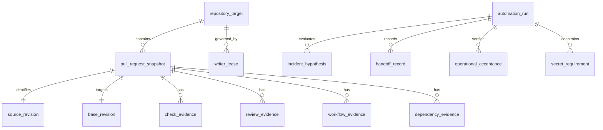

# CWL Automation Control Plane — Conceptual Data Model

Status: active_pr

This is a logical evidence/domain model. It does **not** assert that the central control plane currently persists these entities in a database.

## Entities

- `automation_run`: one finite invocation of a maintenance, development, or audit loop.
- `repository_target`: repository identity and control-plane ownership class.
- `pull_request_snapshot`: current PR metadata captured for a decision.
- `source_revision`: exact source/head commit identity.
- `base_revision`: independently resolved current base-ref tip identity.
- `check_evidence`: named GitHub Check evidence bound to a revision.
- `review_evidence`: formal review/reviewer/thread evidence.
- `workflow_evidence`: workflow/run/job/checkout identity and outcome.
- `dependency_evidence`: state of a central or stacked prerequisite.
- `incident_hypothesis`: falsifiable causal hypothesis and disposition.
- `handoff_record`: read-only transfer to the authoritative owner when mutation is outside the lease.
- `operational_acceptance`: protected-main consumer execution evidence.
- `secret_requirement`: purpose, scope, materialization boundary, and least-privilege requirement for a secret.
- `writer_lease`: authoritative writer scope and conflict evidence.

## Invariants

- `source_revision` and `base_revision` are never collapsed into one identity.
- Review, check, status, workflow, model, merge, and runtime evidence remain separate authorities.
- A stale snapshot cannot authorize a write.
- A conceptual entity is not evidence that persistence exists.
- Durable database object names, if later introduced, use descriptive two-or-more-word `snake_case` names.
