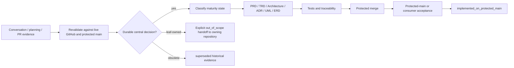

# Whole-conversation documentation fitness audit

Status: active_pr
Last reviewed: 2026-08-10
Scope: `ContextualWisdomLab/.github` automation control plane and its contracts with thin repository consumers

## Purpose

This audit answers whether the durable PRD, TRD, Architecture, UML, ERD/data model, security, testing, operations, ADR, and traceability set is sufficient for the durable decisions represented across the current CWL project conversation and planning material.

Conversation history, prompts, PR bodies, attached planning files, broad master-context documents, and model output are **candidate evidence**, not architectural authority. A decision enters the canonical graph only after it is revalidated against protected-main implementation, current GitHub state, or an explicit accepted-architecture decision. Product-specific detail remains owned by the product repository rather than being copied into the organization control plane.

The current family-level result is **ADEQUATE on this active PR only after the 2026-08-10 premature-stop reconciliation below**. The protected branch is still insufficient as durable canonical truth until this documentation line is integrated. `ADEQUATE` describes coverage and semantic coherence of the active documentation graph; it never means that runtime gaps, active PRs, operational acceptance, or releases are complete.

## Controlled maturity vocabulary

Every durable claim in this documentation graph MUST map to one of these states:

- `implemented_on_protected_main` — observable in the current protected default-branch source and covered by current contract/evidence expectations.
- `active_pr` — implemented or documented only on an open pull request; not shipped truth.
- `accepted_architecture` — approved intended contract whose implementation may be incomplete.
- `planned` — bounded future work with no implementation claim.
- `research_only` — evidence or design exploration that has not crossed an architecture/release gate.
- `superseded` — preserved historical evidence replaced by a newer accepted decision or integration path.
- `out_of_scope` — intentionally owned elsewhere or excluded from this control plane.

`accepted baseline`, `implemented`, `partial`, `proposed`, and `operational-proof-pending` in older documents are descriptive aliases only and MUST be interpreted through the mapping above before a runtime claim is made.

## Whole-conversation ownership reconciliation

| Durable conversation/planning family | Central control-plane relevance | Canonical disposition |
|---|---|---|
| PR review → repair → current-head checks → merge → next work loops | Direct | `accepted_architecture`; PRD/TRD/ADR-0007 define work conservation and authority. |
| Hourly autonomous continuation and no report-as-completion | Direct | `accepted_architecture`; every prompt edit, documentation assessment/update, inventory, status comment, review request, CI dispatch, Draft/Ready transition, auto-merge enablement, commit, merge, document update, or one buyer slice is an intermediate event. |
| User reports that the run stopped while work remained | Direct | `accepted_architecture`; classify `USER_REDIRECTION_INCIDENT`, repair the control contract only if needed, resume substantive work in the same invocation, and when two independent safe lanes exist advance at least two materially distinct actions with a non-documentation action whenever available before a new exit proof. |
| Exact source-head versus PR-base snapshot versus independently resolved live-base tip | Direct | `accepted_architecture`; TRD revision identity and ADR-0002. |
| Reviewer/check/status/model/merge/release authority separation | Direct | `accepted_architecture`; TRD evidence taxonomy and ADR-0005/0016. |
| Central `.github` ownership with thin modular leaf consumers | Direct | `accepted_architecture`; Architecture and ADR-0008. |
| NVIDIA NIM development-agent policy and prohibition on `COPILOT_GITHUB_TOKEN` | Direct | `accepted_architecture`; PRD/TRD/Security/ADR-0004/0011. |
| CSAP/SOC 2 evidence-readiness, PII purpose/access/retention/audit controls | Direct | `accepted_architecture`; Security/Threat Model/Operability/standards doctoring; no certification claim. |
| TEPP / multilingual structural topic measurement / psychometrics compute design | Shared quality/research principles only | `out_of_scope` here; detailed PRD/TRD/model equations belong to the TEPP/psychometrics repository. Central docs retain only reusable CI/review/coverage interfaces. |
| fast-mlsirm psychometric recovery/GPU contracts | Shared quality evidence | `out_of_scope` product detail; central control plane owns reusable evidence transport and merge gates only. |
| OriginWeave agentic browser runtime | Shared automation/agent integration boundary only | `out_of_scope` product architecture; OriginWeave owns browser/runtime design. |
| EmbedRelay embedding interoperability | Shared release/security/test policy only | `out_of_scope` product architecture; EmbedRelay owns adapter/vector design. |
| MHTML ETL Gateway | Shared CI/security/release policy only | `out_of_scope` product architecture; ETL repository owns parser/data/API design. |
| LifeOS | Shared CI/security/release policy only | `out_of_scope` product architecture; LifeOS owns product/data/auth design. |
| BandScope / Inkspan / pg-erd-cloud / naruon / AppGuardrail and other leaf products | Thin caller, review, security, release and evidence interfaces | `out_of_scope` product semantics; central docs specify only the reusable contract and consumer acceptance requirements. |
| Organization ecosystem composition through naruon/contextual-orchestrator/connectors | Interface-level concern | `accepted_architecture` only for central interface ownership, credentials, provenance and thin-consumer rules; business composition is leaf-owned. |

## Historical autonomous-loop contradictions explicitly superseded

The whole-conversation review found old instructions that are useful incident evidence but cannot coexist with the current accepted automation contract.

1. **Fixed time cutoffs.** Historical scheduler guidance used a **fixed 45-minute execution budget** and a **minute-35 write cutoff**. Those constraints are `superseded`. They were an early attempt to avoid overlapping writers, but they can leave executable work behind solely because the clock reached an arbitrary minute. Current authority comes from ADR-0007: branch-local writer leases, exact deferred identities, work-conserving rotation, practical execution/tool-budget exhaustion, and a second fresh all-lanes-nonactionable sweep. Individual jobs or model calls may still have bounded technical timeouts, but elapsed wall-clock time alone is not a clean-exit proof.
2. **Copilot-named Agent Tasks credential.** Historical Agent Tasks guidance instructed operators to store a fine-grained GitHub API token under `COPILOT_GITHUB_TOKEN`. That **historical Agent Tasks guidance** is `superseded`. Current policy prohibits `COPILOT_GITHUB_TOKEN` for autonomous development and keeps model, reviewer, and repository-mutation authorities separate. Model-backed development uses `NVIDIA_NIM_API_KEY`; GitHub API authority uses the minimum `GITHUB_TOKEN`, reviewed short-lived OIDC/App exchange, or—only where strictly necessary—a separately named purpose-bound explicit secret. The old alias is not a compatibility exception.
3. **Prompt repair as sufficient recovery.** Earlier loop text correctly said prompt/doc/status events were intermediate but did not make a repeated user-reported premature stop falsifiable in the current invocation. That weaker recovery interpretation is `superseded`. `USER_REDIRECTION_INCIDENT` now requires same-invocation substantive repository execution, at least two materially distinct safe actions when two lanes exist, a non-documentation action when available, and a new two-sweep exit proof.

These corrections do not rewrite historical artifacts. They make their maturity explicit so an old prompt/file cannot silently override the current canonical graph.

## Documentation family fitness

This table assesses the **active PR documentation baseline**, not protected-main runtime implementation. An `ADEQUATE` documentation family may still describe `accepted_architecture`, `planned`, or `active_pr` behavior whose runtime evidence is incomplete.

| Artifact family | Fitness on this PR | Ongoing control |
|---|---|---|
| PRD | ADEQUATE | Keep the two operating modes, degraded behavior and measurable acceptance aligned with live implementation. |
| TRD | ADEQUATE | Preserve explicit event, identity, authority, secret, retry, timeout, lease, result and compatibility contracts. |
| Architecture | ADEQUATE | Keep central/leaf bounded contexts, data/control planes, trust and failure domains current. |
| UML | ADEQUATE | Machine-check component, PR-maintenance/product-development sequences, evidence state, authority, deployment, retry, mention/sandbox, writer rotation and documentation-continuation flows. The FigJam companion remains supplemental only. |
| ERD / data model | ADEQUATE | `remediation_candidate`, `continuation_handoff`, `documentation_artifact`, `traceability_record`, PR-base/live-base identity and evidence-authority relationships are explicit; the model remains conceptual until a persistence ADR is accepted. |
| Security / threat model | ADEQUATE | Keep credential, confused-deputy, untrusted-source, prompt-injection, stale-evidence, PII and supply-chain cases current. |
| Test strategy | ADEQUATE | Documentation-fitness regression coverage binds this audit, maturity mapping, historical supersession, user-redirection recovery, logical entities and standards freshness; semantic review remains required. |
| Operability / incident runbook | ADEQUATE | `CONTINUATION_RUNBOOK.md` now gives `USER_REDIRECTION_INCIDENT` an executable same-invocation recovery path, plus protected-main/consumer closure and queue/provider/runner/DNS recovery evidence. |
| ADR set | ADEQUATE | ADR-0007 supersedes fixed wall-clock exits, makes prompt/docs/status/review/dispatch/Draft/Ready/auto-merge/commit/merge intermediate, and requires multi-lane same-invocation recovery after user redirection; ADR-0004 supersedes the old Copilot-named Agent Tasks token alias. |
| Traceability | ADEQUATE | Controlled maturity, current redaction lineage, whole-conversation governance, standards, implementation/test/gate ownership and explicit product/control-plane debt are mapped. |
| Standards doctoring | ADEQUATE | Current final baselines include SLSA 1.2, ISO/IEC/IEEE 42010:2022, ISO/IEC/IEEE 29148:2018, ISO/IEC 25010:2023 and NIST SSDF 1.1; newer drafts are labelled informative/non-normative until final. |

The family set is therefore **not missing ADR/PRD/TRD/Architecture/UML/ERD categories**. Its remaining risk is integration/currentness: this graph is `active_pr`, not protected-main truth, and every runtime capability named below keeps its independent source/review/check/operational acceptance gate.

## Concurrent documentation-line reconciliation

- [PR #886](https://github.com/ContextualWisdomLab/.github/pull/886) is closed
  unmerged and `superseded` as a change line. Its controlled maturity,
  same-invocation continuation, double-sweep, and conversation ownership
  contracts are retained here.
- [PR #898](https://github.com/ContextualWisdomLab/.github/pull/898) is closed
  unmerged and `superseded` as a change line. Its value-free secret registry,
  executable-invariant checks, implementation-gap register, mention-claim
  honesty, and SBOM zero-state warning are retained here.
- [PR #896](https://github.com/ContextualWisdomLab/.github/pull/896) is the
  active canonical candidate because it contains the broader indexed graph,
  versioned event contract, logical model, runbooks, standards, and sixteen
  ADRs. Closed donor histories remain preserved; force-push or deletion is not
  reconciliation.

## Current executable-invariant correction ledger

A file's existence alone is not adequate documentation. These reproduced
source/prose contradictions are corrected or explicitly classified as debt:

| Invariant | Executable observation | Canonical correction |
|---|---|---|
| Reviewer tools | `opencode.jsonc` denies Bash, task/subagents, and webfetch to `code-reviewer`. | Root README and rollout no longer promise local command execution. |
| External heads | Privileged targeted scheduler, OpenCode, and Strix routes reject a different head repository. | Current correction banners name [Issue #889](https://github.com/ContextualWisdomLab/.github/issues/889). |
| Strix concurrency | PR/event-or-ref grouping uses `cancel-in-progress: true`. | Current README/rollout/audit corrections match executable YAML. |
| Autofix owner | `pg-erd-cloud` uses the central autofix worker as shared default. | Historical repo-local recommendations are marked superseded. |
| NVIDIA secret | Workflow secret `NVIDIA_NIM_API_KEY` maps to process `NVIDIA_API_KEY`; there is no legacy alias or routine ruleset bypass. | The historical hotfix note now names the current fail-closed contract. |
| Historical scheduler cutoff | Older planning material imposed a 45-minute run and minute-35 no-new-write boundary. | `superseded`; ADR-0007 and the current automation prompt require practical-budget plus double-sweep exit proof instead. |
| Historical Agent Tasks token alias | Older guidance used `COPILOT_GITHUB_TOKEN` as a GitHub API token name. | `superseded`; ADR-0004 requires purpose-bound explicit GitHub authority and prohibits reuse of the Copilot-named alias. |
| Premature-stop recovery | Repeated user redirection proved that prompt/docs repair could still become the last voluntary action while other PR lanes remained executable. | ADR-0007, `CONTINUATION_RUNBOOK.md`, the hourly prompt, and `test_user_redirection_requires_same_invocation_multi_lane_continuation` require same-invocation multi-lane recovery plus a non-documentation handoff when available. |
| Reusable secrets and Pages input trust | Protected-main Pages reusable workflow lacks the accepted explicit-secret/input-safety repair. | PR #901 is `active_pr`; its current line owns explicit secret mappings plus bounded deployment-input validation and must independently satisfy exact-head reviews/checks before merge. |
| Operational SLI receipt | Finite-cardinality continuation/queue measures were previously documentation-only/distributed. | PR #905 is `active_pr` for a read-only bounded `control_plane_sli_receipt` implementation; it remains non-shipped until its own exact-head gates and protected integration pass. |
| SBOM zero state | No successful inventory receipt means no fleet population was materialized. | Zero rows cannot prove zero components or no license findings. |

Runtime gaps `IG-001` through `IG-008` are registered in
[TRD.md](TRD.md) and mapped to the exact active PR or planned issue in
[TRACEABILITY.md](TRACEABILITY.md). Their presence is documented debt, not
implementation.

## No-soft-timeout and user-redirection continuation invariant

The hourly recurrence is a continuation mechanism after genuine practical execution/tool-budget exhaustion. It is not a voluntary wall-clock timeout.

The following events have zero terminal credit while any safe lane remains: prompt update, documentation assessment or update, inventory, RCA without remediation, status/report comment, review request, workflow dispatch/rerun, queued or running CI/model evidence, Draft/Ready transition, auto-merge enablement, commit, merge, document completion, protected-main acceptance of one scenario, or completion of one buyer-visible slice.

When the user reports that work was left behind, classify `USER_REDIRECTION_INCIDENT`. Prompt or documentation repair has zero completion credit. Recovery must happen in the same invocation: rebuild the entire live queue, execute substantive repository work, and if at least two independent safe lanes exist perform at least two materially distinct actions before termination is eligible. At least one must be non-documentation whenever such a lane exists. If only one lane exists, execute it and then perform two fresh whole-queue sweeps to prove no second lane is executable.

Before any voluntary termination the automation performs a fresh whole-queue sweep. If it finds an executable mutation, test, thread resolution, documentation repair, operational acceptance, issue action, merge, or bounded product/control-plane action, it executes that work and sweeps again. Only actual practical run/tool-budget exhaustion or a **second** fresh sweep proving all lanes non-actionable permits termination. User-redirection recovery resets the sweep count.

## Evidence-to-canonicalization flow

A documentation mutation itself is not the end of this flow. When safe non-documentation work is visible, the control plane returns from `F` to the executable queue before considering termination.

## Exit condition for this documentation repair

The documentation family is review-ready only when:

1. `docs/automation/README.md` indexes the complete canonical graph and whole-conversation audit;
2. machine tests validate controlled maturity, whole-conversation ownership, historical-loop supersession, same-invocation user-redirection/multi-lane recovery, double-exit/no-soft-timeout behavior, conceptual-vs-persisted boundaries, remediation/continuation/documentation/traceability entities, standards freshness, local links and Mermaid code fences;
3. PRD/TRD/Architecture/UML/ERD/Data Model/Security/Test/Operability/ADR/Traceability/standards doctoring have no known family-level `PARTIAL` or `MISSING` gap on the same exact head;
4. exact-head documentation/security/supply-chain checks and current review are clean; and
5. after protected merge, the canonical index is refetched from protected `main` before any `implemented_on_protected_main` claim is made.

Residual **product/control-plane implementation debt** remains tracked in `TRACEABILITY.md` and the PR body. Documentation sufficiency does not convert that planned or active implementation work into shipped behavior.