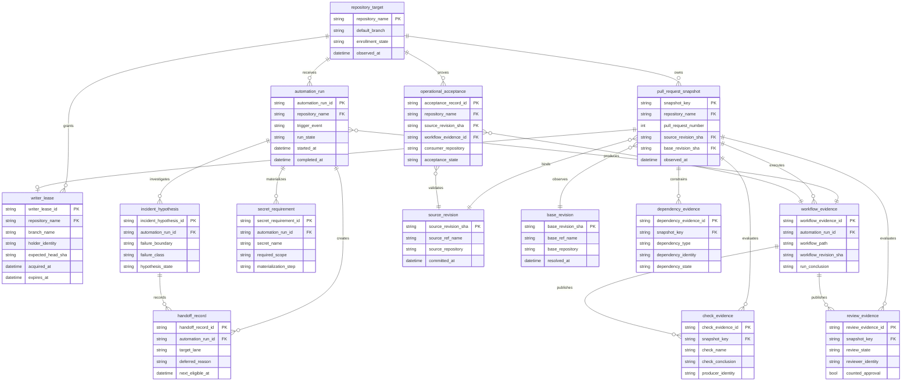

# Evidence and automation domain model

Status: normative conceptual/logical model. This is not a claim that the
entities below are persisted in one database.

Editable companion: [CWL Automation Evidence Domain Model in
FigJam](https://www.figma.com/board/4x8YSMb8teJhU19nDjdkcy). The Mermaid ERD
below is the repository-versioned source of truth.

## Persistence boundary

Most entities are **conceptual** and currently materialize across GitHub PRs,
refs, workflow runs, check runs, statuses, reviews, Actions artifacts, job logs,
issues, and summaries. `handoff_record` and `operational_acceptance` may be
persisted as issue/PR comments, artifacts, or run summaries. A future service
may persist normalized rows, but it must preserve GitHub object identifiers and
source provenance rather than inventing replacement authority.

Database implementations must use descriptive two-or-more-word `snake_case`
object names. The entity names below already follow that rule.

## Identity and cardinality rules

1. One snapshot binds exactly one source revision and one independently
   observed base revision. A new source head or live-base observation creates a
   new snapshot identity.
2. Evidence records are append-only observations. A newer record may supersede
   authority, but history is not rewritten.
3. A review record carries `counted_approval` because review state and reviewer
   eligibility are separate facts.
4. A writer lease is optional for a read-only run and exclusive for a branch
   mutation. It never grants merge, release, or deployment authority by itself.
5. A secret requirement identifies the exact step and scope. It does not store
   the secret value.
6. Operational acceptance references both the integrated source revision and
   the workflow evidence exercised by a real consumer.

## Mapping to current systems

| Entity | Current materialization |
|---|---|
| `automation_run` | GitHub Actions workflow run/job |
| `repository_target` | GitHub repository plus ruleset enrollment |
| `pull_request_snapshot` | Live PR API/GraphQL payload plus scheduler decision |
| `source_revision`, `base_revision` | Git refs and 40-character commit SHAs |
| `check_evidence` | Check run or required context |
| `review_evidence` | GitHub pull-request review object |
| `workflow_evidence` | Workflow source SHA, run, job, and artifact metadata |
| `dependency_evidence` | Stack/base/reusable-workflow/ruleset condition |
| `incident_hypothesis` | Issue/PR RCA and evidence note |
| `handoff_record` | Deferred-lane ledger, issue/PR note, or run summary |
| `operational_acceptance` | Protected-main consumer run evidence |
| `secret_requirement` | Workflow input/secret contract and job environment |
| `writer_lease` | Fresh branch/ref checks plus single-writer policy |
