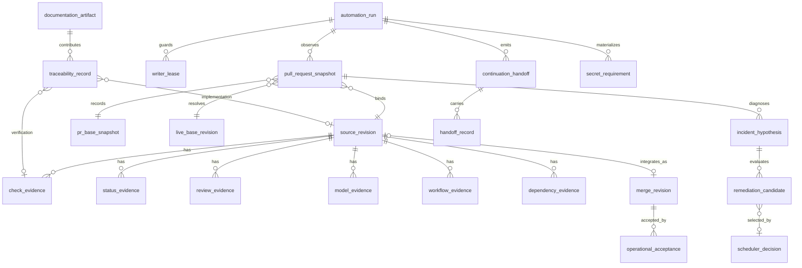

# Evidence relationship diagrams

Status: accepted logical ERD; no physical database is implied
Last reviewed: 2026-08-09

This exact-path artifact answers the ERD requirement without inventing a SQL
database. GitHub APIs, Actions runs/artifacts, Git commits, rulesets, checks,
statuses, reviews, and threads remain the physical systems of record. The full
attribute catalog, Mermaid ERDs, cardinalities, invariants, retention boundary,
and future-persistence decision gate are normative in
[DATA_MODEL.md](DATA_MODEL.md).

## Relationship groups

| Group | Aggregate roots | Revision/authority rule |
|---|---|---|
| Identity and runs | `organization_target`, `orchestration_run`, `repository_target`, `automation_run`, `pull_request_snapshot` | A fleet invocation contains repository-scoped child runs; many observations/runs may bind the same immutable source/base revision. |
| Evidence | `check_evidence`, `status_evidence`, `review_evidence`, `model_evidence`, `workflow_evidence`, `dependency_evidence` | Issuer classes remain separate and every PR record binds an exact source revision. |
| Decisions and dispatch | `ruleset_snapshot`, `dispatch_envelope`, `invocation_claim`, `scheduler_decision`, `writer_lease` | Dated live-state observations and idempotency/expected-head identity precede side effects. |
| RCA and remediation | `incident_hypothesis`, `remediation_candidate`, `scheduler_decision` | Symptoms, root-cause hypotheses, alternative remedies, feasibility evidence, selected action and rejection reasons remain distinguishable. |
| Continuation | `continuation_handoff`, `handoff_record`, `automation_run` | Practical run-budget exhaustion may hand exact deferred identities and next executable lanes to a later recurrence; prompt/docs/status activity is never completion evidence. |
| Documentation governance | `documentation_artifact`, `traceability_record` | Durable requirements/decisions/diagrams carry maturity state and map to exact implementation/tests/evidence; conversation/planning material remains candidate evidence until revalidated. |
| Security and operation | `merge_revision`, `review_thread`, `security_finding`, `sandbox_evidence`, `sbom_snapshot`, `operational_acceptance`, `secret_requirement` | Operational acceptance attaches to the protected integrated revision, never directly to the PR source; bounded evidence/digests are retained. |

## Logical control-plane relationship view

`model_evidence` is the current DATA_MODEL alias for model/reviewer judgment evidence. `pr_base_snapshot` and `live_base_revision` make the distinction between event/PR snapshot base identity and an independently resolved current protected-base tip explicit. These are conceptual names; implementations may serialize equivalent fields inside existing GitHub/Actions receipts without creating tables.

## Physical-model decision

ERD status is intentionally **N/A for a deployed relational database**. Any
proposal to materialize these logical entities must first add an ADR covering
tenancy, access control, purpose and retention, deletion, encryption, schema
migration, reconciliation with GitHub, backup/restore, and rollback. Until then,
the diagrams describe relationships that implementations and evidence receipts
must preserve, not tables that operators should provision.