# UML and behavior diagrams

Status: accepted baseline
Last reviewed: 2026-08-10

These diagrams are normative at the boundary level. Detailed step names remain in workflow source and are checked through [TRACEABILITY.md](TRACEABILITY.md).

An editable FigJam companion board is available at <https://www.figma.com/board/4x8YSMb8teJhU19nDjdkcy>. It is **supplemental visualization**, not an authority source: Mermaid and the Git-tracked contracts in this directory remain canonical. The board currently visualizes the central control plane, PR-governance sequence, evidence state machine, and conceptual evidence entities; it must be refreshed or labelled historical when those canonical diagrams change materially.

## 1. Bounded-context component view

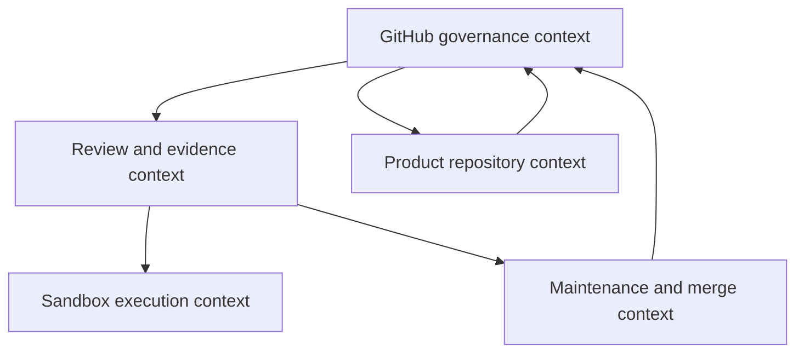

## 2. PR-maintenance sequence

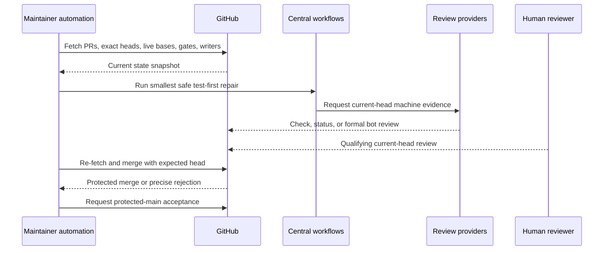

The final merge request occurs only if the machine, human, ruleset, thread, mergeability, and freshness evidence all authorize it. Any wait returns the automation to another ledger lane.

## 3. Product-development sequence

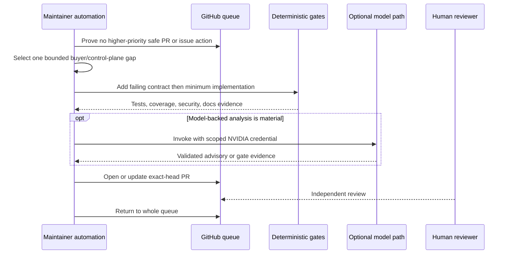

## 4. Evidence gate state machine

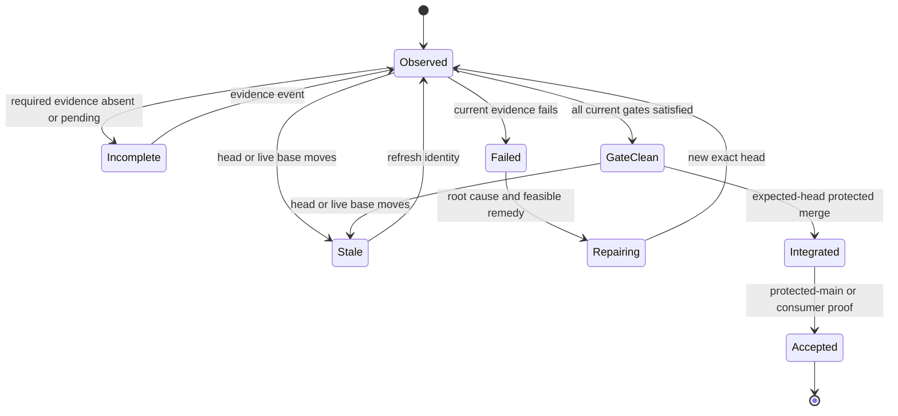

`GateClean` is not incident closure. `Accepted` is scenario-specific and can be reopened by contradictory live evidence.

## 5. Reviewer and merge authority flow

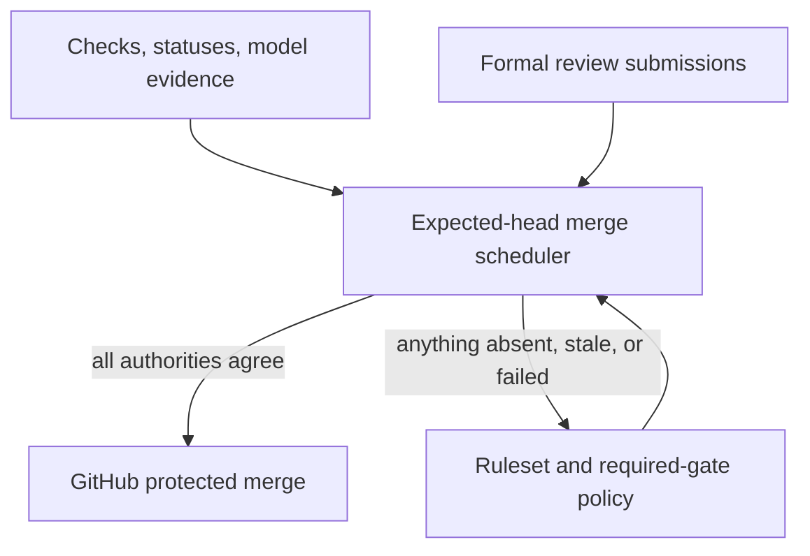

Machine evidence cannot enter the `Formal` authority class. A qualifying human approval cannot replace a failed deterministic check.

## 6. Deployment and control-plane topology

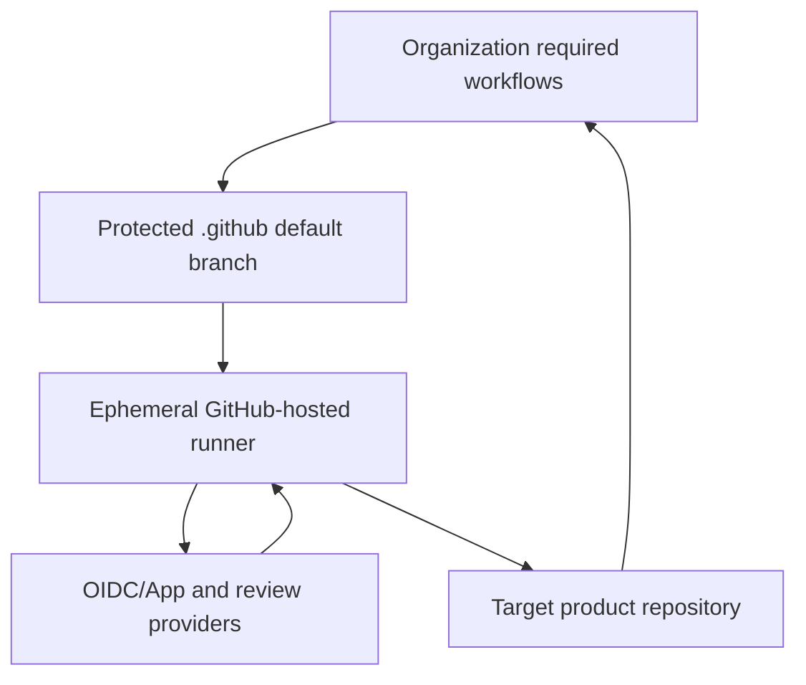

The protected central source is trusted code; the target PR source is untrusted input. Short-lived provider or App authority is scoped to the job that needs it.

## 7. Retry and failure classification

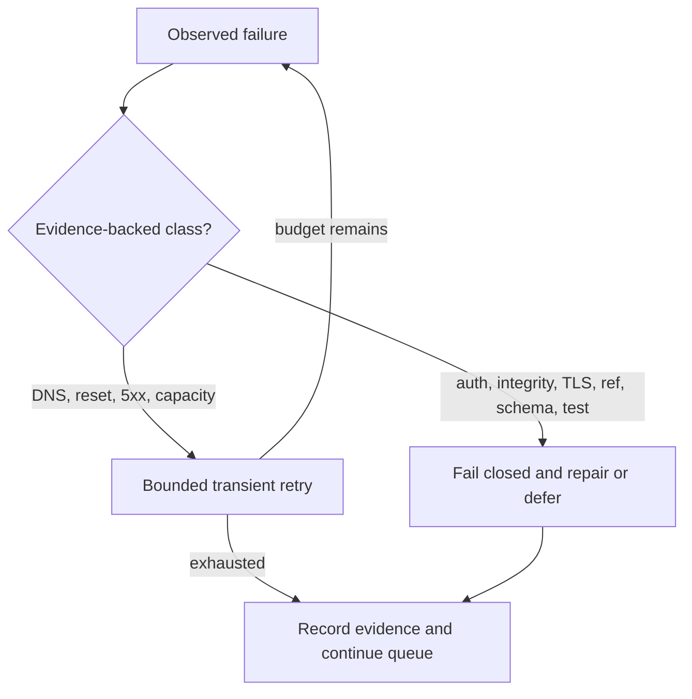

## 8. Sandbox evidence publication sequence

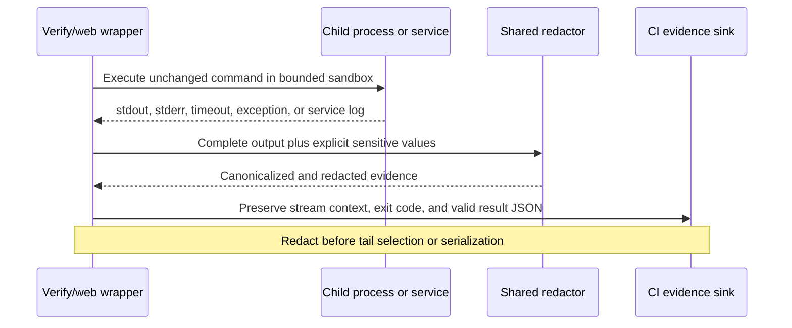

If safe redaction cannot be established before parsing or setup output, the wrapper returns its setup-failure code without publishing attacker-controlled evidence.

## 9. Mention routing and idempotency sequence

```mermaid
sequenceDiagram
  participant G as GitHub event
  participant R as Mention router
  participant L as Artifact ledger
  participant A as Approved agent

  G->>R: Comment event or authenticated sweep
  R->>G: Re-fetch actor, comment, PR, and exact head
  R->>L: Claim canonical invocation key
  alt completed or active claim exists
    L-->>R: Duplicate; no side effect
  else claim acquired
    R->>A: Canonical allowlisted request
    A-->>R: Bounded result receipt
    R->>L: Complete claim with outcome
  end
```

Visible mention text never becomes executable input. Comment edits, agent
changes, and head changes produce a new identity or invalidate the old request;
redelivery of the same identity is observable but side-effect free.

## 10. Merge-mode and external-head state

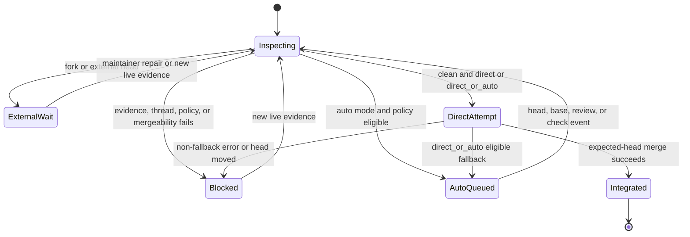

`direct_or_auto` is an ordered policy, not two simultaneous writers. External
heads remain reviewable, but central automation neither direct-merges nor queues
auto-merge for them; it records the maintainer prerequisite and continues other
work.

## 11. Writer lease and branch rotation

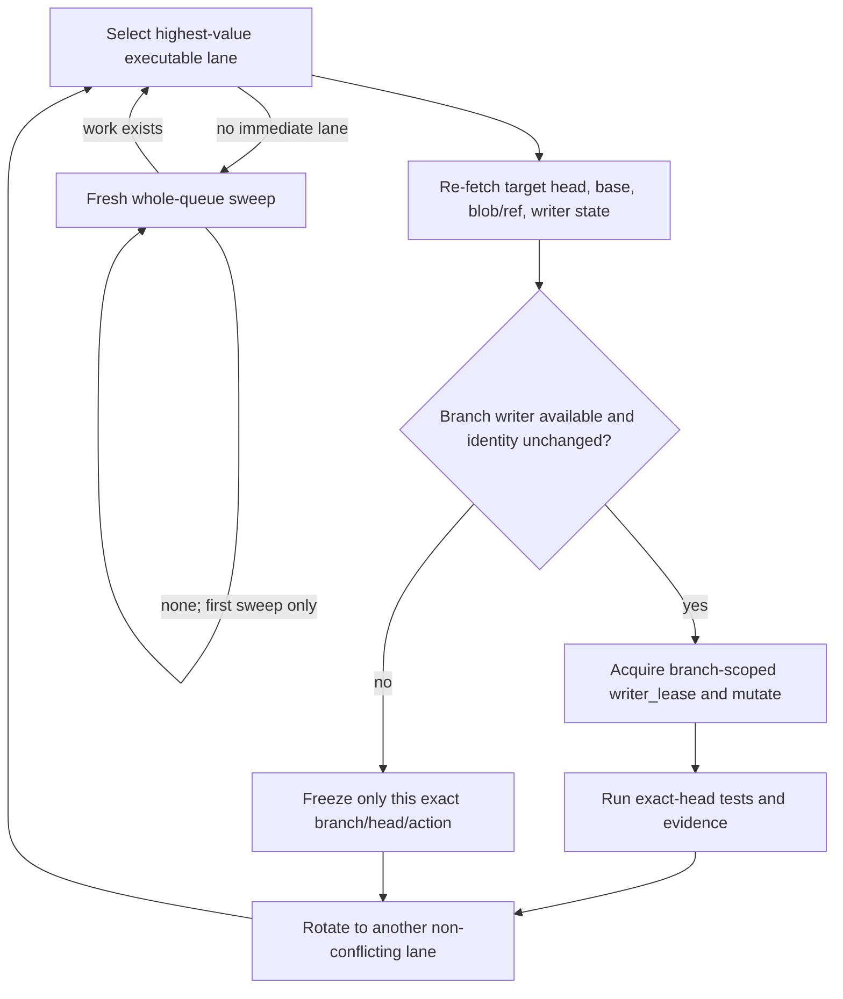

The lease is branch-scoped, not an implicit repository- or organization-wide mutex. A pending review/check, external approval, or another branch writer blocks only that exact lane. A second fresh all-lanes-nonactionable sweep—or genuine practical run/tool-budget exhaustion—is required before termination.

## 12. Documentation assessment to repository mutation and continuation

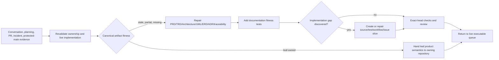

A documentation assessment or update is never completion by itself. Candidate conversation/planning evidence becomes canonical only after revalidation, maturity classification, Git-tracked mutation, and machine/reviewer checks. Product-specific architecture remains with its leaf repository; central documentation owns only shared automation and interface contracts.

## 13. User-redirection incident recovery

```mermaid
sequenceDiagram
  participant U as User/operator
  participant A as Maintainer automation
  participant G as GitHub live queue
  participant D as Documentation control plane

  U->>A: Work remained; prior invocation stopped early
  A->>A: Classify USER_REDIRECTION_INCIDENT
  A->>G: Re-fetch protected main, all PRs/issues, heads, live bases, writers, gates
  G-->>A: Fresh executable and deferred lanes
  opt Control contract was incomplete
    A->>D: Repair prompt/docs/test contract
    D-->>A: META_INTERMEDIATE only; zero completion credit
  end
  alt At least two independent safe lanes exist
    A->>G: Execute first substantive safe action
    A->>G: Execute second materially distinct safe action
    Note over A,G: At least one action is non-documentation when available
  else Exactly one safe lane exists
    A->>G: Execute the sole safe action
  end
  A->>G: Fresh whole-queue sweep 1
  G-->>A: Current queue
  alt Any executable lane exists
    A->>G: Execute and reset sweep count
  else No executable lane
    A->>G: Fresh whole-queue sweep 2 from new reads
  end
```

`USER_REDIRECTION_INCIDENT` is never terminal. Recovery must occur in the **same invocation**. Prompt, documentation, RCA, status, one commit, or one merge has zero completion credit while another safe lane exists. If two independent safe lanes exist, at least two materially distinct actions are required and a safe **non-documentation** lane must be included when available. When only one lane exists, two fresh whole-queue sweeps must prove no second executable lane before voluntary termination.