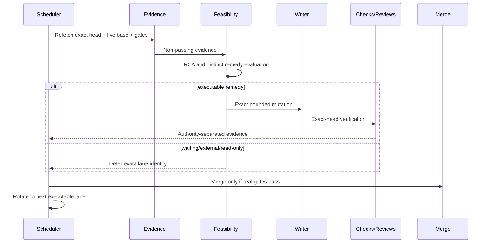
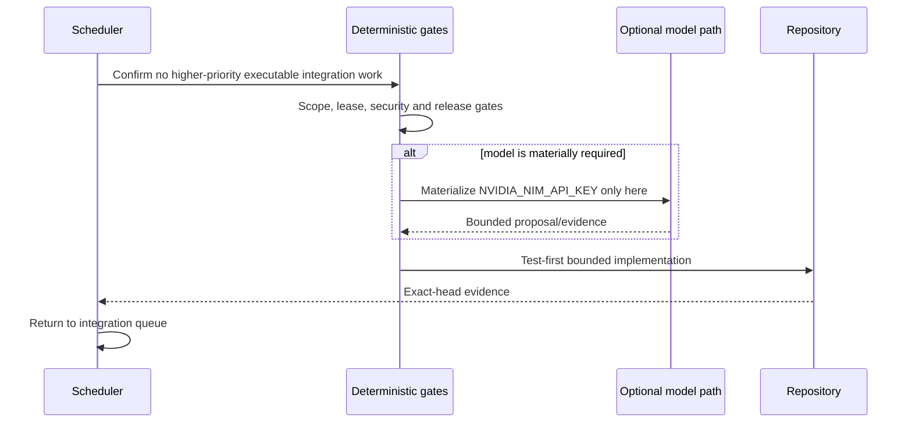
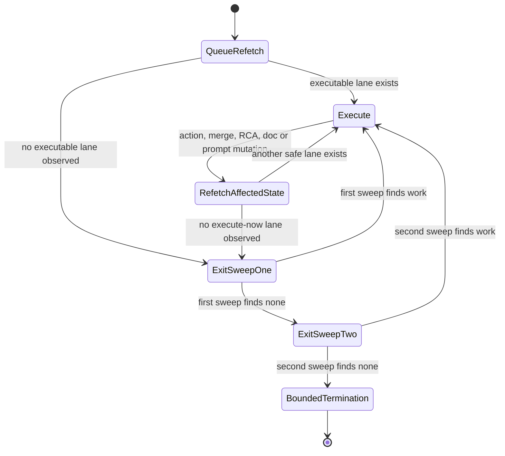
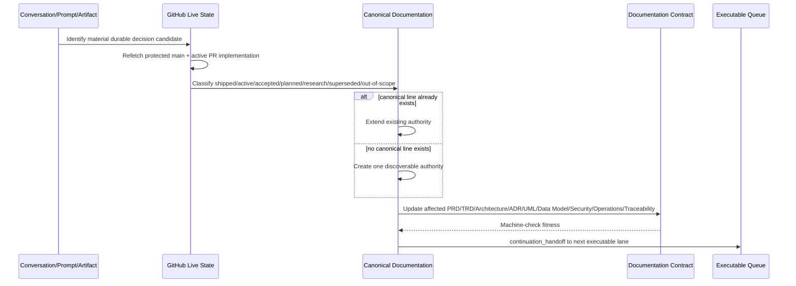
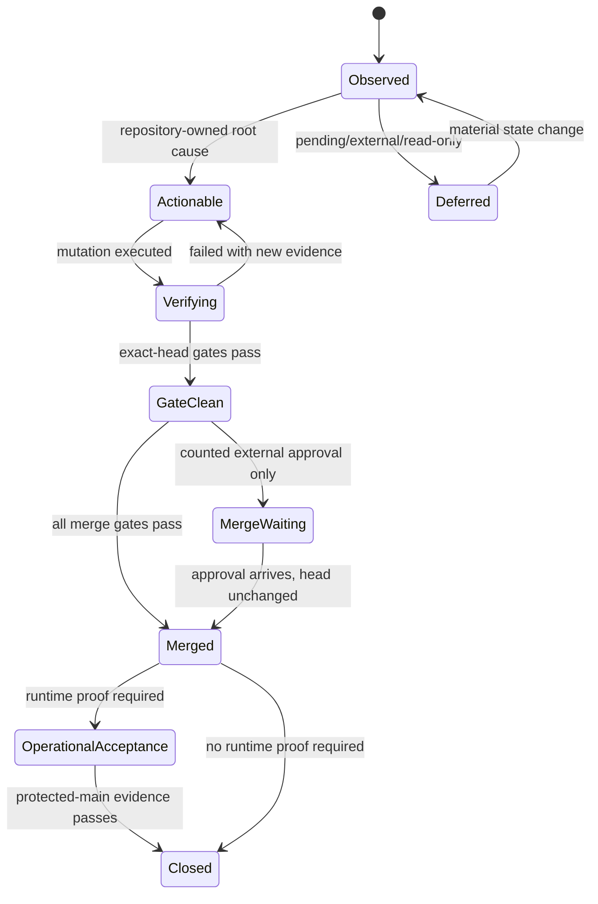
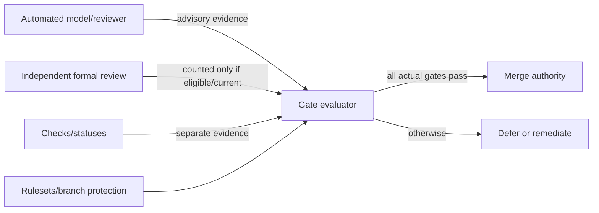
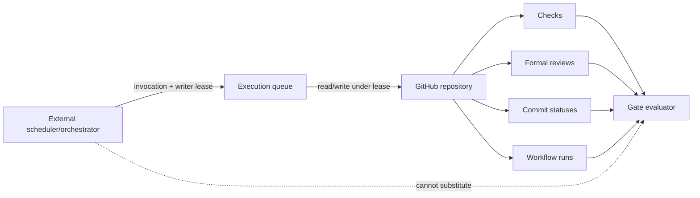
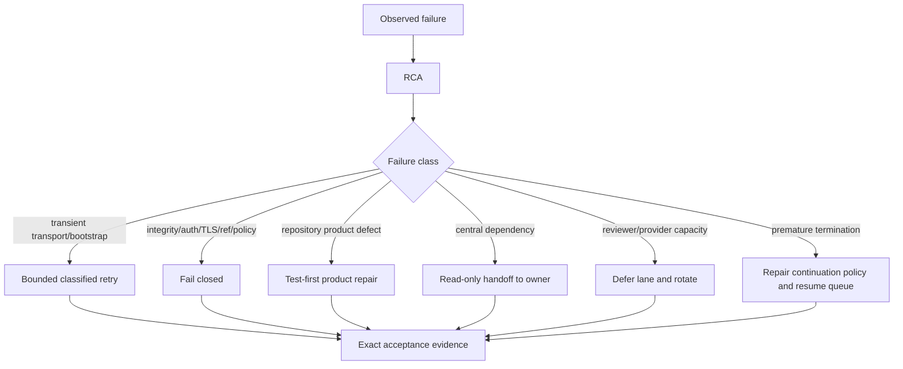

# CWL Automation Control Plane — UML Views

Status: active_pr

## PR maintenance sequence

## Product development sequence

## Continuation and handoff state machine

A user-visible status, prompt update, review request, merge, documentation edit, or defer decision never transitions directly to `BoundedTermination`. It must return through queue selection and the required exit sweeps unless the practical invocation/tool budget is exhausted.

## Conversation-to-repository reconciliation

## Evidence/gate state machine

## Reviewer and merge authority

## External scheduler and GitHub authority

## Incident classification

