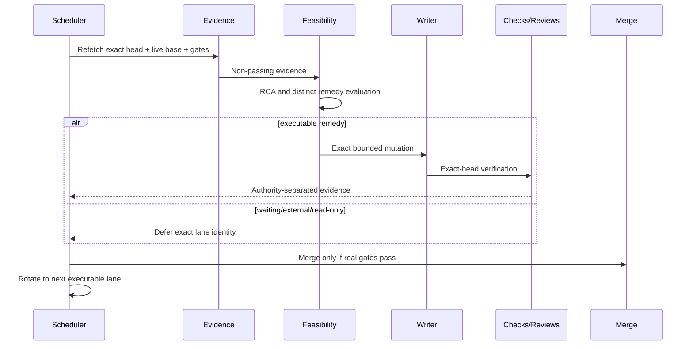
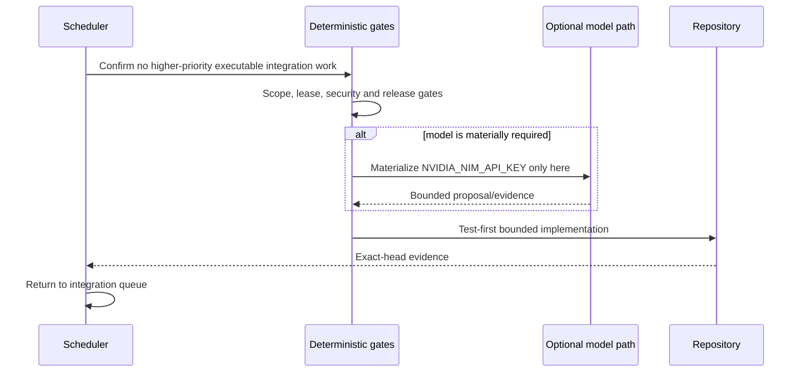
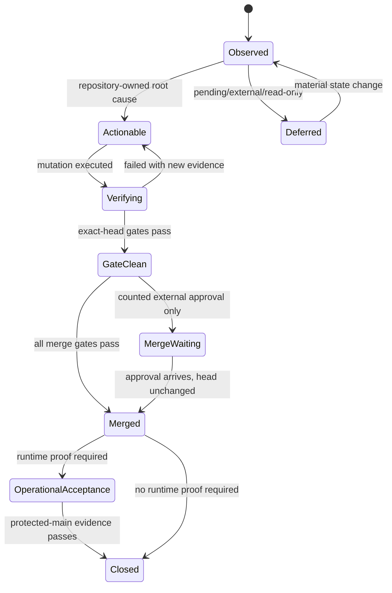
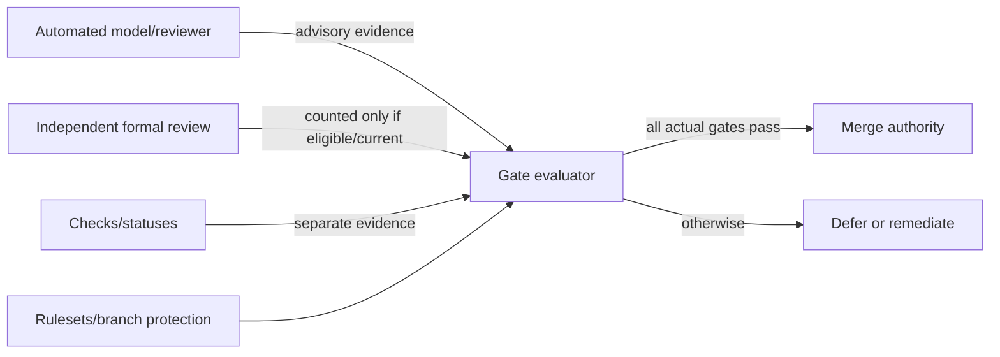
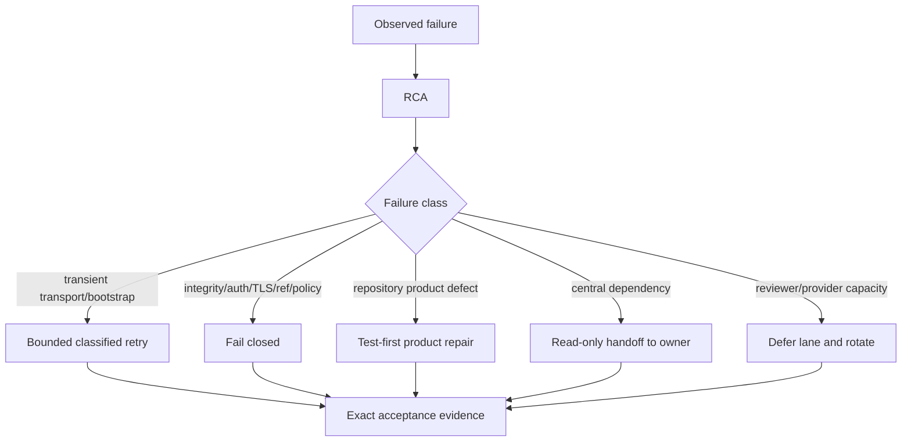

# CWL Automation Control Plane — UML Views

Status: Proposed baseline

## PR maintenance sequence

## Product development sequence

## Evidence/gate state machine

## Reviewer and merge authority

## Incident classification

