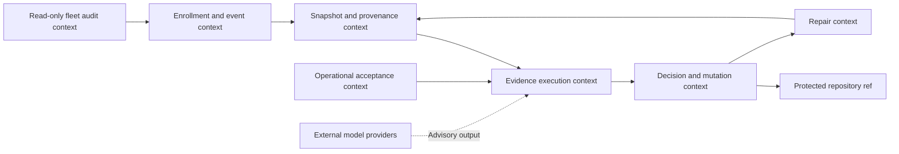
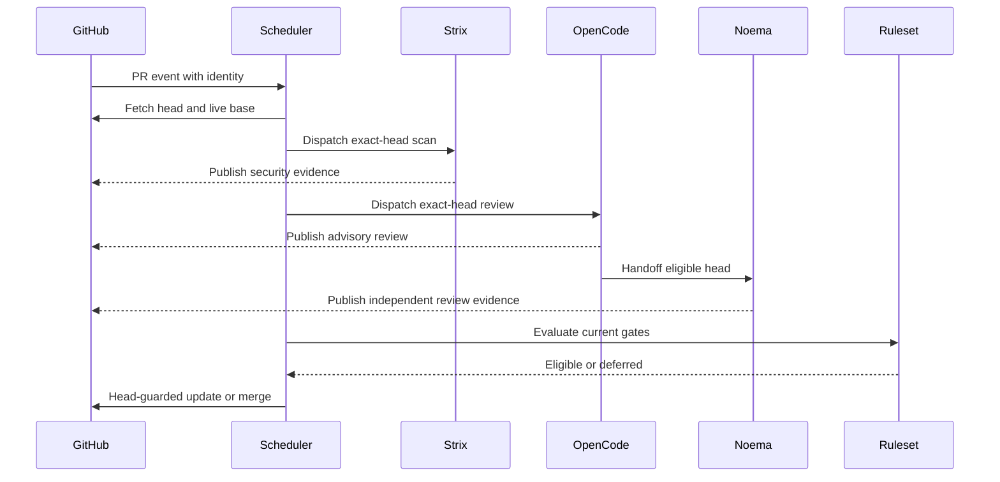
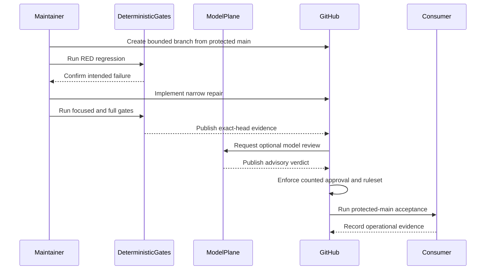
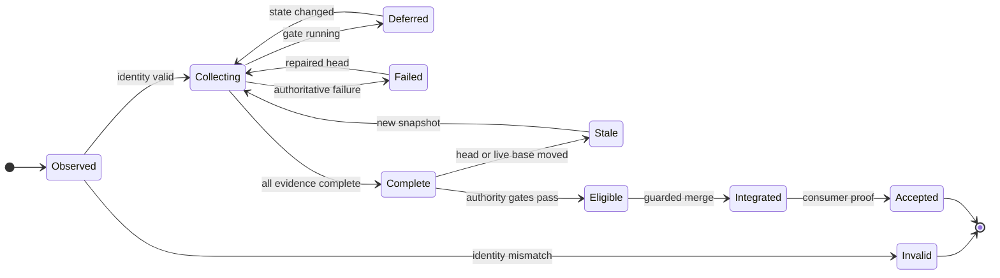
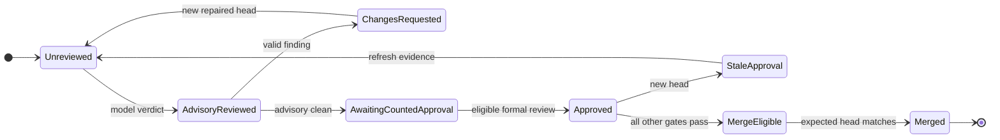
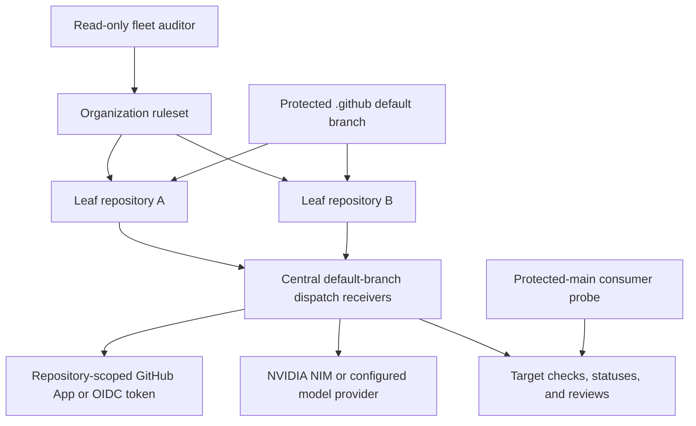
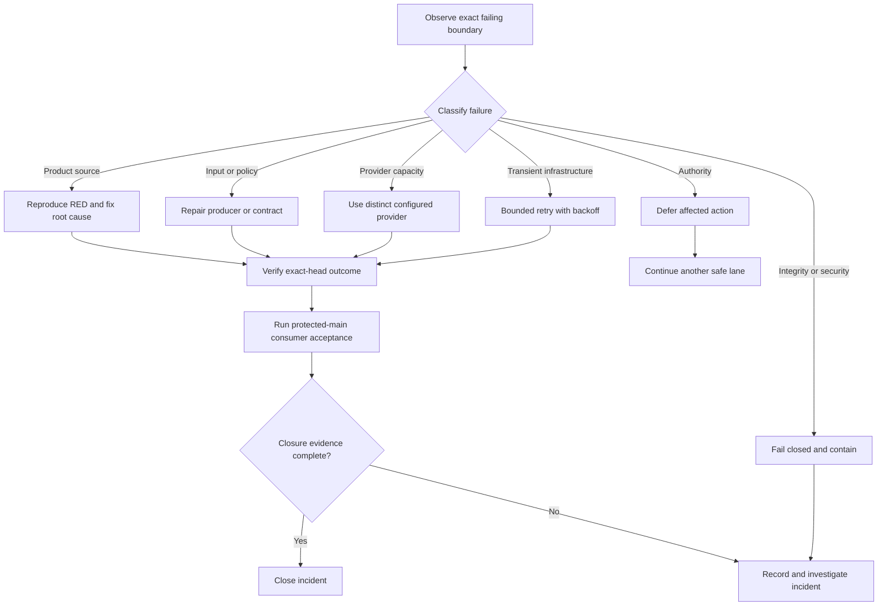

# UML and interaction views

Status: normative diagram-as-code views. The prose contracts in
[TRD.md](TRD.md) take precedence if a renderer changes layout.

Editable architecture, ERD, sequence, and runtime-state companion:
[CWL Automation Control Plane FigJam](https://www.figma.com/board/4x8YSMb8teJhU19nDjdkcy).

## Component and bounded-context view

## PR maintenance sequence

The scheduler does not wait in place between the Strix, OpenCode, and Noema
messages. A queued/running item enters a deferred set while another safe lane is
processed.

This sequence is the target interaction contract. On the audited protected
main, Noema handoff is non-blocking and the scheduler does not validate the
Noema identity; `ContextualWisdomLab/.github#772` owns that governance gap.
End-to-end mention snapshot and review-only semantics remain pending in
`ContextualWisdomLab/.github#840`. The current scheduler records a PR-local
mutation failure as `action_error` and continues the queue, but the CLI can
still exit successfully; terminal workflow propagation is tracked in
`ContextualWisdomLab/.github#894`.

## Product-development sequence

Model credentials are not materialized until deterministic identity and
eligibility gates pass. A provider failure cannot replace deterministic or
formal governance evidence.

## Evidence and gate state machine

## Reviewer and merge authority state flow

An OpenCode, Noema, Strix, CodeRabbit, check, status, comment, or reaction does
not skip `AwaitingCountedApproval` when the ruleset requires an eligible
independent review.

## Deployment and control-plane topology

## Incident retry and failure-classification flow

