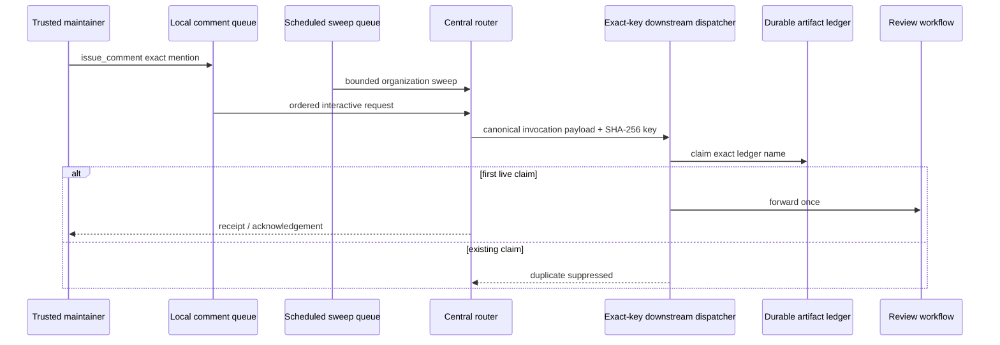

# Review-agent mention concurrency isolation

검토 기준일: **2026-08-07**

## Incident

Trusted `@cwl-noema-review` and review-only `@opencode-agent` comments can remain unacknowledged even though the protected-default-branch router is enabled. The failure occurs before model execution: the central workflow mixes two event classes in one workflow-level concurrency group.

- interactive `issue_comment` routing has a five-minute job timeout;
- the organization-wide sweep is scheduled every five minutes and has a fifteen-minute job timeout.

GitHub Actions documents that a concurrency group permits one running member. With the default `queue: single`, at most one additional run can be pending; a newer queued run replaces the existing pending run even when `cancel-in-progress` is false. A scheduled sweep can therefore replace a pending trusted comment before exact-head resolution, durable ledger claim, dispatch, or acknowledgement.

This is a queue-configuration defect, not evidence that the model, credential, allowlist, or review result is invalid.

## Fail-first evidence

Direct-main replacement PR #825 starts from protected `main` `1131b1bbafb24e455fc8619cdf316813e8721861`. Exact RED head `a319d513a2f67b707737651a9eb7fdbfe4bc23c4` changed only `tests/test_agent_mention_workflow_contract.py` and required separate job-scoped queue contracts while the inherited workflow still had one shared workflow-level group.

This replacement does not reuse predecessor PR #815 or stacked development PR #824 checks, reviews, approvals, or mergeability evidence.

## Decision

Move concurrency from the workflow to the two jobs and give each event class a separate group.

```yaml
route-local-agent-mention:
  concurrency:
    group: review-agent-mention-router-local-${{ github.repository }}
    queue: max

sweep-organization-agent-mentions:
  concurrency:
    group: review-agent-mention-router-sweep-${{ github.repository }}
    cancel-in-progress: false
```

GitHub currently documents `queue: max` as allowing up to 100 pending jobs or workflow runs in a concurrency group. Waiting members are processed serially; runs beyond the queue limit are rejected. GitHub also documents that `queue: max` cannot be combined with `cancel-in-progress: true`.

The interactive route therefore retains every bounded pending trusted comment up to the platform queue limit instead of replacing the previous pending request. The sweep keeps the default single-pending behavior: a running sweep is not interrupted, but obsolete pending sweeps may coalesce. Local routes and scheduled sweeps use different concurrency groups, so scheduled work cannot replace interactive work.

Concurrency is not the durable idempotency authority. Duplicate forwarding remains governed by the canonical invocation key, exact-key downstream concurrency, and immutable exact-name Actions artifact ledger written before authoritative forwarding.

## Data and authority flow



A receipt proves routing/claim processing occurred. It is not an approval and does not weaken exact-head checks, branch protection, or expected-head merge rules.

## Preserved security and privacy boundaries

- No model provider, reviewer identity, token name, secret, repository allowlist, dispatch payload, or permission changes.
- `COPILOT_GITHUB_TOKEN` remains unused.
- Workflow-default permissions remain `contents: read`; only existing job-scoped writes remain.
- The local route still accepts only non-bot `OWNER`, `MEMBER`, or `COLLABORATOR` comments on pull requests in the central repository.
- The sweep retains the configured organization-token / OpenCode installation-token credential chain.
- Pull-request number, base branch, base SHA, current head SHA, requesting actor, source comment identifier, and requested agent remain bound into the canonical invocation key.
- The exact-name Actions artifact ledger remains the authority for idempotent forwarding.
- The ledger keeps the existing **30-day artifact retention** and contains bounded invocation metadata, not comment bodies, model output, credentials, or business payloads.

The privacy alternative to masking is separation and minimization: this automation does not require business PII. It processes bounded GitHub control-plane metadata under repository authorization rather than copying business records into model prompts or artifacts.

## CSAP / SOC 2 readiness evidence

This repair improves availability and processing-integrity evidence without claiming certification.

| Control concern | Evidence |
| --- | --- |
| Change management | Protected pull request and exact-head checks; qualifying independent review and post-integration evidence remain pending |
| Availability | Separate local/sweep groups, bounded job timeouts, bounded interactive queue |
| Processing integrity | Canonical invocation key, exact-name artifact claim, duplicate suppression |
| Least privilege | Existing job-scoped permissions and credential separation remain unchanged |
| Monitoring | Queue delay, receipt delay, sweep duration, dispatch count, duplicate-claim outcome |
| Incident response | Fail-first contract, this doctoring record, rollout/rollback criteria |
| Privacy | Metadata-only routing; no business payload or credential retained in ledger |

## Monitoring and acceptance

After protected merge:

1. create a fresh exact-head `@opencode-agent` and/or `@cwl-noema-review` request;
2. require a durable receipt or acknowledgement before relying on downstream review evidence;
3. verify that scheduled sweep runs do not cancel or replace pending interactive routes;
4. monitor local queue delay, sweep duration, dispatch count, duplicate-ledger outcomes, and downstream conclusions;
5. alert when an eligible interactive request has no receipt within **10 minutes** of comment creation (a CWL operational alert threshold, not a GitHub SLA): this permits at most five minutes of queue delay plus the existing five-minute local execution timeout before operator investigation;
6. alert immediately on a queue-limit rejection, unexpected cancellation of an interactive route, or when the interactive queue approaches the documented 100-pending limit;
7. keep metrics finite-cardinality and exclude comment text, source diffs, tokens, and model responses.

A downstream reviewer may still fail closed because credentials, providers, checks, or exact-head evidence are unavailable. That remains distinct from a routing queue failure.

## Rollback

Rollback must preserve interactive requests. Restoring the shared workflow-level group is not acceptable. A safe emergency degradation is to suspend the scheduled sweep while retaining the isolated local queue. Removing `queue: max` from the local group requires another independently reviewed durable queue that preserves every eligible invocation.

## References (APA 7th)

GitHub. (n.d.). *Concurrency*. GitHub Docs. Retrieved August 7, 2026, from https://docs.github.com/en/actions/concepts/workflows-and-actions/concurrency

GitHub. (n.d.). *Control the concurrency of workflows and jobs*. GitHub Docs. Retrieved August 7, 2026, from https://docs.github.com/en/actions/how-tos/write-workflows/choose-when-workflows-run/control-workflow-concurrency

GitHub. (n.d.). *REST API endpoints for GitHub Actions artifacts*. GitHub Docs. Retrieved August 7, 2026, from https://docs.github.com/en/rest/actions/artifacts

GitHub. (n.d.). *Store and share data with workflow artifacts*. GitHub Docs. Retrieved August 7, 2026, from https://docs.github.com/en/actions/tutorials/store-and-share-data
