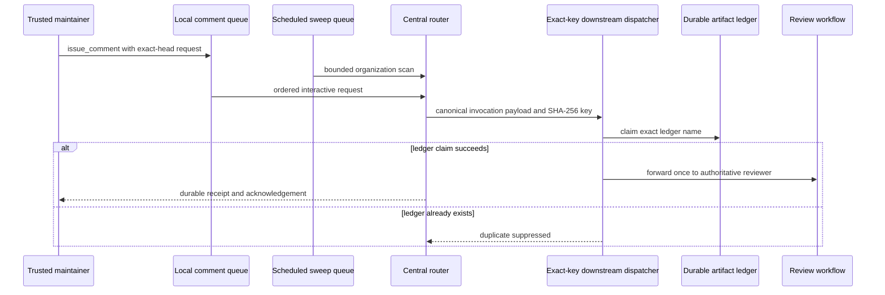

# Review-agent mention concurrency isolation

## Incident

Trusted `@cwl-noema-review` and review-only `@opencode-agent` comments could remain unacknowledged even though the protected-main router was enabled. Repeated exact-head requests on `.github#813` and `mightyETL#121` produced neither the durable router receipt nor the expected `eyes` acknowledgement.

The failure occurred before model execution. The central workflow mixed two event classes in one workflow-level concurrency group:

- an interactive `issue_comment` route with a five-minute job timeout; and
- an organization-wide sweep scheduled every five minutes with a fifteen-minute job timeout.

GitHub Actions permits one running member and, by default, one pending member in a concurrency group. A new queued member replaces the existing pending member even when `cancel-in-progress` is false. A scheduled sweep could therefore replace a pending trusted comment run before it read the comment, resolved the exact pull-request head, dispatched a reviewer, wrote the durable invocation ledger, or acknowledged the request.

This was a deterministic queue configuration defect, not a model, credential, allowlist, or review-quality failure.

## Fail-first evidence

Draft pull request #815 first added only the permanent regression contract at exact head `ca9a03109428332b4c35f4b24313580eda5cd92c`.

Agent Mention Router Quality CI run `31154969412`, job `92792374352`, executed the complete repository suite and produced the intended result:

```text
1 failed, 963 passed
FAILED tests/test_agent_mention_workflow_contract.py::
test_interactive_mentions_and_sweeps_have_independent_queue_contracts
```

The failure proved that the inherited workflow still contained the shared top-level group. No test was weakened or skipped before the production change.

## Decision

Move concurrency from the workflow to the two jobs and give each event class a separate group.

```yaml
route-local-agent-mention:
  concurrency:
    group: review-agent-mention-router-local-${{ github.repository }}
    queue: max

sweep-organization-agent-mentions:
  concurrency:
    group: review-agent-mention-router-sweep-${{ github.repository }}
    cancel-in-progress: false
```

The interactive group uses `queue: max`. GitHub currently permits up to 100 pending members in that mode and processes waiting members serially. It is deliberately not combined with `cancel-in-progress: true`, which GitHub rejects as contradictory.

The sweep group retains the default single-pending behavior. A running sweep is not interrupted, but newer schedules may coalesce obsolete pending sweeps. This avoids an unbounded maintenance backlog while preventing scheduled work from replacing an interactive request.

Local and sweep jobs may overlap because they now use different groups. Duplicate forwarding is still prevented by the existing deterministic invocation key, exact-key downstream concurrency, and immutable exact-name Actions artifact ledger written before authoritative forwarding.

## Data and authority flow



The receipt proves that routing and durable claim processing occurred. It is not an approval and does not weaken exact-head review, required checks, branch protection, or expected-head merge rules.

## Preserved security boundaries

- No model provider, reviewer identity, token name, secret, repository allowlist, dispatch payload, or permission is changed.
- `COPILOT_GITHUB_TOKEN` remains unused.
- The workflow default remains `contents: read`; each job retains only its existing job-scoped writes.
- The local route still accepts only non-bot `OWNER`, `MEMBER`, or `COLLABORATOR` comments on pull requests in the central repository.
- The sweep still uses the configured organization token or bounded OpenCode installation-token exchange for sibling-repository reads.
- Exact pull-request number, base branch, current head SHA, requesting actor, source comment identifier, and requested agent remain bound into the canonical invocation key.
- Artifact-ledger creation remains the authority for idempotent forwarding. Concurrency alone is not treated as durable uniqueness.
- Ordinary logs and queue evidence exclude comment bodies, model output, private tokens, raw credentials, and repository data beyond bounded identifiers already present in GitHub Actions metadata.

## CSAP and SOC 2 operating evidence

The repair supports availability and processing-integrity control evidence without claiming certification from code alone.

| Control concern | Evidence |
| --- | --- |
| Change authorization | Protected pull request, exact-head checks, independent review, and immutable commit history |
| Availability | Separate interactive and sweep groups, bounded job timeouts, and queued interactive requests |
| Processing integrity | Deterministic invocation key, exact-name artifact claim, duplicate suppression, and receipt semantics |
| Security | Existing least-privilege job permissions, secret separation, no new token, and default-branch trusted code |
| Monitoring | Workflow conclusion, queue delay, receipt delay, sweep duration, dispatch count, and duplicate-claim outcome |
| Incident response | This doctoring record, fail-first run identifiers, rollout checks, and rollback constraints |
| Privacy | Architectural data minimization; the router needs metadata, not business payloads or PII |

The alternative to PII masking is separation: this automation path does not read business payloads at all. It uses purpose-bound metadata, encrypted GitHub transport and storage, role-based repository access, and bounded artifact retention.

## Monitoring and acceptance

After protected merge:

1. submit one fresh exact-head Noema request on `.github#813` and one on `mightyETL#121`;
2. require a durable receipt marker or acknowledgement before relying on downstream review evidence;
3. verify that no interactive router run is canceled by a scheduled sweep;
4. inspect local queue delay, sweep duration, dispatch count, duplicate-ledger outcomes, and downstream workflow conclusions;
5. alert when an eligible comment has no receipt within the local five-minute timeout plus bounded queue delay;
6. alert when the interactive queue approaches its 100-pending platform limit or when sweep duration repeatedly exceeds its five-minute cadence;
7. keep metrics finite-cardinality and exclude comment text, pull-request diff content, tokens, and model responses.

A review workflow may still fail closed because credentials, providers, checks, or exact-head evidence are unavailable. That is distinct from an unacknowledged router invocation and must remain visible.

## Rollback

Rollback requires an independently reviewed replacement that proves scheduled work cannot replace pending interactive requests. Restoring the shared workflow-level group is not acceptable.

A safe emergency degradation is to suspend the scheduled sweep while retaining the isolated local queue. Removing `queue: max` from the local group is unsafe unless another durable queue preserves every eligible comment invocation.

## APA 7th references

GitHub. (2026a). *Concurrency*. GitHub Docs. https://docs.github.com/en/actions/concepts/workflows-and-actions/concurrency

GitHub. (2026b). *Control the concurrency of workflows and jobs*. GitHub Docs. https://docs.github.com/en/actions/how-tos/write-workflows/choose-when-workflows-run/control-workflow-concurrency

GitHub. (2026c). *Events that trigger workflows*. GitHub Docs. https://docs.github.com/en/actions/reference/workflows-and-actions/events-that-trigger-workflows

GitHub. (2026d). *Troubleshooting workflows*. GitHub Docs. https://docs.github.com/en/actions/how-tos/troubleshoot-workflows

Korea Internet & Security Agency. (2025). *2025 cloud service security assurance program guide*. https://isms.kisa.or.kr/main/csap/notice

American Institute of Certified Public Accountants. (2023). *2017 Trust Services Criteria for security, availability, processing integrity, confidentiality, and privacy (with revised points of focus—2022)*. AICPA & CIMA. https://www.aicpa-cima.com/resources/download/2017-trust-services-criteria-with-revised-points-of-focus-2022
