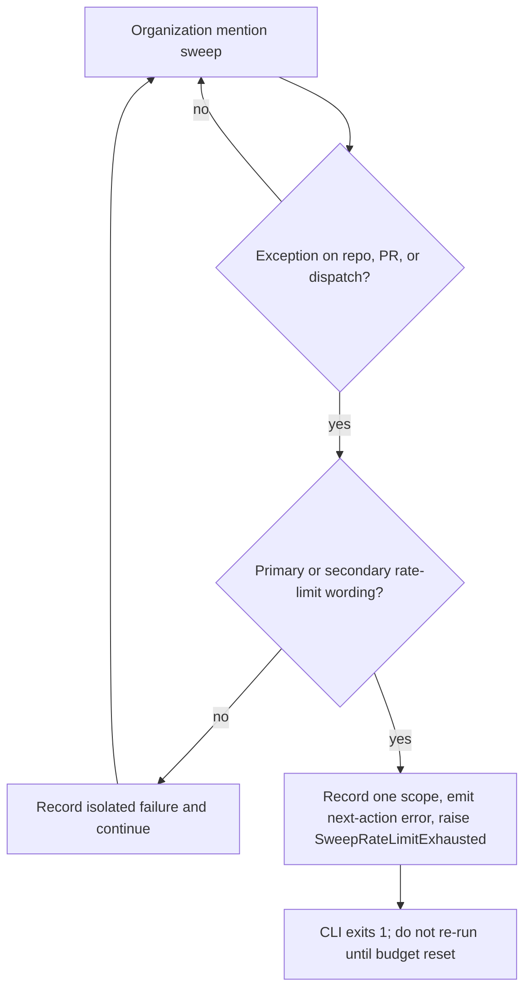

# Agent mention sweep rate-limit fail-fast boundary

Updated: 2026-08-16

## Incident

Scheduled `Review Agent Mention Router` run `31868885733` exhausted the OpenCode GitHub App installation REST budget before processing the requested review queue. The sweep continued traversing repositories after the first installation-wide `API rate limit exceeded` response and finished with zero dispatches plus 116 isolated failures. Repeating requests after the shared budget is exhausted cannot recover candidate-local work and consumes runner time while obscuring the single control-plane cause.

## Decision

Treat explicit GitHub primary- or secondary-rate-limit messages as **sweep-global capacity exhaustion**, not candidate-local failures. The sweep records the first failed scope, emits an operator `::error::` with the next action (wait for the installation REST budget to reset; do not re-run immediately), then raises `SweepRateLimitExhausted`. The scheduled CLI catches that exception and exits `1` so the workflow fails closed without a raw traceback. Ordinary repository, pull-request, review, acknowledgement, and dispatch failures remain isolated exactly as before.

Classification matches GitHub's documented wording families, including `API rate limit exceeded`, `API rate limit already exceeded`, and secondary-limit messages. A contiguous `"api rate limit exceeded"` needle is not sufficient: the GraphQL/already-exhausted phrasing inserts `already` between `limit` and `exceeded`, and that wording must also stop the sweep.

This change is intentionally narrow. It does not retry, sleep, change credentials, widen permissions, alter the canonical invocation key, modify the exact-name artifact ledger, or claim that a failed request was dispatched. A later scheduled invocation may run after GitHub restores capacity. Interactive/local routing and the separate concurrency-isolation repair remain independent control-plane lanes.

## Why fail-fast

GitHub documents that installation access tokens share an installation-level primary REST budget. When a primary limit is exceeded, requests return HTTP 403 or 429 and callers should not retry until the reset time. GitHub also states that integrations should stop and wait on secondary-rate-limit responses; continuing to make requests while rate-limited may lead to integration bans. The current sweep cannot safely infer reset headers from the `gh` exception string, so the bounded action is to stop the current scheduled traversal rather than amplify the exhausted state.

## Verification contract

- a synthetic installation-wide primary-limit error on the first PR aborts before the second PR is touched;
- the incident path (first repository pull listing exhausted) records exactly one failure and never requests a later repository;
- a dispatch-time primary-limit error aborts before the next pull request is built;
- exactly one failure is recorded for the first exhausted scope;
- secondary-limit, `already exceeded`, and HTTP 429 secondary messages are classified as sweep-global exhaustion;
- unrelated authorization/resource errors remain candidate-local and preserve existing failure isolation;
- `main()` returns `1` with an `::error::` next action when `SweepRateLimitExhausted` is raised;
- the permanent agent-mention quality suite continues to require 100% owned production statement/branch and public docstring coverage.

## Operator next action

If the scheduled sweep fails with `::error::` and `rate limit`, wait for GitHub to restore the installation REST budget. Do not re-run the workflow immediately. The next hourly schedule is the recovery path. Ordinary isolated `::warning::` skips are not this signal.

## Rollback

Revert `SweepRateLimitExhausted`, `is_rate_limit_exhaustion`, the CLI catch, and their focused regressions if GitHub changes the CLI error contract or the router gains structured response-header handling. Do not restore repeated API calls after a proven shared rate-limit exhaustion without an equivalent bounded backoff/stop mechanism.

## References

GitHub. (n.d.-a). *Rate limits for the REST API*. GitHub Docs. Retrieved August 16, 2026, from https://docs.github.com/en/rest/using-the-rest-api/rate-limits-for-the-rest-api

GitHub. (n.d.-b). *Rate limits for GitHub Apps*. GitHub Docs. Retrieved August 16, 2026, from https://docs.github.com/en/apps/creating-github-apps/registering-a-github-app/rate-limits-for-github-apps

GitHub. (n.d.-c). *Best practices for using the REST API*. GitHub Docs. Retrieved August 16, 2026, from https://docs.github.com/en/rest/using-the-rest-api/best-practices-for-using-the-rest-api

GitHub. (n.d.-d). *Rate limits and query limits for the GraphQL API*. GitHub Docs. Retrieved August 16, 2026, from https://docs.github.com/en/graphql/overview/rate-limits-and-query-limits-for-the-graphql-api
