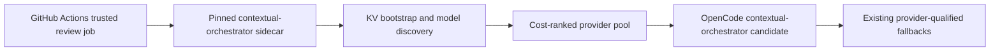

# Contextual Orchestrator OpenCode gateway

The trusted OpenCode review job starts `contextual-orchestrator` from the
pinned predecessor commit `8d31fa50cc6de8ddc3e6b91576e7251c5aa7d914` from
contextual-orchestrator#790, which includes the provider-diverse discovery
repair from #770. After that predecessor merges, this pin must be
replaced with the resulting protected `main` SHA. The sidecar binds only
to `127.0.0.1:18080`, registers any available provider keys in its process-local
KV bootstrap, discovers models across Bytez, both NVIDIA NIM credentials,
OpenRouter, and OpenAI, then serves the existing OpenAI-compatible review
request through the `contextual-orchestrator` model candidate.

The gateway candidate is first in the model pool only for public repositories,
after the pinned checkout succeeds, the sidecar reaches the unauthenticated
`/healthz` liveness check, and an authenticated `/v1/models` response contains
at least one non-empty model id. `/healthz` is liveness only. A missing or
unreadable pinned revision, missing `LICENSE`, or a license other than the
allowed MIT declaration is non-fatal:
the gateway candidate is skipped and the established provider-qualified pool
remains available. Private repositories never start or select the gateway,
because its auto-discovered catalog includes providers excluded by the review
workflow's private-source retention policy. Review publication, current-head
binding, independent approval, Strix, and branch protection are unchanged.
`COPILOT_GITHUB_TOKEN` is not used.

The gateway candidate uses a 900-second per-attempt runtime cap by default
(`OPENCODE_CONTEXTUAL_ORCHESTRATOR_RUN_TIMEOUT_SECONDS`). This preserves the
existing provider-qualified fallback window when the sidecar or its selected
provider stalls; the surrounding retry budget and outer workflow timeout still
bound the complete review step.

The sidecar receives the five provider credentials only in the model-execution
step, plus the existing `NVIDIA_API_KEY` alias required by the NIM adapter. Its
child process starts under an `env -i` allowlist containing only those provider
keys, loopback configuration, Python/runtime paths, and inert Actions command
file paths. It therefore cannot inherit `GITHUB_TOKEN`, `GH_TOKEN`, OIDC or
Actions runtime tokens, `STRIX_GITHUB_MODELS_TOKEN`, `OPENCODE_API_KEY`, or a
future unrelated secret. The generated local bearer token is masked and used
only for loopback inference. Persistent production credential storage remains
the gateway deployment's existing KV boundary; this runner bootstrap is
intentionally process-local and ephemeral.

## References

GitHub. (n.d.). *Building and testing Python*. Retrieved August 20, 2026,
from https://docs.github.com/en/actions/automating-builds-and-tests/building-and-testing-python

GitHub. (n.d.). *Using secrets in GitHub Actions*. Retrieved August 20, 2026,
from https://docs.github.com/en/actions/security-guides/using-secrets-in-github-actions

OpenCode. (n.d.). *OpenCode documentation*. Retrieved August 20, 2026, from
https://opencode.ai/docs/

ContextualWisdomLab. (n.d.). *contextual-orchestrator* [Source repository].
Retrieved August 20, 2026, from
https://github.com/ContextualWisdomLab/contextual-orchestrator
