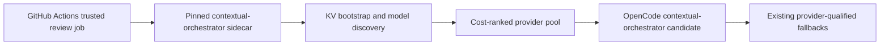

# Contextual Orchestrator OpenCode gateway

The trusted OpenCode review job starts `contextual-orchestrator` from the
pinned commit `04761e412083e02ef6ccc0a888ceec4c0be71553`. The sidecar binds only
to `127.0.0.1:18080`, registers any available provider keys in its process-local
KV bootstrap, discovers models across Bytez, both NVIDIA NIM credentials,
OpenRouter, and OpenAI, then serves the existing OpenAI-compatible review
request through the `contextual-orchestrator` model candidate.

The gateway candidate is first in the model pool only when the sidecar reaches
the unauthenticated `/healthz` liveness check. If startup or discovery fails,
the candidate is skipped and the established OpenCode, OpenAI, OpenRouter,
NVIDIA NIM, and GitHub Models paths remain available. Review publication,
current-head binding, independent approval, Strix, and branch protection are
unchanged. `COPILOT_GITHUB_TOKEN` is not used.

The sidecar receives the five provider credentials only in the model-execution
step. It does not receive review-write tokens, and the generated local bearer
token is masked and used only for loopback inference. Persistent production
credential storage remains the gateway deployment's existing KV boundary; this
runner bootstrap is intentionally process-local and ephemeral.

## References

GitHub. (n.d.). *Building and testing Python*. Retrieved August 20, 2026,
from https://docs.github.com/en/actions/automating-builds-and-tests/building-and-testing-python

GitHub. (n.d.). *Using secrets in GitHub Actions*. Retrieved August 20, 2026,
from https://docs.github.com/en/actions/security-guides/using-secrets-in-github-actions

OpenCode. (n.d.). *OpenCode documentation*. Retrieved August 20, 2026, from
https://opencode.ai/docs/

ContextualWisdomLab. (n.d.). *contextual-orchestrator* [Source repository].
Retrieved August 20, 2026, from
https://github.com/ContextualWisdomLab/contextual-orchestrator
