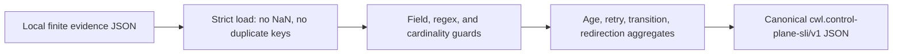

# Bounded control-plane SLI receipts

## Decision

`scripts/ci/control_plane_sli_receipt.py` builds one canonical
`cwl.control-plane-sli/v1` receipt from a local, finite-cardinality evidence
document. The builder does not query GitHub, interpret reviews, or acquire
mutation authority. Unknown fields, duplicate JSON members, non-finite
numbers, unbounded arrays, impossible recovery counts, and out-of-order or
future timestamps fail closed.

Receipts are operator evidence: they tell a buyer whether the org control
plane is executable now, deferred for a named wait reason, or carrying
operational-acceptance debt. They are not merge authority.

## Why the boundary exists

A commercial operator cannot see queue health from GitHub check rollups
alone. Waiting on review or Checks is not a coding stop, but the wait must
be named and aged. An unbounded or authority-bearing collector would turn
that observability surface into a second control plane.

CWE-807 (reliance on untrusted inputs in a security decision) is the
rejection reason for treating a receipt as merge or writer authority
(MITRE, 2026). Timestamps are canonical whole-second UTC RFC 3339 values
ending in `Z` (Internet Engineering Task Force, 2002).

## Trust-boundary sequence

Each arrow is fail-closed. A later stage does not repair an earlier
rejection.

## Verification contract

`tests/test_control_plane_sli_receipt.py` exercises a two-repository fixture,
strict JSON boundaries, impossible premature-stop recovery counts, and
timestamp canonicalization. The permanent quality workflow runs that suite
with 100% branch coverage, interrogate, compileall, and the full central
test suite on the exact pull-request head.

## References

Internet Engineering Task Force. (2002). *Date and time on the Internet:
Timestamps* (RFC 3339). https://www.rfc-editor.org/rfc/rfc3339

MITRE. (2026). *CWE-807: Reliance on untrusted inputs in a security
decision*. https://cwe.mitre.org/data/definitions/807.html
