# Exact-artifact SBOM attestation

Materialize accepts only exact SHA-256 pins or a bounded relative `-r` include; a lone `--require-hashes` line is not lock evidence.

## Trust boundary

The organization-owned reusable workflow signs only an already sealed, same-run evidence artifact. The caller seals its inner source/artifact identity before upload, then supplies the immutable GitHub Actions artifact ID, name, and digest returned by the upload as an outer transport receipt. The trusted workflow independently verifies that receipt before invoking `actions/attest@59d89421af93a897026c735860bf21b6eb4f7b26`.

The reusable workflow must also identify its **own** source independently of the caller. In a `workflow_call`, caller-oriented workflow context is not a trustworthy callee checkout ref. Both jobs therefore request a fresh GitHub Actions OIDC token with a fixed audience and accept the trusted verifier source only when the token reports all of the following: issuer `https://token.actions.githubusercontent.com`, a GitHub-hosted runner, `job_workflow_ref` equal to `ContextualWisdomLab/.github/.github/workflows/exact-artifact-sbom-attestation.yml@<FULL_SHA>`, and `job_workflow_sha` equal to the same 40-character lowercase hexadecimal commit. The token is fetched directly from GitHub's runner-provided OIDC endpoint with the runner-provided bearer credential; the workflow does not accept a caller-supplied JWT or source ref. The resolved callee SHA, not `github.workflow_sha`, is the only ref used to check out the trusted verifier.

The boundary has two jobs:

1. `verify-evidence-artifact` has `actions: read`, `contents: read`, and `id-token: write`. The OIDC permission is used only to resolve the called reusable workflow's immutable source identity before verifier checkout; this job has no attestation or artifact-metadata write authority. It then confirms the exact artifact ID, name, digest, workflow-run ID, expiry state, source repository, source SHA, six-file cardinality, SHA-256 handoff, strict JSON, CycloneDX specification 1.7 identity, and root distribution binding.
2. `attest-exact-artifacts` runs only after the first job succeeds and receives `actions: read`, `id-token: write`, `attestations: write`, `artifact-metadata: write`, and `contents: read`. It independently resolves the same called-workflow identity again. Before downloading or signing, it re-fetches the same artifact ID and rechecks the outer name, digest, workflow-run ID, expiry state, repository, and source SHA. It then downloads the same immutable artifact ID, repeats the data-only inner verification, and signs the exact wheel and source distribution separately.

Both jobs load the verifier from `ContextualWisdomLab/.github` at the exact SHA proven by the OIDC `job_workflow_ref` and `job_workflow_sha` claims, with persisted Git credentials disabled. Caller-controlled source is never checked out in the signing boundary. Downloaded files are treated as inert bytes: the workflow does not import, install, build, test, execute, source, or unpack them. Caller inputs enter shell steps only through explicitly named environment variables; they are never interpolated directly into a shell program.

The handoff contains exactly:

- one wheel;
- one CycloneDX 1.7 wheel SBOM;
- one source distribution;
- one CycloneDX 1.7 source-distribution SBOM;
- `source-identity.json`; and
- `checksums.sha256`.

The inner `source-identity.json` binds repository, exact source SHA, evidence artifact name, predicate/schema, wheel/sdist filenames and SHA-256 values, and both SBOM filenames and SHA-256 values. It deliberately does **not** contain the GitHub Actions artifact digest. That digest does not exist until after the six-file artifact is uploaded, so putting it inside one of the uploaded members would create a self-referential fixed-point requirement. `checksums.sha256` binds the other five files, and externally supplied file digests bind all six files including the checksum file itself. The post-upload artifact ID/name/digest remain an outer receipt and are verified against GitHub Actions metadata in both the read-only intake job and the credentialed signer job.

Each SBOM is strict RFC 8259 JSON: duplicate names, non-finite numbers, malformed UTF-8, and oversized control data fail closed. RFC 8259 forbids NaN and Infinity as JSON numbers (Bray, 2017); the verifier therefore rejects `parse_constant` values instead of accepting Python's default extension. Each CycloneDX document must have integer document version `1`, a deterministic RFC 4122 UUIDv5 serial derived from the exact filename and SHA-256 digest, and one root component of type `file`. That root component must name the exact distribution, carry exactly one `cwl:artifact:filename` property, and contain exactly one canonical SHA-256 hash record with no alternate algorithm or unreviewed fields.

## Exact-head lifecycle

```mermaid
flowchart LR
    A[Caller invokes reusable workflow by full commit SHA] --> B[Each trusted job obtains GitHub OIDC token]
    B --> C[job_workflow_ref and job_workflow_sha agree on exact central SHA]
    C --> D[Trusted verifier checkout from proven callee SHA]
    D --> E[Caller builds exact source SHA]
    E --> F[Caller creates wheel, sdist, two SBOMs]
    F --> G[Caller seals source identity and checksums]
    G --> H[Caller uploads exact six-file artifact]
    H --> I[GitHub returns artifact ID, name, digest]
    I --> J[Read-only outer metadata and inner data verification]
    J --> K[Credentialed job rechecks outer receipt]
    K --> L[Credentialed job repeats inner verification]
    L --> M[Wheel SBOM attestation]
    L --> N[Sdist SBOM attestation]
    M --> O[Online signer/predicate/source verification]
    N --> O
    O --> P[Sigstore bundles and trusted root export]
    P --> Q[README and deterministic SHA256SUMS]
    Q --> R[Offline verification artifact]
```



Before upload, a caller can construct the entire six-file handoff using its exact `source_repository`, 40-character `source_sha`, artifact name, filenames, file SHA-256 digests, CycloneDX schema URI, and SBOM predicate type. After upload, the caller passes the returned same-run artifact ID and artifact digest to the reusable workflow without rewriting `source-identity.json` or any checksum-bearing member. The workflow rejects a caller repository or source SHA that does not match the live GitHub run context and rejects an outer artifact receipt that does not match GitHub's same-run metadata.

The verifier emits deterministic compact JSON containing the verified source identity, predicate, schema, filenames, sizes, and hashes. It publishes the manifest atomically and rejects an output symlink.

## Offline verification

The signing job preserves both Sigstore bundles, a fresh `trusted_root.jsonl`, the deterministic verified-handoff manifest, a beginner-readable `README.md`, and a lexicographically ordered `SHA256SUMS` covering every offline-evidence file except the checksum manifest itself. Verify `SHA256SUMS` before passing any member to GitHub CLI.

An operator imports the distribution, its matching bundle, the trusted root, and GitHub CLI into the offline environment, then runs:

```bash
gh attestation verify path/to/distribution \
  --repo OWNER/REPOSITORY \
  --bundle path/to/attestation.json \
  --custom-trusted-root path/to/trusted_root.jsonl \
  --signer-repo ContextualWisdomLab/.github \
  --signer-workflow ContextualWisdomLab/.github/.github/workflows/exact-artifact-sbom-attestation.yml \
  --source-digest EXACT_SOURCE_SHA \
  --predicate-type EXPECTED_SBOM_PREDICATE
```

Generate a new trusted root whenever new signed material enters an offline environment. A previously exported root cannot reveal revocation or later key rotation that occurred after export.

## Incident recovery and rollback

1. Disable the caller release workflow without changing or deleting existing evidence.
2. Preserve the failed run ID, artifact ID, artifact digest, source SHA, verification output, attestation bundles, README, trusted root, and checksum manifest.
3. Determine whether the defect is in called-workflow identity resolution, build output, SBOM generation, the sealed handoff, outer receipt verification, trusted inner verification, signing, or offline packaging.
4. Revoke or delete an invalid GitHub attestation only after preserving a forensic copy and documenting affected consumers.
5. Correct the source or workflow through a protected pull request. Never overwrite a distribution while retaining its old filename or digest claim.
6. Rebuild from a new exact source SHA, generate new artifacts and SBOMs, and rerun the complete verification and attestation lifecycle.
7. Publish an incident note identifying invalid subjects, replacement subjects, and consumer actions.

Rollback means restoring a previously reviewed workflow version and producing new signed material. It does not mean reusing an old attestation for newly built bytes.

## Claims deliberately not made

- An SBOM attestation does not prove that the software is vulnerability-free, malware-free, correct, safe, or fit for a particular purpose.
- This workflow does not claim SLSA Build L3 (v1.2). It supplies a narrow SBOM authenticity and exact-subject binding control, not a complete build provenance level.
- CycloneDX conformance does not prove that the component inventory is complete or semantically correct.
- A valid signature does not make caller-provided predicate content trustworthy by itself; the trusted reusable workflow and verifier are the policy boundary.
- The OIDC source-identity check authenticates the called workflow Git source used for trusted checkout; it does not authenticate the caller's product evidence, which remains subject to the independent sealed-artifact checks.
- Offline verification cannot detect revocation or trusted-root rotation that happened after the trusted root was exported.
- `artifact-metadata: write` does not imply that a non-registry distribution has been published, deployed, or approved for release.

## References

Bray, T. (2017). *The JavaScript Object Notation (JSON) data interchange
format* (RFC 8259). Internet Engineering Task Force.
https://doi.org/10.17487/RFC8259

CycloneDX Core Working Group. (2025). *CycloneDX specification 1.7*. OWASP Foundation. https://cyclonedx.org/specification/overview/

GitHub. (2026). *OpenID Connect reference*. GitHub Docs. https://docs.github.com/en/actions/reference/security/oidc

GitHub. (2026). *Using OpenID Connect with reusable workflows*. GitHub Docs. https://docs.github.com/en/actions/how-tos/secure-your-work/security-harden-deployments/oidc-with-reusable-workflows

GitHub. (2026). *Using artifact attestations to establish provenance for builds*. GitHub Docs. https://docs.github.com/en/actions/how-tos/secure-your-work/use-artifact-attestations/use-artifact-attestations

GitHub. (2026). *Verifying attestations offline*. GitHub Docs. https://docs.github.com/en/actions/how-tos/secure-your-work/use-artifact-attestations/verify-attestations-offline

GitHub. (2026). *actions/attest* (Version 4.1.0) [Computer software]. https://github.com/actions/attest

Internet Engineering Task Force. (2005). *A universally unique identifier (UUID) URN namespace* (RFC 4122). RFC Editor. https://www.rfc-editor.org/rfc/rfc4122

Open Source Security Foundation. (2025). *SLSA specification version 1.2*. https://slsa.dev/spec/v1.2/

Sigstore Project. (2024). *Sigstore bundle format*. https://docs.sigstore.dev/about/bundle/