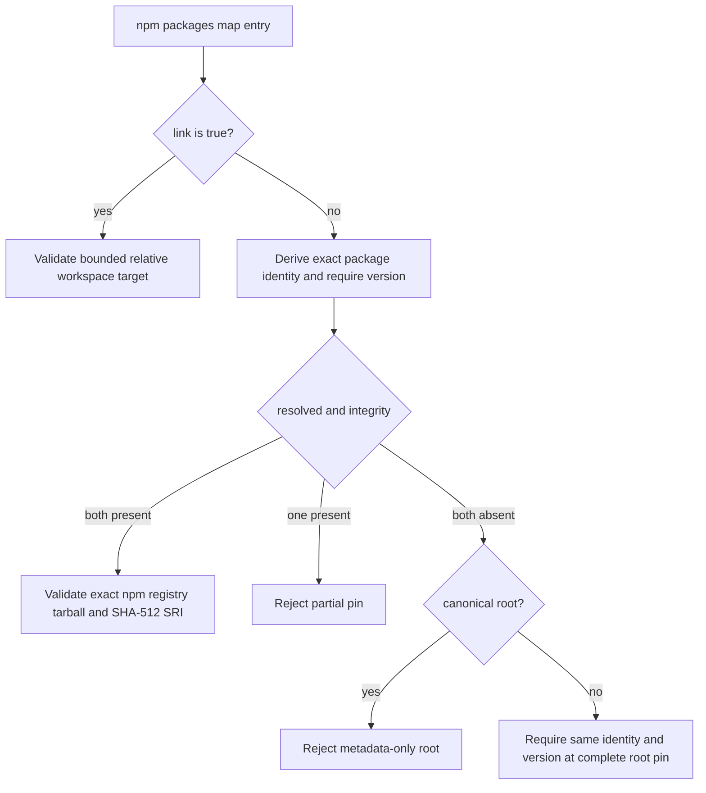

# npm nested metadata canonical pins

## Decision

Changed npm lockfiles remain untrusted pull-request inputs. The central JavaScript dependency materializer accepts npm lockfile versions 2 and 3 only after validating the complete `packages` map. Every non-link package location under a `node_modules` segment must declare a nonempty exact `version`.

npm can serialize a nested workspace or peer location with version and classification metadata while the canonical root location carries the registry tarball and integrity fields. The validator therefore distinguishes two safe forms:

1. **Complete pin** — the location declares both `resolved` and `integrity`. The URL must be an HTTPS tarball on `registry.npmjs.org` with no user information, explicit port, query, or fragment, and the integrity value must be one canonical SHA-512 SRI value.
2. **Metadata-only nested location** — the location declares neither field. It is accepted only when `node_modules/<package identity>` contains one complete pin for the same scoped or unscoped package identity and the exact same version.

A metadata-only canonical root entry is forbidden. A nested location that declares only one of `resolved` or `integrity` is also forbidden. Independently complete nested pins remain valid and may carry a different version because their bytes and integrity are self-contained.

## Package identity

Identity is derived from the path segments after the final `node_modules` component:

- unscoped: exactly one segment, such as `react`;
- scoped: exactly two segments, such as `@types/react-dom`.

Incomplete scopes, additional identity segments, absolute paths, backslashes, and parent traversal fail closed. Workspace links retain their separate bounded relative-link validation and never inherit registry metadata.

## Security and compatibility boundary

The policy does not repair, synthesize, or mutate lockfile metadata. It consumes the validated lock unchanged. It preserves the existing lockfile version, path, link, URL, origin, tarball suffix, and SHA-512 controls while admitting npm's location-keyed metadata representation.

RFC 3986 treats userinfo, port, query, and fragment as distinct URI
components that change origin identity (Berners-Lee et al., 2005). An
explicit `:443` is therefore not the same pin as the default HTTPS origin
`registry.npmjs.org`. The validator rejects every explicit port, not only
non-default ones.

The canonical root pin is a provenance anchor for metadata-only locations, not a claim that all nested locations share one physical installation. A complete nested record is validated independently and does not depend on the root. Missing roots, version drift, malformed identity, partial fields, alternate registries, malformed URLs, and invalid integrity remain blocking.

### Filesystem publication boundary

Materialized evidence is published only when the runtime supports descriptor-relative directory operations, descriptor-backed enumeration, `O_DIRECTORY`, `O_NOFOLLOW`, and no-follow `stat`. The capability gate runs before any output path is created. Missing output components are then created and opened one component at a time from a held filesystem-root descriptor; each name is inspected without following links, opened relative to its pinned parent, and matched to the observed device/inode identity. The final absolute pathname must still identify the pinned output directory before any project file is written.

Generated files use exclusive, no-follow descriptor-relative creation, forward-progress-checked writes, file and directory synchronization, and post-write identity and link-count validation. A project directory is fresh and owned exclusively by one attempt. If a later write fails, cleanup walks only that held project descriptor, removes only inode-matched regular files and directories in reverse publication order, and never follows links. A raced, replaced, symlink, or special entry is retained for forensic inspection; cleanup never masks the original fail-closed error or removes pre-existing operator entries outside the owned project directory.

## Verification

The permanent regression suite includes:

- the BandScope `apps/desktop/node_modules/@types/react-dom` peer-location shape;
- unscoped metadata-only locations;
- independently pinned nested versions;
- missing canonical pins;
- canonical-version mismatch;
- metadata-only canonical roots;
- partial `resolved` or `integrity` declarations;
- malformed scoped identities;
- nonempty-version enforcement;
- alternate origins and invalid SHA-512 SRI values; and
- all pre-existing npm path, link, lockfile, URL, and integrity cases;
- missing descriptor/no-follow capabilities before mutation;
- missing-ancestor and intermediate-ancestor replacement races;
- nested-directory and generated-file identity replacement; and
- late-write rollback that preserves pre-existing operator data.

The dedicated quality workflow runs Python 3.10 compilation, Python 3.14 focused tests with 100% production statement and branch coverage, 100% production docstrings, the complete central test suite, and a clean-patch check.

## Incident recovery and rollback

1. Preserve the exact pull-request head SHA, lockfile blob SHA, validation error, and quality-run ID.
2. Determine whether the changed lock is malformed or whether npm produced a supported metadata-only nested location.
3. Never add missing tarball or integrity values by hand. Regenerate the lock with the repository's pinned npm version when the lock is invalid.
4. Preserve any raced or unexpected filesystem entry for forensic inspection. Do not replace descriptor-relative cleanup with recursive pathname deletion.
5. Roll back only by restoring the prior fail-closed validator or another reviewed implementation that keeps the same identity, version, origin, integrity, no-follow publication, and owned-object cleanup controls.
6. Rerun the complete exact-head quality, security, and supply-chain matrix after any repair.

## References

Berners-Lee, T., Fielding, R., & Masinter, L. (2005). *Uniform Resource
Identifier (URI): Generic syntax* (RFC 3986). Internet Engineering Task
Force. https://doi.org/10.17487/RFC3986

npm, Inc. (2026). *package-lock.json*. npm Docs. https://docs.npmjs.com/cli/v11/configuring-npm/package-lock-json

npm, Inc. (2026). *npm install*. npm Docs. https://docs.npmjs.com/cli/v11/commands/npm-install

World Wide Web Consortium. (2016). *Subresource Integrity*. https://www.w3.org/TR/SRI/

Institute of Electrical and Electronics Engineers, & The Open Group. (2024). *The Open Group Base Specifications Issue 8: IEEE Std 1003.1-2024*. https://pubs.opengroup.org/onlinepubs/9799919799/

MITRE Corporation. (2026). *CWE-59: Improper link resolution before file access ('link following')* (Version 4.20). https://cwe.mitre.org/data/definitions/59.html

MITRE Corporation. (2026). *CWE-367: Time-of-check time-of-use (TOCTOU) race condition* (Version 4.20). https://cwe.mitre.org/data/definitions/367.html
