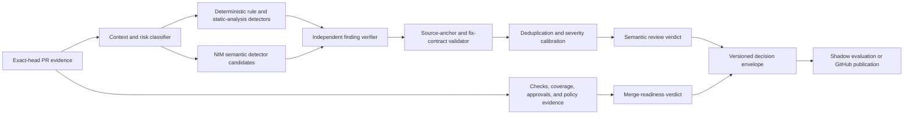

# OpenCode review quality evaluation and commercial parity program

Status: Proposed empirical baseline  
Date: 2026-08-08  
Owner: ContextualWisdomLab central review infrastructure

## Decision summary

The organization must not claim that OpenCode Review has reached CodeRabbit quality from prompt length, model reputation, test count, or a few agreeable reviews. Commercial parity is an empirical non-inferiority claim and requires current-head, expert-gold evidence.

The immediate decision is therefore to:

1. measure operational review yield from directly observed organization pull requests;
2. keep historical lifecycle evidence separate from head-matched defect precision and recall;
3. require a minimum of 50 head-matched pull requests and 50 expert-gold findings before parity can be evaluated;
4. compare the OpenCode candidate against CodeRabbit with Wilson 95% confidence intervals and a five-percentage-point non-inferiority margin;
5. require 100% recall for expert-labeled critical and high findings;
6. keep semantic review verdicts separate from CI and merge-readiness evidence;
7. operate the upgraded reviewer in shadow mode before it becomes a required merge gate.

The pilot result is intentionally **`INSUFFICIENT_EVIDENCE`**, not PASS or FAIL.

## Why a real-pull-request benchmark is mandatory

Synthetic mutation suites remain useful for deterministic regression tests, but they do not establish production review quality. Kumar, Bararia, and Raj (2026) reported that the best tested model achieved F1 = 0.847 on synthetic samples but only F1 = 0.066 on real pull requests, with performance deteriorating sharply as diff size increased. AACR-Bench likewise argues that raw pull-request comments are incomplete ground truth and uses AI-assisted, expert-verified repository-level annotation, increasing defect coverage by 285% over the original review records (Zhang et al., 2026).

ContextCRBench further shows that textual issue context and multi-stage filtering materially affect review performance; its industrial deployment reported a 61.98% improvement after adopting context-enriched, filtered evaluation data (Hu et al., 2025). The organization must therefore stratify by language, diff size, defect class, and repository context rather than evaluate only on tiny injected defects.

## Directly observed organization pilot

The pilot deliberately selected three pull requests for which both OpenCode and CodeRabbit left observable GitHub records. It is a lifecycle-yield study, not a randomized or head-matched experiment.

| Case | OpenCode observed output | CodeRabbit observed output |
|---|---|---|
| `ContextualWisdomLab/disksage#140` | Four completed reviews; all were coverage-evidence-only and repeated the same infrastructure blocker; no source defect finding | One completed review after one directly observed rate-limit event; one actionable source finding concerning the `publish = false` package-boundary check |
| `ContextualWisdomLab/EgressWeave#62` | Two completed reviews; both coverage-evidence-only; no source defect finding | One completed review; two actionable findings concerning intermediate-symlink handling and the positive regression contract |
| `ContextualWisdomLab/inkspan#65` | Two completed reviews; both coverage-evidence-only despite PR-supplied direct coverage evidence; no source defect finding | One completed review; five actionable findings covering documentation provenance, security-document synchronization, a memory claim, plan-count consistency, and a word-fixture budget |

Aggregate pilot result encoded in `benchmarks/opencode_review/pilot_baseline_v1.json`:

| Metric | OpenCode | CodeRabbit |
|---|---:|---:|
| Triggered attempts with observable records | 8 | 4 |
| Completed attempts | 8 | 3 |
| Directly observed rate-limited attempts | 0 | 1 |
| Actionable source findings | 0 | 8 |
| Infrastructure-only review rate | 100% | 0% |
| Duplicate review rate | 62.5% | 0% |
| Evidenced availability rate | 100% | 75% |

These values do **not** prove CodeRabbit precision, OpenCode recall, or head-to-head superiority because the reviews occurred on different lifecycle heads and the eight CodeRabbit comments have not yet been adjudicated against an independent expert-gold set. They do establish a serious operational failure mode: OpenCode can be continuously available while producing no semantic source-review value.

## Root-cause finding in the current central dispatch

The current `opencode-review-dispatch.yml` contains a deterministic path that constructs and posts a synthetic source-level `REQUEST_CHANGES` review when coverage evidence acquisition fails. The review points at a workflow line and describes missing coverage evidence, then exits before normal semantic review publication. This couples two distinct decisions:

- **semantic review verdict** — whether the changed source contains an actionable defect;
- **merge readiness** — whether required checks, coverage, approvals, and policy evidence permit merge.

Coverage evidence may legitimately block approval and merge readiness. It must not be transformed into a source-code defect. An unavailable evidence service is an infrastructure state, not proof that the changed implementation is wrong.

The production repair is blocked from this pull request because active central branches are already changing the same large dispatch file. Concurrently replacing the file through the contents API would race another writer and risk discarding their exact-head work. The safe follow-up must land after those writers integrate or relinquish the file.

## Target commercial architecture



The versioned decision envelope must carry at least:

```json
{
  "schema_version": "1.0",
  "review_verdict": "APPROVE | REQUEST_CHANGES | COMMENT",
  "merge_readiness": "READY | BLOCKED | UNKNOWN",
  "findings": [],
  "evidence_manifest": {},
  "model_attempts": [],
  "quality_policy_version": "..."
}
```

### Detector and verifier separation

BitsAI-CR uses a RuleChecker followed by a ReviewFilter and reports 75.0% precision in production, supporting an explicit detector–verifier split rather than trusting raw model comments (Sun et al., 2025). RovoDev similarly describes a context-aware, quality-checked review pipeline and reports that 38.7% of comments led to subsequent code changes, alongside a 30.8% reduction in pull-request cycle time (Tantithamthavorn et al., 2026).

The verifier must reject a candidate finding unless it contains:

- a changed or connected source path and positive line;
- a concrete trigger condition;
- an observable impact;
- a source-backed root cause;
- a minimal fix direction;
- an exact regression target or verification command when the repository exposes one;
- no duplication of an already published current-head finding.

For executable defects, fix-guided verification can compare the original and proposed repair against trusted tests. This must remain a filter, not a general proof mechanism, because documentation, architecture, and untested behavior may have no executable oracle. Overcorrection research warns that more detailed prompts can increase false rejection and recommends verification of proposed fixes before accepting model judgments (Jin & Chen, 2026).

### Adaptive test-time compute

The upgraded reviewer should not run a fixed multi-agent topology on every pull request. Fugu, Conductor, and TRINITY support task-adaptive orchestration rather than uniform model use:

- Fugu learns query-adaptive agentic scaffolds and exposes a quality-prioritized deeper mode for hard tasks (Tang et al., 2026).
- Conductor learns targeted instructions and communication topologies, including recursive test-time scaling, over heterogeneous worker pools (Nielsen et al., 2025).
- TRINITY dynamically assigns Thinker, Worker, and Verifier roles to selected models over multiple turns (Xu et al., 2025).

For CWL review, a bounded risk classifier should allocate compute as follows:

| Pull-request class | Default topology |
|---|---|
| Small documentation or metadata change with no behavioral claim | one detector, deterministic cross-file checks, one verifier only if a finding exists |
| Ordinary source change | one semantic detector plus independent verifier |
| Security, auth, data-loss, migration, numerical, or workflow-trust change | diverse parallel detectors, role-specific verifier, evidence synthesis |
| Large or cross-service change | decomposition by execution path, independent repository-context retrieval, multiple specialist detectors, final verifier |
| Ambiguous finding or detector disagreement | bounded recursive verification; no automatic publication when the budget is exhausted |

Speed is not the primary objective. The optimization target is expert-gold defect utility under a bounded, reproducible compute budget.

## Benchmark schema and metrics

Two evaluation modes are deliberately separated.

### `historical_lifecycle`

Used for operational telemetry when reviews are not head-matched or expert-adjudicated. It reports:

- triggered, completed, and rate-limited attempts;
- availability and Wilson interval;
- infrastructure-only review rate;
- duplicate review rate;
- actionable findings per completed review;
- source-backed, line-anchored, fix-direction, and regression-direction rates.

It must never output precision, recall, F1, or a parity PASS.

### `head_matched_gold`

Used only when both reviewers inspect the same immutable head and independent experts label all relevant defects. It additionally reports:

- true positives, false positives, and false negatives;
- precision, recall, and F1;
- Wilson 95% intervals for precision and recall;
- critical/high recall;
- reference-relative non-inferiority.

A repeated model finding mapped to the same gold finding counts as a false positive after the first match. An unmatched actionable finding is a false positive. An unlabeled or unresolved expert disagreement must be excluded from the finalized gold set rather than silently assigned to either reviewer.

## Commercial release gates

OpenCode Review may be described as CodeRabbit-level only when all conditions hold on a frozen benchmark version:

1. at least 50 head-matched pull requests and 50 expert-gold findings;
2. at least four primary languages, all three diff-size buckets, and security, correctness, performance, workflow, documentation, and data-model defect classes;
3. candidate precision lower 95% Wilson bound at least CodeRabbit point precision minus 0.05;
4. candidate recall lower 95% Wilson bound at least CodeRabbit point recall minus 0.05;
5. critical/high recall = 1.00;
6. source-backed and positive-line anchored rate = 1.00 for published blockers;
7. infrastructure-only source findings = 0;
8. duplicate current-head publication rate < 0.05;
9. schema-valid output rate = 1.00;
10. no stale-head evidence accepted;
11. resolution rate, reviewer rejection rate, and time-to-resolution tracked in shadow mode;
12. expert audit finds no credential, tenant, prompt-injection, or evidence-provenance regression.

The reference is a moving commercial product. Benchmark snapshots must record CodeRabbit configuration, profile, path instructions, timestamp, and exact output records. CodeRabbit supports configurable review profiles, path-specific instructions, incremental and full-review modes, and Autofix; comparisons must therefore state which features and settings were enabled rather than treating the product as a single immutable model.

## Rollout

1. **Baseline** — land the scorer, pilot, CI, and doctoring with parity unavailable.
2. **Collection** — sample pull requests by language, size, and risk; capture both reviewers on identical heads.
3. **Expert gold** — use two independent reviewers plus adjudication; retain evidence and disagreement reason.
4. **Shadow orchestration** — run detector/verifier topologies without publishing blockers.
5. **Calibration** — tune routing, verifier thresholds, duplicate suppression, and severity mapping against the development split only.
6. **Frozen test** — evaluate once on a held-out benchmark; publish confidence intervals and failures.
7. **Limited publication** — publish comments but keep OpenCode non-required; measure developer resolution and rejection.
8. **Required gate** — enable only after the commercial release gates remain satisfied for two consecutive frozen benchmark versions.

## Security and governance

- Pull-request content and reviewer comments are untrusted input.
- The evaluator must never execute model-proposed commands or fixes.
- Trusted execution receipts must be produced outside the model process.
- Secrets, cookies, tokens, and raw credential material must not enter model context or benchmark artifacts.
- `NVIDIA_NIM_API_KEY` remains the credential for scheduled OpenCode model calls; this program does not introduce `COPILOT_GITHUB_TOKEN`.
- Benchmark artifacts require exact repository, pull request, head SHA, base SHA, reviewer configuration, timestamp, and source receipt provenance.
- Human reviewer identities may be pseudonymized in exported benchmark data while preserving adjudication independence.
- Benchmark and model-routing changes require versioned doctoring and a new held-out evaluation.

## References

Hu, R., Wang, X., Wen, X.-C., Zhang, Z., Jiang, B., Gao, P., Peng, C., & Gao, C. (2025). *Benchmarking LLMs for fine-grained code review with enriched context in practice* (arXiv:2511.07017). arXiv. https://doi.org/10.48550/arXiv.2511.07017

Jin, H., & Chen, H. (2026). *Are LLMs reliable code reviewers? Systematic overcorrection in requirement conformance judgement* (arXiv:2603.00539). arXiv. https://arxiv.org/abs/2603.00539

Kumar, S. P., Bararia, S., & Raj, K. (2026). *Bigger isn't always better: A comparative evaluation of LLMs for automated code review* (arXiv:2606.15689). arXiv. https://arxiv.org/abs/2606.15689

Nielsen, S., Cetin, E., Schwendeman, P., Sun, Q., Xu, J., & Tang, Y. (2025). *Learning to orchestrate agents in natural language with the Conductor* (arXiv:2512.04388). arXiv. https://arxiv.org/abs/2512.04388

Sun, T., Xu, J., Li, Y., Yan, Z., Zhang, G., Xie, L., Geng, L., Wang, Z., Chen, Y., Lin, Q., Duan, W., & Sui, K. (2025). BitsAI-CR: Automated code review via LLM in practice. In *Proceedings of the 33rd ACM International Conference on the Foundations of Software Engineering*. https://doi.org/10.1145/3696630.3728552

Tang, Y., Cetin, E., Xu, J., Sun, Q., Nielsen, S., Richard, V., Goda, H., Tymchenko, I., Nguyen, N., Lee, H., Ashiga, M., Kotyan, S., Kuroki, S., & Clanuwat, T. (2026). *Sakana Fugu technical report* (arXiv:2606.21228). arXiv. https://arxiv.org/abs/2606.21228

Tantithamthavorn, K., Zou, Y., Wong, A., Gupta, M., Wang, Z., Buller, M., Jiang, R., Watson, M., Jeong, M., Chen, K., & Wu, M. (2026). *RovoDev Code Reviewer: A large-scale online evaluation of LLM-based code review automation at Atlassian* (arXiv:2601.01129). arXiv. https://arxiv.org/abs/2601.01129

Xu, J., Sun, Q., Schwendeman, P., Nielsen, S., Cetin, E., & Tang, Y. (2025). *TRINITY: An evolved LLM coordinator* (arXiv:2512.04695). arXiv. https://arxiv.org/abs/2512.04695

Zhang, L., Yu, Y., Yu, M., Guo, X., Zhuang, Z., Rong, G., Shao, D., Shen, H., Kuang, H., Li, Z., Wang, B., Zhang, G., Xiang, B., & Xu, X. (2026). *AACR-Bench: Evaluating automatic code review with holistic repository-level context* (arXiv:2601.19494). arXiv. https://arxiv.org/abs/2601.19494
