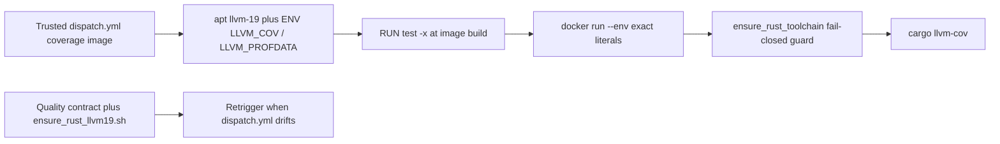

# OpenCode Rust coverage LLVM runtime boundary

## Decision

The trusted OpenCode coverage sandbox binds Rust coverage to the reviewed LLVM
19 executables shipped by Debian's `llvm-19` package:

- `LLVM_COV=/usr/bin/llvm-cov-19`
- `LLVM_PROFDATA=/usr/bin/llvm-profdata-19`

These are producer-selection constants, not caller-selectable configuration and
not a substitute for package-hash or signature integrity verification. The
trusted default-branch workflow `.github/workflows/opencode-review-dispatch.yml`
installs `llvm-19` in the digest-pinned coverage image, asserts both paths are
executable at image build, passes the same literals through isolated
`docker run --env`, and fails closed in `ensure_rust_toolchain` before
`cargo llvm-cov`. The readable extract `scripts/ci/ensure_rust_llvm19.sh`
mirrors those literals for local operators and the permanent quality contract.
A pull-request-head script cannot be the enforcement point: the coverage
sandbox measures untrusted current-head source.

Updating the trusted workflow changes the independent review-dispatch Git blob
SHA pin in `tests/test_pr_review_autofix_nvidia_nim_contract.py`. That pin
separates the write-capable autofix worker from the read-only reviewer. LLVM
provisioning may update the pin in the same reviewed change; it must not move
review-agent credentials, model keys, or approval authority.

The runtime MUST NOT fall back to unversioned `llvm-cov` or `llvm-profdata`, a
host-runner tool, a pull-request-selected path, or a dynamically downloaded LLVM
binary. Missing, changed, or non-executable reviewed paths are coverage-evidence
failures rather than reasons to measure a different toolchain.

## Why the boundary exists

`cargo-llvm-cov` is a wrapper around Rust's LLVM source-based coverage and
explicitly supports `LLVM_COV` and `LLVM_PROFDATA` as path overrides. Its
current project documentation states that the LLVM tools must be compatible
with the LLVM version used by `rustc`. Allowing ambient `PATH` discovery would
therefore make a runner-image change capable of silently changing the coverage
producer.

Debian bookworm currently publishes the versioned `llvm-19` package from
`llvm-toolchain-19`; Debian package file inventories expose versioned LLVM 19
tool entry points including `llvm-cov-19`. Pinning the reviewed executable names
inside the trusted image converts that mutable ambient dependency into an
explicit contract that can be checked before source execution.

The `test -x` build and runtime checks confirm the selected producer is present
and executable. They do not hash, sign, or attest the Debian package. Package
integrity remains a separate control (image digest, apt repository
authentication, and future rustc/LLVM compatibility review).

## Trust-boundary sequence

Each arrow is fail-closed. A later stage does not repair or broaden an earlier
stage's failed trust decision. The helper is a contract extract, not a
substitute for the trusted workflow.

## Security and supply-chain implications

The reviewed paths are fixed in trusted central workflow source. Pull-request
content cannot choose an LLVM package, executable path, download origin, or
runtime environment value. The existing coverage sandbox retains
`--network=none`, credential/Git isolation, exact-head/base materialization,
and the separately checksum-pinned `cargo-llvm-cov` archive.

Debian's `llvm-19` / `llvm-toolchain-19` packaging redistributes LLVM under
Apache-2.0 with the LLVM exception (and related NCSA/MIT notices in the Debian
copyright file). That SPDX basis authorizes the package in this
permissive-license org; it is not an integrity receipt for a specific binary
build.

This binding narrows reproducibility risk but does not by itself attest Debian's
whole package supply chain or prove a future Rust toolchain is compatible with
LLVM 19. A future rustc or base-image upgrade must revalidate compatibility and
update this contract, its tests, CHANGELOG, and the review-dispatch blob SHA in
one reviewed change rather than silently selecting a different binary.

## Failure and recovery

If the image cannot install `llvm-19`, either reviewed executable is missing or
non-executable, the runtime value differs from the literal reviewed path, or the
isolated runtime does not receive the values, Rust coverage fails closed before
`cargo llvm-cov` runs. The operator should identify whether the failure comes
from Debian package availability, the pinned image/base generation, a central
workflow regression, or an intentional Rust/LLVM compatibility change.

Do not work around the failure by removing the exact-value check, using an
unversioned executable, adding network access to the PR runtime, accepting a
host-provided path, or moving the guard into a current-head script. A deliberate
toolchain migration requires fresh authoritative compatibility evidence and the
same RED→GREEN exact-head verification sequence.

## Verification contract

`tests/test_opencode_rust_coverage_toolchain_contract.py` proves that:

1. the trusted coverage image installs `llvm-19` and binds both reviewed
   executable paths with build-time `test -x` checks;
2. the isolated `docker run` receives the same exact literals;
3. `ensure_rust_toolchain` requires live `LLVM_COV` / `LLVM_PROFDATA` equality
   and executability before coverage;
4. the helper extract hardcodes the same paths and rejects caller overrides;
5. the helper exits `1` when the reviewed env is unbound or retargeted;
6. the permanent quality workflow watches
   `.github/workflows/opencode-review-dispatch.yml` so a later blob rewrite
   cannot drop the guard without retriggering this contract; and
7. `REVIEW_DISPATCH_BLOB_SHA` in
   `tests/test_pr_review_autofix_nvidia_nim_contract.py` equals
   `git hash-object` of the trusted dispatch workflow, so a producer-pin
   rewrite cannot leave the independent review-dispatch identity stale. The
   hourly NVIDIA NIM quality workflow does not watch `opencode-review-dispatch.yml`,
   so this pairing check lives in the workflow that does.

The permanent quality workflow runs on Python 3.14, checks out the exact PR head,
executes the focused contract, compiles the test, and applies `git diff --check`.
Repository security and supply-chain workflows remain separate authorities.

## Next operator action

If Rust coverage fails with the LLVM 19 path message, rebuild the trusted
coverage image from current default-branch `opencode-review-dispatch.yml` and
confirm the Docker boundary still passes `LLVM_COV=/usr/bin/llvm-cov-19` and
`LLVM_PROFDATA=/usr/bin/llvm-profdata-19`. Do not merge a change that removes
those literals without a replacement producer pin, blob-SHA update, and this
doctoring record.

## References

Debian Project. (2026). *File list of package llvm-19*. Debian Packages.
Retrieved August 16, 2026, from
https://packages.debian.org/bookworm/amd64/llvm-19/filelist

Debian Project. (2026). *Package: llvm-19 (1:19.1.7-3~deb12u1), bookworm*.
Debian Packages. Retrieved August 16, 2026, from
https://packages.debian.org/bookworm/llvm-19

Debian Project. (n.d.). *Copyright file for llvm-toolchain-19*. Debian
copyright archive. Retrieved August 16, 2026, from
https://metadata.ftp-master.debian.org/changelogs/main/l/llvm-toolchain-19/llvm-toolchain-19_19.1.7-3~deb12u1_copyright

Souppaya, M., Scarfone, K., & Dodson, D. (2022). *Secure software development
framework (SSDF) version 1.1: Recommendations for mitigating the risk of
software vulnerabilities* (NIST Special Publication 800-218). National
Institute of Standards and Technology. https://doi.org/10.6028/NIST.SP.800-218

Taiki Endo. (2026). *cargo-llvm-cov: Cargo subcommand to use LLVM source-based
code coverage*. GitHub. Retrieved August 16, 2026, from
https://github.com/taiki-e/cargo-llvm-cov
