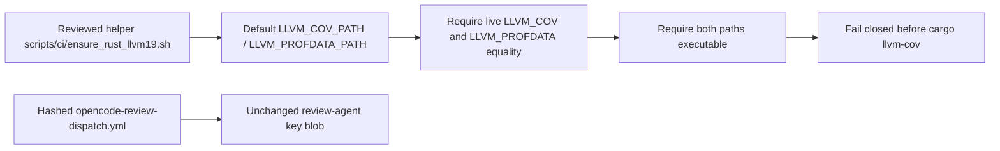

# OpenCode Rust coverage LLVM runtime boundary

## Decision

The trusted OpenCode coverage sandbox binds Rust coverage to the reviewed LLVM
19 executables shipped by Debian's `llvm-19` package:

- `LLVM_COV=/usr/bin/llvm-cov-19`
- `LLVM_PROFDATA=/usr/bin/llvm-profdata-19`

These are compatibility and trust-boundary constants, not caller-selectable
configuration. The reviewed helper `scripts/ci/ensure_rust_llvm19.sh` binds both
exact paths and fails closed unless the live `LLVM_COV` / `LLVM_PROFDATA`
values match and are executable before Rust coverage evidence is admitted. The
independent OpenCode review-dispatch workflow stays byte-for-byte so the
review-agent key system is not rewritten to carry this runtime check.

The runtime MUST NOT fall back to unversioned `llvm-cov` or `llvm-profdata`, a
host-runner tool, a pull-request-selected path, or a dynamically downloaded LLVM
binary. Missing, changed, or non-executable reviewed paths are coverage-evidence
failures rather than reasons to measure a different toolchain.

## Why the boundary exists

`cargo-llvm-cov` is a wrapper around Rust's LLVM source-based coverage and
explicitly supports `LLVM_COV` and `LLVM_PROFDATA` as path overrides. Its
current project documentation states that the LLVM tools must be compatible
with the LLVM version used by `rustc`. Allowing ambient `PATH` discovery would
therefore make a runner-image change capable of silently changing the coverage
producer.

Debian bookworm currently publishes the versioned `llvm-19` package from
`llvm-toolchain-19`; Debian package file inventories expose versioned LLVM 19
tool entry points including `llvm-cov-19`. Pinning the reviewed executable names
inside the image converts that mutable ambient dependency into an explicit
contract that can be checked before source execution.

## Trust-boundary sequence

Each arrow is fail-closed. A later stage does not repair or broaden an earlier
stage's failed trust decision.

## Security and supply-chain implications

The reviewed paths are fixed in trusted central workflow source. Pull-request
content cannot choose an LLVM package, executable path, download origin, or
runtime environment value. The existing coverage sandbox retains
`--network=none`, credential/Git isolation, exact-head/base materialization,
and the separately checksum-pinned `cargo-llvm-cov` archive.

This binding narrows reproducibility risk but does not by itself attest Debian's
whole package supply chain or prove a future Rust toolchain is compatible with
LLVM 19. A future rustc or base-image upgrade must revalidate compatibility and
update this contract, its tests, and CHANGELOG in one reviewed change rather
than silently selecting a different binary.

## Failure and recovery

If the image cannot install `llvm-19`, either reviewed executable is missing or
non-executable, the runtime value differs from the literal reviewed path, or the
isolated runtime does not receive the values, Rust coverage fails closed before
`cargo llvm-cov` runs. The operator should identify whether the failure comes
from Debian package availability, the pinned image/base generation, a central
workflow regression, or an intentional Rust/LLVM compatibility change.

Do not work around the failure by removing the exact-value check, using an
unversioned executable, adding network access to the PR runtime, or accepting a
host-provided path. A deliberate toolchain migration requires fresh authoritative
compatibility evidence and the same RED→GREEN exact-head verification sequence.

## Verification contract

`tests/test_opencode_rust_coverage_toolchain_contract.py` proves that:

1. the helper defaults both reviewed LLVM 19 executable paths;
2. the helper requires live `LLVM_COV` / `LLVM_PROFDATA` equality with those
   paths;
3. the helper requires both paths to be executable and exits `1` on mismatch;
4. the helper does not mention unversioned `llvm-cov` / `llvm-profdata`; and
5. every exact path named by the permanent quality workflow's
   `pull_request.paths` filter resolves to a repository file, including the
   helper, preventing a dangling documentation trigger from becoming
   invisible debt.

The permanent quality workflow runs on Python 3.14, checks out the exact PR head,
executes the focused contract, compiles the test, and applies `git diff --check`.
Repository security and supply-chain workflows remain separate authorities.

## References

Debian Project. (2026). *Package: llvm-19 (1:19.1.7-3~deb12u1), bookworm*.
Debian Packages. Retrieved August 10, 2026, from
https://packages.debian.org/bookworm/llvm-19

Debian Project. (2026). *File list of package llvm-19*. Debian Packages.
Retrieved August 10, 2026, from
https://packages.debian.org/bookworm/amd64/llvm-19/filelist

Taiki Endo. (2026). *cargo-llvm-cov: Cargo subcommand to use LLVM source-based
code coverage*. GitHub. Retrieved August 10, 2026, from
https://github.com/taiki-e/cargo-llvm-cov
