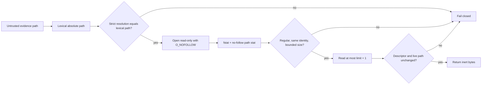

# Descriptor-safe native peer evidence reads

## Decision

The native-extension peer-evidence gate treats pytest logs, project metadata, changed-file inventories, and check-run receipts as hostile data. Every accepted local evidence file is therefore read through one bounded regular-file routine that rejects symlinked lexical paths, final-component links, non-regular files, oversized metadata, descriptor/path identity changes, and growth during the read.

## Trust boundary

The routine does not execute, import, extract, install, or otherwise interpret caller artifacts. It returns bytes only after the opened descriptor and the live lexical path agree. The subsequent UTF-8, TOML, pytest-log, and JSON parsers remain responsible for their own syntax and semantic validation.

`O_NOFOLLOW` protects the final component on operating systems that expose it. Strict lexical-versus-resolved comparisons protect parent components and are repeated after the bounded read. Descriptor metadata is sampled before and after reading, and the live no-follow path identity is compared with the descriptor. Any `OSError`, unsupported path, race signal, size overflow, or metadata change produces no evidence rather than a partial result.

## Verification

The permanent Python 3.10/3.14 quality workflow executes realistic regressions for:

- a regular file reached through a symlinked parent directory;
- a read that exceeds the declared byte limit after initial metadata validation;
- descriptor metadata replacement during the read;
- live path identity replacement;
- post-open lexical path retargeting; and
- an unchanged bounded regular file.

The helper remains subject to 100% production statement and branch coverage, 100% public docstrings, Python compilation, and the complete pre-existing hostile-input suite.

## Operational failure and rollback

A new rejection is intentionally fail-closed. Operators should first determine whether the evidence producer emitted a symlink, replaced a file concurrently, exceeded the documented limit, or wrote after sealing. The producer must publish a fresh immutable evidence snapshot; the gate must not raise its limits or weaken identity checks to consume unstable input.

Rollback means reverting the entire descriptor-safety commit and its regressions together. Removing only a regression, adding a broad exception, following links, or accepting a changed descriptor is prohibited because it would make a passing check weaker than the documented trust boundary.

## Claims deliberately not made

This control does not attest the semantic truth of a repository check, prove that a compiled extension is safe, or convert deferred source-only coverage into passing evidence. It only prevents mutable filesystem aliases and bounded-read races from becoming trusted input to the separately enforced exact-head peer-check policy.

## References

Institute of Electrical and Electronics Engineers, & The Open Group. (2024). *open — Open a file*. In *The Open Group Base Specifications, Issue 8 (IEEE Std 1003.1-2024)*. https://pubs.opengroup.org/onlinepubs/9799919799/functions/open.html

MITRE. (n.d.). *CWE-59: Improper link resolution before file access ('link following')*. CWE. Retrieved August 7, 2026, from https://cwe.mitre.org/data/definitions/59.html

MITRE. (n.d.). *CWE-367: Time-of-check time-of-use (TOCTOU) race condition*. CWE. Retrieved August 7, 2026, from https://cwe.mitre.org/data/definitions/367.html

Python Software Foundation. (2026). *os — Miscellaneous operating system interfaces*. Python 3.14.6 documentation. https://docs.python.org/3.14/library/os.html
