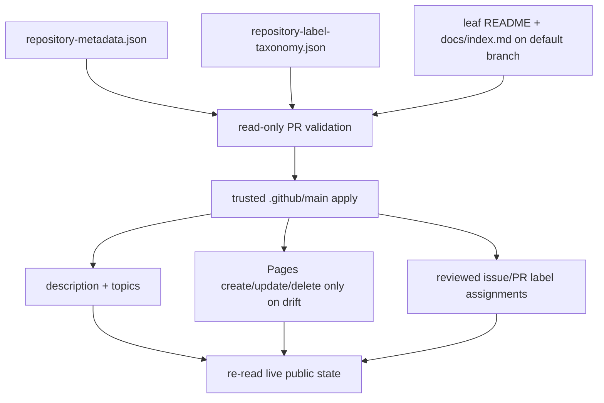

# Repository public-surface reconciliation — operational baseline

**Recorded:** 2026-09-01
**Owner:** `ContextualWisdomLab/.github`
**Applies to:** repository descriptions, topics, GitHub Pages settings, exact Ask DeepWiki preconditions, and reviewed issue/PR label assignments.

## Problem statement

The organization had repository-facing state that could be observed but not consistently mutated through the connected GitHub client. Concrete examples included an internal-instruction-heavy CalendarWeave description, empty repository topics on new bounded-context repositories, `has_pages=false` despite reviewed documentation sources being prepared, and label normalization that depended on one-off manual edits. A second central metadata PR also created a competing writer for the same control-plane responsibility.

Reporting those limitations was insufficient because the organization already owns a central GitHub Actions/API control plane. The repair therefore belongs in `.github`: reviewed desired state plus a least-privilege, protected-default-branch reconciliation path.

## Current control loop

The fleet loop is deliberately non-blocking. Every repository or label assignment is attempted independently, failures are collected, and the process reports the aggregate only after reachable siblings have been tried. A missing leaf README badge or Pages source therefore blocks only that repository's public-setting mutation.

## Safety and authority

- Pull-request validation has `contents: read` only. It cannot mutate repository settings or labels.
- Apply runs only when the scheduled workflow is executing from trusted `refs/heads/main` after validation.
- The apply step uses the established maintainer credential rather than widening the ordinary workflow token.
- Repository README changes remain leaf-owned. The central reconciler verifies exact DeepWiki linkage but never fabricates or silently edits customer-facing README copy.
- Pages publication is conditional on `docs/index.md` being present on the live default branch. A branch-only source or PR is not publication evidence.
- Pages is convergent: absent sites are created, drifted legacy `/docs` sites are updated, disabled sites are deleted, and already-correct sites receive no write.
- Label reconciliation adds and removes only taxonomy-managed labels through individual label endpoints, so unrelated labels added by people or automation are not replaced from a stale snapshot.
- Scheduled reconciliation does not cancel an active apply, preventing a replacement run from abandoning a partially updated fleet.
- The repository's control-plane contract intentionally exposes no branch-selectable `workflow_dispatch` entrypoint; remediation follows the trusted default-branch schedule and normal rerun/governance paths.

## Desired-state fleet in this increment

The repository metadata manifest currently covers 13 repositories selected because their public-surface work already has a concrete leaf source or active writer: `CalendarWeave`, `ConceptWeave`, `context-graph-contracts`, `ThreadWeave`, `RankWeave`, `fast-mlsirm`, `EgressWeave`, `psychometrics-commons`, `keyverse`, `OriginWeave`, `accounting-information-platform`, `pg-erd-cloud`, and `clearfolio`.

EgressWeave and Psychometrics Commons joined the original fleet after their exact-cased DeepWiki badges and bounded `docs/index.md` Pages sources reached their protected default branches. The five later entries are deliberately declared before live convergence only when an owned leaf lane exists for the required badge and Pages source. Until those prerequisites reach each protected default branch, that repository fails closed while sibling repositories remain independently actionable.

The explicit label assignments now cover 19 evidence-backed targets: `.github#1582`, `CalendarWeave#1`, `ConceptWeave#1`, `context-graph-contracts#20`, `RankWeave#40`, `fast-mlsirm#1717`, `EgressWeave#231`, `psychometrics-commons#442`, `contextual-orchestrator#994`, `contextual-orchestrator#1003`, `appguardrail#1077`, `naruon#1513`, `LineageWeave#908`, `ContextualWisdomLab.github.io#203`, `TEPP#435`, `semantic-data-portal#72`, `Orgmetra#160`, `learning-interoperability-contracts#1`, and `noema#530`. The assignment reconciler preserves richer repository-local labels such as priority, status, and `type: maintenance` when those labels are outside the managed semantic set.

## Verification contract

A central source commit is not completion. After protected integration and apply, the operator or automation must re-read each affected repository and verify:

1. the live description equals reviewed desired state;
2. live topics equal the normalized desired set;
3. the default-branch README carries the exact linked DeepWiki badge when requested;
4. `docs/index.md` exists on the live default branch before Pages is enabled;
5. the live Pages configuration uses the intended default branch and `/docs`, and the published site is reachable before publication is claimed;
6. reviewed issue/PR targets carry the desired managed label while unrelated labels remain intact.

GitHub's current REST Pages contract supports `build_type` values `legacy` and `workflow`, and branch sources with `/` or `/docs`. The reconciler selects `legacy` plus `/docs` because the leaf repositories currently declared in this manifest provide reviewed static documentation sources rather than a separate custom Pages workflow. Repositories with a meaningful Actions-backed Pages deployment must not be enrolled until the central contract is extended to model and preserve that deployment mode.

## Known integration boundary

Until a desired-state extension is merged through normal governance, its settings reconciliation cannot run from trusted `.github/main`; leaf PRs whose badge or Pages source is still branch-only also remain repository-local precondition blockers. These are integration states, not reasons to stop independent repository work. The same run should continue classifying labels, preparing other leaf public surfaces, and re-checking earlier lanes when exact-head evidence becomes available.
