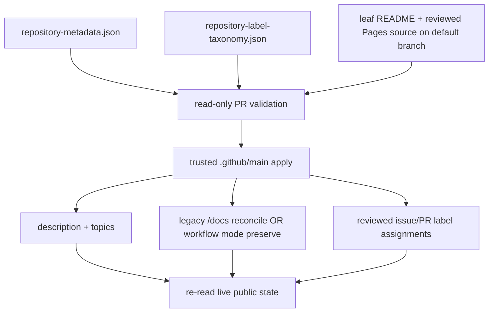

# Repository public-surface reconciliation — operational baseline

**Recorded:** 2026-09-02
**Owner:** `ContextualWisdomLab/.github`
**Applies to:** repository descriptions, topics, GitHub Pages settings, exact Ask DeepWiki preconditions, and reviewed issue/PR label assignments.

## Problem statement

The organization had repository-facing state that could be observed but not consistently mutated through the connected GitHub client. Concrete examples included an internal-instruction-heavy CalendarWeave description, empty repository topics on new bounded-context repositories, `has_pages=false` despite reviewed documentation sources being prepared, and label normalization that depended on one-off manual edits. A second central metadata PR also created a competing writer for the same control-plane responsibility.

Reporting those limitations was insufficient because the organization already owns a central GitHub Actions/API control plane. The repair therefore belongs in `.github`: reviewed desired state plus a least-privilege, protected-default-branch reconciliation path.

## Current control loop

The fleet loop is deliberately non-blocking. Every repository or label assignment is attempted independently, failures are collected, and the process reports the aggregate only after reachable siblings have been tried. A missing leaf README badge or Pages source therefore blocks only that repository's public-setting mutation.

## Safety and authority

- Pull-request validation has `contents: read` only. It cannot mutate repository settings or labels.
- Apply runs only when the scheduled workflow is executing from trusted `refs/heads/main` after validation.
- Apply obtains repository-settings write authority only from the protected `repository-metadata-maintenance` environment's dedicated `CWL_REPOSITORY_METADATA_TOKEN`. The job fails before either mutation lane starts when that credential is absent and never falls back to `PR_REVIEW_MERGE_TOKEN`, reviewer/model/provider credentials, or a widened pull-request `GITHUB_TOKEN`. External provisioning remains owned by issue #1579; source integration alone does not prove the secret exists.
- Repository README changes remain leaf-owned. The central reconciler verifies exact DeepWiki linkage but never fabricates or silently edits customer-facing README copy.
- Pages has two reviewed deployment modes. Legacy mode requires a regular `docs/index.md` file on the live default branch. Explicit `pages_mode: workflow` requires a regular `.github/workflows/pages.yml` file **and** an already-configured live Pages site whose `build_type` is `workflow`.
- Workflow mode is preserve-only: the reconciler does not create or convert the Pages configuration. Missing Pages, a legacy live configuration, a directory at the required workflow path, or a missing workflow file fails before description/topic/Page writes for that repository.
- Legacy Pages remains convergent: absent sites are created, drifted legacy `/docs` sites are updated, disabled sites are deleted, and already-correct sites receive no write.
- Contents API source checks require a single object with `type: file`; directory objects and directory listings do not count as reviewed source evidence.
- Label reconciliation adds and removes only taxonomy-managed labels through individual label endpoints, so unrelated labels added by people or automation are not replaced from a stale snapshot.
- Pull-request metadata validation uses the stable `repository-metadata-reconcile-${{ github.ref }}` concurrency lineage and cancels superseded PR runs. The scheduled trusted apply remains non-cancellable, preventing a replacement heartbeat from abandoning a partially updated fleet.
- The repository's control-plane contract intentionally exposes no branch-selectable `workflow_dispatch` entrypoint; remediation follows the trusted default-branch schedule and normal rerun/governance paths.

## Desired-state fleet in this increment

The repository metadata manifest covers 22 reviewed repositories whose public-surface work has a concrete leaf source or active writer: `CalendarWeave`, `ConceptWeave`, `context-graph-contracts`, `ThreadWeave`, `RankWeave`, `fast-mlsirm`, `EgressWeave`, `psychometrics-commons`, `keyverse`, `OriginWeave`, `accounting-information-platform`, `pg-erd-cloud`, `clearfolio`, `DiagramWeave`, `semantic-data-portal`, `contextual-orchestrator`, `mhtml-etl-gateway`, `PolicyWeave`, `supply-chain-control-plane`, `learning-management-platform`, `learning-content-studio`, and `learning-record-store`.

EgressWeave and Psychometrics Commons joined the original fleet after their exact-cased DeepWiki badges and bounded `docs/index.md` Pages sources reached their protected default branches. Later entries are deliberately declared before live convergence only when an owned leaf lane exists for the required badge and Pages source. Until those prerequisites reach each protected default branch, that repository fails closed while sibling repositories remain independently actionable. The `semantic-data-portal` desired description also removes the internal `(PRD/TRD draft implementation)` qualifier rather than propagating it to the customer-facing repository surface.

The newest cohort has explicit source ownership: `ContextualWisdomLab/PolicyWeave#1` carries its exact-cased badge and `docs/index.md`; `ContextualWisdomLab/supply-chain-control-plane#1` carries its exact badge and bounded Pages landing source on the active product writer; `ContextualWisdomLab/learning-management-platform#1` owns the product-first README badge and `docs/index.md`; `ContextualWisdomLab/learning-content-studio#1` now owns its product-first README, exact badge, Apache-2.0 grant, and the `docs/index.md` content folded from closed child #8; and `ContextualWisdomLab/learning-record-store#1` now owns its product-first README, exact badge, Apache-2.0 grant, and the bounded `docs/index.md` content folded from closed child #7. The closed child PRs retain discussion history but no longer own unique public-surface source. Their live repositories still report Pages disabled until protected integration and trusted reconciliation complete.

An Actions-backed repository is not enrolled merely because `pages_mode: workflow` is supported. Enrollment requires an explicit reviewed manifest change after the repository's standard Pages workflow and live `build_type: workflow` configuration both exist. This preserves the deployment architecture of repositories such as ScopeWeave instead of silently rewriting them to legacy `/docs`.

The original baseline now contains 47 active evidence-backed label targets after successor reconciliation: `ContextualWisdomLab/.github#1579`, `ContextualWisdomLab/.github#1582`, `ContextualWisdomLab/.github#1622`, `ContextualWisdomLab/.github#1625`, `ContextualWisdomLab/.github#1634`, `ContextualWisdomLab/CalendarWeave#1`, `ContextualWisdomLab/ConceptWeave#1`, `ContextualWisdomLab/context-graph-contracts#20`, `ContextualWisdomLab/RankWeave#40`, `ContextualWisdomLab/fast-mlsirm#1717`, `ContextualWisdomLab/EgressWeave#231`, `ContextualWisdomLab/psychometrics-commons#434`, `ContextualWisdomLab/contextual-orchestrator#994`, `ContextualWisdomLab/appguardrail#1077`, `ContextualWisdomLab/naruon#1513`, `ContextualWisdomLab/LineageWeave#908`, `ContextualWisdomLab/ContextualWisdomLab.github.io#203`, `ContextualWisdomLab/TEPP#435`, `ContextualWisdomLab/semantic-data-portal#72`, `ContextualWisdomLab/Orgmetra#160`, `ContextualWisdomLab/learning-interoperability-contracts#1`, `ContextualWisdomLab/noema#530`, `ContextualWisdomLab/bandscope#1125`, `ContextualWisdomLab/saju-caldav#44`, `ContextualWisdomLab/OriginWeave#274`, `ContextualWisdomLab/semantic-data-portal#90`, `ContextualWisdomLab/clearfolio#538`, `ContextualWisdomLab/pg-erd-cloud#1046`, `ContextualWisdomLab/DiagramWeave#34`, `ContextualWisdomLab/keyverse#103`, `ContextualWisdomLab/mhtml-etl-gateway#56`, `ContextualWisdomLab/j-planner#2`, `ContextualWisdomLab/learning-record-store#1`, `ContextualWisdomLab/learning-content-studio#1`, `ContextualWisdomLab/learning-management-platform#1`, `ContextualWisdomLab/metering-billing-platform#157`, `ContextualWisdomLab/PolicyWeave#1`, `ContextualWisdomLab/supply-chain-control-plane#1`, `ContextualWisdomLab/governance-risk-compliance#65`, `ContextualWisdomLab/pingora-gateway#4`, `ContextualWisdomLab/life-os#211`, `ContextualWisdomLab/scopeweave#651`, `ContextualWisdomLab/newsdom-api#782`, `ContextualWisdomLab/kaefa#81`, `ContextualWisdomLab/kaefa#82`, `ContextualWisdomLab/aFIPC#261`, and `ContextualWisdomLab/nonnest2#115`. Closed/superseded `psychometrics-commons#442`, `contextual-orchestrator#1003`, `accounting-information-platform#45`, and `scopeweave#650` are no longer active taxonomy targets: their valid public-surface deltas are respectively preserved by current `psychometrics-commons#434`, `contextual-orchestrator#994`, `accounting-information-platform#37`, and `scopeweave#651`. Closed superseded child PRs `learning-record-store#7`, `learning-content-studio#8`, `metering-billing-platform#175`, and `keyverse#127` are likewise absent because their unique deltas were folded into authoritative parent writers. Historical labels on retired PRs are not erased by this desired-state change. The assignment reconciler preserves richer repository-local labels such as priority, status, and `type: maintenance` when those labels are outside the managed semantic set.

## Verification contract

A central source commit is not completion. After protected integration and apply, the operator or automation must re-read each affected repository and verify:

1. the live description equals reviewed desired state;
2. live topics equal the normalized desired set;
3. the default-branch README carries the exact linked DeepWiki badge when requested;
4. the selected Pages source is a regular file on the protected default branch: `docs/index.md` for legacy mode or `.github/workflows/pages.yml` for workflow mode;
5. legacy mode uses the intended default branch and `/docs`; workflow mode remains `build_type: workflow` and is never converted by the reconciler;
6. the Pages status is `built`, its URL remains under `https://contextualwisdomlab.github.io`, and the published endpoint returns non-empty content before publication is claimed;
7. reviewed issue/PR targets carry the desired managed label while unrelated labels remain intact.

GitHub's current REST Pages contract supports `build_type` values `legacy` and `workflow`, and branch sources with `/` or `/docs`. Current fleet entries use the legacy `/docs` contract unless an entry explicitly declares `pages_mode: workflow`. The workflow mode exists to preserve a repository whose deployment is already owned by a reviewed GitHub Actions workflow; it is not a central creation/conversion mechanism.

## Workflow-mode operating procedure

1. Land and review the repository-local `.github/workflows/pages.yml` on the protected default branch.
2. Verify the repository already has a live GitHub Pages configuration with `build_type: workflow`; do not rely on a PR branch or workflow filename alone.
3. Add `"pages": true` and `"pages_mode": "workflow"` to the exact-cased repository record in `config/repository-metadata.json`.
4. Let read-only PR validation prove manifest/source contracts and stale-run cancellation without settings write authority.
5. After protected integration, let the trusted scheduled reconciler preflight the workflow source and live deployment mode **before** any description/topic mutation.
6. Re-read description, topics, Pages build type, publication status, organization-owned URL, and non-empty live content. Only then mark the public-surface reconciliation complete.
7. If the workflow file disappears or the live deployment changes away from `workflow`, the repository fails closed and receives no metadata write until the repository-owned deployment boundary is repaired.

## Known integration boundary

Immediately before this branch correction, protected `.github/main@7d707b8abbb8a3fed95d0efe4121ed9b4f76bb2a` still carried the 22-repository metadata desired state and the older 39-target label operating record. This branch keeps the metadata fleet unchanged and expands the label taxonomy plus its operator record. The taxonomy/test/operator-record files must integrate together; a source-only assignment change with stale operating prose is not acceptable evidence. Current successor reconciliation removes retired writers from the active taxonomy rather than preserving stale issue identities solely to keep a count stable. After integration, live label convergence must still be re-read through GitHub before completion is claimed. Issue #1579 remains open for the separate protected-environment repository-settings credential; this label-taxonomy correction neither assumes nor broadens that credential.
