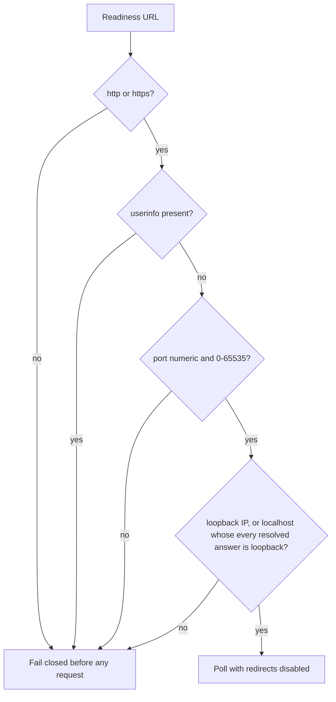

# Sandboxed web readiness loopback boundary

## Decision

`sandboxed_web_e2e.py` opens a readiness URL only after
`require_loopback_readiness_url` accepts it. The accepted destinations are
literal `localhost` (a trailing FQDN dot is stripped) or an address that
Python's standard-library `ipaddress` module classifies as loopback after
IPv4-mapped IPv6 addresses are unwrapped. Literal `localhost` is then
resolved; every A/AAAA answer must itself be loopback, so a poisoned hosts
file cannot smuggle a public address through the name allowlist. Redirects
remain disabled.

This supports the complete IPv4 loopback block, including `127.0.0.2`, and
IPv6 `::1`. It rejects `0.0.0.0`, `::`, public hosts, `.localhost`
subdomains, cloud-metadata link-local addresses, missing hosts, and
userinfo-confused URLs such as `http://user@127.0.0.1/`. A mapped public
address such as `::ffff:8.8.8.8` cannot pass merely because it is IPv6.

The port is validated too: `urllib.parse.ParseResult.port` is accessed inside
the same function and any `ValueError` it raises (a non-numeric port such as
`:abc`, or one out of the 0-65535 range) is re-raised as the same `ValueError`
class every other check here raises. Before this, a malformed port passed the
URL parse silently — the port was never read — and only surfaced later as an
uncaught `http.client.InvalidURL` from the HTTP client itself, a class that is
neither `ValueError` nor `urllib.error.URLError` and so was not covered by
`main`'s exit-125 handling. It now fails the same way every other rejection
in this function does, before any request opens.

The boundary uses the standard library rather than a second address table.
It therefore follows the runtime's maintained special-purpose definitions and
keeps one fail-closed validation point before any network request. Do not add
individual non-loopback exceptions.

This successor lands the same buyer-facing repair as ContextualWisdomLab/.github#1244
on current `main` and keeps Strix classifier ownership out of the SSRF slice
(unlike ContextualWisdomLab/.github#1313).

## Operator next action

Point `--backend-ready-url` and `--frontend-ready-url` at the sandboxed
service on loopback. If readiness fails with `URL cannot target external
hostname`, replace the destination with `http://127.0.0.1:<port>/...` or
`http://[::1]:<port>/...` instead of opening the firewall or adding a
hostname exception.

## Verification

The regression exercises literal `localhost`, a trailing-dot `localhost.`,
`127.0.0.1`, another address in `127.0.0.0/8`, IPv6 `::1`, mapped loopback
`::ffff:127.0.0.1`, an unspecified address, a `.localhost` subdomain, a
public hostname, the common cloud metadata address, mapped public IPv6,
userinfo, a missing host, poisoned localhost resolution (public A,
mapped public AAAA, empty answers, resolver errors, and non-IP answers), and
a non-numeric or out-of-range port on both the backend and frontend readiness
URL, checked through both the standalone function and a `main()` run that
never starts a service. The existing no-redirect test continues to prove that
an allowed readiness endpoint cannot redirect the poller across the boundary.

## References

Berners-Lee, T., Fielding, R., & Masinter, L. (2005). *Uniform Resource
Identifier (URI): Generic syntax* (RFC 3986). Internet Engineering Task
Force. https://doi.org/10.17487/RFC3986

Cotton, B., Vegoda, L., Bonica, R., & Haberman, B. (2013). *Special-purpose
IP address registries* (RFC 6890). Internet Engineering Task Force.
https://doi.org/10.17487/RFC6890

Internet Assigned Numbers Authority. (2026). *IANA IPv4 special-purpose
address registry*. Retrieved August 25, 2026, from
https://www.iana.org/assignments/iana-ipv4-special-registry/iana-ipv4-special-registry.xhtml

OWASP Foundation. (n.d.). *Server-side request forgery prevention cheat
sheet*. Retrieved August 25, 2026, from
https://cheatsheetseries.owasp.org/cheatsheets/Server_Side_Request_Forgery_Prevention_Cheat_Sheet.html

Python Software Foundation. (2026). *ipaddress — IPv4/IPv6 manipulation
library*. https://docs.python.org/3/library/ipaddress.html
