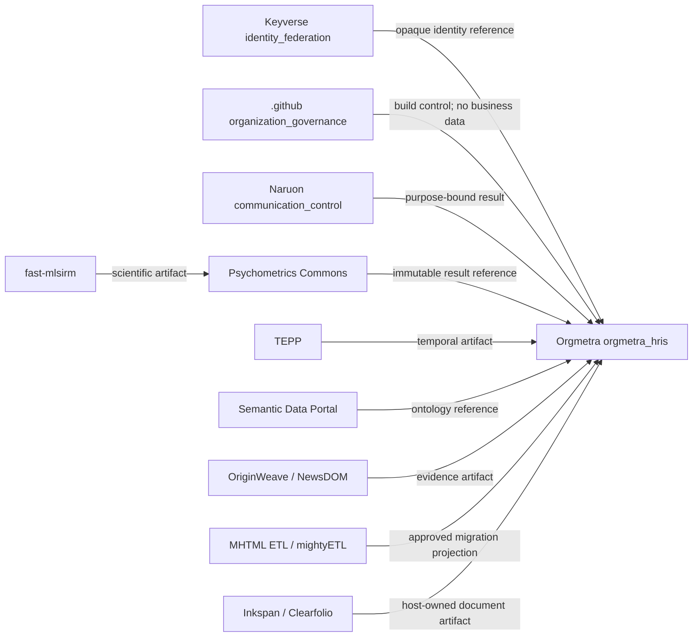
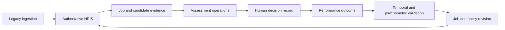

# CWL Repository Responsibility Catalogue v1

Status: **Active pull request**

Owner: `ContextualWisdomLab/.github`

## Customer outcome

A buyer, operator, or product team can identify the **authoritative data owner**, provider, consumer, contract version, permitted data flow, maturity, and **customer next action** for every reviewed integration. The catalogue prevents architecture prose from silently becoming a deployed claim.

## Federated responsibility map

The central repository owns vocabulary, schemas, catalogue validation, and compatibility rules. Leaf repositories own product semantics, operational databases, migrations, runtime adapters, and release evidence.

## Security product boundaries

| Canonical repository | Catalogue service | Authoritative capabilities | Current integration evidence |
| --- | --- | --- | --- |
| `ContextualWisdomLab/EgressWeave` | `egress_policy` | SSRF/DNS-rebinding-safe outbound HTTP, redirect isolation, exact authority policy, and immutable package/SBOM release evidence | A provider-neutral in-process package. Host adapters remain host-owned; no leaf consumer is declared until source contains a versioned adoption. |
| `ContextualWisdomLab/appguardrail` | `sast_governance` | Reusable detector, finding, remediation, and assurance evidence contracts | A build/operations provider. External-engine provenance remains distinct and no product runtime is claimed as a consumer. |
| `ContextualWisdomLab/wardnet` | `security_operations` | WAF/IDS event handling, monitor/block control, AI SOC response, and SIEM export evidence | An independent security gateway. Coraza, Suricata, and enterprise SIEM deployments remain explicit adapters rather than invented built-ins. |
| `ContextualWisdomLab/keyverse` | `identity_federation` | Identity credentials, OIDC/federation, SCIM provisioning, and account lifecycle/unification | A provider to the versioned Orgmetra identity-reference relationship; identity state remains Keyverse-owned. |

The canonical product names are `EgressWeave`, `appguardrail`, `wardnet`, and
`keyverse`. Historical aliases such as `waf-ids-ai-soc`, `VibeSec`, and
`cwl-idp` are not catalogue repository identities. Capability identifiers are
globally unique in the reviewed catalogue so two products cannot silently claim
the same authority. A provider-facing contract does not create a consumer edge:
`consumer_repositories` and relationship records are added only when matching
versioned integration source exists.

## Ownership rules

- Each business fact has one authoritative data owner.
- **Direct cross-repository SQL** is forbidden.
- Credentials are never copied between products.
- An inferred lineage, LLM judgment, retrieval score, or psychometric artifact cannot directly update an authoritative fact.
- Raw PII is not broadcast. Restricted workflows use opaque references, workload identity or delegated authorization, purpose-bound dereference, field-level protection, retention, revocation, and immutable audit.
- Blanket masking is not required where it would break legitimate work; access is constrained by tenant, actor, purpose, resource, field, and decision context.

## Closed-loop enterprise value chain

Every transition carries a versioned contract and provenance. A green schema alone does not authorize the transition.

## Maturity ledger

The controlled states are `planned`, `accepted_architecture`, `active_pr`, `implemented_on_protected_main`, `released`, `deprecated`, and `superseded`. An issue, PRD, prototype, branch, or conversation cannot be labelled `implemented_on_protected_main`. A relationship cannot exceed the maturity of its provider or consumer.

## Purpose-bound privacy without blanket masking

Restricted operational data remains at its authoritative service. Consumers receive the minimum permitted reference or projection. Dereference requires workload identity or explicit user delegation, tenant/purpose/resource authorization, field-level controls, access and export audit, retention, and revocation. Raw PII event broadcast and credential copying are fail-closed catalogue violations.

## CSAP and SOC 2 engineering evidence

This catalogue supports engineering evidence; it does not claim certification. Each production relationship should link identity and access control, data classification and purpose, encryption, retention/deletion, audit, availability and recovery, change-management approval, exact contract version, SBOM/provenance, and incident rollback evidence. These mappings assist CSAP and SOC 2 readiness while certification remains a separate assessment.

## Customer next action

Each service and relationship records next actions for success, rejection, timeout, duplicate, and rollback. Product copy must expose the relevant action rather than a terminal status alone. A rejected request preserves authoritative state. A duplicate returns the previous idempotent outcome. A timeout follows a bounded retry/escalation policy. Rollback restores the last verified contract or projection without restoring unsafe coupling.

## Rollout

1. Integrate the event/command envelopes normally and retain them as the authority.
2. Integrate this catalogue from the resulting protected `main` without changing its semantic contracts.
3. Add one leaf capability manifest at a time; add a provider/consumer pair only when both endpoints contain the matching versioned contract.
4. Require exact-version tests in both repositories, purpose authorization, idempotency, degraded-mode, provenance, and rollback evidence.
5. Promote maturity only after protected-main or released evidence exists.

## Rollback

Rollback deprecates or supersedes a catalogue version. Released schemas are immutable. Rollback never restores direct SQL, credential copying, raw PII broadcast, or a false maturity claim.
