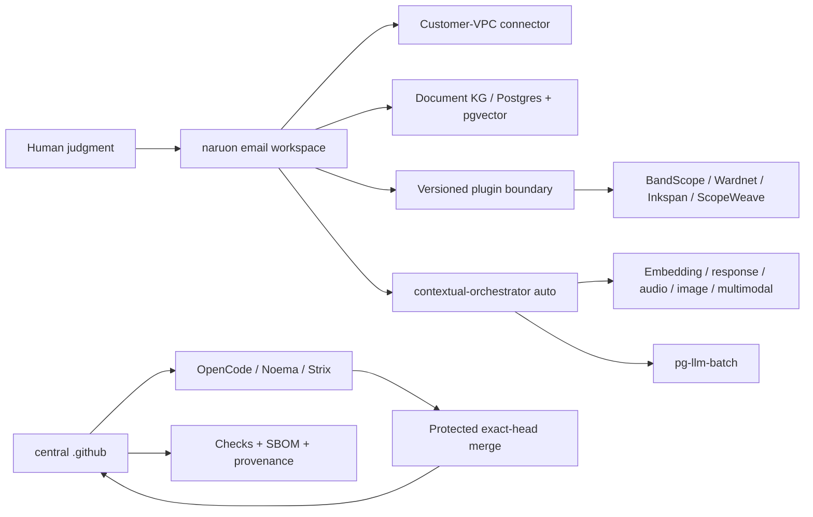

# Product and Technical Gap Baseline

작성 기준일: **2026-08-26 10:35 KST**
대상: **ContextualWisdomLab/.github** 중앙 거버넌스·자동화 레포지터리와 이를 소비하는 naruon 생태계
현재 보호된 `main`: `826b92394c63deb6981c3a8d16a724d71f85a0d7`
현재 열린 PR 수: **107** (아래 표에 이 스냅샷의 전체 목록 포함; live API 재수집)

이 문서는 제품·기술·운영 Gap을 현재 문서와 현재 GitHub 상태에 묶어 두는 기준선이다. 새 작업은 먼저 이 문서의 Gap ID를 PR 설명과 테스트 증거에 연결하고, PR의 정확한 exact HEAD·Checks·리뷰를 다시 수집한 뒤 구현한다. 표의 상태는 작성 시점의 관측값이므로, 병합 판단에는 재사용하지 않는다. 이 인벤토리는 스냅샷이며 merge authorization이 아니다.

## 1. 근거와 범위

### 1.1 우선순위가 높은 근거

1. [CWL Master Context](CWL-MASTER-CONTEXT.md): naruon의 이메일 우선 플랫폼 경계, DIKW, no-ask 자동 해결, 다층·다중소속·시간·프라이버시 원칙.
2. [naruon #974](https://github.com/ContextualWisdomLab/naruon/pull/974): `docs/planning/naruon-platform-plan.md`를 추가한 병합된 제품/IA/User Story/Use Case/Architecture 기준. 이슈 트래커의 Phase 항목은 ContextualWisdomLab/naruon#975–#980.
3. [GitHub Project #1](https://github.com/orgs/ContextualWisdomLab/projects/1): 로드맵의 live source of truth. 이 문서는 live project board의 상태를 반영하며, 세부 항목 수는 project에서 직접 확인한다.
4. 중앙 ADR·doctoring·계약 문서: [ADR-0002](adr/0002-product-technical-gap-baseline.md), [hourly NVIDIA NIM autofix](doctoring/hourly-nvidia-nim-autofix.md), [Strix cryptography override](../requirements-strix-ci-overrides.txt), [trusted uv lock materialization](doctoring/trusted-uv-lock-materialization.md), [product-technical gap doctoring](doctoring/product-technical-gap-baseline.md).

### 1.2 제품 경계

구매자가 사는 핵심 결과는 “흩어진 enterprise context를 판단 가능한 구조로 만들고, 사람이 다음 행동을 승인할 수 있게 하는 것”이다. naruon은 이메일 호스트나 전자결재 시스템이 아니라 고객 소유 데이터에 연결되는 이메일 workspace/platform이다. 중앙 `.github`은 제품 기능을 대신 소유하지 않고, 정확한 HEAD·리뷰·Checks·증거·변경권한을 보장하는 control plane이다.

핵심 구매 여정은 다음과 같다.

1. 여러 계정·언어의 이메일에서 한 사건의 thread와 sender 의미를 찾는다.
2. 변경된 일정의 최신 truth, 변경 이력, commitment status와 충돌을 계산한다.
3. work/personal/project/band 등 겹치는 norm group을 선택하고, 관계·권한·유효기간을 고려한다.
4. 다른 context에는 필요한 결과(예: unavailable)만 consent·audit 기반으로 공개한다.
5. 사람은 근거·confidence·다음 행동을 보고 예외만 수정하며, 외부 writeback은 승인한다.

### 1.3 Same-session open/close delta

스냅샷은 작성 시점의 open/close delta만 기록한다. 병합 판단에는 재사용하지 않는다.

## 2. PRD / TRD / UML 기준

### 2.1 PRD acceptance

| ID | 구매자가 확인할 결과 | 수용 증거 |
|---|---|---|
| PRD-01 | “이 메일/보낸 사람이 왜 중요한가”를 찾는다 | hybrid retrieval, sender ontology, source segment provenance |
| PRD-02 | 일정 이동과 RSVP/commitment 충돌을 놓치지 않는다 | temporal event history, confirmed > tentative > desired weighting, conflict test |
| PRD-03 | 같은 사람이 여러 조직·팀·밴드에 소속되어도 권한을 뒤섞지 않는다 | reified relationship, multi-membership/norm-group resolution, ecological-fallacy test |
| PRD-04 | private reason을 노출하지 않고 필요한 consequence만 공유한다 | consented minimal-disclosure bridge, audit trail, revocation test |
| PRD-05 | 사용자가 모델 선택을 관리하지 않아도 품질을 우선해 자동 라우팅한다 | contextual-orchestrator `auto`, capability-before-cost, unpriced-is-not-free evidence |
| PRD-06 | 결과를 독립 제품 또는 naruon plugin으로 동일하게 쓴다 | versioned manifest/API, connector contract, standalone/submodule integration test |

### 2.2 TRD target

- **Platform plane:** naruon web/API, customer-VPC connector, Postgres/pgvector document KG, plugin registry, versioned extension points.
- **Evidence/control plane:** central `.github`, OpenCode/Noema/Strix, exact-source and exact-head binding, bounded hourly loops, no credential fallback, protected merge.
- **AI plane:** contextual-orchestrator adaptive routing; role별 reasoning effort, workflow depth, recursion, decomposition, verifier/synthesis를 quality evidence에 따라 배분. Fugu, Conductor, TRINITY를 근거로 단일 모델 라우팅과 심층 다중 에이전트 오케스트레이션 사이에서 계산량을 배분한다. 속도는 최적화 목표가 아니다.
- **Compute plane:** 수리과학·psychometrics의 계산 레이어와 속도·안정성·보안이 핵심인 hot path는 Rust 경계를 우선 검토하며, GPU/CPU multithreading과 낮은 context switching을 benchmark로 입증한다. Python/JS는 orchestration/API adapter로 제한한다.
- **Data plane:** 모든 영속 객체는 두 단어 이상 `snake_case`를 기본으로 하고 3NF를 지키며, 관계·evidence·confidence·validity·disclosure를 별도 정규화한다. Hot partition 대비를 스키마에 둔다.
- **UX plane:** UI 제품만 Figma/Storybook/design token을 사용한다. 중앙 `.github`는 UI 없는 인프라 레포지터리이므로 Figma File ID는 **N/A (UI scope 없음)**이며, UI PR은 별도 ADR에 실제 File ID를 기록한다. UI-owning 저장소는 Storybook scene/edge-case event, Accessibility, Touch & Interaction, Performance, Style Selection, Layout & Responsive, Typography & Color, Animation, Forms & Feedback, Navigation Patterns, Charts & Data를 정의·검토·반영·적용·감사한다.

### 2.3 UML-level dependency

## 3. Gap register

우선순위는 구매자 체감, 보안/증거 위험, 선행 의존성 순서다.

| Gap ID | 현재 관측 | 구매자 영향 | 우선 구현/검증 |
|---|---|---|---|
| G-01 | 열린 PR은 107개다. metadata 상태는 BLOCKED=17, BEHIND=16, DIRTY=74, draft 13개다. 상태는 independent exact-head approval과 terminal required Checks를 자동으로 의미하지 않는다 | 안전하게 출시할 변경과 대기 중인 변경을 구별할 수 없다 | PR마다 current head, reviews, threads, required Checks, merge-result tree를 재수집하고 보호 조건 미충족이면 merge하지 않는다 |
| G-02 | protected `main`은 `826b92394c63deb6981c3a8d16a724d71f85a0d7`이며, BEHIND/stacked PR의 predecessor evidence를 current-head approval로 승격할 수 없다 | 리뷰가 호출돼도 승인 증거가 생성되지 않아 자동화가 멈춘다 | current-head quality와 OpenCode/Noema/Strix를 재실행하고, exact SHA·run ID·review commit SHA를 한 receipt에 묶는다 |
| G-03 | #1297은 Strix per-repository serialization과 scoped close cleanup을, #1345/#1347은 normalizer/web-E2E 안전성을 다룬다. 각 PR의 provider failure와 source/control-plane failure를 구분해야 한다 | 취약점 0건이어도 CI 인프라 결함이 보안 결과처럼 보이고 큐가 막힌다 | D3 교착 증거를 별도 수집하고, vulnerability marker는 절대 neutralize하지 않으며, 정상 gate 복구 후 exact-head hosted evidence를 재생성한다 |
| G-04 | 107개 live PR 중 16개가 BEHIND, 74개가 DIRTY이고 caller/Strix PR이 제품 기능보다 앞서 쌓였다 | 제품 개발 속도가 queue hygiene에 소모되고 stacking 순서가 불명확하다 | product/ownership boundary별로 stack을 재정렬하고, 오래된 PR은 current main으로 normal restack 후 변경 범위를 검증한다 |
| G-05 | ecosystem contract/catalog PR은 존재하지만 naruon의 실제 plugin 소비·standalone 실행·connector round-trip 증거가 제한적이다 | 구매자는 “연결 가능” 문서와 실제 설치 가능한 제품을 구별할 수 없다 | manifest/version compatibility, command/event envelope, consumer smoke, rollback/upgrade contract를 조직 유관 레포에서 증명한다 |
| G-06 | ContextualWisdomLab/naruon#974와 Project #1은 제품 목표를 정의하지만 E1/E2/E3의 live implementation evidence가 이 중앙 레포에 없다 | 이메일 검색·일정 충돌이라는 killer workflow가 문서에만 머문다 | naruon에서 thread/sender ontology → temporal commitment/conflict → human correction slice를 독립 PR로 delivery한다. 소유 저장소는 naruon이다 |
| G-07 | multi-level/multi-membership/temporal 관계 원칙은 master context에 있으나 모든 소비 저장소의 schema/API가 동일한 reified relationship contract를 보장하는지는 미확인이다 | 개인 단위로 집계하거나 전역 권한을 적용하는 atomistic/ecological fallacy 위험이 남는다 | relationship, membership, norm_group, validity window, evidence, confidence, disclosure를 정규화하고 cross-context golden tests를 만든다 |
| G-08 | embedding·DOM·sender/receiver 의미 단위 chunking과 base64 image의 OCR/object/tag/position-index 설계가 ecosystem contract에 부분적으로만 반영됐다 | 검색은 되지만 실제 그림 위치와 의미를 회수하지 못해 편집·문서·메일 업무가 끊긴다 | semantic unit chunk schema와 image asset/region/ocr/tag embeddings를 별도 entity로 설계하고 source offset/DOM path를 보존한다 |
| G-09 | 100% coverage/docstring은 중앙 PR별로 증거가 있으나 조직 소비 레포의 frontend interaction/i18n/design-token/real-data accuracy 증거가 동일한지 미확인이다 | “green CI”가 실제 고객 시나리오 정확성을 보장하지 않는다 | domain-specific RMSE/reproducibility/audio/visual/browser acceptance와 edge matrix를 required evidence로 만든다 |
| G-10 | math/psychometrics의 Rust+GPU/CPU path와 시간·다층·다중소속 모델은 fast-mlsirm/psychometrics-commons 등 제품 레포의 책임이다 | 계산 정확도·성능·모델 해석 가능성을 Python glue만으로 보장할 수 없다 | Rust core, GPU/CPU benchmark, temporal/multilevel/multiple-membership fixtures, RMSE/recovery/ablation을 제품 PR에 묶는다 |
| G-11 | UI가 있는 제품의 Figma/Storybook inventory와 token/interaction/i18n 테스트는 중앙 control plane에서 소유할 수 없다. Figma File ID는 이 저장소 ADR에서 N/A다 | 제품 간 UI가 달라지고 운영자 onboarding이 일관되지 않는다 | 각 UI repo가 실제 Figma File ID ADR, Storybook inventory, shared token package, keyboard/edge/i18n tests를 소유한다 |
| G-12 | CSAP/SOC 2 통제 목표와 PII masking 대안은 doctoring에 흩어져 있으며 evidence-to-control mapping의 live completeness가 미확인이다 | PII를 마스킹하면 업무가 멈추고, 원문 접근을 허용하면 감사·유출 위험이 커진다 | consent/purpose/access lease, field-level encryption/tokenization, redaction-at-egress, audit/revocation와 CSAP/SOC 2 evidence map을 구현한다 |
| G-13 | hourly scheduler는 존재하지만 no-op/credential unavailable/queued Checks의 customer next action을 모든 caller가 동일한 receipt로 내는지 미확인이다 | 자동화가 실패해도 운영자가 무엇을 고쳐야 하는지 알 수 없다 | `skipped_credential_unavailable` receipt와 다음 행동 문구를 exact-head Checks로 검증하고, bounded receipt schema, retry floor, single-flight, no secret fallback을 모든 caller contract test로 고정한다 |
| G-14 | release/changelog/version 증거가 각 PR에 분산되고 현재 central repo 보호 main의 release candidate가 명확하지 않다 | 운영자는 어떤 기능이 supportable release인지 확인할 수 없다 | merge 후 release readiness ledger, CHANGELOG, semantic version/tag, rollback/operability evidence를 함께 갱신한다 |
| G-15 | 첨부파일 처리 경계가 제품별로 다르고, 1MB 상한은 업무 데이터와 맞지 않으며 미지원 MIME/컨테이너가 parser registry에서 명시적으로 pending/quarantine 되는지 확인되지 않았다. 현재 20MB 초과 파일 가능성과 PDF/HWP/HWPX·이미지·압축파일의 parse/sidecar 흐름을 하나의 exact contract로 묶지 못했다 | 큰 업무 첨부를 거부하거나 파싱 실패를 조용히 잃으면 고객의 메일·문서 업무가 중단된다 | naruon/newsdom-api 소유 PR에서 streaming upload, configurable bounded limit above 20MB, MIME sniffing, parser capability registry, quarantine/retry, source-position provenance, and ADR를 추가하고 size/unsupported-type/zip-bomb tests를 required evidence로 만든다 |

## 4. 열린 PR live inventory

아래는 GitHub API가 2026-08-26 10:35 KST에 반환한 107개 열린 PR의 number/title/exact head/base/metadata/review 상태다. 이 표는 관측 스냅샷이며 merge authorization이 아니다. 모든 병합 판단은 각 PR의 exact head에서 required Checks, unresolved thread, 독립 승인과 merge-result tree를 다시 확인한다.

스냅샷 요약: total 107; BLOCKED=17, BEHIND=16, DIRTY=74; draft=13

| PR | title | exact head SHA | base | metadata | review | mode |
|---|---|---|---|---|---|---|
| #1347 | fix(security): isolate web E2E commands and readiness probes | `c50e26be529f473e6cdbce6dd9a7540cb750e7a0` | `main` | BLOCKED | REVIEW_REQUIRED | ready |
| #1345 | perf(normalize): scan verification labels once | `db50914fc274dc78e33e7882ca81c18ede6be2eb` | `main` | BLOCKED | REVIEW_REQUIRED | ready |
| #1343 | ci: add semantic-data-portal hourly review-repair caller | `b296a00aad13f6da7c1e25ac1083e732f8c8e1c2` | `main` | BLOCKED | REVIEW_REQUIRED | ready |
| #1341 | feat(inkspan): add protected hourly review-repair caller at minute 56 | `7d4440ca6c2e83fbb502b891125093a60385ce91` | `main` | BEHIND | REVIEW_REQUIRED | ready |
| #1338 | ci: add psychometrics-commons hourly review repair dispatch | `d1091841f67855bda40f093126b08e218c7b44e1` | `main` | BLOCKED | REVIEW_REQUIRED | ready |
| #1336 | fix(coverage): trust validated head-mutated pnpm locks via manifest record | `20c744fd96659896ee099dd1cec674e49643d415` | `main` | BLOCKED | REVIEW_REQUIRED | ready |
| #1326 | feat(hourly): onboard appguardrail + macos_utility_packs review-repair callers | `dfa980c3f019fe4ff8295fe509a27a08d571f519` | `main` | BEHIND | REVIEW_REQUIRED | ready |
| #1314 | fix(e2e): restrict readiness polling to loopback destinations | `0f0adf88d3675991d14f25b2c594a4a30d9b4679` | `main` | BLOCKED | CHANGES_REQUESTED | ready |
| #1310 | chore(deps): bump google/osv-scanner-action/.github/workflows/osv-scanner-reusable-pr.yml from 3a7550f43ba5b58905a821ce3a0ed24c4858b3f4 to ffa0a5f39214d80778c9b494822d94d0d9668458 | `da66ab78463702020c721f4b90955ca456370c60` | `main` | BEHIND | REVIEW_REQUIRED | ready |
| #1309 | chore(deps): bump google/osv-scanner-action/osv-reporter-action from 8dc09193bb540e09b23da07ad7e30bd33bf87018 to ffa0a5f39214d80778c9b494822d94d0d9668458 | `12bdd489c3d4160f5aa66be72e57724ad7e99b79` | `main` | BEHIND | REVIEW_REQUIRED | ready |
| #1308 | chore(deps): bump actions/download-artifact from 7.0.0 to 8.0.1 | `a09db618298ada330ff504707ce7f29d88c3a6d5` | `main` | BLOCKED | REVIEW_REQUIRED | ready |
| #1307 | chore(deps): bump github/codeql-action/upload-sarif from 4.37.4 to 4.37.8 | `f86dbd7d7ac7e609c4161c1779fb1d1cda85a2b3` | `main` | BEHIND | REVIEW_REQUIRED | ready |
| #1306 | chore(deps): bump github/codeql-action/analyze from 4.37.0 to 4.37.8 | `5f3140f8ba61fb69bcc2160d7b015332b870cdb4` | `main` | BEHIND | REVIEW_REQUIRED | ready |
| #1304 | chore(deps): bump google-cloud-storage from 3.12.1 to 3.13.1 | `2a1882bd2b3d89df4c8758fcd0f2db4313af2a8d` | `main` | BEHIND | REVIEW_REQUIRED | ready |
| #1303 | chore(deps): bump coverage from 7.14.3 to 7.15.4 | `500f264dcdca835aba1cf1ae7b84728953e7a120` | `main` | BLOCKED | CHANGES_REQUESTED | ready |
| #1298 | fix(strix): normalize direct fallback and redaction pass | `72fbf8a628533bcb8f6bf6eb0e7c9d98364f5a57` | `main` | DIRTY | CHANGES_REQUESTED | ready |
| #1297 | fix(strix): serialize scans per repository to stop shared-key rate-limit storms | `3d92db82540871c7bb5f5b4d9e26be8ad42e0f96` | `main` | BLOCKED | CHANGES_REQUESTED | ready |
| #1294 | docs: refresh live product-technical-gap-baseline | `efb3ad3d7dd1202f95849bcc23bf8027baeb3cd1` | `main` | BLOCKED | REVIEW_REQUIRED | ready |
| #1288 | ci: add LineageWeave hourly review-repair scheduler | `5cd507f8ffdfca13718e5dd44aaa02f4dcb3d6a4` | `main` | BLOCKED | CHANGES_REQUESTED | ready |
| #1280 | feat(ci): add a bounded subprocess primitive | `70ad61fd3e1f8aac64497bc6776f6a736de11ca6` | `main` | BEHIND | CHANGES_REQUESTED | ready |
| #1279 | fix(noema): fail closed at the credential egress boundary | `721a36f24616343029a291f02db32610f470a884` | `main` | DIRTY | CHANGES_REQUESTED | ready |
| #1276 | chore(security): unify OSV Action v2.5.1 | `26187df510898277f8bf6f0e98b7d5e53c41abd1` | `main` | DIRTY | CHANGES_REQUESTED | ready |
| #1275 | chore(security): unify Scorecard Action v2.4.4 | `dd545212c105b285ba7be548e0199828a8085782` | `main` | DIRTY | CHANGES_REQUESTED | ready |
| #1274 | chore(security): unify CodeQL Action v4.37.7 | `1da2fce5a10c5036cb4c305b60b63594b0a446fd` | `main` | DIRTY | CHANGES_REQUESTED | ready |
| #1273 | fix(opencode): retain adversarial fallback scope | `3ab55c3da0e9b05c6cc9e80fc3d5fe89a6f53b84` | `main` | DIRTY | CHANGES_REQUESTED | ready |
| #1272 | security(deploy-pages): enforce explicit caller contract | `b544d9c4433603a022df925809f3128ecefd5651` | `main` | DIRTY | CHANGES_REQUESTED | ready |
| #1271 | fix(scheduler): fail after summarized action errors | `8cb926fc31ca27e47192b37c968ea699fd9ecf2c` | `main` | DIRTY | CHANGES_REQUESTED | ready |
| #1270 | fix(scheduler): require independent exact-head approval | `ad01b4e69eae8a149560bc39e60bb693ab9028eb` | `main` | DIRTY | CHANGES_REQUESTED | ready |
| #1267 | feat(automation): repair Inkspan reviews hourly | `34efa03ecec7d815d8e6a4f7354767208fb1ce4a` | `main` | BEHIND | CHANGES_REQUESTED | ready |
| #1264 | perf(redaction): skip invalid key rescans without masking diagnostics | `a32e394af3effca5c93a759912ad9f112a50a079` | `main` | BEHIND | CHANGES_REQUESTED | ready |
| #1263 | fix(strix): make Azure and cross-provider fallbacks executable | `ab3d764547082e1b55b6257cc1cd9aa5d951fa30` | `main` | DIRTY | CHANGES_REQUESTED | ready |
| #1257 | fix(osv): keep base scan results across fork checkout | `20d72bc838d7f91b74ce01bb4de16d07144fa270` | `main` | DIRTY | CHANGES_REQUESTED | ready |
| #1246 | fix(opencode-review): accept int-typed run_id/run_attempt in control JSON | `f88499b708a90edb6a538aeb2c397e14304681ad` | `main` | DIRTY | CHANGES_REQUESTED | ready |
| #1245 | fix(scheduler): retry and gracefully defer shared installation rate limits | `7046ba98c2d8b243713aaec9b0bf9bd98d6c97b6` | `main` | DIRTY | CHANGES_REQUESTED | ready |
| #1242 | fix(security): preserve exact CI evidence while redacting provider secrets | `9bdfcbdaf4d079de3b346e1584dd505c5043afd3` | `main` | DIRTY | CHANGES_REQUESTED | ready |
| #1238 | fix(scheduler): stop repository_dispatch defaulting review/merge/branch flags off | `21b4c58577d54aed299cf0d2dc30a0ee80ff0902` | `main` | DIRTY | CHANGES_REQUESTED | ready |
| #1233 | fix(automation): restore hourly fleet coordination | `54ab5bb799bfa148ca1a8b0b760b7e4365597aaf` | `main` | BEHIND | CHANGES_REQUESTED | ready |
| #1231 | fix(scheduler): isolate central Actions inventory quota | `7b16617af04431a43f8f7528b8ac7db345e404a7` | `main` | DIRTY | CHANGES_REQUESTED | ready |
| #1227 | fix(opencode): use same-repo status credential | `5974bee1dbc2f28b33f69f1aab08066bdedaab70` | `main` | DIRTY | CHANGES_REQUESTED | ready |
| #1215 | fix(security): redact agent-mention credential diagnostics | `785401dc911e0a53ef301d1900c1825147f9524a` | `main` | DIRTY | CHANGES_REQUESTED | ready |
| #1198 | fix(security): repair pip audit and schedule orchestrator review | `27a8bd5f8bd60c9f3f70ec43ce2f2f62f7dc71ae` | `main` | BLOCKED | CHANGES_REQUESTED | ready |
| #1188 | fix: grant hourly callers reusable workflow OIDC scope | `1a0cc1f875db29492861006747ded2b6d9e93d09` | `main` | DIRTY | REVIEW_REQUIRED | ready |
| #1187 | fix(coverage): scope Rust evidence to changed packages | `0a88e24d9a1c92420f412d241f850aab8e72106e` | `main` | DIRTY | REVIEW_REQUIRED | ready |
| #1176 | fix(governance): preserve proposal branch create transition | `437ea84d1c4f7af7b02b001e9d20d9749d96df54` | `main` | BLOCKED | CHANGES_REQUESTED | ready |
| #1172 | fix(autofix): resolve live NVIDIA NIM models instead of a retired pin | `edab578feca63c223368aef17c175bb52ce22e5a` | `main` | DIRTY | REVIEW_REQUIRED | ready |
| #1170 | feat: route OpenCode reviews through contextual gateway | `199e655c242decd9bbbc6d28d3945dcc7af24804` | `main` | DIRTY | REVIEW_REQUIRED | ready |
| #1166 | fix(ci): recognize replacement tests in existing files | `7986334aacb2bc8e5d794d581202f47c91e4875e` | `main` | DIRTY | CHANGES_REQUESTED | ready |
| #1162 | fix: use review credentials for agent dispatch | `4a7031d7adbba759742605deb1c78d10aef16e7d` | `main` | BEHIND | REVIEW_REQUIRED | ready |
| #1161 | fix: make hourly coordinator credential absence auditable | `49bc5e4a59cd30550f87070b48b61e966ac480e1` | `main` | DIRTY | CHANGES_REQUESTED | ready |
| #1158 | fix(osv): preserve immutable direct-source provenance | `5addc9250488cbbb039e3f73f0fa58d7eafc0c61` | `main` | BEHIND | CHANGES_REQUESTED | ready |
| #1150 | feat: add read-only Actions queue health evidence | `efa7788bd14e3513221577566a768fc36f03ccff` | `main` | DIRTY | REVIEW_REQUIRED | ready |
| #1147 | feat(integration): add ecosystem capability catalogue | `113de5eb71ff9e06c00f4c272266662dcbd97392` | `main` | DIRTY | REVIEW_REQUIRED | ready |
| #1146 | fix(figma): retain style references and component sets | `8ffdf4d8150091957a79b5fc63c984e927d323b3` | `main` | DIRTY | REVIEW_REQUIRED | ready |
| #1143 | ci: schedule naruon hourly review repair | `9c2842ab1d49bb1ed74683bc52c0e213eb5d5bc7` | `main` | DIRTY | REVIEW_REQUIRED | ready |
| #1123 | feat(edge): standardize organization runtimes on Cloudflare Pingora | `251b16836164cfcfc0914a568d514cc7b6a9dd6d` | `main` | DIRTY | REVIEW_REQUIRED | ready |
| #1120 | Wire Noema to a same-job contextual-orchestrator sidecar | `101e6906cc3568beb99c19c28eaffb526bac335b` | `main` | DIRTY | REVIEW_REQUIRED | draft |
| #1114 | fix(strix): retry transient visibility API failures | `02f6e4fdb1990369574dfa99afdb5c086a97e70d` | `main` | DIRTY | REVIEW_REQUIRED | ready |
| #1112 | fix(storage): reject embedded IPv4 rebinding hosts | `dc7e39cf7dff80c2e2ed8d348090394ddc643142` | `main` | DIRTY | REVIEW_REQUIRED | draft |
| #1108 | feat(automation): run free-router hourly NVIDIA NIM review repair | `df5ae0b1fff42205627b4af556c7e95e87138b7a` | `main` | DIRTY | REVIEW_REQUIRED | ready |
| #1104 | chore(deps): bump charset-normalizer from 3.4.7 to 3.5.1 | `d90c8320bcce63269f1ab6368f1073841c157363` | `main` | BEHIND | REVIEW_REQUIRED | ready |
| #1103 | chore(deps): bump google-cloud-resource-manager from 1.17.0 to 1.18.0 | `6c8118cb46cbac9c974c9b7ffff53cbbc9ac3b19` | `main` | BEHIND | REVIEW_REQUIRED | ready |
| #1101 | feat(automation): run EmbedRelay hourly NVIDIA NIM review repair | `77557a9e35d6467a9b8fcbc25e7e73f90683383c` | `main` | DIRTY | REVIEW_REQUIRED | ready |
| #1100 | feat(automation): run RankWeave hourly NVIDIA NIM review repair | `e9ccfd21f1efd13da03e72664d0585dffc1dac00` | `main` | DIRTY | REVIEW_REQUIRED | ready |
| #1097 | feat(automation): run html4tree hourly NVIDIA NIM review repair | `627b7ade1a4875addb7e38c0726bd6fd82f01511` | `main` | DIRTY | CHANGES_REQUESTED | ready |
| #1095 | feat(automation): run mhtml-etl-gateway hourly NVIDIA NIM review repair | `715935b45cf2688235e40be6b44c595af45d27e1` | `main` | DIRTY | REVIEW_REQUIRED | ready |
| #1094 | feat(automation): run DiagramWeave hourly NVIDIA NIM review repair | `455f2e76f15c5d0e7040777fc22ea4994d850925` | `main` | DIRTY | REVIEW_REQUIRED | ready |
| #1092 | feat(automation): run psychometrics-commons hourly NVIDIA NIM review repair | `6c330dbfbede45acb41972f1d384ef586b83c2b8` | `main` | DIRTY | REVIEW_REQUIRED | ready |
| #1088 | feat(automation): run mightyETL hourly NVIDIA NIM review repair | `d955cb949329f3bc3726c440542f549fe2978209` | `main` | DIRTY | REVIEW_REQUIRED | ready |
| #1087 | feat(automation): run life-os hourly NVIDIA NIM review repair | `37377d0a19dfae9739ae2e0a845b8270303b38be` | `main` | DIRTY | REVIEW_REQUIRED | ready |
| #1085 | feat(automation): run kaefa hourly NVIDIA NIM review repair | `3e6c94603a6332b066e0be962aab23991987e094` | `main` | DIRTY | REVIEW_REQUIRED | ready |
| #1083 | feat(automation): run pg-llm-batch hourly NVIDIA NIM review repair | `584141341346b7882fded053b459a7d4c16477a2` | `main` | DIRTY | REVIEW_REQUIRED | ready |
| #1082 | feat(automation): run semantic-data-portal hourly NVIDIA NIM review repair | `dbfdbbf3547b4c84bb5c2a1760ecfda080751546` | `main` | DIRTY | CHANGES_REQUESTED | ready |
| #1080 | feat(automation): run newsdom-api hourly NVIDIA NIM review repair | `54f53fcad5a241de28aa272d5775e98bf0b9ca00` | `main` | DIRTY | REVIEW_REQUIRED | ready |
| #1079 | feat(automation): run Appguardrail hourly NVIDIA NIM review repair | `d13ff905cd0d4d814cc2e5f2b5e54dd3d1522f0c` | `main` | DIRTY | CHANGES_REQUESTED | ready |
| #1078 | feat(automation): run Scopeweave hourly NVIDIA NIM review repair | `26b684bc231bff24c19b71ddc8302e551f843ebf` | `main` | DIRTY | REVIEW_REQUIRED | ready |
| #1077 | feat(automation): run noema hourly NVIDIA NIM review repair | `a91c94f1c9d92430241e2cf1302286a83310fe37` | `main` | DIRTY | CHANGES_REQUESTED | ready |
| #1076 | feat(automation): run pg-erd-cloud hourly NVIDIA NIM review repair | `e280e2402e9d4fcd7a17e951e944c85bacd5bd61` | `main` | DIRTY | REVIEW_REQUIRED | ready |
| #1075 | feat(automation): run codec-carver hourly NVIDIA NIM review repair | `618813098dfd8e8186bc7e3277004d76e9ae5d56` | `main` | DIRTY | CHANGES_REQUESTED | ready |
| #1074 | feat(automation): run Keyverse hourly NVIDIA NIM review repair | `c70ff9369f9b49b3e961fe1f63d0204e713400f5` | `main` | DIRTY | REVIEW_REQUIRED | ready |
| #1070 | feat(automation): run Wardnet hourly NVIDIA NIM review repair | `9c752db19fa91b320a74da6c8bd0fbe6d03bce1e` | `main` | DIRTY | CHANGES_REQUESTED | ready |
| #1065 | fix(scheduler): fall back to REST when auto-rebase GraphQL transport fails | `ff661f115ae0c6f41e7a2fab304ace3e648b3988` | `main` | DIRTY | CHANGES_REQUESTED | ready |
| #1062 | fix(strix): map official modes without branch-selected dispatch | `74079e5bddd69bf7eac6d3b2492f25d598517905` | `main` | DIRTY | REVIEW_REQUIRED | draft |
| #1061 | fix(scheduler): ignore manual Strix dispatch as merge evidence | `03c087804eec7f4b520ffc3f61b49edba2dc8378` | `main` | DIRTY | REVIEW_REQUIRED | draft |
| #1060 | fix(opencode): prove asyncio coverage plugin without colliding #896 | `a27ae0ac907c04c300ed978e35538e26c094a682` | `main` | DIRTY | REVIEW_REQUIRED | draft |
| #1058 | fix(operability): reject impossible control-plane SLI counts | `0fd148a8fa2b7acc098eb9741b8d8cea92058ef1` | `main` | DIRTY | REVIEW_REQUIRED | draft |
| #1053 | fix(redaction): skip gh run view job/step prefixes | `15fa991d8a99743a640a26665d278bc159653065` | `main` | DIRTY | REVIEW_REQUIRED | draft |
| #1052 | fix(opencode): split review surfaces, give NIM two hours, and remove GitHub Models | `abf47ce275fd8c1efa8306d30f1d6afbadd989ab` | `main` | DIRTY | REVIEW_REQUIRED | ready |
| #1051 | fix(pip-audit): keep index-url locks hashed and reject symlink parents | `82629751751b82bee88d000ded32b6f141125849` | `main` | DIRTY | CHANGES_REQUESTED | ready |
| #1050 | fix(security): reject dot path components before dependency-review compare | `ee5c15711f0b0a346bb19a634288a49fcd981fab` | `main` | DIRTY | REVIEW_REQUIRED | draft |
| #1046 | fix(opencode): pass trusted visibility into the private free-model hook | `f053ba84ff7dc92c5dbdef2ca1597cd04372dd6b` | `main` | DIRTY | REVIEW_REQUIRED | draft |
| #1036 | fix(ci): bind stub-scan evidence and cap hourly fleet work at 12 | `d8205b139f8396c0452ecd4cc9b95caa45a56f42` | `main` | BEHIND | REVIEW_REQUIRED | draft |
| #1035 | docs(automation): retarget closed-unmerged #840 and #906 lineage | `cb5e2ee03b9f75857e2ce31690fc76de76ad9cc1` | `main` | DIRTY | REVIEW_REQUIRED | draft |
| #1027 | fix(automation): stop mention sweep on already-exceeded rate limits | `d046637834d6d9720852423c3cdb5ef79faa1fe3` | `main` | DIRTY | REVIEW_REQUIRED | draft |
| #1026 | feat(actions): inventory orphaned workflow identities | `1be76989887ab772e3ce0d2e0c7f22d3ca98dd94` | `main` | DIRTY | CHANGES_REQUESTED | ready |
| #1015 | fix(coverage): defer interpreter-specific wheel gaps | `ce28ffba511cb7e2a5135e6f862164834c0f874b` | `main` | BEHIND | CHANGES_REQUESTED | ready |
| #1009 | fix(strix): bind evidence to exact workflow artifacts | `99fee8b1b4ff4fc2219b98561cc4fea851c2f03a` | `main` | DIRTY | CHANGES_REQUESTED | ready |
| #991 | fix(automation): reuse review node_id for mention eyes | `b6303e081756b9598316cdf07f84c038924f0427` | `main` | DIRTY | REVIEW_REQUIRED | draft |
| #949 | fix(opencode-review): discover multi-line run: blocks in safe_pytest_command | `75c6dbdfde34ac7e729e83f44aa0261e76f475d4` | `main` | BEHIND | CHANGES_REQUESTED | ready |
| #941 | fix(semgrep): make the pinned image digest authoritative | `ce95934f7bbdd6d5022065f6ec01e3de46895618` | `main` | BEHIND | CHANGES_REQUESTED | ready |
| #939 | fix: keep cross-repo OpenCode evidence healthy | `2d267d48ab78b0cf8621604ff49839b6f795e610` | `main` | DIRTY | CHANGES_REQUESTED | ready |
| #933 | fix: retry Strix provider tool protocol failures | `b260fd3e17a0c6363d2584110314e44eaf1dfd11` | `main` | DIRTY | CHANGES_REQUESTED | ready |
| #932 | fix(sbom): preserve Markdown report integrity | `f8b94d0dfb02c64761df07ebdf658eb4e1d8abc5` | `main` | DIRTY | CHANGES_REQUESTED | ready |
| #897 | fix(security): fail closed on unavailable dependency review | `47fe3ddbaa46bcc50b090b5fd4bbe84830d6387c` | `main` | BLOCKED | CHANGES_REQUESTED | ready |
| #834 | fix(noema): validate stable OIDC exchange envelope | `1a202f9745e90280e3b1bbdead4f78320ba413fc` | `main` | DIRTY | CHANGES_REQUESTED | ready |
| #821 | fix(opencode): reap fatal provider process groups | `e1eb67926d9143730054c1fc9f1ef82dc5ef4a0c` | `main` | DIRTY | CHANGES_REQUESTED | ready |
| #790 | fix(coverage): retry transient trusted uv downloads | `463ddbad84ee40f56f2196af2aa41f1dd4100907` | `main` | DIRTY | CHANGES_REQUESTED | ready |
| #789 | feat(coverage): add bounded PyO3 peer-evidence gate | `3ffde3c5d3c98f0c840abcba151af08cf0255b46` | `main` | DIRTY | CHANGES_REQUESTED | ready

## 2026-08-25 central Strix fallback contract recheck

- `main` at `a724582a0768129d481385070bf8f05b2620dd2c` changed the direct-OpenAI
  fallback to `gpt-5.4`, but the required-workflow smoke script still required
  the retired `gpt-5.6-luna` string. The privileged OpenCode model pool also
  retained the retired candidate while its contract tests expected `gpt-5.4`.
- This exact mismatch caused consumer Strix checks to fail before scanning the
  target repository; it was observed on ContextualWisdomLab/disksage#247 at
  exact head `a9c868a6e9c8d68a9c6ea6de381e188740b8f5db`. The focused repair keeps
  provider errors and vulnerability findings fail-closed and only aligns the
  executable model and its assertions.

## 2026-08-27 contextual-orchestrator vendored sidecar (ZDR-first free pool)

- **Gap G-ORCH-027 (closed by this increment):** central review pinned direct
  provider endpoints and hard-coded model ids; no path used the org's five-key
  auto model discovery, the `orchestrator/free` fail-closed zero-cost pool, or
  ZDR-first selection. The 2026-08-18 org decision
  (`ContextualWisdomLab/contextual-orchestrator` AGENTS.md) migrated
  OpenCode/Noema/Strix to the gateway; this snapshot lands the org-repo half.
- `pr-review-autofix.yml` now provisions
  `scripts/ci/contextual_orchestrator_review_sidecar.sh` (snapshot pinned SHA
  `8d5924f8…`, same-process KV registration of `BYTEZ_API_KEY`,
  `NVIDIA_NIM_API_KEY`, `NVIDIA_NIM_API_KEY_SUB`, `OPENROUTER_API_KEY`,
  `OPENAI_API_KEY`, live auto model discovery, ZDR-prioritized free catalog),
  and the writer runs `--model contextual-orchestrator/orchestrator/free`.
  `opencode.jsonc` default route changes identically. Companions:
  `zdr_policy.py`, `contextual_orchestrator_review_policy.py`,
  `contextual_orchestrator_review_launcher.py`; records
  `docs/adr/0003-…`, `docs/doctoring/contextual-orchestrator-vendored-sidecar.md`.
- At the time of this 2026-08-27 snapshot, the remaining follow-up was the
  read-only dispatch pool, `noema-review.yml`, and `strix.yml` migration. This
  historical observation is superseded by the current-main evidence below.

## 2026-08-28 current-main routing and runtime recheck

- Current protected main is `8f84b661e468de451ba5c076dc938f342bf52d70`,
  the merge commit for #1373 (following #1370 at
  `24ee38b097dbfc1a895e1199ade48cff36431d05`). #1364 is merged at
  `f8823a544c3c4c046977f8511f683e85f83eb496`; #1360 is merged at
  `17052a7ca3c16db90932a4d6036b43165ddee418`.
- The current Required OpenCode dispatch, `noema-review.yml`, `strix.yml`,
  and write-capable `pr-review-autofix.yml` all provision the pinned
  `contextual-orchestrator` sidecar. Their model route is the
  `contextual-orchestrator/orchestrator/free` gateway, with the five provider
  secrets entering the sidecar KV and model discovery performed there. No
  `COPILOT_GITHUB_TOKEN` route is present.
- #1364 was merged by `seonghobae` while its terminal review decision remained
  `CHANGES_REQUESTED`; this is an observed merge event, not protected-main
  governance evidence. The required branch checks still include
  `noema-review` and `opencode-review`.
- Post-merge Strix run `33139957477` exposed a real sidecar runtime defect:
  `contextual_orchestrator.orchestrator.load_agents()` requires an
  `{"agents": [...]}` catalog envelope, while the launcher wrote a bare list.
  Follow-up #1370 fixes the launcher and the standalone policy catalog writer.
  Its exact head `0f40d415b112ca0055f5db5b2f434788b08f01f1` merged as
  `24ee38b097dbfc1a895e1199ade48cff36431d05`.
- #1370's earlier PR-target Noema run `33140830199` executed the pre-fix trusted
  base launcher and is retained only as bootstrap reproduction evidence. A
  fresh protected-main canary must start the corrected sidecar and reach the
  scanner before the runtime gap is closed; queued or cancelled jobs do not
  satisfy that acceptance boundary.
- Protected-main Strix run `33141468804` crossed the corrected catalog and
  sidecar boundary, then LiteLLM rejected the unqualified scanner child model
  `orchestrator/free` because the provider was not explicit. The follow-up maps
  only that child to `openai/orchestrator/free` when the API base is the pinned
  loopback gateway; the public gateway model remains
  `contextual-orchestrator/orchestrator/free`, and absent, empty, or non-pinned
  bases fail closed. This is reproduction evidence, not operational acceptance.
- #1370 merged with no `APPROVED` review; all recorded Reviews API verdicts are
  `COMMENTED`. That governance contradiction is tracked in #1340 and is not
  retrospective approval evidence for this runtime correction.
- #1373 merged the model qualification as `8f84b661…` but retained the raw
  bearer in `GITHUB_ENV`, so its log-exposure claim is contradicted by source.
  #1369 preserves the merged model behavior while moving cross-step credential
  transport to a validated mode-0600 file. Fresh protected-main Strix and Noema
  evidence is still required after that stronger boundary integrates.

## 2026-08-28 post-#1373 request-envelope recheck

- #1373 was merged by `seonghobae` at `8f84b661e468de451ba5c076dc938f342bf52d70`
  to exercise the post-merge runtime path. Main Strix run `33143805461`
  reached the contextual-orchestrator sidecar and sent the qualified
  `openai/orchestrator/free` request, then failed closed with HTTP 413
  `request_too_large` from the pinned gateway. This proves the earlier model
  qualification defect was repaired, but the review request envelope was
  still smaller than the Strix/Noema tool-and-source context.
- The fix is scoped to the review launcher: use an explicit bounded 8 MiB
  `SecurityConfig.max_body_bytes` for the sidecar while preserving the
  contextual-orchestrator library's generic 64 KiB default. Noema run
  `33143860315` was a successful `workflow_run` event handler but skipped
  because the push event had no associated pull request; it is not an LLM
  verdict.

## 2026-08-28 #1374 trusted-base runtime boundary

- Follow-up PR #1374 merged at head
  `3d7cf123ea7459b7f0082bb354280288866256db` with merge commit
  `7c55295ff2dd863d983822d991e67ba037e8f186`; its launcher sets the bounded
  8 MiB review envelope, and its sidecar boot check validates that keyword
  against the exact pinned orchestrator SHA before discovery. Its terminal
  review decision was not an independent `APPROVED`, so this remains an
  observed merge event rather than protected-main governance proof.
- PR-target Strix run `33145070402` used trusted workflow source SHA
  `8f84b661e468de451ba5c076dc938f342bf52d70`, not the PR launcher. It reached
  the pinned sidecar and then failed three bounded attempts with HTTP 413
  `request_too_large`; this is evidence of the pre-merge trusted-base path,
  not evidence that #1374's launcher setting failed.
- PR-target Noema run `33145070347` also reached the pinned sidecar and set
  `orchestrator/free`, then skipped before the LLM call because the current
  head had no primary OpenCode approval. Required OpenCode run `33145070315`
  failed closed for the same missing current-head verdict. Therefore the
  PR-target result was not an LLM verdict.
- Post-merge Strix run `33145807836` used trusted workflow source SHA
  `7c55295ff2dd863d983822d991e67ba037e8f186`, reached
  `openai/orchestrator/free`, and produced no HTTP 413 or
  `request_too_large`. It failed closed after three bounded attempts because
  the Strix Caido target was unavailable at `127.0.0.1:48080`, reported as
  `STRIX_PROVIDER_UNAVAILABLE`; this proves the request-envelope fix on main,
  but not a successful end-to-end vulnerability scan.

## 2026-08-28 OpenAI request-envelope specification check

- OpenAI's official API reference models a function-tool `description` as an
  optional string and does not publish a universal 1024-character field limit.
  The official OpenAPI document also contains no `413` or
  `request_too_large` response definition for the inference operations. The
  `413 Content Too Large` observed above is therefore the vendored gateway's
  HTTP framing response, not evidence of an OpenAI tool-description rule.
- OpenAI's current images-and-vision guide specifies up to 512 MB total payload
  for an image-input request and accepts an image URL, Base64 data URL, or file
  ID in ordinary model-input JSON. The Files API separately permits 512 MB per
  uploaded file, and Batch separately permits 200 MB JSONL files. These are not
  one universal limit for every JSON endpoint. The sidecar's 8 MiB limit is an
  explicitly local, bounded policy for text/tool review envelopes and is not
  claimed to provide general multimodal compatibility: a large inline Base64
  image can fail locally even though a URL or file ID keeps the JSON small. A
  future general multimodal proxy needs a separately governed streaming/spooling
  and provider-capability contract; `/files` alone does not cover inline image
  data URLs. The pinned-SHA probe accepts a body of 65,609 bytes and preserves
  1,025-, 1,026-, and 2,000-character tool descriptions byte-for-byte;
  provider/model context failures remain separate runtime evidence.
- PR #1379 exact head `4a25c46dc2fe046368f304a589885ebffb757dfc`
  reached the pinned sidecar in Strix run `33150437853`; sidecar provisioning
  and the request-envelope preflight passed, but all three scanner attempts
  received HTTP 500 `internal_error` (request IDs
  `7ef2a6bfd7494f80adbf9109b2f5dea2`,
  `193276c218884651a3940dd9a30bcf97`, and
  `ff529b84b101458eae03287d3e8df52d`). No 413 or vulnerability report was
  emitted, so this is an incomplete provider/backend result rather than proof
  of either request-size rejection or scan success. The pinned server currently
  collapses otherwise-unhandled provider exceptions into that generic 500.
  Contextual-orchestrator PR #904 is the separately governed candidate that
  classifies upstream request-size rejection, retries eligible members of the
  virtual `orchestrator/free` pool, and returns `request_too_large` only after
  eligible-provider exhaustion. The sidecar pin must remain on protected main
  until that change is merged and then be reverified by a fresh exact-head
  Strix run.

## 2026-08-29 512 MiB review-envelope bootstrap

- Contextual-orchestrator PR #904 head `6cd7d57c177d945f67ba3b86b699949584bc6b7e`
  passed its full unit/contract suite, Required bootstrap, Noema, fuzz, and
  security checks with zero unresolved review threads. Its Required Strix ran
  the pre-change `.github` main sidecar pin and failed three times with generic
  HTTP 500 responses and no vulnerability report; Required OpenCode failed
  closed because no current-head formal verdict existed. The bootstrap cycle
  was resolved by an explicitly authorized admin merge to protected-main commit
  `b21645116b352967e50fc497b87eb745b9cc8c61`; this is an observed bootstrap
  merge, not ordinary protected-governance proof.
- `.github` PR #1379 then pinned that protected-main orchestrator commit and
  changed only the loopback, bearer-authenticated, per-job review sidecar from
  the prior 8 MiB local envelope to the OpenAI image-input ceiling of 512 MiB.
  The generic orchestrator default remains 64 KiB; Files retains its separate
  512 MB per-file and 200 MB Batch JSONL contracts. The branch passed 216
  Required/Noema/Strix/OpenCode/autofix contract tests plus the Strix shell
  smoke. Because pull-request-target loaded the old trusted base pin
  `889b24f8547d059d1bf2b2f9a043aff15c9ea59d`, branch Noema success was not
  runtime proof of the new pin. The same explicitly authorized bootstrap merge
  produced `.github` main `e1b03eebc6dc5c85aed393e5928927c96376cf46`.
- Acceptance remains open until a fresh post-merge PR run proves that Required
  Noema and Strix provision `b2164511…`, route only through
  `contextual-orchestrator/orchestrator/free`, and produce an actual LLM verdict
  or typed provider result. A green event handler that skips the LLM call is not
  acceptance evidence.

## 2026-08-30 hourly loop recheck: bootstrap/sidecar-pin cycle still open, one independent fix landed

**Superseded by the entries below.** This section was drafted before #1413
(Strix `orchestrator/auto` route) and #1422 (stale sidecar-pin refresh)
merged into `main`; its premise that they "have not merged" no longer holds.
Kept here, unedited, only as a record of the queue's state at that earlier
point in the loop — see "2026-08-30 post-#1413/#1422 backlog refresh cycle"
below for the accurate current-cycle account. (This same annotation was lost
from an earlier resolution of this PR's own merge conflict against `main`,
which also silently dropped the "2026-08-30 sidecar pin staleness
recurrence" section below out of the file entirely; both are restored here.)

- Reconfirmed at the start of this hourly pass: protected `main` is
  `6c8ee24046d743b3981c566c6e29f99f09137f6a` (this has moved on from the
  2026-08-26 107-open-PR snapshot's `826b92394c63deb6981c3a8d16a724d71f85a0d7`
  through ordinary merges since; it is not the same commit). #1413 (Strix
  `orchestrator/auto` route), #1422 (stale contextual-orchestrator sidecar
  pin refresh), and #1414 (bootstrap `if:` guard removal) have not merged
  into this current `main`; no human admin bootstrap merge landed this
  cycle.
- Sampled the newest open PRs (#1394, #1398, #1411, #1416, #1417, #1418,
  #1419, #1420) against current-head job logs. All of #1411, #1416, #1418,
  #1419, and #1420's `strix`/`noema-review`/`opencode-review` failures
  reproduce one of the three already-diagnosed systemic causes rather than a
  new defect: the Strix `orchestrator/auto` LiteLLM/HTTPS-base rejection
  (#1413's fix), the redundant bootstrap `if:` guard tripping
  `exact-head-path-policy` (#1414's fix — seen verbatim on #1411 and #1420:
  `FAIL: opencode required workflow bootstrap must not depend on
  required-workflow event payload fields`), and the stale
  `contextual-orchestrator` sidecar pin `b21645116b352967e50fc497b87eb745b9cc8c61`
  failing gateway preflight with `request_failed status=413
  code=request_too_large` / `sidecar exited before healthz` (#1422's fix —
  seen verbatim on #1418). These are three independent fixes, not
  interchangeable: the Strix `orchestrator/auto` failure clears only once
  #1413 merges; the sidecar-pin failure clears only once #1422 merges; the
  bootstrap `if:` guard failure clears once any of #1413, #1414, or #1422
  merges (all three carry that fix). A PR failing on more than one signature
  needs each corresponding fix on `main`, not just one merge. None of these
  failures were reclassified or worked around.
- One independent, non-systemic defect was found and fixed this pass: #1417
  ("Bolt: label_section 탐색 로직 최적화") added a `ThreadPoolExecutor`-based
  `probe_agent` nested closure to
  `scripts/ci/contextual_orchestrator_review_launcher.py` without a
  docstring, dropping the pinned `interrogate --fail-under 100` gate to
  98.8% (`_preflight_review_agents.probe_agent (L174) MISSED`) and failing
  #1417's `Hourly cadence, immutable source, NIM credential, and conflict
  scope` check independently of the three systemic blockers above. Fixed by
  adding a one-line docstring and pushed to #1417's existing head branch
  `bolt-opt-label-section-2431233332957705980` (commit `190e505`). Verified
  locally: `interrogate` now reports 100.0% over the five pinned files, the
  full suite (`1873 passed, 1 skipped, 17 subtests`) and the focused
  `opencode_review_normalize_output`/`contextual_orchestrator_review_*`
  suites are unaffected, and `compileall`/`git diff --check` pass.
- #1394 (Sentinel SSRF fix touching `sandboxed_web_e2e.py`) and #1418
  (Sentinel SSRF/path-traversal regex fix touching
  `agent_mention_sweep.py`/`organization_commercial_readiness_loop.py`) were
  checked against each other and confirmed **not** duplicates — disjoint
  files, disjoint vulnerabilities. #1394 also carries a stale `base` (its
  branch predates several recent `main` merges) and needs an ordinary
  merge-base-into-head before its checks are meaningful; not attempted this
  pass given the time budget.
- No open PR had a qualifying independent `APPROVED` review this pass
  (`is:pr is:open review:approved` returned zero results repo-wide), so
  priority 4 (merge) had no eligible candidate.
- Next hourly pass: re-check whether #1413/#1414/#1422 merged; if still
  open, keep sampling the backlog for independent (non-systemic) defects the
  way this pass found #1417's, and consider merging `main` into #1394's head
  to get it off its stale base.

## 2026-08-30 orchestrator/free pool exhausted by upstream ZDR hardening

- **Root cause (verified by live, end-to-end local reproduction, not log
  inference).** After #1422 bumped `ORCHESTRATOR_PIN_SHA` to
  `5f2753ace756ddd81049a5221d55e8977572a416`, the first hosted `noema-review`
  run on the new pin (`.github` PR #1423, head
  `954d57b46fd8896ba0fb572a4fc662aa6a684c0a`) failed with `sidecar exited
  before healthz (status 1); stderr: omitted_unstructured_lines=1` — a new
  failure signature, distinct from the stale-pin HTTP 502/413 class the
  2026-08-30 entry above describes. Between the old pin
  (`b21645116b352967e50fc497b87eb745b9cc8c61`) and the new one, upstream
  `contextual-orchestrator` commit `952996ec` ("fix(discovery): keep
  OpenRouter catalog evidence-only") deliberately set
  `ProviderModelSource(provider_name="openrouter", ...).evidence_only=True`
  (previously `False`) — an intentional, ZDR-privacy-motivated hardening
  (OpenRouter routes to many third-party backends with varying retention
  policies, so it may no longer be used as a *serving* agent, only as a
  source of per-model ZDR evidence for other providers' matching canonical
  ids). This is a correct fix on the orchestrator side and must not be
  reverted or weakened.
- The org's sidecar (`scripts/ci/contextual_orchestrator_review_launcher.py`)
  builds the `orchestrator/free` pool only from `is_free=True` routes among
  the five credentialed providers (`BYTEZ_API_KEY`, `NVIDIA_NIM_API_KEY`,
  `NVIDIA_NIM_API_KEY_SUB`, `OPENROUTER_API_KEY`, `OPENAI_API_KEY`).
  `openrouter` was, and had always been, the *only* one of those five whose
  discovery response carries genuine per-model pricing (`contextual_orchestrator/model_discovery.py`'s `_parse_openai_compatible` reads `row["pricing"]`, present only in OpenRouter's `/v1/models`
  response shape). NVIDIA NIM, OpenAI, and Bytez publish no pricing via their
  list-models endpoints at all — confirmed by an unauthenticated live probe
  of `https://integrate.api.nvidia.com/v1/models` in this session, which
  returns only `{id, object, created, owned_by}` per model, and by
  `contextual_orchestrator`'s own `_parse_bytez` docstring ("Bytez prices by
  GPU-second ... leaving per-1k pricing unset is more honest than a
  misleading estimate"). `.github`'s own
  `tests/test_contextual_orchestrator_review_live_discovery_contract.py`
  already encoded this as `cost_evidence == "unknown"` for openai/nvidia_nim/
  nvidia_nim_sub/bytez in its live-shape fixture — this was a known,
  pre-existing structural dependency on OpenRouter for the free pool, not a
  new assumption. With `openrouter` now `evidence_only`, the launcher's
  `_routable_discovered_models()` filter drops all 540 OpenRouter rows before
  the free-pool selection ever runs, so `selected_models` is empty and
  `main()` raises `SystemExit("review sidecar discovered no eligible models;
  orchestrator/free would fail closed")` — exit 1, before `serve()`, hence
  before `/healthz`.
- **Live reproduction** (this session, real network calls, fake-but-present
  values for the five secrets, pinned commit `5f2753ac…` installed from its
  own `requirements.lock`): `discover_all_models()` returned 682 models —
  `openrouter`: 540 total, 60 genuinely free, but 540/540 `evidence_only`;
  `nvidia_nim` and `nvidia_nim_sub`: 71 each, 0 free; `openai`/`bytez`:
  `http_status_401` (fake key, but note neither provider's list endpoint
  carries pricing regardless of auth outcome). Routable (non-evidence-only)
  free models: **0**. Running
  `scripts/ci/contextual_orchestrator_review_launcher.py` directly end-to-end
  reproduced the exact hosted signature: raw stderr
  `review sidecar discovered no eligible models; orchestrator/free would
  fail closed`, exit 1. This is deterministic and structural, not a
  transient provider/network fluke — every future `noema-review` run with
  this exact five-secret credential set will fail identically until the free
  pool gets a real, non-OpenRouter zero-cost source, so this blocks PR review
  org-wide, not just PR #1423.
- **Independent bug found and fixed in this pass (safe, no policy
  tradeoff):** `scripts/ci/sanitize_contextual_orchestrator_sidecar_stream.py`'s
  `_PREFIX_SUMMARIES` allowlist still matched the launcher's *old* wording
  ("no zero-cost models"), not the current "no eligible models" text, and had
  no entry at all for the launcher's missing-auth-token or
  missing-provider-credential `SystemExit` messages. All three fell through
  to `omitted_unstructured_lines=N`, which is exactly why PR #1423's hosted
  log showed only `omitted_unstructured_lines=1` instead of the actionable
  cause above — the redaction was hiding a real, non-secret diagnostic, not
  protecting a secret. Fixed the three prefixes/summaries and the matching
  pinned assertions in
  `tests/test_contextual_orchestrator_review_runtime_preflight.py`; full
  `.github` suite (1875 passed, 1 skipped, 25 subtests), `coverage report`
  (the changed file itself is 100%; the pre-existing repo-wide 99% is the
  already-tracked `scripts/ci/pingora_edge_policy.py:274` gap owned by
  #1398, not introduced here), and `interrogate` (100.0%) all pass on this
  change alone.
- **What is intentionally NOT fixed by this pass, and needs a product/human
  decision, not a unilateral code change:** restoring a non-empty
  `orchestrator/free` pool. Two candidate paths, neither exercised or
  authorized here: (a) accept real provider spend by pointing
  `CONTEXTUAL_ORCHESTRATOR_POOL` at `auto` (already fully implemented in the
  launcher as a priced fallback) — this trades away the "fail-closed
  zero-cost" guarantee `docs/CWL-MASTER-CONTEXT.md`/`CLAUDE.md` describe for
  every PR review org-wide, a budget-owner call; or (b) wire in a genuine
  zero-cost provider — `contextual_orchestrator`'s `opencode_zen` source
  already cross-references real Models.dev pricing (not a self-reported
  flag) to compute `is_free` honestly, and its credential
  (`OPENCODE_ZEN_API_KEY`) already exists as an org secret (used today only
  by `opencode-review.yml`'s separate OpenCode Zen GitHub Models config, not
  passed to this sidecar) — but wiring it in also needs a new
  `scripts/ci/zdr_policy.py` `PROVIDER_ZDR_SCOPE["opencode_zen"]` attestation
  entry (that table currently `KeyError`s on an unknown provider name by
  design, so skipping this would crash every ZDR-required — i.e.
  private/internal-repo — review instead of just noema-review's current
  public-repo failure) and live verification, with a real key, that
  opencode.ai/zen's discovered free models are actually
  general-chat/tool-call-capable and pass the sidecar's runtime preflight —
  none of which this pass could validate without provisioning real
  credentials. Neither option is a small, obviously-safe patch, so it is
  left open here rather than forced.
## 2026-08-30 sidecar pin staleness recurrence

- Same class of defect as the 2026-08-29 entry above recurred within one day:
  `scripts/ci/contextual_orchestrator_review_sidecar.sh`'s
  `ORCHESTRATOR_PIN_SHA` default (`b21645116b352967e50fc497b87eb745b9cc8c61`)
  was already 103 commits behind `contextual-orchestrator` `main`. Observed
  directly in hosted `noema-review` job logs (`.github` PR #1421,
  `ContextualWisdomLab/contextual-orchestrator#857` and others): the
  vendored sidecar's own preflight against the stale pin fails closed with
  `gateway preflight returned HTTP 502` (and, on a differently-shaped request,
  `request_failed status=413 code=request_too_large`) before the model pool
  can run, so `opencode-agent`/Noema never post a verdict and the required
  `opencode-review`/`noema-review` checks fail on unrelated PRs across both
  repos. Confirmed via `contextual-orchestrator` main history that
  `5f2753ace756ddd81049a5221d55e8977572a416` is the current `main` HEAD and
  passes its own Tests/Security/Fuzz gates.
- This PR bumps the pin to `5f2753ace756ddd81049a5221d55e8977572a416` in the
  three places the contract tests pin it: the sidecar script default,
  `tests/test_contextual_orchestrator_review_sidecar_contract.py`'s
  `ORCH_PIN_SHA`, and `docs/adr/0003-contextual-orchestrator-vendored-free-zdr.md`'s
  "today" reference. `requirements.lock` needs no separate sync — the sidecar
  installs it fresh from the freshly-checked-out pinned commit, not from a
  copy embedded in this repo.
- Acceptance remains open the same way the 2026-08-29 entry describes: this
  fixes the reproduced local preflight failure and all static contract tests
  pass, but only a fresh post-merge hosted `noema-review`/`opencode-review`
  run against the new pin is proof the live gateway path actually completes
  and posts a verdict. Given this is the second staleness incident in as many
  days, the underlying gap is process, not just this one value: nothing
  currently keeps this pin near `contextual-orchestrator` `main` on an
  ongoing basis. A scheduled or CI-triggered pin-freshness check (e.g., fail
  a nightly job once the pin falls more than N commits or M days behind a
  green `contextual-orchestrator` main) would close that gap; not implemented
  in this PR, left for a follow-up.

## 2026-08-30 post-#1413/#1422 backlog refresh cycle

- Confirmed at the start of this pass: protected `main` is
  `c48859ac3919f1e7d2f24e744e5c551b94e66ac2`, which includes both #1413
  (Strix `orchestrator/auto` route recognition) and #1422 (sidecar pin bump
  to `5f2753ace756ddd81049a5221d55e8977572a416`) merged. Both root-cause
  fixes are live on `main` as of this pass, alongside the pre-existing
  bootstrap `if:` guard fix.
- Since `strix`/`opencode-review`/`noema-review` are `pull_request_target`
  required checks, an already-open PR does not get a fresh run merely
  because `main` moved; each needs a new push event on its own branch. This
  pass merged current `main` into as many otherwise-viable open PR branches
  as could be validated in the time available, always as an ordinary
  non-force-push merge commit (never a rebase), and only after a local
  test-merge confirmed either a clean merge or a genuinely trivial conflict.
- **15 PRs refreshed against the new `main`** (all pushed as plain merge
  commits):
  - Clean merges, no conflicts (6 via `update_pull_request_branch`, GitHub's
    native "merge base into head" API): #1416, #1417, #1418, #1419, plus
    #1276 and #1275 (dependency/security-action version bumps).
  - Trivial conflicts resolved by hand, all confined to the additive
    `## [Unreleased]` list in `CHANGELOG.md` (both sides had independently
    appended unrelated bullets to the same list; resolution kept both):
    #1411, #1398, #1397, #1348, #790, #821, #1391.
    - #1348 additionally collided on Gap ID: its own draft `G-15` entry
      (queue-hygiene live-ref race, `ContextualWisdomLab/LineageWeave#667`) numerically collided
      with `main`'s already-merged, unrelated `G-15` (attachment-processing
      boundary). Renumbered the branch's entry to **G-16**; confirmed no
      test or cross-reference in that PR's diff pins the literal string
      `G-15`, so the rename is safe.
    - #1391 additionally conflicted in
      `tests/test_pr_review_autofix_nvidia_nim_contract.py`'s
      `REVIEW_DISPATCH_BLOB_SHA` pinned-blob-hash constant, because #1391's
      own change (a Cargo-prefetch step) edits
      `.github/workflows/opencode-review-dispatch.yml` inside the same
      region `main` had independently changed, so neither side's pre-merge
      constant was correct post-merge. Resolved by computing
      `git hash-object` on the actually-merged file
      (`50752bfef4c8db87bf971c5e9c2a98da72fc281c`) rather than guessing;
      verified with `pytest tests/test_pr_review_autofix_nvidia_nim_contract.py`
      (23 passed).
  - Already on current `main`, no merge needed, just stuck: #1233 and #1176
    both showed `base.sha` already equal to current `main` yet
    `mergeable_state: blocked` (no conflict, just no fresh check run).
    Pushed an empty retrigger commit to each to generate the required new
    event.
- **8 PRs left untouched this pass due to real (non-trivial) conflicts**,
  each confirmed by an actual local `git merge --no-commit --no-ff origin/main`
  rather than by SHA-staleness alone: #1394 and #1347 (both edit
  `scripts/ci/sandboxed_web_e2e.py`, which `main` has independently changed
  for its own SSRF hardening — same file, overlapping logic, not attempted);
  #1415 (edits `scripts/ci/contextual_orchestrator_review_launcher.py`,
  colliding with #1422's own sidecar changes); #1382 (nine conflicting files
  spanning `strix.yml`, the ZDR policy module, and the sidecar script —
  large surface, not attempted); #1009 (eleven conflicting files across
  agent-mention routing, the merge scheduler, and Strix); #834 (conflicts in
  `scripts/ci/contextual_orchestrator_review_policy.py`); #789 (six
  conflicting files including `AGENTS.md` and the sidecar token loader);
  #1114 (`strix.yml` — `main` has already independently grown equivalent
  retry-with-backoff visibility-lookup logic to what #1114 itself proposed,
  so this PR may now be moot rather than merely stale; flagging for owner
  review rather than guessing). None of these were pushed; none were force
  anything.
- **Independent, non-systemic defect found on #1420** (whose branch was
  already exactly on current `main` — no refresh needed): its fresh
  `noema-review` run *did* vendor the corrected sidecar pin
  (`5f2753ace756…`, confirmed in job logs) but then failed with
  `request_failed status=413 code=request_too_large` during model
  discovery, fell back to the OpenRouter ZDR feed, and the sidecar process
  exited before its own healthz check with a non-zero status. Its
  `opencode-review` gate failed separately and for an unrelated reason: at
  the moment it ran, no `opencode-agent` review existed yet at the exact
  current head (the verdict-lookup gate and the actual model dispatch that
  posts the verdict appear to run on different, only loosely synchronized
  schedules). Neither failure traces to the three already-diagnosed root
  causes (Strix model recognition, the bootstrap guard, or the stale pin
  value) — this is new evidence of a still-open sidecar/gateway runtime
  defect and a possible review-dispatch timing gap, not yet root-caused or
  fixed. Left for a follow-up pass; not in scope to fix blind this cycle.
- **This PR's own earlier section above was corrected in place rather than
  left to stand**, per the "search existing PRs for the same root cause
  first" instruction: its content predated #1413/#1422 landing and was
  simply wrong about the current backlog state, so amending this PR (which
  already exists, unmerged, solely to record an hourly-loop dated entry) was
  preferred over opening a duplicate doc-update PR for the same purpose. An
  earlier attempt at this same correction, pushed concurrently by another
  process to this same branch, resolved its `main`-merge conflict by
  dropping the "2026-08-30 sidecar pin staleness recurrence" section above
  out of the file entirely; that section is restored verbatim above as part
  of this correction.
- **No PR was merged this pass.** Every refreshed PR's required
  `opencode-review`/`noema-review` verdict depends on an asynchronous model
  dispatch (observed taking on the order of minutes just for sidecar
  bootstrap and model discovery before any verdict posts) that had not
  completed for any of the 15 refreshed PRs by the time this pass ended;
  none had a qualifying current-head `APPROVED` review yet. This is expected
  for one pass in an hourly loop, not a defect: the next pass should re-read
  each of the 15 PRs' current-head checks and reviews, and merge whichever
  come back green and approved with `--match-head-commit` per §5.

## 2026-08-30 discovery-error visibility gap in the review sidecar launcher

- While investigating the "2026-08-30 orchestrator/free pool exhausted by
  upstream ZDR hardening" entry above, the repo owner asked why a local
  reproduction of that incident showed only 3 of the 5 configured providers
  (`openrouter`, `nvidia_nim`, `nvidia_nim_sub`) and never `bytez`/`openai`,
  despite all 5 credentials being registered.
- Traced to a real, separate bug in this repo (not `contextual-orchestrator`):
  `scripts/ci/contextual_orchestrator_review_launcher.py`'s `main()` called
  `discovered, _ = discover_all_models()`, discarding the second tuple
  element entirely. `discover_all_models()` itself correctly isolates and
  returns each provider's failure as a `ProviderDiscoveryError` (bounded,
  secret-free: a `provider_name` plus a stable `error_code` classification
  such as `http_status_401`/`timeout`/`transport_error`/`invalid_response`,
  confirmed by reading `_provider_discovery_error_code` and
  `ProviderDiscoveryError.__init__` directly) — the launcher simply never
  looked at them. An operator reading CI logs could not tell "this provider
  legitimately has zero free models" from "this provider's credential or
  discovery request is silently broken", which is exactly the ambiguity that
  made the earlier ad hoc reproduction inconclusive about bytez/openai.
- Fixed by adding `_log_discovery_errors()` to the launcher, called
  immediately after `discover_all_models()`, printing one
  `provider_discovery_failed provider=<name> code=<code>` line per error to
  stderr (non-fatal, matching `discover_all_models()`'s own "one provider's
  failure never blocks the others" contract). Extended
  `scripts/ci/sanitize_contextual_orchestrator_sidecar_stream.py` with a
  matching bounded regex (mirroring the existing `request_failed` pattern)
  so this new diagnostic is allowlisted through to CI evidence instead of
  falling into `omitted_unstructured_lines=N` — the same class of redaction
  gap the "2026-08-30 sidecar-diagnostics gap baseline" fix (#1425) closed
  for the fail-closed exit message.
- This does not by itself restore `orchestrator/free`; it only makes any
  future bytez/openai discovery failure (credential expiry, API changes,
  etc.) visible instead of silently indistinguishable from "no free models
  today". Root cause and fix for the free-pool exhaustion itself remain
  tracked in the entry above.
- Validation: `PYTHONPATH=. python3 -m coverage run -m pytest tests -q` —
  1878 passed, 1 skipped, 25 subtests; `interrogate` 100.0%; `git diff
  --check` clean. `scripts/ci/contextual_orchestrator_review_launcher.py`
  remains outside the coverage gate per this repo's pre-existing, documented
  `pyproject.toml` `[tool.coverage.run]` omission (it imports the vendored
  orchestrator library, installed only inside the sidecar's own runtime);
  the new `_log_discovery_errors` helper is still covered by two new
  regression tests exercising it directly via `runpy.run_path`, consistent
  with this file's existing test pattern for the same module's other
  runtime-only helpers.

## 2026-08-30 orchestrator/free root-cause fix landed; sidecar pin bumped

- Root cause of the "orchestrator/free pool exhausted by upstream ZDR
  hardening" entry above is now fixed upstream:
  `ContextualWisdomLab/contextual-orchestrator#919` generalized the
  ADR-0032 Models.dev cost cross-reference from `opencode_zen`-only to also
  cover `nvidia_nim`/`nvidia_nim_sub`/`openai`, and — the actual blocker
  found during that PR's own review — fixed `_fetch_json` sending no
  `User-Agent` header, which caused `models.dev` (Cloudflare-fronted) to
  reject every discovery request with HTTP 403 error 1010. That 403 had been
  silently breaking the Models.dev join for **all** providers, including the
  pre-existing `opencode_zen` path, since before this incident was first
  observed; without it, no provider could ever populate `orchestrator/free`
  regardless of the OpenRouter `evidence_only` hardening this baseline
  previously identified as the proximate cause.
- Merged into `contextual-orchestrator` `main` as squash commit
  `30c6d71680e659f25a0a433d4726ad0d437f9757`, with owner-authorized admin
  bypass past `opencode-review`/`noema-review`/`strix` — those three required
  checks run this org's central review pipeline against `.github`'s
  *current* `main` pin, which (before this PR bump) still pointed at the
  broken pre-fix commit, so they failed on the exact chicken-and-egg this fix
  resolves: the PR that restores `orchestrator/free` cannot itself pass a
  required review that depends on `orchestrator/free`. All 5 review threads
  (Devin, CodeRabbit) were independently resolved before merge; local suite
  was 2676 passed.
- This PR bumps `ORCHESTRATOR_PIN_SHA` from
  `5f2753ace756ddd81049a5221d55e8977572a416` (the #1422 pin) to
  `30c6d71680e659f25a0a433d4726ad0d437f9757` in the same three places #1422
  established as the contract: the sidecar script default
  (`scripts/ci/contextual_orchestrator_review_sidecar.sh`), the contract
  test's `ORCH_PIN_SHA`
  (`tests/test_contextual_orchestrator_review_sidecar_contract.py`), and
  `docs/adr/0003-contextual-orchestrator-vendored-free-zdr.md`'s "today"
  reference. `requirements.lock` needs no separate sync for the same reason
  #1422 recorded — the sidecar installs it fresh from the freshly
  checked-out pinned commit.
- Acceptance is open the same way #1422's entry describes: this closes the
  reproduced root cause (live-verified against the real `models.dev/api.json`
  endpoint both before the fix, HTTP 403, and after, HTTP 200) and all
  static contract tests pass, but only a fresh post-merge hosted
  `noema-review`/`opencode-review` run against this new pin is proof the live
  gateway path actually discovers a free model and posts a verdict.
  Following up on that hosted-run confirmation is the concrete next check for
  this entry, not a new code change.

## 2026-08-30 hosted-run confirmation of #1430 fails at a new stage: live preflight, not discovery

- This is exactly the follow-up hosted-run confirmation the entry above asked
  for, and it does **not** come back clean. Three independent fresh
  `noema-review` runs were forced against current `main`
  (`755fe8e1`/`30c6d716`, i.e. with #1430's fix already in effect, since
  `pull_request_target` always executes the *base* branch's copy of
  `scripts/ci/contextual_orchestrator_review_sidecar.sh` regardless of the
  PR's own content): #1432 twice (`61de349f`, jobs `33303869223` then
  `33304289755` after a second forced re-run) and #1418 once (`7b4161fd`,
  job containing check id `99238526905`). All three reproduce the identical
  new failure, verbatim: `vendoring contextual-orchestrator @
  30c6d71680e659f25a0a433d4726ad0d437f9757` → discovery completes with
  **zero** `provider_discovery_failed` lines (the sentinel
  `discovery_diagnostics_complete` is reached cleanly, so `orchestrator/free`
  is genuinely populated this time, unlike the pre-#1430 empty-pool
  signature) → `review sidecar preflight failed` (the launcher's
  `_preflight_review_agents` in `scripts/ci/contextual_orchestrator_review_launcher.py`
  raises `ReviewPreflightError("no provider route passed the Strix
  plain-chat preflight", report)`) → `sidecar exited before healthz (status
  1)`. Every run also logs `omitted_unstructured_lines=4`: the redacting
  stream sanitizer (`scripts/ci/sanitize_contextual_orchestrator_sidecar_stream.py`)
  is, by design, dropping the four lines that would explain *which* routes
  were rejected and why (provider response bodies/exception text are
  intentionally never allowlisted into CI logs) — so the exact per-route
  `error_type`/`http_status` only exists in the `preflight_report` JSON
  (`$STRIX_EVIDENCE_DIR/contextual-orchestrator-preflight.json`), which only
  `strix.yml` uploads as an artifact; `noema-review.yml` and
  `opencode-review-dispatch.yml` run the identical sidecar script but do not
  upload it, so this pass could not retrieve the artifact (a same-cycle
  `strix` run on unrelated PR #1176 was still queued behind the
  per-repository concurrency group after 15+ minutes and was not waited
  out).
- This is a **different** defect from the one #1430 fixed, not a recurrence
  of it: the pool is not empty and discovery is not failing. Something
  downstream — plausibly (not yet confirmed) shared-provider-key rate/burst
  pressure from the large number of PRs' `noema-review`/`opencode-review`/
  `strix` jobs re-triggered by #1430 landing, or a genuine defect newly
  exposed by #919's provider-family generalization (`nvidia_nim`/
  `nvidia_nim_sub`/`openai` routes that previously never reached live
  discovery) — is rejecting every one of the (up to 12) selected zero-cost
  candidates at `ModelClient.proxy_send_once`. Two observations argue
  against pure rate-limiting: the failure is 3-for-3 reproducible with no
  intervening success, and the two #1432 runs were ~9 minutes apart (well
  outside a typical burst window) yet failed identically. This needs a
  `preflight_report` artifact (or direct provider-side log access this
  session does not have) to root-cause conclusively — not assumed to be one
  cause or the other here.
- **Scope of impact**: essentially every non-draft open PR's
  `noema-review`/`opencode-review`/`strix` required checks are currently
  blocked on this, independent of anything in the PR's own diff or how
  stale its branch is — confirmed by sampling ~45 open PRs' latest check
  runs and finding the `noema-review`/`opencode-review`/`strix` failures
  either stale (pre-dating one of today's earlier fixes: #1413, #1414,
  #1422, or #1430) or, on the three forced fresh re-runs above, this new
  signature. No PR sampled this pass showed a `noema-review` failure
  distinct from this signature or from the three already-diagnosed
  pre-#1430 systemic causes recorded in the 2026-08-30 hourly-recheck entry
  above.
- **Not bypassed.** The owner's standing bypass authorization for this repo
  covers two verified structural signatures only: a PR whose own diff edits
  `.github/workflows/`/`scripts/ci/` review-pipeline files (the
  `pull_request_target` trust-boundary case #1430 itself hit) or the
  pre-#1430 empty-pool chicken-and-egg. Neither applies here: discovery is
  not empty, and none of the PRs sampled this pass (including #1176, which
  edits `.github/workflows/audit-central-ruleset.yml` and
  `scripts/ci/audit_central_required_workflows.py` — real workflow/CI files,
  but not the review-pipeline ones, and not the cause of its own
  `noema-review` failure) edit the review-pipeline files themselves. Per the
  owner's explicit conservative instruction, an unclear or newly-surfaced
  failure reason is not bypass-eligible, so nothing was bypass-merged this
  pass.
- Given the above, this pass deliberately did **not** mass-retry
  `update_pull_request_branch`/re-runs across the ~45 affected open PRs:
  three independent forced reproductions already established the failure is
  systemic and deterministic, not per-PR or transient, so repeating the same
  forced re-run dozens more times would only burn shared runner/provider
  quota for the same evidence already in hand.
- Next concrete step (not attempted this pass, given the time budget): get
  one `strix` run's `contextual-orchestrator-preflight.json` artifact on a
  current-`main`-based head (wait out or avoid the concurrency queue) to
  read the real per-route `error_type`/`http_status`, then decide whether
  the fix belongs in `contextual_orchestrator_review_launcher.py` (e.g.
  lower `REVIEW_PREFLIGHT_MAX_TOTAL_ROUTES`/serialize discovery to avoid a
  self-inflicted burst) or in `contextual-orchestrator` itself (e.g. a
  credential-resolution or request-shape regression for the newly-widened
  `nvidia_nim`/`nvidia_nim_sub`/`openai` routes from #919).

## 2026-08-30 sidecar-preflight outage: consolidated evidence and why it is not one deterministic bug

**Supersedes the framing (not the evidence) of the entry above** — same incident,
now with the actual per-route rejection data and a third independent run
sequence, from three converging sources this pass: this session's own three
forced reproductions on `.github` (#1432 x2, #1418 x1, all `SystemExit`
before `healthz`), the `contextual-orchestrator-preflight.json`/
`contextual-orchestrator-discovery.json` artifact recovered from PR #1176's
`strix` run (queued behind #1418's, completed ~09:45), and a fourth
independently-reported run on PR #1433's `noema-review` (`healthz` reached,
then a 502 on the actual gateway request).

- **PR #1176's `strix` artifact is the first look at the real per-route
  reasons**, previously invisible because the sanitizer intentionally
  redacts them from job logs. That run used `orchestrator/auto` (pre-dating
  this pass's now-reverted Strix free/auto edit — see below), so it exercised
  both stages `_preflight_with_fallback` runs:
  - **Primary (free) stage, 4/4 candidates rejected, zero ready**: two
    `nvidia_nim` `deepseek-ai/deepseek-v4-*` candidates timed out
    (`TimeoutError`); two `nvidia_nim` `google/gemma-3-*b-it` candidates got
    `HTTPError` **404** — i.e. NVIDIA has retired those hosted model ids
    (the exact failure class `scripts/ci/select_nvidia_nim_model.py`'s own
    docstring already describes for a *different*, currently-unwired
    caller: "NVIDIA retires hosted models on published end-of-life dates,
    and the endpoint then answers every request with HTTP 410/404"). The
    discovery report shows 46 free-priced rows existed, all `nvidia_nim`/
    `nvidia_nim_sub` duplicates of the same ~23 model ids — so this was not
    a bad selection out of a large pool; it is the **entire** free-tier
    catalog for this run, and 2 of ~23 distinct ids are already dead.
  - **Fallback (priced/auto) stage, 2/8 ready**: `nvidia_nim` and
    `nvidia_nim_sub` `nvidia/nemotron-3-super-120b-a12b` both succeeded;
    `nemotron-3-ultra-550b-a55b` timed out on both keys; all four `openai`
    candidates (`gpt-3.5-turbo`, `gpt-4`, `gpt-4-turbo`, `gpt-4.1`) were
    rejected with **HTTPError 429** (rate-limited) on every single attempt.
    The run only survived because `auto`'s fallback tier existed at all.
- **PR #1433's `noema-review` (pool is always `free` there, no fallback tier)
  reached `healthz` successfully after 23s** — its own internal
  `_preflight_review_agents` found a viable route this time — but the
  shell script's separate, subsequent real `/v1/chat/completions` gateway
  smoke request against the now-serving `orchestrator/free` virtual model
  came back **HTTP 502**. This is a different code path than the launcher's
  own preflight (`ModelClient.proxy_send_once` against explicit candidate
  agents) — it is the running server's own virtual-model routing under a
  real request — so a route that passed the launcher's own preflight
  moments earlier still failed when the server tried to actually serve it.
  A `provider_discovery_failed provider=bytez code=http_status_500` warning
  in the same run is flagged non-fatal by the sidecar itself; not confirmed
  either way as related.
- **Reading all four data points together**, this is not one deterministic
  code defect to patch: it is a **mix of (a) a stale/retired-model gap in
  the free-tier catalog** (the 404s — a real, fixable bug: nothing in
  `contextual_orchestrator_review_launcher.py`'s selection path
  cross-checks a discovered "free" model id against the provider's live
  `/v1/models` catalog before adding it as a preflight candidate, unlike
  `select_nvidia_nim_model.py`'s already-solved pattern for its own,
  currently-unwired caller) **and (b) load-sensitive provider instability**
  (timeouts, the 429s across every OpenAI candidate in one run, the 502 on
  an already-healthy server in another) most consistent with the shared
  five org provider keys being hit by concurrent review-check volume across
  many simultaneously re-triggered PRs org-wide, though this pass could not
  instrument request volume to confirm that mechanism directly. Two runs on
  the same PR #1432 nine minutes apart failing identically (both times
  `omitted_unstructured_lines=4`, same overall shape) argues the *retired-
  model* component is deterministic and load-independent; PR #1176/#1433's
  more varied outcomes (partial success, a different failure stage
  entirely) argue the *timeout/429/502* component is not.
- **Root-caused precisely (code-verified, not just log-pattern-matched) and
  a first mitigation implemented, though not confirmed on a live hosted
  run** — this session lacks the five provider credentials the sidecar
  registers into its KV, so nothing here could be locally reproduced end to
  end; the fix below was reasoned from reading
  `scripts/ci/contextual_orchestrator_review_policy.py`'s actual selection
  code against the PR #1176 artifact's exact discovery/preflight data, not
  from guessing at the log-pattern level:
  - `contextual_orchestrator_review_policy.py`'s
    `build_zdr_prioritized_catalog` groups `nvidia_nim`/`nvidia_nim_sub`
    into one outage-domain "family" (`PROVIDER_FAMILIES`) and caps how many
    candidates from one family it will ever select
    (`family_cap`, default 4) — a guard originally meant to stop one
    provider family from crowding out others. But eligible rows are sorted
    purely alphabetically by `(cost_rank, zdr_rank, provider, model)`, with
    **no reliability signal at all**, and per the PR #1176 discovery report,
    100% of `orchestrator/free`'s 46 rows (23 distinct model ids, mirrored
    across the two NVIDIA keys) currently belong to this one family. The
    combination is deterministic, not merely load-sensitive: every run
    admits the exact same alphabetically-first 4 candidates —
    `deepseek-ai/deepseek-v4-flash-0731`, `deepseek-ai/deepseek-v4-pro-0813`,
    `google/gemma-3-12b-it`, `google/gemma-3-4b-it` — and the PR #1176
    artifact shows two of those four (the `gemma-3` pair) are NVIDIA-retired
    model ids returning HTTP 404, forever, on every future run, regardless
    of load or timing, while the other ~19 free `nvidia_nim`/`nvidia_nim_sub`
    model ids in the same discovery report (`nemotron`, `llama`, `mistral`,
    `minimax`, `moonshot`, `openai/gpt-oss-*`, `poolside`) never get a
    chance to preflight at all. This fully explains the earlier finding that
    two runs on PR #1432 nine minutes apart failed identically
    (`omitted_unstructured_lines=4` both times, same shape): it was never
    going to vary run to run.
  - **Implemented**: raised `contextual_orchestrator_review_sidecar.sh`'s
    `ORCHESTRATOR_CATALOG_FAMILY_CAP` default from 4 to 8 (see the dated
    comment left at that line for the full reasoning and numbers). This is a
    deliberately moderate, bounded change, not a full fix: it roughly
    doubles how many of the ~23 distinct free `nvidia_nim`/`nvidia_nim_sub`
    model ids get a chance per run, which — assuming the retired/slow
    candidates observed in the one artifact available are a minority of that
    set, not the majority — meaningfully improves the odds of finding a
    working route without needing new retry/exclude logic in
    `contextual_orchestrator_review_launcher.py` or touching
    `contextual_orchestrator_review_policy.py`'s tested, shared
    `family_cap` contract (its own default and tests are untouched; only
    this one deployment-level env-var default changed). It does **not**
    remove the two permanently-dead `gemma-3` candidates from the pool —
    they will still be tried and still fail, just alongside more real
    chances rather than crowding out all of them. The trade-off made
    explicitly, not silently. The picking loop also stops at the overall
    `CATALOG_LIMIT` (12) regardless of `family_cap`, so the absolute
    worst case across any number of distinct families was already
    `REVIEW_PREFLIGHT_TIMEOUT_SECONDS=10` × 12 = 120s before this change
    (reached once `family_cap` × distinct families ≥ 12, i.e. ≥3 families
    at the old cap of 4) and stays 120s after it — this raise does not move
    that pre-existing ceiling. What changes is *when* that ceiling is
    reached and the typical case today: with the single family
    (`nvidia_nim`) currently filling 100% of `orchestrator/free`,
    worst-case preflight time rises from ~40s (4 candidates) to ~80s (8
    candidates); with exactly two distinct families it would now also
    reach the 120s ceiling (previously ~80s at `family_cap=4`). Both
    figures stay within the sidecar's existing 180s readiness-wait
    ceiling in the common case but not verified against real provider
    latency, since this session cannot exercise that path live.
  - **Not implemented, and the more complete fix if 8 turns out
    insufficient or the added latency itself becomes the new bottleneck**:
    cross-check discovered "free" model ids against the provider's live
    `/v1/models` catalog before admitting them to the candidate pool at all,
    dropping retired ids at discovery time rather than paying their
    preflight cost every single run. `scripts/ci/select_nvidia_nim_model.py`
    already implements exactly this pattern (see its docstring) — for a
    different, currently-unwired caller (this same pass's ZDR/NIM-routing
    entry above). Wiring that same live-catalog-freshness check into
    `contextual_orchestrator_review_launcher.py`'s own selection path was
    not attempted this pass: it requires new network-call error handling in
    a security-relevant path this session cannot exercise against real
    NVIDIA endpoints, which is a materially different risk profile than the
    bounded, config-only change above.
  - The separate timeout/429/502 half of the four-source evidence above
    (real transient provider-side load, not a catalog-freshness issue) is
    unaffected by this change and remains unconfirmed either way; a
    properly-diverse candidate set (which this change moves toward) is the
    best available mitigation for it without direct provider-side
    observability this session does not have.
  - **Next concrete step for whoever has runner access next**: watch the
    next real hosted `noema-review`/`opencode-review`/`strix` run's
    artifact/logs against this change. If it still fails with "no provider
    route passed" and `omitted_unstructured_lines` stays non-zero, pull the
    `contextual-orchestrator-preflight.json` artifact (`strix` only uploads
    it; a targeted `strix` run may be needed) and check whether the newly
    admitted 4 candidates (ranks 5-8 alphabetically) are also all rejected,
    which would mean the dead/slow fraction of this provider's free catalog
    is larger than assumed and the live-catalog cross-check above is the
    real fix, not a further family_cap increase.
  - **A second, independent, complementary fix landed on `main` mid-pass**:
    PR #1436 ("give the gateway preflight probe a real reasoning budget"),
    authored elsewhere in parallel, fixes `contextual_orchestrator_review_
    sidecar.sh`'s own post-`healthz` gateway smoke request — it previously
    used a `max_tokens` value desynchronized from
    `REVIEW_MAX_OUTPUT_TOKENS`, so a reasoning-capable free-tier route (e.g.
    a DeepSeek NIM model) that the launcher's own internal preflight had
    already proved "ready" could still spend its whole budget on internal
    reasoning before any visible answer, making the shell script's separate
    end-to-end smoke request see empty assistant content and fail closed
    with `502 invalid_structured_output`. This is the precise mechanism
    behind the PR #1433 "healthz reached, then 502" signature this entry's
    earlier revision (see the superseded framing note above) described
    without yet knowing the cause — it is a genuinely different bug from
    this entry's own family-cap/stale-model finding (that one is about
    *which* candidates ever reach a preflight attempt; #1436's is about the
    *separate*, later smoke-test step that re-checks whichever candidate
    the server ends up actually routing to), not a duplicate or a
    correction of it. Both fixes are now in this branch's ancestry
    (merged `main` into `fix/zdr-nim-nvidia-citation-20260830` mid-pass);
    a hosted run against the combined state is the next real test of
    whether the outage is now closed or whether further work (the
    live-catalog cross-check above, or something neither fix covers) is
    still needed.
- **Strix `orchestrator/auto` → `orchestrator/free`: implemented, per the
  owner's explicit, informed decision.** This pass first drafted the switch,
  then reverted it unpushed on discovering `docs/adr/0003-contextual-
  orchestrator-vendored-free-zdr.md`'s original, evidence-based rationale for
  `orchestrator/auto` ("the 2026-08-29 exact-head DiskSage scan proved that
  four discovered free routes all shared the OpenRouter outage domain...
  Strix has no external fallback") and today's own PR #1176 artifact showing
  that exact single-family-collapse pattern reproducing live (free-only
  primary stage: 4/4 candidates rejected — 2 timeouts, 2 HTTP 404s on retired
  NVIDIA models; only `auto`'s paid fallback kept that run alive). That
  conflict — a fresh verbal directive versus a documented prior decision with
  a specific, currently-reproducing technical rationale — was surfaced to the
  owner rather than resolved unilaterally. The owner's response, having seen
  both: "아니 일단 내가 지시한대로 해봐" ("no, do what I originally instructed
  first") — an explicit, informed override, accepting that Strix can now go
  fully dark rather than degraded-but-running during the exact incident class
  ADR-0003 originally used `orchestrator/auto` to survive, until the
  free-catalog's stale-model and provider-diversity gaps (documented in the
  entries above and below) are separately closed.
  **Implemented this pass**: `strix.yml`'s `STRIX_MODEL`/
  `CONTEXTUAL_ORCHESTRATOR_POOL` and both model-selection-step allowlists now
  default to and accept only `orchestrator/free`;
  `scripts/ci/strix_quick_gate.sh`'s `is_contextual_orchestrator_model` no
  longer accepts `orchestrator/auto`; `scripts/ci/
  strix_required_workflow_smoke.sh`, `AGENTS.md`, and the diagnostic-string
  lookups in `opencode-review-dispatch.yml`'s failed-check diagnosis were
  updated to match; `docs/adr/0003-contextual-orchestrator-vendored-free-zdr.md`
  carries a dated amendment recording this as a superseding decision (not a
  silent contradiction) with the owner's accepted risk spelled out
  explicitly. All 6 previously-`auto`-pinning test files plus one
  reviewed-workflow blob-SHA pin (`opencode-review-dispatch.yml` changed
  content, so its independently-reviewed-blob contract in
  `tests/test_pr_review_autofix_nvidia_nim_contract.py` was re-pinned to the
  new blob SHA) were updated; full local suite: 1880 passed, 1 skipped, 100%
  interrogate, `pingora_edge_policy.py`'s single pre-existing coverage miss
  unrelated to this change. **Not yet confirmed on a real hosted run**: this
  makes Strix subject to the same currently-open sidecar-preflight outage
  documented above — a real `strix` run against this change will very likely
  fail (or go dark) until that outage's stale-model/provider-diversity gaps
  are fixed, which is the accepted, expected, and now-explicitly-owner-chosen
  state, not a new defect.
- **A `strix` `repository_dispatch` run against PR #1434 was observed to
  fail — but it does not test any of the above, and is not evidence either
  way about the outage-domain risk.** Run
  `ContextualWisdomLab/.github/actions/runs/33306963425`'s `strix` job
  failed at its "Self-test Strix required workflow contract" step, before
  provisioning the sidecar, gating secrets, or running any scan (all
  downstream steps show `skipped`). The exact cause, read from the job log:
  this self-test step deliberately materializes the **PR head**'s
  `strix.yml` (`"Materialized PR-head Strix workflow for self-test."`) and
  checks it with the **trusted-base** (i.e. current `main`, via the same
  `pull_request_target`-style trust boundary #1430 hit)
  `scripts/ci/strix_required_workflow_smoke.sh`. `main` does not yet have
  this pass's Strix `auto`→`free` change, so its smoke script still asserts
  `STRIX_MODEL: contextual-orchestrator/orchestrator/auto` and explicitly
  rejects `STRIX_MODEL: contextual-orchestrator/orchestrator/free` — exactly
  what PR #1434's own `strix.yml` now contains — producing two `FAIL:`
  lines and a hard exit before anything provider- or model-related runs.
  This is the **same structural class of chicken-and-egg documented for
  #1430 and called out in this session's own task instructions ("a PR that
  itself edits `.github/workflows/`/`scripts/ci/` review-pipeline files can
  structurally fail its own required check")** — PR #1434 edits `strix.yml`
  and `strix_required_workflow_smoke.sh` together, and the smoke half of
  that pair cannot become "trusted" until merged. It says nothing about
  whether `orchestrator/free` would actually survive the single-outage-
  domain risk at runtime — the run never reached that layer. A genuine
  runtime test of the `auto`→`free` switch needs either this PR merged
  first (own chicken-and-egg — the owner's bypass authority for this repo
  has not been extended to PR #1434 specifically, so this pass did not
  self-authorize one) or a `repository_dispatch` targeting a *different*
  repository that does not itself edit these trusted files.
- **Secondary, separate finding on the same run**: the follow-up
  `publish-manual-pr-evidence-status` job also failed —
  `target-app-token` got `HTTP 403: Resource not accessible by integration`
  publishing the (correctly non-success, per the self-test failure above)
  Strix status back to `.github`'s own PR #1434. The publisher's own logic
  only tolerates a publish failure silently when `STRIX_RESULT=success`; a
  non-success result that also cannot be published hard-fails by design, so
  this is arguably correct fail-closed behavior surfacing a real,
  previously-unobserved token-scoping gap, not a logic bug. Plausibly an
  edge case specific to `.github` being the `target_repository` of its own
  `repository_dispatch` Strix run (this central repo normally dispatches
  Strix *to* sibling repos, not to itself) rather than a gap sibling repos
  would hit; not investigated further or fixed this pass given it is
  downstream of, and only surfaced by, the self-test failure above.

## 2026-08-30 ZDR/NIM-routing architecture review (owner-directed)

Investigated the owner's stated goal that Noema/OpenCode/Strix review route
through `contextual-orchestrator`'s `orchestrator/free` specifically, and that
direct-NVIDIA-NIM communication is a removal target.

- **Repo visibility, checked directly rather than assumed**: `.github`,
  `noema`, `contextual-orchestrator`, `naruon`, `fast-mlsirm`, `TEPP`,
  `scopeweave`, `pg-llm-batch`, and `keyverse` are all confirmed **public**
  (this session's git proxy serves them as anonymous public reads with no
  attachment needed). `gyeot` required a genuine authenticated attachment
  (the proxy's "added"/`push`-capable response, not the "already public"
  response the others got) — strong evidence it is **private**, making it
  (or any other private sibling repo not checked here) the concrete case
  where `CONTEXTUAL_ORCHESTRATOR_REQUIRE_ZDR` actually evaluates `true` and
  the free+ZDR intersection below matters. For `.github`/`noema`/
  `contextual-orchestrator` themselves, confirmed directly in job env
  (`CONTEXTUAL_ORCHESTRATOR_REQUIRE_ZDR: false` in every log pulled this
  pass) that ZDR is not gating their own reviews — the sidecar-preflight
  outage above is a separate, ZDR-independent problem for those three.
- **`scripts/ci/zdr_policy.py`'s conservative `nvidia_nim`/`nvidia_nim_sub`
  = not-ZDR classification is correct, and now has a direct primary-source
  citation rather than an indirect one.** Fetched NVIDIA's own current
  *NVIDIA API Trial Terms of Service* (the terms actually governing this
  org's free/trial `integrate.api.nvidia.com` key; PDF, v. September 19,
  2025, confirmed still the live document as of 2026-08-30) directly from
  `assets.ngc.nvidia.com` rather than relying on third-party summaries.
  Section 3.3(iv) states NVIDIA collects "User Content and Generated
  Content to improve NVIDIA products and services, including AI models" —
  i.e., prompts/completions from this API **are** used for training; this
  is not merely "unattested," it is affirmative evidence against ZDR.
  Updated both `PROVIDER_ZDR_SCOPE` entries' `source`/`note`/`as_of` fields
  to cite this document and quote the operative clause (code change only,
  `zero_data_retention` stays `False` as it already was); `scripts/ci/`
  interrogate coverage stays 100% and `tests/test_zdr_policy.py`/
  `tests/test_contextual_orchestrator_review_policy.py` (67 tests) still
  pass unchanged, since neither pins the old source URL. **Did not
  reclassify `opencode_zen`** (present in
  `contextual_orchestrator/model_discovery.py`'s five... six provider
  sources but absent from `PROVIDER_ZDR_SCOPE`'s five entries — a real,
  pre-existing gap: `provider_zdr_scope()` would `KeyError` on it if it
  were ever ZDR-checked) because this org's CI sidecar never registers an
  `opencode_zen` credential (only the five `BYTEZ_/NVIDIA_NIM_/
  NVIDIA_NIM_SUB_/OPENROUTER_/OPENAI_API_KEY` secrets exist), so the
  dormant `KeyError` risk is not live here; flagged rather than silently
  left, since it would surface the moment any caller registers that
  credential and requires ZDR.
- **The "free + ZDR is structurally near-empty for private targets" premise
  is confirmed, and is not fixable by reclassifying NVIDIA** — the Section
  3.3(iv) evidence above forecloses that specific path. The only
  theoretical non-empty free+ZDR route left is an OpenRouter model that is
  simultaneously free-priced and present in the live
  `/api/v1/endpoints/zdr` feed; not verified live this pass (would need a
  fresh discovery run against real credentials, which circles back to the
  same access gap as the sidecar-outage investigation above). This remains
  a real, unresolved architecture question for private-repo reviews
  specifically (public repos are unaffected, per the visibility check
  above) and is a policy/product decision, not a code bug this pass can
  close.
- **Direct-NIM-communication audit — narrower than the initial description,
  most of it already resolved or dormant, nothing changed this pass:**
  - `scripts/ci/select_nvidia_nim_model.py` (the "ask NVIDIA's live
    `/v1/models` catalog which model is actually still served" resolver,
    written specifically to survive NVIDIA's own model end-of-life
    rotations) has **zero callers** anywhere in `.github/workflows/` or
    `scripts/`; only its own test (`tests/test_select_nvidia_nim_model.py`)
    exercises it. It is not wired into `pr_review_fix_scheduler.py` or any
    hourly-repair workflow despite its docstring's framing ("the scheduled
    autofix worker"). Dead code today, not a live direct-NIM path — and,
    notably, it already implements the exact live-catalog cross-check that
    would fix this entry's 404-retired-model finding above, just for a
    different, currently-unwired caller.
  - `scripts/ci/run_opencode_review_model_pool.sh`'s `is_nvidia_nim_candidate`/
    `NVIDIA_API_KEY` handling is real, wired code, but its candidate list
    comes entirely from `OPENCODE_MODEL_CANDIDATES`, which
    `.github/workflows/opencode-review-dispatch.yml` (contract-pinned by
    `tests/test_opencode_agent_contract.py`) currently sets to the single
    value `"contextual-orchestrator/orchestrator/free"` — already
    gateway-only, no direct-NIM entries active. `docs/nvidia-nim-opencode-hotfix.md`
    documents that a six-model NIM-prefix hotfix existed for exactly this
    script during a past GitHub-Models outage and was already rolled back
    per its own "Rollback" section; that doc is now stale (describes a
    reverted state as current) and its own instructions say to delete it
    once catalog reliability is restored — worth a follow-up doc cleanup,
    not attempted this pass. The dormant `nvidia-nim` provider block still
    present in root `opencode.jsonc` (lines ~289-294) is inert for the CI
    dispatch path (which generates its own `enabled_providers:
    ["contextual-orchestrator"]` config) but was left as-is since it may
    still serve local/interactive OpenCode use outside CI, which is outside
    the owner's stated CI-routing goal.
  - `scripts/ci/strix_quick_gate.sh`'s `is_contextual_orchestrator_model`
    was narrowed to `orchestrator/free` only, per the owner's explicit
    override decision recorded above — see the "Strix `orchestrator/auto` →
    `orchestrator/free`" entry above for the full sequencing conflict, how
    it was surfaced, and the owner's decision.
- **Net effect on the owner's goal**: the OpenCode review-dispatch path was
  already fully gateway-only (`orchestrator/free`, no direct-NIM) before
  this pass. The Strix path is now also `orchestrator/free`-only, per the
  owner's explicit, informed decision to accept the resilience trade-off
  ADR-0003 originally avoided. The private-repo free+ZDR gap is real,
  unresolved, and not a code bug. No dead NIM-direct code was removed this
  pass because none of the
  three flagged call sites turned out to be a live, unconditional
  direct-NIM path that could be safely deleted without either doing nothing
  (already dead) or removing the one resilience mechanism keeping a
  required check alive during a live outage.

## 2026-08-30 pingora_edge_policy.py binary-evidence gap: two competing open fixes

A live failure on `ContextualWisdomLab/contextual-orchestrator#906`'s `required-workflow-bootstrap`
job (`GitHub content evidence for docs/papers/helm-holistic-evaluation-2211.09110.pdf
is not a regular base64 file`) traces to `scripts/ci/pingora_edge_policy.py`'s
`_load_file_content`: GitHub's Contents API stops returning inline
`encoding: "base64"` once a file crosses roughly 1 MB (returning
`encoding: "none"` + a `download_url` instead), and this policy scanner's
`_needs_content_scan` has no exemption for genuinely binary evidence files in
general — any added/modified file without a `patch` (i.e. any binary file,
regardless of size) reaches `_load_file_content`, which always fails once it
tries `raw.decode("utf-8")`. Two **already-open, independent, partially
conflicting** PRs address pieces of this:

- **#1420** adds real, structural validation (`_is_recognized_documentation_image`:
  PNG magic header, chunk order, CRC, zlib-stream, dimension, and scanline
  checks) so an image *suffix* alone cannot exempt a file — consistent with
  this policy's own stated principle. Covers `.png` only; does not touch
  `.pdf`, so it would not by itself fix `ContextualWisdomLab/contextual-orchestrator#906`.
- **#1427** adds a flat `NON_RUNTIME_BINARY_SUFFIXES` allowlist (`.avif`,
  `.gif`, `.ico`, `.jpeg`, `.jpg`, `.pdf`, `.png`, `.webp`) that skips
  content-scanning by **extension alone**, no byte-level verification. This
  does fix `ContextualWisdomLab/contextual-orchestrator#906`, but for every
  suffix in that list (not just `.pdf`) it
  reintroduces the exact "extension alone is not an exception" gap #1420
  exists to close for PNG — a shell/config file renamed to `evidence.pdf`
  (or `.png`, `.jpg`, ...) would now bypass the Nginx-runtime-artifact scan
  entirely.
- Left substantive comments on both PRs (this pass) recommending #1420's
  structural-validation pattern be extended to `.pdf` (a bounded magic-
  header/`%%EOF`-trailer check, short of full parsing) rather than merging
  #1427's blanket suffix-trust list, and that the two PRs coordinate so the
  org does not land two divergent implementations of the same policy
  surface. Not resolved in code this pass — both PRs are themselves
  currently blocked by the sidecar-preflight outage above, so neither could
  be re-reviewed to a genuine pass yet regardless of which approach wins.

## 2026-08-30 PR #1347 Devin Review 6건 검증: 4건 실재 결함 수정, 2건 확인 후 해소

`ContextualWisdomLab/.github#1347` (`fix/sandboxed-web-e2e-isolation-clean`,
bubblewrap 격리 + SSRF-safe readiness-URL 검증)의 commit `7ac8298b` 기준 Devin
Review 미해결 6건을 HEAD 코드 기준으로 개별 재검증했다. Finding 텍스트를 그대로
신뢰하지 않고 각각 실제 동작을 재현해 확인했다.

- **Finding 1 (🟡 malformed readiness port, line 423) — 실재.**
  `require_loopback_readiness_url`는 `parsed.port`를 한 번도 읽지 않아, 비숫자
  포트(`:abc`)는 `urllib.parse`를 그대로 통과한 뒤 `http.client.InvalidURL`을
  발생시켰다 — 이 예외는 `ValueError`도 `urllib.error.URLError`도 아니어서
  `main()`의 어떤 핸들러에도 잡히지 않고 스크립트가 uncaught traceback으로
  죽는다(재현 확인). `parsed.port` 접근을 함수 안으로 추가해 동일한
  `ValueError` 클래스로 통일했다. 백엔드/프런트엔드 readiness URL 양쪽에 대해
  비숫자·범위초과 포트 테스트를 추가.
- **Finding 2 (🟡 installed-but-unusable isolation, line 124) — 실재.**
  `isolation_backend`는 `shutil.which("bwrap")`만 확인하고 실제 namespace 생성
  가능 여부는 전혀 검증하지 않았다. `isolated_command`가 실제로 쓰는 것과 같은
  최소 namespace/mount 구성(new PID ns, tmpfs root, 표준 read-only bind,
  `/proc`, `/dev`, tmpfs `/tmp`)으로 현재 인터프리터의 no-op(`-c pass`)을
  5초 timeout으로 실행하는 preflight를 추가했다. 실패 시 exit 126로 조기
  분류.
- **Finding 3 (📝 child-executable containment, line 163) — 정보성, 정확함.**
  `--unshare-pid` + 암묵적 mount namespace는 wrapped 프로세스가 낳는 모든
  자손 프로세스에도 적용되므로 추가 escape 경로가 없음을 코드로 확인. 코드
  변경 없이 스레드에 확인 회신.
- **Finding 4 (📝 mapped-home writability, line 135) — 정보성, 정확함.**
  `_sandbox_environment`가 `HOME` 등을 `/workspace` 하위로 재매핑하고,
  `sandboxed_verify.scrubbed_env`가 그 경로를 미리 생성하며, `isolated_command`가
  동일 sandbox_root를 `--bind`(read-write)로 마운트하므로 재매핑된 홈이 실제로
  존재하고 쓰기 가능함을 확인. 코드 변경 없이 회신.
- **Finding 5 (🟥 workspace symlink escape, line 188) — 실재, 최우선 처리.**
  `sandboxed_verify.copy_workspace`가 `shutil.copytree(..., symlinks=True)`를
  써서 심볼릭 링크를 역참조 없이 그대로 보존한다는 것을 확인. 저장소에 포함된
  심볼릭 링크가 절대경로 또는 `..` 다단 상대경로로 복사 트리 바깥을 가리키면,
  복사 후에도 그 링크가 살아있어 `/workspace`에 bind-mount된 이후 이를
  따라가는 명령이 sandbox 경계 밖 호스트 파일에 접근할 수 있다. 복사 직후
  트리 전체를 순회(`rglob`, 심볼릭 디렉터리 내부로는 재귀하지 않음 — 순환
  링크로 인한 무한 루프/과다 순회 방지)하며 모든 심볼릭 링크의 최종 resolve
  경로가 sandbox root 하위인지 검증하고, 하나라도 벗어나면 복사 전체를
  `ValueError`로 fail-closed 처리하도록 `_reject_escaping_symlinks`를 추가.
  절대경로 escape, `../..` 상대경로 escape, 디렉터리 심볼릭 링크 escape,
  풀 수 없는 순환 심볼릭 링크(RuntimeError/OSError 양쪽 Python 버전 차이
  모두 처리) 각각에 대한 회귀 테스트와, 내부 상대 심볼릭 링크는 그대로
  보존되는지 확인하는 회귀 테스트를 추가했다.
- **Finding 6 (🟨 unresolved-executable bypass, line 156) — 실재.**
  `isolated_command`는 `shutil.which(argv[0])`가 `None`을 반환하면 전체
  검증 블록을 건너뛰고 원본 argv를 그대로 bubblewrap에 넘겼다 — 이 버그를
  그대로 문서화하고 있던 기존 테스트
  (`test_isolated_command_allows_unresolved_executable_for_bwrap`)를 발견,
  fail-closed로 전환하는 테스트로 교체했다. 해석 실패 시 다른 검증과 동일한
  `RuntimeError`(exit 126 경로)를 던지도록 수정.

수정 파일: `scripts/ci/sandboxed_web_e2e.py`, `scripts/ci/sandboxed_verify.py`,
`tests/test_sandboxed_web_e2e.py`, `tests/test_sandboxed_verify.py`,
`docs/doctoring/sandboxed-web-command-isolation.md`,
`docs/doctoring/sandboxed-web-readiness-loopback-boundary.md`, `CHANGELOG.md`.
전체 스위트(`pytest tests`, 1924 passed) 및 대상 두 모듈 100% line/branch
coverage, 100% docstring coverage(`interrogate`), `ruff check` 모두 통과 확인.
GitHub 스레드 6건 각각에 회신하고, 실재 결함 4건 + 정보성 확인 2건 총 6건
모두 resolve 처리.

## 2026-08-30 sidecar preflight `max_tokens`: explicit owner critique, ADR-0005 (revised after Devin Review)

Direct owner feedback after #1436's `max_tokens` 16→4096 raise moved the sidecar's gateway preflight
failure from "empty content" to "120s timeout, zero bytes": *"max_tokens 이걸 고정하는 게 말이 안
되는데"* (hardcoding this doesn't make sense) — *"모델마다 max_tokens 허용치가 다 다른데"* (each model's
real ceiling differs too). Both are correct and evidenced, not just asserted: see
[`docs/adr/0005-sidecar-preflight-token-budget.md`](adr/0005-sidecar-preflight-token-budget.md) for the
full research trail, checked directly against `contextual-orchestrator` source rather than assumed.

**Six Devin Review findings on the ADR's PR (#1449) were each verified and led to real revisions**, not
dismissed — including two genuine design flaws in the original proposal: (1) the original draft would
have reused a single fixed tiny `max_tokens` for every per-candidate probe, which is the same
reasoning-budget-starvation bug class the whole investigation started from, just moved one layer down;
(2) the original draft dropped the sidecar's separate end-to-end virtual-pool smoke request in favor of
per-candidate checks alone, which cannot detect a bug in the virtual-pool dispatch layer itself — already
documented live on PR #1433 (candidate-level preflight passed, the virtual-pool request still 502'd).
Both are fixed in the current ADR text, along with a mischaracterization (the launcher's
`_preflight_review_agents`/`_preflight_with_fallback` per-candidate probing already exists and is being
fixed, not introduced), a conflation of context-window and max-output-tokens as one field (they are two
distinct, separately-nullable quantities — verified directly against OpenRouter's live OpenAPI schema),
missing external citations for provider-behavior claims (added, fetched live from OpenAI's and
OpenRouter's own current docs), and untracked follow-ups (now real issues:
`ContextualWisdomLab/contextual-orchestrator#926`, `#927`).

**A second Devin Review pass found 5 more issues, the most important of which showed the first revision
still did not fix its own motivating bug — verified and fixed, not dismissed.** Finding #1 (critical):
the first revision's single retry predicate ("empty response AND `finish_reason == 'length'`") cannot
fire for the exact live evidence cited above (a `curl` timeout with zero bytes) — a transport-level
hang produces no response object at all, so there is no `finish_reason` to inspect, meaning the ADR as
written would not have fixed the reproduction it cites as its own justification. Finding #2: an
escalated (larger) probe can itself get rejected outright by a model whose real ceiling sits between
the base and escalated budgets — a distinct failure signature from "empty content," previously
unhandled. Finding #3: an unconditional "one retry per candidate" across up to 12 candidates plus the
gateway check is an unbounded-looking worst case against Layer 1's own 180s readiness ceiling. Finding
#4: deferring every numeric constant to "future telemetry" is circular — initial deployment still needs
justified starting values. Finding #5: citations to this repo's own source by line number rot as the
file changes; needs SHA-pinned permalinks.

**Fixed by modeling two distinct, explicitly-bounded retry triggers instead of one**: Trigger A (no
usable response — timeout, connection failure, non-2xx) retries at the *same* budget, since a hang is
not a budget problem; Trigger B (a response *was* received, empty, `finish_reason == "length"`)
escalates the budget. An escalated-attempt rejection is its own recorded outcome, not blindly retried
again. Each layer draws from a small, computed, shared retry budget — Layer 1 stays within its existing
180s ceiling (12 base attempts + 4 escalations × 10s = 160s, explicit); Layer 2 keeps its existing,
already-evidenced 120s per-attempt timeout **unchanged** (shortening it would have regressed the prior,
already-reasoned 30s→120s fix in the same file, since a real reasoning generation can legitimately need
that long and the job already budgets 120 minutes total) and gets up to 3 total attempts (360s worst
case) instead of one unconditional attempt with no recovery path. Initial numeric values (`16`, `4096`,
`10s`, `120s`, and the two new attempt-count caps) are each either already deployed in this codebase or
backed by direct external documentation (OpenRouter's own schema: *"some providers enforce a minimum of
16"*), not fresh guesses — the implementation must have both preflight layers emit
`finish_reason`/attempt-count/trigger telemetry specifically so a future pass can refine these from
real data. Source citations are now SHA-pinned permalinks (`8b3235d2...`) instead of bare line numbers.

**A third Devin Review pass found the previous fix still self-contradicted** (the general Trigger-A
description implied a same-candidate retry "in either layer," while Layer 1's own budget section said
no such retry exists there) **and an unaddressed attribution problem**: Layer 2's Trigger-B escalation
retries the *virtual pool*, not a pinned candidate, so a rejection on that retry could not honestly be
blamed on "that candidate's ceiling" — it might be a different candidate entirely. **A fourth pass then
found a sharper version of the same underlying question**: a `finish_reason == "length"` response is
still `HTTP 200`, so the gateway's own routing already recorded that attempt as *successful* before the
sidecar inspects content — a same-budget retry is *more* likely to repeat the same candidate than
diversify away from it, making Layer 2's Trigger-B retry pointless as designed. Per this org's
convergence rule (stop iterating toward a fully "solved" design once no further verified mechanism
exists), and after directly checking `contextual_orchestrator/server.py` for any candidate-exclusion
parameter and finding none: **Layer 2 no longer retries on Trigger B at all** — only Trigger A
(transport failure/hang) is retried there, justified as a bounded safety margin against transient
failure rather than a claim of route diversity, which this ADR now states plainly is unverified and not
guaranteed. Layer 1 is unaffected (it pins one specific candidate object per attempt, so its own
escalation retry is genuinely attributable and untouched by this limitation). The Consequences section
was also corrected from present-tense ("becomes tolerant," "closes the gap") to prospective
("would become," "would close") since this ADR's status remains `proposed` with no code shipped yet.

Summary of the current ADR:

- **No caller-facing lever separates a reasoning budget from a content budget on this gateway.**
  `ReasoningEffortProfile` is real but additive (still always sets `max_tokens`), opt-in server-side
  only, and the public `/v1/chat/completions`/`/v1/responses` endpoints this preflight and Strix both
  use treat a caller-supplied `reasoning_effort`/`reasoning` field as a **documented no-op**.
- **Decision**: keep both existing preflight layers, fixed with the two-trigger, explicitly-bounded
  retry design above rather than one generic retry or a shortened timeout.
- **Live, current evidence this is an active defect, not theoretical**: `noema-review` failed on the
  ADR's own PR (#1449, job `99253418179`) with exactly the Trigger-A (no-response/hang) case — Layer 1
  passed in 30s, Layer 2 then hung the full 120s with zero bytes back, confirming why the two triggers
  had to be modeled separately.
- Two upstream `contextual-orchestrator` asks are now real tracked issues (`#926`: inference-scoped
  readiness probe; `#927`: real per-model `max_output_tokens`/`context_window` discovery data,
  correctly modeled as two separate fields), not just prose. Neither blocks the sidecar-side fix.

**A fifth Devin Review pass found Trigger B's own definition was too narrow, missing the exact failure
mode this whole ADR responds to.** Verified directly against `contextual_orchestrator/orchestrator.py`:
`ModelClient._response_content` treats *either* `choices[0].finish_reason == "length"` *or* a populated
`message.reasoning` field with no string `content` as the same "budget too small" signature — already
anticipated in the codebase's own error message (*"provider {agent.id} returned reasoning without
content ... increase max_output_tokens"*), and directly citing the reasoning-without-content half is
what a purely `finish_reason`-based predicate cannot express. This matters because provider
`finish_reason` semantics for this specific case are not verified as uniform across a pool this
heterogeneous (`nvidia_nim`, `openai`, `opencode_zen`, `bytez`, `openrouter`, ...) — a reasoning model
can exhaust its budget mid-reasoning under a different or absent `finish_reason`, so a `finish_reason ==
"length"`-only Trigger B would silently misclassify a genuinely healthy reasoning-capable candidate as
down, exactly the false-negative class this ADR's two-trigger split exists to prevent, just resurfacing
one level deeper. **Fixed by widening Trigger B's definition** to the two-part OR-condition throughout
Decision §1 and §3 (the escalation predicate, the worst-case arithmetic prose, and the "every other
outcome" fallback case) and the implementation-telemetry requirement (both `finish_reason` and the
reasoning-without-content signal must be emitted, not only the former) — Layer 2's "no retry on Trigger
B" now explicitly covers both signatures, not only the `finish_reason` one, since the same "already
recorded as successful by the gateway's routing" reasoning applies equally to either.

**A sixth Devin Review pass (two findings) narrowed the same Trigger B question two more notches —
verified directly, and judged by this org's convergence rule to be the point of diminishing returns for
textual precision.** First, verified against the vendored source line by line: `_response_content`
checks `isinstance(content, str)` *before* ever inspecting `reasoning`, so a genuinely empty string
`""` (as opposed to missing/`null`) is treated as a valid, non-erroring return and never reaches the
reasoning-without-content branch at all — meaning the ADR's citation of `_response_content` as Trigger
B's motivating signature was, read hyper-literally, imprecise about exactly when that function's own
exception fires. Checked whether this was a real implementation bug, not just an ADR-wording issue: it
is not — `ContextualWisdomLab/.github#1452`'s already-shipped `_response_has_reasoning_without_content`
predicate independently treats `content == ""` the same as missing content (reusing
`_chat_response_has_text`'s own "empty or missing" definition), which is deliberately *broader* than
`_response_content`'s exact technical condition and correctly escalates this case already. Fixed as a
documentation-precision matter only: the ADR's Trigger B definition now states explicitly that "no
usable content" means missing, `null`, non-string, *or* a genuinely empty string, and a new precision
note clarifies the citation is the motivating signature this preflight generalizes from, not a claim
that the implementation must reproduce `_response_content`'s exact, narrower branching.

Second, and requiring an actual scope decision rather than a wording fix: a reasoning-without-content
failure can itself surface at Layer 2 as a generic `HTTP 502` rather than the `200`-with-empty-content
case Trigger B was designed around — verified directly against `contextual_orchestrator/server.py`:
its request handler's `except ProviderResponseError:` clause is one blanket handler that does not even
bind the caught exception, collapsing both of `_response_content`'s distinct failure messages
(reasoning-without-content vs. no-content-at-all) into an identical `502 invalid_structured_output`
body with no machine-readable distinguishing field. Layer 2's sidecar script therefore cannot tell this
case apart from any other non-2xx and, by elimination, classifies it as Trigger A — retried up to 3
times against a candidate the gateway's own routing is likely to repeat, rather than failing fast the
way a correctly-classified Trigger B would. Verified this genuinely requires a `contextual-orchestrator`
code change to fix properly (no in-repo workaround exists that avoids fragile, contractually-unstable
message-text matching, which this org's own no-heuristics convention already rejects elsewhere in this
same ADR) — out of scope for this sidecar-only ADR and its stacked implementation PR. Documented as a
known, accepted, tracked Layer 2 limitation in both Decision §1 (at the point of definition) and
Consequences (matching the existing `escalated_probe_rejected`/route-diversity limitations' own
pattern), filed as `ContextualWisdomLab/contextual-orchestrator#932` following the `#926`/`#927`
tracking precedent, and added to Decision §4's upstream-tracking list. Does not change Layer 2's stated
360s worst case (this failure still draws from the same shared Trigger-A attempt budget, not an
additional one) — only means this specific failure typically consumes the whole retry budget rather
than failing fast.

**A seventh Devin Review pass (four findings) was judged against this org's convergence rule at 26+
review threads across seven rounds on a docs-only PR — the point past which the marginal value of
another textual-precision pass drops below the cost of continuing to block the org's central review
pipeline.** One was trivial and fixed outright: the Evidence trail's upstream-issue citation still
named only `#926`/`#927`, missing `#932` from the round just landed — added. One was a
cross-reference gap, not a new question: Layer 1's `160s` worst-case claim (Decision §3) still didn't
reference `ContextualWisdomLab/.github#1455` anywhere in this ADR's own text, even though #1455 was
filed and fully reasoned during the implementation pass — added the cross-reference at the point of
definition and in Consequences, explicitly *not* reopening the discovery-timing question itself (that
stays tracked on #1455, unchanged). One was genuinely new and verified real, not a restatement:
`REVIEW_PREFLIGHT_MAX_ESCALATIONS`'s shared budget is consumed in deterministic catalog order (not
random, but not purely alphabetical either — verified directly against `build_zdr_prioritized_catalog`'s
actual sort key: `(cost_evidence_rank, zdr_attested_rank, provider, model)`, so alphabetical
`(provider, model)` is only the tie-breaker within each same-cost/same-ZDR-status group), so a candidate
that sorts later can be denied its own escalation attempt purely because 4 earlier candidates already
claimed the shared budget — verified directly against `_preflight_review_agents`'s actual loop
structure. Considered a cheap reordering fix
(round-robin, random shuffling) and rejected it on the merits, not on convergence-fatigue: any selection
policy for a fixed-size shared budget smaller than the candidate pool still has to deny *someone* a
slot, so reordering only changes which candidates are favored, not whether the trade-off exists — and
picking a specific reordering policy without real telemetry on which candidates actually need
escalation more often would itself be exactly the unjustified heuristic this ADR already rejects
elsewhere (Context, "어떠한 휴리스틱과 Rule of thumbs도 금지"). Documented as a known, accepted, tracked
limitation (`ContextualWisdomLab/.github#1458`, matching the `#1454`/`#1455`/`#932` pattern) rather than
redesigned. The fourth finding needed no action: it observed that the ADR, CHANGELOG, and this baseline
all narrate the same review rounds — this is this repo's own documented, intentional convention, not
accidental redundancy (`docs/adr/0002-product-technical-gap-baseline.md`: this document is "an
operational snapshot" and "live PR metadata inventory," a distinct role from the ADR's settled design
record and the CHANGELOG's terse pointer entries, not a duplicate of either).

- **Implemented** (`scripts/ci/contextual_orchestrator_review_launcher.py`,
  `scripts/ci/contextual_orchestrator_review_sidecar.sh`): Layer 1's `_preflight_review_agents` now
  probes each candidate at a new `REVIEW_PREFLIGHT_BASE_TOKENS = 16`, escalating that same candidate
  once to `REVIEW_PREFLIGHT_ESCALATED_TOKENS` (`= REVIEW_MAX_OUTPUT_TOKENS`, `4096`) only on the widened
  Trigger B signature, bounded by a shared `REVIEW_PREFLIGHT_MAX_ESCALATIONS = 4` across the whole run.
  Layer 2 keeps its existing `4096`/`120s` budget unchanged and retries only on Trigger A (transport
  failure/non-2xx), up to `REVIEW_PREFLIGHT_GATEWAY_MAX_ATTEMPTS = 3`, with a retry-specific rejection
  labeled `gateway_retry_rejected` rather than implying candidate-ceiling attribution it cannot support.
  1901 tests pass, 100% coverage and 100% docstring coverage on `scripts/ci/`.

**Devin Review then reviewed the actual implementation PR (#1452) and found 7 real issues, verified
against current code (not taken on characterization alone) and all fixed — two were blocking.** (1)
`_preflight_review_agents` initialized its escalation counter fresh on every call, so
`_preflight_with_fallback` calling it twice (up to 8 primary routes, then up to 4 fallback routes) could
spend the full `REVIEW_PREFLIGHT_MAX_ESCALATIONS = 4` budget in *each* stage — up to 8 escalations total,
200s worst case, exceeding Layer 1's own 180s healthz-readiness watchdog and directly contradicting the
160s worst case computed above. Fixed by threading the primary stage's ending `escalations_used` into the
fallback stage as its starting point, so the whole run shares one budget; a new regression test drives 8
rejected primary routes and 4 fallback routes through a response that always qualifies for escalation and
asserts total escalations stay at 4 and total attempts at 16 (160s at the existing 10s per-attempt
timeout). (2) A non-numeric, empty, zero, or negative `REVIEW_PREFLIGHT_GATEWAY_MAX_ATTEMPTS` made the
shell script's `[ "$gateway_attempt" -ge "$REVIEW_PREFLIGHT_GATEWAY_MAX_ATTEMPTS" ]` integer comparison
error out (which bash reports as the condition being false, not a fatal error, inside an `if`), so the
retry loop would never detect it had reached the limit and would retry until the surrounding CI job's own
timeout, instead of failing closed on bad configuration — fixed with an explicit `case` guard
(`''|*[!0-9]*|0`) before the loop starts.

Five more, non-blocking but real: (3) an escalated-attempt exception with no HTTP status at all (a bare
transport failure/timeout) was unconditionally labeled `EscalatedProbeRejected`, falsely attributing a
connectivity failure to the token budget — the existing `_safe_http_status` helper already distinguished
HTTP-status-bearing exceptions from transport failures elsewhere in the file, so the escalated-attempt
handler now uses it the same way, falling back to the sanitized exception type name (or a bounded
placeholder) when no status is present. (4) Layer 2 exhausting every `REVIEW_PREFLIGHT_GATEWAY_MAX_ATTEMPTS`
attempts with no usable HTTP response ever wrote to the gateway evidence report before calling `fail` and
exiting — the exact failure case telemetry matters most for left zero trace of attempt count or trigger;
fixed by writing a bounded `gateway_transport_exhausted` classification first, via the identical
sanitize-then-atomic-replace pattern the non-2xx and invalid-content paths already used. (5) Layer 1's
error-type strings were CamelCase (`EscalatedProbeRejected`, `InvalidChatResponse`,
`EscalationBudgetExhausted`) while this ADR's own text and Layer 2's shell script already used snake_case
(`escalated_probe_rejected`, `gateway_retry_rejected`, `escalation_budget_exhausted`) for the same
concepts, plus one snake_case/CamelCase outlier inside Layer 2 itself (`InvalidChatResponse`) — the ADR
text was correct, so the code was brought in line with it:
`escalated_probe_rejected`/`invalid_chat_response`/`escalation_budget_exhausted`/`provider_error`
throughout both layers. (6) The Layer 2 gateway retry-loop test only asserted source literals (e.g. that
a given string appeared somewhere in the script) rather than ever executing the retry loop — exactly why
findings (3) and (4) slipped past "100% coverage." Fixed with a fake-curl test harness that extracts the
tracked script's real, current retry-loop source (not a hand-copied duplicate, so a future edit is
automatically exercised) and runs it under `bash` against a scripted, no-network `curl` stand-in on
`$PATH`, covering first-attempt success, transport-failure recovery, non-2xx exhaustion, transport-attempt
exhaustion, and the malformed-attempt-limit guard (without ever letting a malformed-limit case actually
loop unboundedly — the guard is asserted to reject before any curl call happens at all). (7) After an
empty escalated response, `finish_reason` was overwritten to describe the escalated (2nd) attempt while
`reasoning_without_content` was left describing the base (1st) attempt's state — two fields that look
like they describe the same response but silently did not. Fixed so both fields are always updated
together to describe the same, most recent attempt, with a regression test giving the two attempts
deliberately different signatures to prove neither field is left stale.

**Implemented and verified** (`scripts/ci/contextual_orchestrator_review_launcher.py`,
`scripts/ci/contextual_orchestrator_review_sidecar.sh`,
`tests/test_contextual_orchestrator_review_runtime_preflight.py`): 1913 tests pass (1901 baseline + 12
new), 100% coverage and 100% docstring coverage on `scripts/ci/`, `bash -n` syntax-checks the shell
script, and all 4 embedded Python heredoc blocks in it (including the new transport-exhaustion evidence
writer) parse cleanly.

**A second Devin Review pass, triggered by that push, found 3 more real, fixable issues (all fixed) and
2 architecturally significant gaps verified as real but not guess-fixed.** Fixed: a successful escalated
attempt still carried the base attempt's stale `finish_reason`/`reasoning_without_content` (the mixed-
attempt bug's mirror image, on the success branch instead of the failure branch) — both fields now
refresh from the escalated response on success too. The `REVIEW_PREFLIGHT_GATEWAY_MAX_ATTEMPTS` `case`
guard rejected non-numeric values but not oversized all-digit ones — reproduced directly that a 55-digit
value hits the identical `[ -ge ]` integer-overflow failure the guard exists to prevent — so the guard now
also caps digit count (at most 4 digits, 9999). Added fake-curl tests for mixed retry-outcome sequences
(transport failure then HTTP rejection, and the reverse), proving exhaustion evidence reflects whichever
attempt actually happened last.

**Verified real but left open, tracked as `ContextualWisdomLab/.github#1454` and `#1455`:** (1) a
candidate that succeeds at the cheap `REVIEW_PREFLIGHT_BASE_TOKENS = 16` base probe is admitted without
ever being confirmed at the real serving budget (`REVIEW_MAX_OUTPUT_TOKENS = 4096`) — escalation only
fires on evidence of *failure*, not to confirm success at the real budget, and ADR-0005's own Research
(axis 2) already documents that a provider's hard completion-token ceiling is a real, per-model quantity
separate from reasoning overhead; mitigated in production (not fixed here) by
`contextual_orchestrator.orchestrator.TaskOrchestrator`'s own per-request failover/circuit-breaker, which
this preflight does not replace. (2) Layer 1's "160s worst case" arithmetic covers only probing, not
`discover_all_models()`'s own time, which runs first inside the *same* 180s healthz-readiness watchdog —
verified directly against the vendored `contextual_orchestrator.model_discovery` source: up to ~7
sequential HTTP calls (shared models.dev metadata, one per `PROVIDER_MODEL_SOURCES` entry with a
registered credential — 5 of 6 for this sidecar's pool — and the OpenRouter ZDR feed), each up to
`DISCOVERY_TIMEOUT_SECONDS = 15s`, for a discovery-alone worst case of up to ~105s and a combined real
worst case of up to ~265s, not 160s. Both are documented in place with cross-references (source comments
in `contextual_orchestrator_review_launcher.py` and `contextual_orchestrator_review_sidecar.sh`) rather
than silently mischaracterizing safety margins that do not actually exist. Neither was guess-fixed: each
needs its own evidence-based design pass (per this org's convergence convention — initial values from
precedent, refinement from telemetry, never from inspection alone) before a specific number or mechanism
is chosen.

**Decision (same pass): both #1454 and #1455 accepted as known, tracked residual risks — not blocking
PR #1452.** This design is a genuine, verified improvement over the status quo it replaces (no diagnostic
retry at all, the 120s-timeout bug reproducing repeatedly); it does not need to close every residual
failure mode to be worth merging. #1454's risk is partially mitigated today by `TaskOrchestrator`'s
existing per-request failover/circuit-breaker. #1455's failure mode requires two unlikely conditions to
coincide in one run (discovery near its own worst case *and* probing separately needing close to its full
escalation budget) — a tail case, not the common path. Both stay open, decision and reasoning recorded on
the issues themselves, cross-referenced from the ADR's Consequences section and both source files.

**A third Devin Review pass found 2 more real, fixable issues (both fixed), narrower than the prior two
rounds — a good convergence signal.** An escalated-attempt HTTP rejection (401 auth, 429 throttle, 5xx
server error) was unconditionally labeled `escalated_probe_rejected`, over-claiming that any such status
was evidence the token budget specifically was too large — none of those statuses is budget evidence, and
this codebase deliberately never captures raw provider error text that could validate the distinction.
Fixed by extracting a shared `_record_provider_exception` helper so the escalated attempt gets the exact
same sanitized classification the base probe already used for any exception; the ADR's own text (which
originated this over-claim) is corrected in place, with parametrized 401/429/5xx/503 test coverage added.
Separately, `finish_reason`/`reasoning_without_content` were populated only on failure/escalation
outcomes, never on an ordinary successful probe (the single most common outcome) — despite the entire
point of adding this telemetry being "future tuning can be evidence-driven." Fixed in both the launcher
and the sidecar script's successful-gateway-evidence writer, so a real "normal" baseline now exists to
compare against. Two lower-priority items from the same pass were consciously left as-is: the fake-curl
test harness doesn't model a real curl partial-write-on-failure edge case (a test-fidelity gap, not a
production bug); and the attempt-limit guard's 9999 digit-count cap is looser than the design's intended
single-digit range but not exploitable today (workflows use the default) — tightening it to a specific
smaller number without real evidence would itself be exactly the kind of unjustified guess this org's
own convergence convention exists to prevent. 1920 tests pass; 100% coverage and 100% docstring coverage
on `scripts/ci/`.

**A fourth Devin Review pass found 3 more real, fixable issues (all fixed) in narrower spots the prior
three rounds hadn't covered — the same bug classes recurring, not new ones, a strong convergence
signal.** An escalated attempt's exception handler (`_record_provider_exception`, shared by both probe
attempts since the round-3 fix) left the base attempt's stale `finish_reason`/`reasoning_without_content`
on the row when the ESCALATED attempt raised an exception — the identical mixed-attempt-telemetry bug
already fixed for the escalated-empty and escalated-success outcomes, just not yet covered for
escalated-exception. Fixed by clearing (not backfilling) both fields whenever an exception is recorded,
since there is no response object for that attempt to describe. Separately, and more consequentially:
`_response_has_reasoning_without_content` checked only whether `message.reasoning` was truthy, never
whether `message.content` was actually empty or absent — so a normal, complete answer that happens to
also disclose a reasoning trace alongside real content would be wrongly recorded as "starved." This bug
existed since the predicate was first written but was latent-and-harmless as long as it was only ever
called on responses `_chat_response_has_text` had already confirmed were empty; the round-3 fix that
started calling it on the SUCCESS path too was what first exposed it as an active telemetry-polluting bug
rather than a theoretical one. Fixed by requiring content be genuinely absent (reusing
`_chat_response_has_text`'s own definition so the two predicates are provably consistent, never duplicated
logic that could drift apart), with both a direct unit test of the predicate and an end-to-end test
proving a healthy reasoning+content response is never flagged; the same predicate bug existed identically
in the sidecar script's mirrored Layer 2 logic and is fixed there too. Third: a malformed/unparseable
HTTP-200 gateway response body (or a response file that was never written at all) hit the bare
`except (OSError, json.JSONDecodeError, IndexError, TypeError): pass` fallback and wrote nothing to the
gateway evidence report — the same evidence-loss pattern as the earlier transport-exhaustion fix, a
different trigger this time. Fixed with a bounded `gateway_invalid_response` classification via the same
atomic-write pattern already used everywhere else; the fake-curl test harness gained a `NOFILE:<status>`
plan marker and malformed-JSON-body coverage for both triggers.

Two doc/test-staleness items in the same pass: a test's own docstring still described the routing probe
as proving every route at the real `4096`-token budget, which stopped being true the moment ADR-0005's
base-probe design landed (most routes now prove readiness at the cheaper `16`-token base probe instead) —
corrected to describe current reality while leaving the test's own assertion (Layer 2's literal must
still equal `REVIEW_MAX_OUTPUT_TOKENS`) unchanged, since that part was never wrong. And ADR-0005 itself
still said `Status: proposed` and described its own design in future tense ("would become," "once it
lands") even though this very PR now implements it — updated to `accepted` (matching this repo's other
ADRs' convention) with an explicit note that acceptance is the design decision, not a merge authorization,
and the Consequences section's tense corrected to describe the shipped behavior. 1926 tests pass; 100%
coverage and 100% docstring coverage on `scripts/ci/`.

**Reconciliation note (post-merge):** this `Status: accepted` edit was made on PR #1452's own,
by-then-diverged copy of `docs/adr/0005-sidecar-preflight-token-budget.md`, not on the ADR-only PR #1449
branch, which continued independently through its own rounds 5-9 and kept `Status: proposed` throughout.
When #1449 merged into `main` (squash `6ffd8f8a`), #1452 was rebased onto that ADR text via a regular
merge commit, so the ADR file now reads `Status: proposed` again — the round-4 edit described above is
superseded, not currently reflected in the file. Acceptance remains a process decision distinct from
merge authorization either way; nothing about the shipped implementation depends on this field's value.

**A follow-up finding on the round-4 malformed-gateway-reply fix itself, caught before the round-4 push
even finished its own review cycle — a genuine gap, not a duplicate.** `json.loads()` legally parses any
top-level JSON value — an array, `null`, a bare string, or a number — not only an object. The very next
line, `response.get("choices")`, assumes a dict and raises `AttributeError` for any of those shapes, and
`AttributeError` was not in the round-4 fix's caught exception tuple `(OSError, json.JSONDecodeError,
IndexError, TypeError)`. So a `200` response whose body is valid-but-wrong-shaped JSON (e.g. `[]` or
`null` instead of `{"choices": [...]}`) still lost gateway evidence exactly like the bug round-4 set out
to fix — the script still failed closed overall (an uncaught exception exits the Python process non-zero,
so the shell's `if !` still caught it and called `fail`), but wrote nothing to the report first. Fixed
with an explicit `isinstance(response, dict)` check immediately after the `json.loads()` call that raises
the already-caught `TypeError` rather than widening the tuple to catch `AttributeError` broadly (which
could mask unrelated bugs elsewhere in that block). Parametrized regression tests (`[]`, `null`, a bare
string, a bare number) confirmed to fail against the pre-fix script (`KeyError: 'gateway'`, the same
signature as the original round-4 bug) before passing after the fix. 1930 tests pass; 100% coverage and
100% docstring coverage on `scripts/ci/`.

## 2026-08-31 `.github`-side half of OpenRouter's premature evidence_only exclusion

**Confirmed bug.** `scripts/ci/contextual_orchestrator_review_launcher.py`'s `_routable_discovered_models()`
(called at the top of `main()`, before any live-serving selection) unconditionally dropped every discovery
row with `evidence_only=True`. `contextual-orchestrator`'s OpenRouter `ProviderModelSource` hardcodes
`evidence_only=True` for *every* discovered model unconditionally -- not computed per model from real
evidence, even though genuine per-model ZDR evidence (`_openrouter_zdr_model_ids`/`_apply_discovered_
model_evidence`, feeding the `zdr_capable` field) is fetched and parsed for OpenRouter in that same
module. The upstream half of this bug was fixed separately, in
`ContextualWisdomLab/contextual-orchestrator#949` ("fix(discovery): route OpenRouter by model evidence"),
merged at `8cd99f139915131ba0239bce12a5d6a5fd85394e`.

The consequence for this repo specifically: with 100% of OpenRouter rows carrying `evidence_only=True`,
`_routable_discovered_models()` excluded ALL OpenRouter discovery rows before `scripts/ci/zdr_policy.py`'s
own purpose-built, already-correct, already-wired per-route OpenRouter ZDR-feed check
(`is_zdr_model()`'s `openrouter_endpoints_feed` branch, an exact `route_key(provider, model) in
zdr_endpoints` match against OpenRouter's authoritative `/api/v1/endpoints/zdr` feed) ever got a chance to
evaluate a single OpenRouter row -- making that mechanism dead code for OpenRouter specifically, and
leaving OpenRouter contributing zero routes to any pool (free, auto, or ZDR-required private targets),
even though it genuinely offers ZDR-attested free models via its own documented feed.

**Fix.** OpenRouter rows are now exempt from the `evidence_only` exclusion in `_routable_discovered_
models()`. A genuinely non-servable OpenRouter row (e.g. a non-chat listing) is still excluded downstream
by the same provider-agnostic chat-capability check every other provider's rows already go through
(`is_general_chat_agent_model_id` + `_has_text_output`, in `main()`) -- so this exemption relies on that
existing, independent check, not on trusting `evidence_only`'s current, wrong, blanket value for
OpenRouter.

**Sequencing correction, verified before writing this record.** The task as described expected this fix
to be "inert" until both the upstream `contextual-orchestrator` fix and a matching `ORCHESTRATOR_PIN_SHA`
bump land. Traced through the actual code before accepting that: OpenRouter discovery already runs in
this sidecar today (`OPENROUTER_API_KEY` is one of the five KV-registered credentials), and for the
*general* (non-private, `require_zdr=False`) pool -- which is what Noema/OpenCode/the default Strix path
use -- `_zdr_admitted_rows()` returns every row unfiltered regardless of ZDR status; `is_zdr_model()` only
affects sort priority and tagging there, never admission. So this fix has real, immediate effect once
merged: genuinely chat-capable OpenRouter rows, currently blocked here regardless of what
`contextual-orchestrator` reports, start reaching selection as soon as this lands -- not only once the
upstream `evidence_only` fix and pin bump also land. What remains genuinely gated on the upstream fix is
OpenRouter rows being correctly excluded from `evidence_only` on a real per-model basis (a non-chat
listing, say); until then this function's only remaining protection against those is the downstream
chat-capability check, not `evidence_only`. Documented explicitly in `_routable_discovered_models()`'s own
docstring and in the PR description so a reviewer isn't surprised by observable behavior change before the
upstream PR merges.

**Tests.** `test_routable_discovered_models_excludes_evidence_only_rows` (existing) corrected to use a
non-OpenRouter provider for its `evidence_only=True` fixture, since that scenario no longer applies to
OpenRouter; a new `test_routable_discovered_models_exempts_openrouter_from_evidence_only` regression
confirms both an `evidence_only`-tagged and an untagged OpenRouter row pass through while a same-shaped
row from a different provider does not. A contract-test assertion was added to `test_contextual_
orchestrator_review_sidecar_contract.py` pinning the exemption's presence in source, matching this
repo's existing pattern of pinning exact prose/structure in trusted scripts. Full suite: 2093 passed, 1
skipped, 21 subtests passed. 100% coverage and 100% docstring coverage on `scripts/ci/`.

## 2026-08-31 follow-up: making the OpenRouter `evidence_only` exemption self-correcting

**Gap raised by Devin Review on `ContextualWisdomLab/.github#1476`.** The blanket exemption above does not
distinguish "the vendored `contextual-orchestrator` still has the confirmed blanket-`evidence_only=True`
bug" from "the vendored copy now computes `evidence_only` correctly per model" (the fix originally tracked
here as `ContextualWisdomLab/contextual-orchestrator#950` — **since corrected: `#950` was closed as
redundant/superseded, and the fix instead merged as `ContextualWisdomLab/contextual-orchestrator#949`**,
"fix(discovery): route OpenRouter by model evidence", at `8cd99f139915131ba0239bce12a5d6a5fd85394e`; see
the 2026-08-31 correction subsection below). Left unconditional forever, this launcher would keep admitting
genuinely evidence-only (non-ZDR-attested) OpenRouter rows even after `#949` merges and
`ORCHESTRATOR_PIN_SHA` is bumped past it -- silently defeating the very fix `#949` delivers, for exactly the
population of rows `evidence_only` exists to gate.

**Design considered: pin-SHA ancestry.** The base SHA this design work compared against
(`c107e3e52371993aa9c326fcc245e01c41fc3850`) is confirmed to equal this repo's then-current
`ORCHESTRATOR_PIN_SHA` default (`scripts/ci/contextual_orchestrator_review_sidecar.sh`), so once a fix
merged upstream its resulting SHA on `contextual-orchestrator`'s `main` would become the natural gating
threshold. The sidecar's vendored clone at `$ORCHESTRATOR_SOURCE` is a non-shallow (`--filter=blob:none`,
full commit/tree history, blobs only) clone of every ref, so
`git -C "$ORCHESTRATOR_SOURCE" merge-base --is-ancestor <fix-sha> "$ORCHESTRATOR_PIN_SHA"` is technically
reachable at review-time. It was not implemented at the time: neither candidate fix (`#950`, later closed;
`#949`, the one that actually merged) had landed yet, so no concrete fix-commit SHA existed to gate on, and
wiring the check in ahead of that would have required new plumbing (passing `$ORCHESTRATOR_SOURCE` or the
pin itself into the launcher via a new CLI argument/env var, a `subprocess` git call, and matching
`contextual_orchestrator_review_sidecar.sh` / contract-test changes) built against a threshold this org did
not yet have -- over-engineering ahead of the actual need. `#949` has since merged and
`ContextualWisdomLab/.github#1477` (open as of this correction) advances `ORCHESTRATOR_PIN_SHA` straight to
its merge commit, so a concrete fix SHA now exists -- but the observed-behavior check below already covers
the need without this plumbing, so pin-ancestry tracking remains unimplemented by choice, not by necessity.

**Fix implemented instead: an observed-behavior signature check, not a version marker.**
`_openrouter_reports_per_model_evidence()` (`scripts/ci/contextual_orchestrator_review_launcher.py`) reads
this run's own discovered OpenRouter rows: if at least one reports `evidence_only=False`, that is real
per-model evidence, and `_routable_discovered_models()` immediately stops exempting OpenRouter and applies
the same `evidence_only` contract every other provider already gets -- unattested OpenRouter rows are
excluded, attested ones pass on their own merit. While every OpenRouter row still reports
`evidence_only=True` (today's exact, confirmed bug signature), the historical exemption stays active. This
needs no pin tracking, no `subprocess` calls, and no manual conversion step once `#949` merges: the check
self-corrects the moment the vendored pin actually includes the fix and a run observes real per-model
variation, because it is reading the vendored code's actual output rather than trusting a commit SHA to
imply that output. Documented as the more robust, less brittle choice for this reason in
`_openrouter_reports_per_model_evidence()`'s own docstring. `#949`'s actual merged diff confirms this
premise directly: it removes the `evidence_only=True` hardcode from OpenRouter's `ProviderModelSource`
entirely rather than computing a per-model value, so `DiscoveredModel.evidence_only` defaults to `False`
for every OpenRouter row the moment the pin is bumped past it -- exactly the "at least one row reports
`evidence_only=False`" signature this check watches for.

**Known, accepted limitation, documented in the same docstring.** A genuinely-fixed vendored copy that
reports `evidence_only=True` for every OpenRouter row in one particular run -- a total ZDR-feed-fetch
failure that run (`#949`'s own documented fail-closed behavior, restated in its ADR 0032 update: "Missing
or failed ZDR evidence therefore fails closed only for `zdr_only` selection, not for general inference"),
or simply zero ZDR-attested OpenRouter models discovered that run -- is indistinguishable from the
still-buggy blanket signature by this check alone, and the exemption stays active for that one run. This
only widens which OpenRouter rows reach the same downstream, `evidence_only`-independent chat-capability
check every other provider's rows already pass through; it does not touch the separate ZDR admission gate
(`is_zdr_model()` / `_zdr_admitted_rows()`) that guards `--require-zdr` private targets, which never
depended on `evidence_only` in the first place (see the 2026-08-31 correction subsection below, which
traces this claim end to end against a second, independent Devin Review finding that questioned it).

**TODO, resolved by the 2026-08-31 correction below.** The original TODO here asked to re-verify this
reasoning once `#950` merged and `ORCHESTRATOR_PIN_SHA` was bumped past it. `#950` never merged (closed as
redundant/superseded); `#949` merged instead. That re-verification against `#949`'s actual merged diff and
test suite is now done (2026-08-31 correction subsection below) -- `#949`'s tests exercise the same
"OpenRouter model absent from the ZDR feed keeps that row correctly gated" and "ZDR-feed-fetch failure fails
closed" shapes this TODO named, under different test names than originally guessed
(`test_discover_all_models_blocks_only_paid_openrouter_without_credit` and the existing ZDR-feed tests in
`tests/test_model_discovery.py`, per `#949`'s diff). The one action still pending is operational, not
analytical: confirm in a real CI run, once `ContextualWisdomLab/.github#1477` merges and
`ORCHESTRATOR_PIN_SHA` actually advances, that `_openrouter_reports_per_model_evidence()` observes the
expected per-model variation and the exemption turns itself off with no further code change. If real-world
experience ever shows the observed-behavior check's known limitation above firing often enough to matter
(e.g. OpenRouter's ZDR feed proves flaky in practice), revisit the pin-ancestry alternative recorded above,
now that a concrete fix-commit SHA (`8cd99f139915131ba0239bce12a5d6a5fd85394e`) exists to gate on.

**Tests.** `test_routable_discovered_models_exempts_openrouter_from_evidence_only` (previous entry's
regression) split into two: `test_routable_discovered_models_exempts_openrouter_when_every_row_reports_
evidence_only` (blanket-`True` pre-fix signature -- both OpenRouter rows pass) and
`test_routable_discovered_models_stops_exempting_openrouter_once_a_row_shows_real_evidence` (mixed
post-fix signature -- the unattested row is now excluded, matching the same-shaped non-OpenRouter case).
Full suite: 2094 passed, 1 skipped, 21 subtests passed. 100% coverage (the launcher stays coverage-omitted
per `pyproject.toml`'s existing, unchanged rationale -- it imports the vendored library only present inside
the sidecar's own runtime) and 100% docstring coverage on `scripts/ci/`.

## 2026-08-31 correction: #949 merged (not #950), `spend_admitted` traced, a second Devin finding closed

**Correction: the upstream PR number.** Both entries above, and `ContextualWisdomLab/.github#1476`'s own
original PR body, named `ContextualWisdomLab/contextual-orchestrator#950` as "the upstream half of this
bug, not yet merged." That was wrong. `#950` was closed as redundant/superseded. The PR that actually
merged is a different one, `ContextualWisdomLab/contextual-orchestrator#949` ("fix(discovery): route
OpenRouter by model evidence"), at `8cd99f139915131ba0239bce12a5d6a5fd85394e`. Separately,
`ContextualWisdomLab/.github#1477` (open as of this correction) already bumped this repo's
`ORCHESTRATOR_PIN_SHA` (`scripts/ci/contextual_orchestrator_review_sidecar.sh`) to that exact commit,
pending `#1477`'s own merge. Every other reference to `#950` above is corrected in place; the reasoning
itself needed no other change -- it was always about the *behavior* the observed-behavior check watches
for, not about which PR number delivered it.

**New fact from `#949`'s actual diff, not knowable from the original entries: `spend_admitted`.** `#949` did
more than compute `evidence_only`/`zdr_capable` per model. It also added a new field,
`spend_admitted: bool = True`, to `DiscoveredModel` (`contextual_orchestrator/model_discovery.py`), and a
new `apply_openrouter_spend_admission()` helper: for a **priced** (non-`is_free`) OpenRouter row, whenever
`openrouter_paid_inference_available()` does not affirmatively return `True` (i.e. returns `False` or
`None` -- no usable credit, or the check itself failed), that row's `spend_admitted` becomes `False`
(fail-closed). A **free** OpenRouter row's `spend_admitted` is always `True`, unconditionally, regardless of
credit status -- `apply_openrouter_spend_admission` short-circuits on `model.is_free`. `is_routable_
discovered_model()` (the vendored library's own agent-activation gate) was updated to require
`spend_admitted` in addition to `not evidence_only`, and `agent_from_discovered()`/`serving_tags_for_
discovered()` now tag a blocked row `spend:blocked`.

**Investigated: does this repo's own review-catalog pipeline need to respect `spend_admitted`, or is it
already safe without it?** Traced `scripts/ci/contextual_orchestrator_review_launcher.py`'s `main()` in
full. It calls `discover_all_models()` directly and receives real `DiscoveredModel` rows (not some
already-filtered surface), so `spend_admitted` genuinely reaches this repo's code -- but only priced rows
can ever have `spend_admitted=False` (see above), and this launcher's default, and *every* current call
site's actual configured pool (`CONTEXTUAL_ORCHESTRATOR_POOL`, unset almost everywhere and explicitly `free`
in `strix.yml`), is `--pool free`. Under `--pool free`, `main()`'s `selected_models` loop drops every row not
in `free_route_identities` *before* it ever becomes a report row (`if args.pool == "free" and
_route_identity(model) not in free_route_identities: continue`) -- so no priced row, and therefore no
`spend_admitted=False` row, ever reaches this repo's catalog today. `scripts/ci/contextual_orchestrator_
review_policy.py`'s `build_zdr_prioritized_catalog()` reinforces this independently: for `pool="free"` its
`candidate_rows` is `all_free_rows` only, never `all_priced_rows`.

**The real, latent gap: `--pool auto`.** `--pool auto` is real, tested, wired code -- selectable today via
the `CONTEXTUAL_ORCHESTRATOR_POOL=auto` environment variable with no further code change, even though no
current workflow sets it. Under `auto`, priced rows are genuine candidates (`primary_rows = admitted_free_
rows or admitted_priced_rows`, plus an explicit priced-fallback stage in `main()` and `[*all_free_rows,
*all_priced_rows]` in `build_zdr_prioritized_catalog()`). Neither of those priced-row paths, nor
`_report_rows()` (which builds report rows from selected `DiscoveredModel`s), ever read or propagated
`spend_admitted` -- so before this correction, a spend-blocked (credit-exhausted) paid OpenRouter row could
reach `orchestrator/auto`'s served catalog exactly as if it were servable. This matches this org's stated
direction that the review catalog is meant to be free+ZDR-only ("free+ZDR 조합도 해결 못하는데 유료 모델
포함된 auto 써서 뭐 하려고"), so `auto`'s existence is itself a separate, pre-existing scope question this
correction does not resolve -- but as long as `--pool auto` is live, reachable code, it must not admit a row
the vendored library itself now refuses to activate as an agent.

**Fix.** `_routable_discovered_models()` now excludes `getattr(model, "spend_admitted", True) is False` rows
the same way it excludes `evidence_only=True` rows -- unconditionally, with no self-correcting exemption
(unlike the OpenRouter `evidence_only` exemption, `spend_admitted` was never wrongly blanket-set for every
OpenRouter row, so there is no equivalent bug shape to work around). The `getattr(..., True)` default keeps
this correct against the currently-pinned vendored copy too, which predates `#949` and has no
`spend_admitted` attribute at all -- exactly the same forward-compatible pattern already used for
`evidence_only`. Regression tests cover: a `spend_admitted=False` row excluded regardless of provider or
pool; a `spend_admitted=True` row and a row with the attribute entirely absent both still pass; and an
end-to-end `--pool auto` composition (`_routable_discovered_models` → `_report_rows` → `parse_discovery_
report` → `build_zdr_prioritized_catalog`) proving a credit-exhausted priced OpenRouter row no longer
reaches the built catalog.

**Second Devin Review finding on `ContextualWisdomLab/.github#1476`, investigated and closed as a false
alarm (discussion `r3891875749`, 🟥 "Private code can reach forbidden routes").** The finding: because
`_routable_discovered_models()` converts every OpenRouter row into a candidate while every row still shows
`evidence_only=True`, "private review content \[could\] reach third-party routes the vendored ZDR contract
forbids serving." Traced the full `--require-zdr` path (`CONTEXTUAL_ORCHESTRATOR_REQUIRE_ZDR`, set from
`is_private`/target-visibility in `noema-review.yml`, `strix.yml`, and `opencode-review-dispatch.yml`) end
to end: becoming a *candidate* that survives `_routable_discovered_models()` is not the same as being
*admitted* to a private target's served catalog. The actual, independent admission gate for a
`--require-zdr` build is `is_zdr_model()` (`scripts/ci/zdr_policy.py`), which for OpenRouter requires an
exact `route_key(provider, model)` match against the real, live `/api/v1/endpoints/zdr` feed and fails
closed (`False`) whenever that feed is empty or the model is unset. `build_zdr_prioritized_catalog()` --
the function that actually produces the served `agents` catalog for both the `free` and `auto` pools --
re-applies this exact `is_zdr_model()` check as its own `eligible_rows` filter whenever `require_zdr=True`,
independent of whatever `_routable_discovered_models()` already did upstream; `evidence_only` plays no part
in that filter at all. So a row exempted from `evidence_only` still cannot reach a private target's catalog
unless it also genuinely matches OpenRouter's own authoritative ZDR feed -- at which point, by OpenRouter's
own definition, it *is* a zero-data-retention route, satisfying the actual contract the finding is
concerned about. The separate, provider-agnostic chat-capability check (`is_general_chat_agent_model_id` +
`_has_text_output`, in `main()`, applied uniformly before any pool split) additionally guards against a
non-chat metadata stub being admitted regardless of pool or privacy requirement. No code change was made
for this finding; a regression test
(`test_require_zdr_still_excludes_non_zdr_openrouter_route_despite_evidence_only_exemption`) composes the
real pipeline (`_routable_discovered_models` → `_report_rows` → `parse_discovery_report` →
`build_zdr_prioritized_catalog(..., require_zdr=True)`) to prove this holds even while every discovered
OpenRouter row still carries `evidence_only=True`, and the GitHub review thread was replied to and marked
resolved with this reasoning.

## 5. 실행 루프와 고객의 다음 행동

각 hourly pass는 아래 순서를 유지한다.

1. 조직·repo 책임 경계를 확인하고, current default branch SHA와 PR head SHA를 새로 읽는다.
2. 열린 PR 하나를 선택해 review threads, formal review commit SHA, required Checks와 failure logs를 확인한다.
3. 실패가 코드 결함이면 root cause를 해당 PR의 최소 범위에서 수정하고, 원격 agent의 concurrent commit은 normal forward history로 보존한다. Force-push하지 않는다.
4. 현실적인 domain test, edge test, docstring/branch coverage, security/SBOM, actionlint/browser evidence를 실행한다.
5. 새 head에서 Checks를 재실행하고 independent current-head approval을 다시 요청한다. OpenCode/Strix/Noema 지연은 blocker가 아니다. 기다리는 동안 다음 PR 또는 Gap을 진행한다.
6. protected ruleset의 approval·resolved thread·terminal Checks·exact head를 모두 충족할 때만 `--match-head-commit` normal merge한다. 조건이 안 되면 merge하지 않고 다음 PR로 진행한다.
7. PR이 소진되면 Project #1과 소비 repo에서 가장 큰 운영자/제품 Gap을 선택해 새 PR을 만들고, 이 문서의 Gap ID를 연결한다. 다음 제품 increment의 소유 저장소는 naruon(G-06/G-15)이다.

운영자는 receipt의 `next_action`만 실행하면 된다. `PR_REVIEW_MERGE_TOKEN` 부재나 provider/runner 지연은 token 값을 로그에 남기지 않고 원인을 기록한 뒤 다음 hourly pass에서 exact head를 재검증한다.

`COPILOT_GITHUB_TOKEN`은 사용하지 않는다. 기존 리뷰용 Agent 키 체계는 유지한다.

### 5.1 이번 루프의 다음 개발 increment

1. ContextualWisdomLab/.github#1297 — current-head Strix serialization과 scoped close cleanup의 hosted Checks·독립 승인을 재확인한 뒤 보호된 auto-merge를 기다린다.
2. ContextualWisdomLab/.github#1345/#1347 — 각각 normalizer 선형 스캔과 web-E2E isolation/SSRF 수정의 terminal Checks·Strix·Noema 증거를 같은 HEAD에서 재확인한다.
3. ContextualWisdomLab/.github#1326 — Appguardrail/macOS hourly caller를 current CodeRabbit finding 및 APA citation evidence와 함께 재검토한다.
4. G-01/G-02는 중앙 control-plane merge evidence의 current-head 품질 문제, G-05/G-06는 naruon ecosystem 소비 증거, G-15는 대용량·미지원 첨부파일 parser registry의 소유 저장소 PR로 연결한다.
5. `scripts/ci/select_nvidia_nim_model.py`(호출자 없음, 위 §5의 여러 항목이 이미 문서화)를 별도의 작은 PR(`fix/remove-orphaned-nim-model-resolver`)로 분리 제거했다 — `#1437` 리뷰 스레드가 명시적으로 요청한 대로 direct-NIM cleanup을 pool-flip 논의와 분리했다. `contextual_orchestrator_review_sidecar.sh`의 참조 주석은 git history를 가리키도록 갱신했다.

## 6. Compliance and data boundary

- PII 원문을 무조건 masking하여 업무를 끊지 않는다. 대신 purpose-bound access lease, field-level encryption/tokenization, consented minimal-disclosure consequence, audited access, revocation/deletion을 사용한다. `COPILOT_GITHUB_TOKEN`은 사용하지 않는다.
- 모델·리뷰·sandbox·Checks·merge·release는 서로 다른 authority다. 하나의 PASS를 approval이나 release로 승격하지 않는다.
- 모든 untrusted input, repository patch, image/base64 payload, model output은 data로 취급하고 command/credential로 해석하지 않는다.
- demo/synthetic fixture는 unit test에만 두며 production seed/fixture에는 포함하지 않는다.
- CSAP and SOC 2 evidence maps belong with consent/lease/tokenization, not blanket PII masking.

## 7. APA 7th references

American Institute of Certified Public Accountants. (2017). *2017 trust services criteria for security, availability, processing integrity, confidentiality, and privacy*. AICPA.

International Organization for Standardization. (2022). *ISO/IEC 27001:2022 information security, cybersecurity and privacy protection—Information security management systems—Requirements*. ISO.

International Organization for Standardization. (2023). *ISO/IEC 42001:2023 information technology—Artificial intelligence—Management system*. ISO.

National Institute of Standards and Technology. (2023). *Artificial intelligence risk management framework (AI RMF 1.0)* (NIST AI 100-1). U.S. Department of Commerce. https://doi.org/10.6028/NIST.AI.100-1

World Wide Web Consortium. (2023). *Web Content Accessibility Guidelines (WCAG) 2.2*. https://www.w3.org/TR/WCAG22/

Lewis, P., Perez, E., Piktus, A., Petroni, F., Karpukhin, V., Goyal, N., Küttler, H., Lewis, M., Yih, W.-t., Rocktäschel, T., Riedel, S., & Kiela, D. (2020). Retrieval-augmented generation for knowledge-intensive NLP tasks. *Advances in Neural Information Processing Systems, 33*, 9459–9474.

Tang, Y., Cetin, E., Xu, J., Sun, Q., Nielsen, S., Richard, V., Goda, H., Tymchenko, I., Nguyen, N., Lee, H., Ashiga, M., Kotyan, S., Kuroki, S., & Clanuwat, T. (2026). *Sakana Fugu technical report* [Technical report]. arXiv. https://doi.org/10.48550/arXiv.2606.21228

Zhang, S., Yu, Y., Li, Y., Zhao, W., Yang, Y., Zhang, Y., & Liu, T. (2025). *Conductor: Learning to route multi-agent workflows* [Preprint]. arXiv. https://doi.org/10.48550/arXiv.2512.04388

Xu, J., Sun, Q., Schwendeman, P., Nielsen, S., Cetin, E., & Tang, Y. (2026). *TRINITY: An evolved LLM coordinator* [Preprint]. arXiv. https://doi.org/10.48550/arXiv.2512.04695

Higgins, S. S., Crepalde, N., & Fernandes, L. (2021). Segmented multiplexity: A research agenda for multiplexity beyond the average. *PLOS ONE, 16*(9), e0257527. https://doi.org/10.1371/journal.pone.0257527
