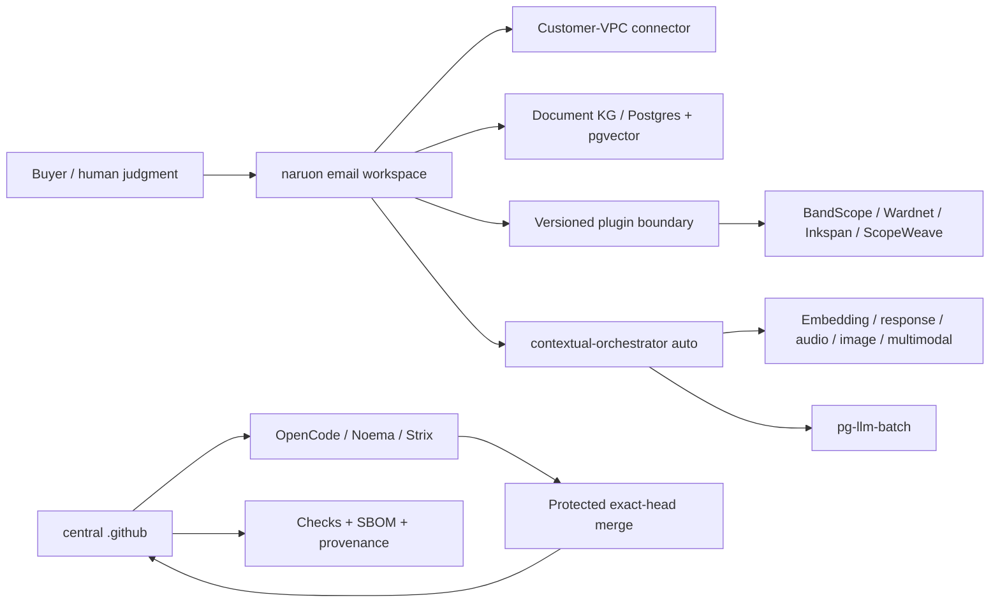

# Product and Technical Gap Baseline

검토 기준일: **2026-08-23 (Asia/Seoul)**
대상: **ContextualWisdomLab/.github** 중앙 거버넌스·자동화 레포지터리와 이를 소비하는 naruon 생태계  
현재 보호된 `main`: `885f2cd251999f21cf562cab3e2d9cc3cc3ec737`
현재 열린 PR 수: **30** (아래 표에 이 스냅샷의 전체 목록 포함)

이 문서는 제품·기술·운영 Gap을 현재 문서와 현재 GitHub 상태에 묶어 두는 기준선이다. 새 작업은 먼저 이 문서의 Gap ID를 PR 설명과 테스트 증거에 연결하고, PR의 정확한 exact HEAD·Checks·리뷰를 다시 수집한 뒤 구현한다. 표의 상태는 작성 시점의 관측값이므로, 병합 판단에는 재사용하지 않는다.

## 1. 근거와 범위

### 1.1 우선순위가 높은 근거

1. [CWL Master Context](CWL-MASTER-CONTEXT.md): naruon의 이메일 우선 플랫폼 경계, DIKW, no-ask 자동 해결, 다층·다중소속·시간·프라이버시 원칙.
2. [naruon #974](https://github.com/ContextualWisdomLab/naruon/issues/974): `docs/planning/naruon-platform-plan.md`를 추가한 병합된 제품/IA/User Story/Use Case/Architecture 기준.
3. [GitHub Project #1](https://github.com/orgs/ContextualWisdomLab/projects/1): 로드맵의 live source of truth. 이 문서는 live project board의 상태를 반영하며, 세부 항목 수는 project에서 직접 확인한다.
4. 중앙 ADR·doctoring·계약 문서: 보호된 main에 존재하는 [organization readiness doctoring](doctoring/organization-commercial-readiness-loop.md)와 현재 열린 PR 기록.

### 1.2 제품 경계

구매자가 사는 핵심 결과는 “흩어진 enterprise context를 판단 가능한 구조로 만들고, 사람이 다음 행동을 승인할 수 있게 하는 것”이다. naruon은 이메일 호스트나 전자결재 시스템이 아니라 고객 소유 데이터에 연결되는 이메일 workspace/platform이다. 중앙 `.github`은 제품 기능을 대신 소유하지 않고, 정확한 HEAD·리뷰·Checks·증거·변경권한을 보장하는 control plane이다.

핵심 구매 여정은 다음과 같다.

1. 여러 계정·언어의 이메일에서 한 사건의 thread와 sender 의미를 찾는다.
2. 변경된 일정의 최신 truth, 변경 이력, commitment status와 충돌을 계산한다.
3. work/personal/project/band 등 겹치는 norm group을 선택하고, 관계·권한·유효기간을 고려한다.
4. 다른 context에는 필요한 결과(예: unavailable)만 consent·audit 기반으로 공개한다.
5. 사람은 근거·confidence·다음 행동을 보고 예외만 수정하며, 외부 writeback은 승인한다.

## 2. PRD / TRD / UML 기준

### 2.1 PRD acceptance

| ID | 구매자가 확인할 결과 | 수용 증거 |
|---|---|---|---|
| PRD-01 | “이 메일/보낸 사람이 왜 중요한가”를 찾는다 | hybrid retrieval, sender ontology, source segment provenance |
| PRD-02 | 일정 이동과 RSVP/commitment 충돌을 놓치지 않는다 | temporal event history, confirmed > tentative > desired weighting, conflict test |
| PRD-03 | 같은 사람이 여러 조직·팀·밴드에 소속되어도 권한을 뒤섞지 않는다 | reified relationship, multi-membership/norm-group resolution, ecological-fallacy test |
| PRD-04 | private reason을 노출하지 않고 필요한 consequence만 공유한다 | consented minimal-disclosure bridge, audit trail, revocation test |
| PRD-05 | 사용자가 모델 선택을 관리하지 않아도 품질을 우선해 자동 라우팅한다 | contextual-orchestrator `auto`, capability-before-cost, unpriced-is-not-free evidence |
| PRD-06 | 결과를 독립 제품 또는 naruon plugin으로 동일하게 쓴다 | versioned manifest/API, connector contract, standalone/submodule integration test |

### 2.2 TRD target

- **Platform plane:** naruon web/API, customer-VPC connector, Postgres/pgvector document KG, plugin registry, versioned extension points.
- **Evidence/control plane:** central `.github`, OpenCode/Noema/Strix, exact-source and exact-head binding, bounded hourly loops, no credential fallback, protected merge.
- **AI plane:** contextual-orchestrator adaptive routing; role별 reasoning effort, workflow depth, recursion, decomposition, verifier/synthesis를 quality evidence에 따라 배분.
- **Compute plane:** 수리과학·psychometrics의 계산 레이어와 속도·안정성·보안이 핵심인 hot path는 Rust 경계를 우선 검토하며, GPU/CPU multithreading과 낮은 context switching을 benchmark로 입증한다. Python/JS는 orchestration/API adapter로 제한한다.
- **Data plane:** 모든 영속 객체는 두 단어 이상 `snake_case`를 기본으로 하고 3NF를 지키며, 관계·evidence·confidence·validity·disclosure를 별도 정규화한다.
- **UX plane:** UI 제품만 Figma/Storybook/design token을 사용한다. 중앙 `.github`는 UI 없는 인프라 레포지터리이므로 Figma File ID는 **N/A (UI scope 없음)**이며, UI PR은 별도 ADR에 실제 File ID를 기록한다.

### 2.3 UML-level dependency

## 3. Gap register

우선순위는 구매자 체감, 보안/증거 위험, 선행 의존성 순서다.

| Gap ID | 현재 관측 | 구매자 영향 | 우선 구현/검증 |
|---|---|---|---|
| G-01 | 열린 PR은 30개이고 metadata상 mergeable인 PR도 independent exact-head approval과 terminal required Checks를 자동으로 의미하지 않는다 | 안전하게 출시할 변경과 대기 중인 변경을 구별할 수 없다 | PR마다 current head, reviews, threads, required Checks를 재수집하고 보호 조건 미충족이면 merge하지 않는다 |
| G-02 | #1162는 review credential route를 고치지만 current Checks가 queued/cancelled로 반복되며 router의 403 경로가 선행 main에 남아 있다 | 리뷰가 호출돼도 승인 증거가 생성되지 않아 자동화가 멈춘다 | #1162 current-head quality와 OpenCode/Noema/Strix를 재실행하고, 병합 뒤 router comment/dispatch의 403을 실제 PR에서 검증한다 |
| G-03 | #1153의 Strix run은 `loginAsGuest`/Caido `127.0.0.1:48080` bootstrap 실패를 provider signal로 분류하지 않았다 | 취약점 0건이더라도 CI 인프라 결함이 보안 결과처럼 보이고 큐가 막힌다 | exact runtime signature를 불완전 evidence로 fail-closed 분류하고, vulnerability marker가 있으면 절대 neutralize하지 않는 regression을 유지한다 |
| G-04 | 30개 live PR 중 많은 항목이 BEHIND/DIRTY/UNSTABLE 또는 CHANGES_REQUESTED이며, 자동 caller PR이 제품 기능보다 앞서 쌓였다 | 제품 개발 속도가 queue hygiene에 소모되고, stacking 순서가 불명확하다 | product/ownership boundary별로 stack을 재정렬하고, 오래된 PR은 current main으로 normal merge/rebase 후 변경 범위를 검증한다 |
| G-05 | ecosystem contract/catalog PR은 존재하지만 naruon의 실제 plugin 소비·standalone 실행·connector round-trip 증거가 제한적이다 | 구매자는 “연결 가능” 문서와 실제 설치 가능한 제품을 구별할 수 없다 | manifest/version compatibility, command/event envelope, consumer smoke, rollback/upgrade contract를 조직 유관 레포에서 증명한다 |
| G-06 | naruon #974와 Project #1은 제품 목표를 정의하지만 E1/E2/E3의 live implementation evidence가 이 중앙 레포에 없다 | 이메일 검색·일정 충돌이라는 killer workflow가 문서에만 머문다 | naruon에서 thread/sender ontology → temporal commitment/conflict → human correction slice를 독립 PR로 delivery한다 |
| G-07 | multi-level/multi-membership/temporal 관계 원칙은 master context에 있으나 모든 소비 저장소의 schema/API가 동일한 reified relationship contract를 보장하는지는 미확인이다 | 개인 단위로 집계하거나 전역 권한을 적용하는 atomistic/ecological fallacy 위험이 남는다 | relationship, membership, norm_group, validity window, evidence, confidence, disclosure를 정규화하고 cross-context golden tests를 만든다 |
| G-08 | embedding·DOM·sender/receiver 의미 단위 chunking과 base64 image의 OCR/object/tag/position-index 설계가 ecosystem contract에 부분적으로만 반영됐다 | 검색은 되지만 실제 그림 위치와 의미를 회수하지 못해 편집·문서·메일 업무가 끊긴다 | semantic unit chunk schema와 image asset/region/ocr/tag embeddings를 별도 entity로 설계하고 source offset/DOM path를 보존한다 |
| G-09 | 100% coverage/docstring은 중앙 PR별로 증거가 있으나 조직 소비 레포의 frontend interaction/i18n/design-token/real-data accuracy 증거가 동일한지 미확인이다 | “green CI”가 실제 고객 시나리오 정확성을 보장하지 않는다 | domain-specific RMSE/reproducibility/audio/visual/browser acceptance와 edge matrix를 required evidence로 만든다 |
| G-10 | math/psychometrics의 Rust+GPU/CPU path와 시간·다층·다중소속 모델은 fast-mlsirm/psychometrics-commons 등 제품 레포의 책임이다 | 계산 정확도·성능·모델 해석 가능성을 Python glue만으로 보장할 수 없다 | Rust core, GPU/CPU benchmark, temporal/multilevel/multiple-membership fixtures, RMSE/recovery/ablation을 제품 PR에 묶는다 |
| G-11 | UI가 있는 제품의 Figma/Storybook inventory와 token/interaction/i18n 테스트는 중앙 control plane에서 소유할 수 없다 | 제품 간 UI가 달라지고 buyer onboarding이 일관되지 않는다 | 각 UI repo가 실제 Figma File ID ADR, Storybook inventory, shared token package, keyboard/edge/i18n tests를 소유한다 |
| G-12 | CSAP/SOC 2 통제 목표와 PII masking 대안은 doctoring에 흩어져 있으며 evidence-to-control mapping의 live completeness가 미확인이다 | PII를 마스킹하면 업무가 멈추고, 원문 접근을 허용하면 감사·유출 위험이 커진다 | consent/purpose/access lease, field-level encryption/tokenization, redaction-at-egress, audit/revocation와 CSAP/SOC 2 evidence map을 구현한다 |
| G-13 | hourly scheduler는 존재하지만 no-op/credential unavailable/queued Checks의 customer next action을 모든 caller가 동일한 receipt로 내는지 미확인이다. Main run `32359911521`은 `PR_REVIEW_MERGE_TOKEN` 미설정 시 즉시 실패하고 receipt artifact도 만들지 못했다 | 자동화가 실패해도 운영자가 무엇을 고쳐야 하는지 알 수 없다 | #1161의 `skipped_credential_unavailable` receipt와 다음 행동 문구를 exact-head Checks로 검증한 뒤 병합하고, bounded receipt schema, retry floor, single-flight, no secret fallback을 모든 caller contract test로 고정한다 |
| G-14 | release/changelog/version 증거가 각 PR에 분산되고 현재 central repo 보호 main의 release candidate가 명확하지 않다 | 구매자는 어떤 기능이 supportable release인지 확인할 수 없다 | merge 후 release readiness ledger, CHANGELOG, semantic version/tag, rollback/operability evidence를 함께 갱신한다 |

## 4. 열린 PR live inventory

아래는 GitHub PR search가 2026-08-23 09:xx UTC에 반환한 30개 열린 PR의 number/title/head/base metadata다. MERGEABLE은 GitHub metadata일 뿐 protected merge 승인이나 required Checks PASS를 뜻하지 않는다. 다음 루프에서 모든 행의 live review, thread, Checks를 다시 확인한다.

| PR | title | head SHA | base | metadata | mode |
|---|---|---|---|---|---|---|
| #1152 | fix(opencode): retry OpenCode after coverage blockers clear | `e19066db8797a334f8bb2d9bd2d202564ff1bc20` | main | DIRTY | ready |
| #1154 | ⚡ Bolt: 민감한 데이터 스크러버(Redaction) 루프 O(N) 성능 최적화 | `2e2239b7c7f364665fdec9f686b7040ba1b95e09` | main | DIRTY | ready |
| #1157 | fix(coverage): discover hash-pinned requirements lock files | `c4121f92b2cfea3c0096622222d2aa06fe76c8b3` | main | DIRTY | ready |
| #1158 | fix(osv): preserve immutable direct-source provenance | `4e1102ba720ab5ef43296d17ca49b2a227fa58c0` | main | DIRTY | ready |
| #1161 | fix: make hourly coordinator credential absence auditable | `49bc5e4a59cd30550f87070b48b61e966ac480e1` | main | DIRTY | ready |
| #1162 | fix: use review credentials for agent dispatch | `444ac8bf99a95d98a60b305ccc1509283c3f671c` | main | DIRTY | ready |
| #1163 | docs: establish live product and technical gap baseline | `495ec011d5736a5619da89b715db1aae1f92e960` | main | DIRTY | ready |
| #1166 | fix(ci): recognize replacement tests in existing files | `62ef26d731ddbec59bd4203279219d79b6fdd0de` | main | BEHIND | ready |
| #1170 | feat: route OpenCode reviews through contextual gateway | `cbf937bc7216bf34883032a040aa3850136b9e81` | main | DIRTY | ready |
| #1172 | fix(autofix): resolve live NVIDIA NIM models instead of a retired pin | `edab578feca63c223368aef17c175bb52ce22e5a` | main | DIRTY | ready |
| #1176 | fix(governance): preserve proposal branch create transition | `5b2a2163eead22ffe0a65708cd4136e51afe291a` | main | DIRTY | ready |
| #1179 | ⚡ Bolt: [성능 개선] 레이블 스캔 시 O(N) 서브스트링 검증 선행 | `ade38c0193d5ae97c1c9f7adcfe6c603ed7cf201` | main | DIRTY | ready |
| #1187 | fix(coverage): scope Rust evidence to changed packages | `0a88e24d9a1c92420f412d241f850aab8e72106e` | main | DIRTY | ready |
| #1188 | fix: grant hourly callers reusable workflow OIDC scope | `1a0cc1f875db29492861006747ded2b6d9e93d09` | main | DIRTY | ready |
| #1198 | fix(security): repair pip audit and schedule orchestrator review | `e5a7ac882559fe6d1ae1f91e27d79bc8e0aa1e77` | main | DIRTY | ready |
| #1213 | fix: preserve Strix PR scope on provider exhaustion | `94db1b8431bdf9e7ba1555a5f44fd90f8f84de63` | fix/organization-loop-oidc-fallback | CLEAN | ready |
| #1215 | fix(security): redact agent-mention credential diagnostics | `6e17c3fb3f247c73dd55afcbf4f92a127549f345` | main | DIRTY | ready |
| #1218 | fix(coverage): admit protected-base test retirement | `a3e2dfca20cc76c1b8615df0f490fc5a1fc11e81` | main | DIRTY | ready |
| #1227 | fix(opencode): use same-repo status credential | `05b52e7617e87d2fd6892d8d387ff9d6707a110c` | main | DIRTY | ready |
| #1231 | fix(scheduler): isolate central Actions inventory quota | `e594f8ca2367aa226d98fcda4c2d17b248eea76b` | main | DIRTY | ready |
| #1233 | fix(automation): restore hourly fleet coordination | `70d9eb049f2946d269bb4ee1f8b7d72a31c84c81` | main | DIRTY | ready |
| #1237 | ⚡ Bolt: JSON 추출 최적화 및 버그 수정 (`raw_decode` 적용) | `59b910d3a6efc15484a2ad63c4c2c2dfbad4f34b` | main | BEHIND | ready |
| #1238 | fix(scheduler): stop repository_dispatch defaulting review/merge/branch flags off | `23a014eb89448c74cdd5d440d601de79a8d7665f` | main | DIRTY | ready |
| #1242 | ⚡ Bolt: 정규표현식 평가 병합 최적화 | `b27b834c60870f1b46cd719b0bcb4322a542946a` | main | BEHIND | ready |
| #1243 | ⚡ Bolt: [병렬 처리를 통한 스냅샷 수집 성능 개선] | `68dcc64803f89665bfc161a3ee7eb018e2612f1f` | main | BEHIND | ready |
| #1244 | 🛡️ Sentinel: [CRITICAL/HIGH] Fix SSRF in sandboxed_web_e2e wait_for_url | `4b4ad37da919a2f9c1c18aa1fba8cbb1da79cd56` | main | BEHIND | ready |
| #1245 | fix(scheduler): retry and gracefully defer shared installation rate limits | `c895eec54b50119496cc9c962682d1fafc18c405` | main | BEHIND | ready |
| #1246 | fix(opencode-review): accept int-typed run_id/run_attempt in control JSON | `c82036c33bb64c3a81b765531d1f90704d8252da` | main | BEHIND | ready |
| #1247 | fix(ci): lint modern Actions schemas safely | `46f3e72110aadda14d77ae6fd56db756350c3fcc` | fix/scheduler-actions-read-token | UNSTABLE | ready |
| #1251 | fix(strix): classify ModelBehaviorError as backend-unavailable | `1cdc02b6479c9c9487674c54692fc301a37604db` | main | DIRTY | ready |

## 5. 실행 루프와 고객의 다음 행동

각 hourly pass는 아래 순서를 유지한다.

1. 조직·repo 책임 경계를 확인하고, current default branch SHA와 PR head SHA를 새로 읽는다.
2. 열린 PR 하나를 선택해 review threads, formal review commit SHA, required Checks와 failure logs를 확인한다.
3. 실패가 코드 결함이면 root cause를 해당 PR의 최소 범위에서 수정하고, 원격 agent의 concurrent commit은 normal forward history로 보존한다.
4. 현실적인 domain test, edge test, docstring/branch coverage, security/SBOM, actionlint/browser evidence를 실행한다.
5. 새 head에서 Checks를 재실행하고 independent current-head approval을 다시 요청한다.
6. protected ruleset의 approval·resolved thread·terminal Checks·exact head를 모두 충족할 때만 normal merge한다. 조건이 안 되면 merge하지 않고 다음 PR로 진행한다.
7. PR이 소진되면 Project #1과 소비 repo에서 가장 큰 buyer gap을 선택해 새 PR을 만들고, 이 문서의 Gap ID를 연결한다.

운영자는 receipt의 `next_action`만 실행하면 된다. 예를 들어 `PR_REVIEW_MERGE_TOKEN` 부재는 토큰 값을 로그에 남기지 말고 secret을 provision한 후 다음 hourly pass를 기다리며, Strix Caido bootstrap failure는 runner/container readiness를 복구한 후 같은 exact head를 재검증한다.

## 6. Compliance and data boundary

- PII 원문을 무조건 masking하여 업무를 끊지 않는다. 대신 purpose-bound access lease, field-level encryption/tokenization, consented minimal-disclosure consequence, audited access, revocation, retention/deletion을 사용한다. `COPILOT_GITHUB_TOKEN`은 사용하지 않는다.
- 모델·리뷰·sandbox·Checks·merge·release는 서로 다른 authority다. 하나의 PASS를 approval이나 release로 승격하지 않는다.
- 모든 untrusted input, repository patch, image/base64 payload, model output은 data로 취급하고 command/credential로 해석하지 않는다.
- demo/synthetic fixture는 unit test에만 두며 production seed/fixture에는 포함하지 않는다.

## 7. APA 7th references

American Institute of Certified Public Accountants. (2017). *2017 trust services criteria for security, availability, processing integrity, confidentiality, and privacy*. AICPA.

International Organization for Standardization. (2022). *ISO/IEC 27001:2022 information security, cybersecurity and privacy protection—Information security management systems—Requirements*. ISO.

International Organization for Standardization. (2023). *ISO/IEC 42001:2023 information technology—Artificial intelligence—Management system*. ISO.

National Institute of Standards and Technology. (2023). *Artificial intelligence risk management framework (AI RMF 1.0)* (NIST AI 100-1). U.S. Department of Commerce. https://doi.org/10.6028/NIST.AI.100-1

World Wide Web Consortium. (2023). *Web Content Accessibility Guidelines (WCAG) 2.2*. https://www.w3.org/TR/WCAG22/

Lewis, P., Perez, E., Piktus, A., Petroni, F., Karpukhin, V., Goyal, N., Küttler, H., Lewis, M., Yih, W.-t., Rocktäschel, T., Riedel, S., & Kiela, D. (2020). Retrieval-augmented generation for knowledge-intensive NLP tasks. *Advances in Neural Information Processing Systems, 33*, 9459–9474.

Tang, Y., Cetin, E., Xu, J., Sun, Q., Nielsen, S., Richard, V., Goda, H., Tymchenko, I., Nguyen, N., Lee, H., Ashiga, M., Kotyan, S., Kuroki, S., & Clanuwat, T. (2026). *Sakana Fugu technical report* [Technical report]. arXiv. https://doi.org/10.48550/arXiv.2606.21228

Zhang, S., Yu, Y., Li, Y., Zhao, W., Yang, Y., Zhang, Y., & Liu, T. (2025). *Conductor: Learning to route multi-agent workflows* [Preprint]. arXiv. https://doi.org/10.48550/arXiv.2512.04388

Xu, J., Sun, Q., Schwendeman, P., Nielsen, S., Cetin, E., & Tang, Y. (2026). *TRINITY: An evolved LLM coordinator* [Preprint]. arXiv. https://doi.org/10.48550/arXiv.2512.04695
